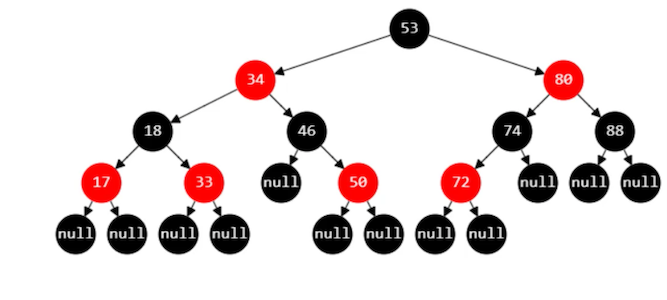

## 红黑树

### 初识红黑树

+ 红黑树也是一种自平衡的二叉搜索树
  - 以前也叫做平衡二叉B树（Symmetric Binary B-tree）
  - 红黑树将度为0或1的节点加上黑色的null节点，变为度为2的节点
  - 这些null节点是空想出来的，是为了实现红黑树的某些性质
  - 通过这些空节点，使其变为只有度为2或0的节点的树，即为真二叉树
+ 红黑树必须满足以下 5 条性质
  1. 节点是 **RED** 或者 **BLACK**
  2. 根节点是 **BLACK**
  3. 叶子节点（外部节点，空节点）都是 **BLACK**
  4. **RED** 节点的子节点都是 **BLACK**
     - **RED** 节点的**parent**  都是 **BLACK**
     - 从根节点到**叶子节点**的所有路径上不能有 2 个连续的 **RED** 节点
  5. 从任一节点到**叶子节点**的所有路径都包含相同数目的 **BLACK** 节点
+ 为何这些规则下，就能保证平衡？

1-错误示范

2-与4阶B树的等价交换

3-辅助函数

4-添加01

5-添加02-情况分析

6-添加03-黑叔01-LL-RR

7-添加04-黑叔02-LR-RL

8-添加05-red_uncle

9-添加06-情况总结

10-添加07-实现01-red_uncle

11-添加08-实现02-black_uncle

12-添加09-测试

13-添加10-补充

14-删除01-情况分析

15-删除02-红替01-分析

16-删除03-红替02-实现

17-删除04-黑叶01-根节点

18-删除05-黑叶02-黑兄01

19-删除06-黑叶03-黑兄02

20-删除07-黑叶04-红兄

21-删除08-总结

22-删除09-黑叶05-实现01

23-删除10-黑叶06-实现02

24-删除11-黑叶07-对称处理

25-删除12-测试

26-删除13-去除replacement参数

27-答疑

28-总结

29-平衡

30-性能对比