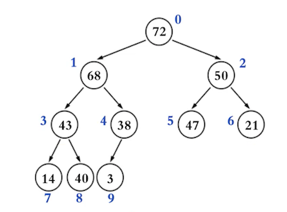

## 二叉堆

### 思考

+ 设计一种数据结构，用来存放整数，要求提供 3 个接口

  - 添加元素
  - 获取最大值
  - 删除最大值

  

+ 有没有更优的数据结构?
  - 堆
    - 获取最大值:O(1), 删除最大值: O(logn), 添加最大值O(logn)

### 堆（Heap）

+ 堆（Heap）也是一种树状的数据结构（不要跟内存模型中的“堆空间”混淆），常见的堆实现有

  - 二叉堆（Binary Heap，完全二叉堆）
  - 多叉堆（D-heap、D-ary Heap）
  - 索引堆（Index Heap）
  - 二项堆（Binomial Heap）
  - 斐波那契堆（Fibonacci Heap）
  - 左倾堆（Leftist Heap，左式堆）
  - 斜堆（Skew Heap）

+ 堆的一个重要性质：任意节点的值总是 ≥（ ≤ ）子节点的值

  - 如果任意节点的值总是 ≥ 子节点的值，称为：最大堆、大根堆、大顶堆

  - 如果任意节点的值总是 ≤ 子节点的值，称为：最小堆、小根堆、小顶堆

    

+ 由此可见，堆中的元素必须具备可比较性（跟二叉搜索树一样）

### 堆的基本接口设计

### 二叉堆（Binary Heap）

+ 二叉堆的逻辑结构就是一棵完全二叉树，所以也叫完全二叉堆

  

+ 鉴于完全二叉树的一些特性，二叉堆的底层（物理结构）一般用数组实现即可

  

+ 索引 i 的规律（ n 是元素数量）

  - 如果 i = 0 ，它是 根节点
  - 如果 i > 0 ，它的 父节点的索引为 floor( (i – 1) / 2 )
  - 如果 2i + 1 ≤ n – 1，它的 左子节点的索引为  2i + 1
  - 如果 2i + 1 > n – 1 ，它 无左子节点
  - 如果 2i + 2 ≤ n – 1 ，它的 右子节点的索引为 2i + 2
  - 如果 2i + 2 > n – 1 ，它 无右子节点

  

01-需求分析

02-堆

03-二叉堆

04-基本接口实现

05-add01-思路

06-add02-实现

07-打印调试

08-优化

09-抽取父类

10-remove01-思路

11-remove02-实现

12-replace

13-heapify01-自上而下的上滤

14-heapify02-自下而上的下滤

15-heapify03-效率对比

16-heapify04-复杂度计算

17-heapify05-答疑

18-heapify06-实现

19-小顶堆

20-TopK面试题