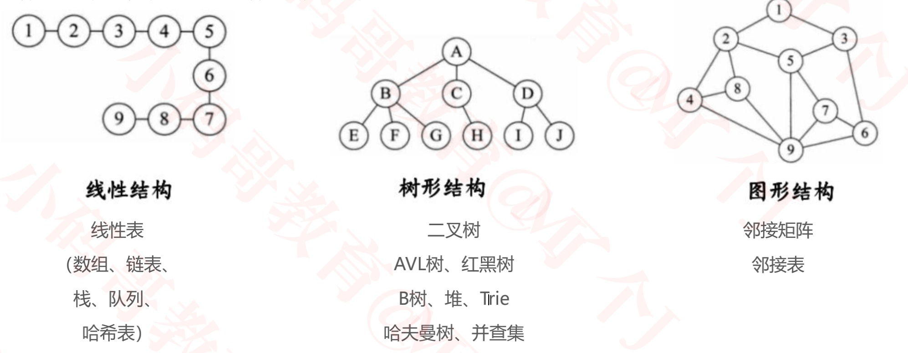
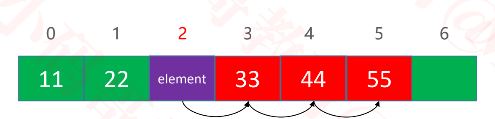
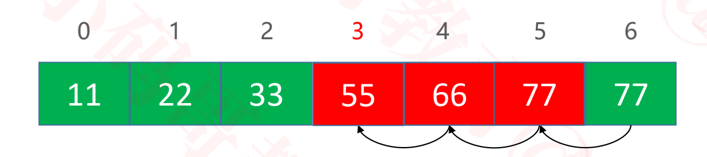
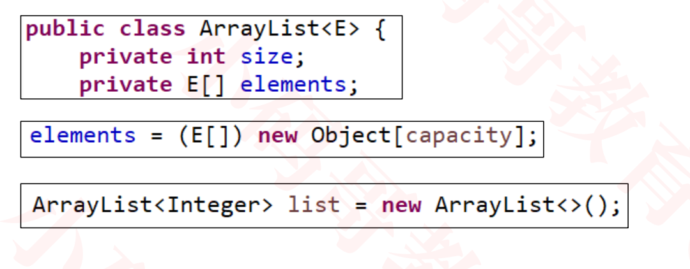
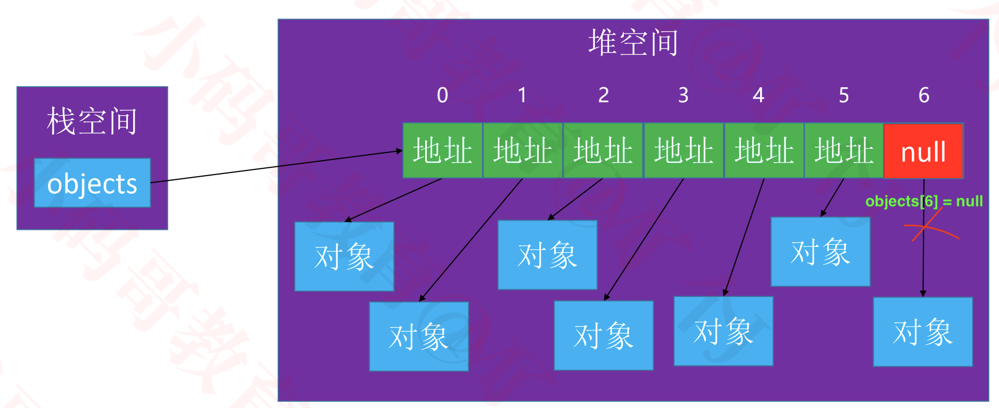

## 动态数组-ArrayList

### 什么是数据结构

+ 数据结构是计算机存储、组织数据的方式

  

+ 在实际应用中，根据使用场景来选择最合适的数据结构

### 线性表

+ 线性表是具有 n 个相同类型元素的有限序列（ n ≥ 0 ）

  

  - a1 是首节点（首元素）， an 是尾结点（尾元素）
  - a1 是 a2 的前驱， a2 是 a1 的后继

+  常见的线性表有

  - 数组
  - 链表
  - 栈
  - 队列
  - 哈希表（散列表）

### 数组（Array）

+ 数组是一种顺序存储的线性表，所有元素的内存地址是连续的

  

+ 在很多编程语言中，数组都有个致命的缺点

  - 无法动态修改容量

+ 实际开发中，我们更希望数组的容量是可以动态改变的

### 接口设计

```java
◼ boolean isEmpty(); // 是否为空
◼ boolean contains(E element); // 是否包含某个元素
◼ void add(E element); // 添加元素到最后面
◼ E get(int index); // 返回index位置对应的元素
◼ E set(int index, E element); // 设置index位置的元素
◼ void add(int index, E element); // 往index位置添加元素
◼ E remove(int index); // 删除index位置对应的元素
◼ int indexOf(E element); // 查看元素的位置
◼ void clear(); // 清除所有元素
```

### 动态数组的设计

+ size表明当前元素的个数

+ elements存放元素的数组

  

+ 在java中，成员变量会自动初始化, 比如
  - int类型自动初始化为0
  - 对象类型自动初始化为null

### 简单的接口实现

```java
package com.mj;

@SuppressWarnings("unchecked")
public class ArrayList<E> {
	/**
	 * 元素的数量
	 */
	private int size;
	/**
	 * 所有的元素
	 */
	private E[] elements;
 
  //元素未找到的标记
	private static final int ELEMENT_NOT_FOUND = -1;
	
	/**
	 * 清除所有元素
	 */
	public void clear() {
    
	}

	/**
	 * 元素的数量
	 * @return
	 */
	public int size() {
		return size;
	}

	/**
	 * 是否为空
	 * @return
	 */
	public boolean isEmpty() {
		 return size == 0;
	}

	/**
	 * 是否包含某个元素
	 * @param element
	 * @return
	 */
	public boolean contains(E element) {
	   return false
	}

	/**
	 * 添加元素到尾部
	 * @param element
	 */
	public void add(E element) {
	}

	/**
	 * 获取index位置的元素
	 * @param index
	 * @return
	 */
	public E get(int index) {
    return null;
	}

	/**
	 * 设置index位置的元素
	 * @param index
	 * @param element
	 * @return 原来的元素ֵ
	 */
	public E set(int index, E element) {
		return null;
	}

	/**
	 * 在index位置插入一个元素
	 * @param index
	 * @param element
	 */
	public void add(int index, E element) {
    
	}

	/**
	 * 删除index位置的元素
	 * @param index
	 * @return
	 */
	public E remove(int index) {
    return null;
	}

	/**
	 * 查看元素的索引
	 * @param element
	 * @return
	 */
	public int indexOf(E element) {
    return 0;
	}
}

```

### 设计基本容量

```java
//ArrayList存储对象类型
public class ArrayList<E> {
   //默认容量
  private static final int DEFAULT_CAPACITY = 10;

  public ArrayList(int capaticy) {
    //当传入的容量小于10时，改为默认容量
		capaticy = (capaticy < DEFAULT_CAPACITY) ? DEFAULT_CAPACITY : capaticy;
    //存储的所有的类都继承自 java.lang.Object
		elements = (E[]) new Object[capaticy];
	}
  public ArrayList() {
    // 默认容量为10
	  this(DEFAULT_CAPACITY);
  }
}
```

### clear

```java
/**
 * 清除所有元素
 */
	public void clear() {
		for (int i = 0; i < size; i++) {
			elements[i] = null;
		}
		size = 0;
}
```

### rangeCheck

```java
//检查下标越界

//添加之外的操作，检查是否越界。例如set, get, remove
private void rangeCheck(int index) {
		if (index < 0 || index >= size) {
			outOfBounds(index);
		}
	}
//添加操作检查下标
private void rangeCheckForAdd(int index) {
	if (index < 0 || index > size) {
			outOfBounds(index);
	}
}
//越界报错
private void outOfBounds(int index) {
	 throw new IndexOutOfBoundsException("Index:" + index + ", Size:" + size);
}
```

### get

````java
/**
	 * 获取index位置的元素
	 * @param index
	 * @return 
	 */
	public E get(int index) {
		rangeCheck(index);
		return elements[index];
	}
````

### set

````java
	/**
	 * 设置index位置的元素
	 * @param index
	 * @param element
	 * @return 原来的元素ֵ
	*/
public E set(int index, E element) {
		rangeCheck(index);
		
		E old = elements[index];
		elements[index] = element;
		return old;
}
````

### indexOf

```java
/**
	 * 查看元素的索引
	 * @param element
	 * @return
	 */
	public int indexOf(E element) {
		if (element == null) { 
      //支持存储null元素
			for (int i = 0; i < size; i++) {
				if (elements[i] == null) return i; 
			}
		} else {
			for (int i = 0; i < size; i++) {
				if (element.equals(elements[i])) return i; // n
			}
		}
		return ELEMENT_NOT_FOUND;
	}
```

### contains

```objc
/**
	 * 是否包含某个元素
	 * @param element
	 * @return
	 */
	public boolean contains(E element) {
		return indexOf(element) != ELEMENT_NOT_FOUND;
	}
```

### add

+ 先不考虑扩容

+ 尾部添加元素 - add(E element)

  

  

+ 按下标添加元素 - add(int index, E element)

  + size等于5,index等于2。向2位置插入元素前，先将index为4，3，2的分别向后移动到5,4,3位置， 即从后往前，依次移动。然后再插入元素，最后让size++

    

```java
/**
	 * 在index位置插入一个元素
	 * @param index
	 * @param element
	 */
	public void add(int index, E element) {
    //检查是否越界
		rangeCheckForAdd(index);
    //确保数组至少有size+1的容量，用于存储新的元素。当数组容量不够时，进行动态扩容（后面详解）
		ensureCapacity(size + 1);
		for (int i = size; i > index; i--) {
      //size = 5 index = 2时
      //elements[5] = elements[4] 
      //elements[4] = elements[3]
      //elements[3] = elements[2]
			elements[i] = elements[i - 1];
		}
    //最后将元素插入到index位置
		elements[index] = element;
    //size加1
		size++;
	}


//检查添加操作下标
private void rangeCheckForAdd(int index) {
	if (index < 0 || index > size) {
			outOfBounds(index);
	}
}
```

### 打印

+ 需要重写toString()方法

+ 在 toString 方法中将元素拼接成字符串

+ 字符串拼接建议使用 StringBuilder

  ```java
  public class ArrayList<E> {
    ...
    ...
    @Override
  	public String toString() {
  		// size=3, [99, 88, 77]
  		StringBuilder string = new StringBuilder();
  		string.append("size=").append(size).append(", [");
  		for (int i = 0; i < size; i++) {
  			if (i != 0) {
  				string.append(", ");
  			}
  			
  			string.append(elements[i]);
  			
  //			if (i != size - 1) { //size -1需要多做计算，所以采用上面的方法
  //				string.append(", ");
  //			}
  		}
  		string.append("]");
  		return string.toString();
  	}  
  }
  
  
  
  public class Main {
  
  	public static void main(String[] args) {
  		
  		ArrayList<Integer> ints  = new ArrayList<>();
  		ints.add(10);
  		ints.add(10);
  		ints.add(22);
  		ints.add(33);
  		System.out.println(ints);
      }
  }
  
  //打印结果
  size=4, [10, 10, 22, 33]
  ```


### remove

+ 假设size = 7,原来index为3的位置元素为33，  删除的index = 3。

+ 当删除33后，index为4，5，6的元素依次向前移动。

+ size要减1,并且原来的最后一个元素(index=6)要置为null

  

```java
/**
	 * 删除index位置的元素
	 * @param index
	 * @return
	 */
	public E remove(int index) {
    //先检查是否越界
		rangeCheck(index);

    //取出要被删除的元素
    E old = elements[index];
    //从被删除的元素，直到最后一个元素。依次向前移动
		for (int i = index + 1; i < size; i++) {
			elements[i - 1] = elements[i];
		}
    //原来的最后一个元素变为null
		elements[--size] = null;
		return old;
	}
```

### 接口测试

+ 测试工具类

  ```java
  
  public class Assert {
  	public static void test(boolean value) {
  		try {
        if (value) System.out.println("测试通过");
  			if (!value) throw new Exception("测试未通过");
  		} catch (Exception e) {
  			e.printStackTrace();
  		}
  	}
  }
  
  ```

+ 测试代码

  ```java
  public class Main {
  	public static void main(String[] args) {        
  		ArrayList<Integer> list  = new ArrayList<>();
  		list.add(99);
  		list.add(88);
  		list.add(77);
  		list.add(66);
  		list.add(55);
  
  		list.remove(0);
  		Assert.test(list.get(0) == 88);
  		Assert.test(list.size() == 4);
  		}
  }
  
  //测试通过
  //测试通过
  ```

### 动态扩容 


```objc
  /**
	 * 确保数组至少有capacity个容量，当数组容量不够时，进行动态扩容。
	 * @param capacity
	 */
	private void ensureCapacity(int capacity) {
    //capacity: 存储元素需要的容量
		int oldCapacity = elements.length;
    
		if (oldCapacity >= capacity) return;
    
    //旧的容量不能满足存储需求时
		
		//新容量为旧容量的1.5倍
		int newCapacity = oldCapacity + (oldCapacity >> 1);
    // 创建新数组
		E[] newElements = (E[]) new Object[newCapacity];
    // 将原数组的元素对应放到新数组中
		for (int i = 0; i < size; i++) {
			newElements[i] = elements[i];
		}
    //System.arraycopy(elements, 0, newElements, 0, size);
    
    //让elements指向新数组
		elements = newElements;
		System.out.println(oldCapacity + "扩容为" + newCapacity);
	}
```

+ 扩容时如果元素过多是否会消耗性能？怎么优化?

  ````java
  //可以使用系统的数组copy函数
  System.arraycopy(src, srcPos, dest, destPos, length);
  ````

+ 代码测试

  


### 泛型

+ 使用泛型技术可以让动态数组更加通用，可以存放任何数据类型

  

### 对象数组

+ Object[] objects =  new Object[7];

  

  - 数组中存放都是对象的地址
  - 当将某个元素变为null时，对应的对象会被释放


### 内存管理的细节


### clear细节

```java
/**
	 * 清除所有元素
	 */
	public void clear() {
		for (int i = 0; i < size; i++) {
			elements[i] = null;
		}
		size = 0;
	}
```

+ 循环遍历将所有的元素赋值为null,此时清空数组后，释放对元素的引用，当gc回收垃圾时，回收掉空间
+ 否则，只要当对应index被重新赋值时，对应元素才会被放到垃圾回收中

### remove细节

```java
	/**
	 * 删除index位置的元素
	 * @param index
	 * @return 返回被删除的元素
	 */
	public E remove(int index) {
    //1. 检查是否越界
		rangeCheck(index);
		//2. 取出被删除的元素
		E old = elements[index];
    //3. 依次挪动元素
		for (int i = index + 1; i < size; i++) {
			elements[i - 1] = elements[i];
		}
    //4. 将原来的最后一个元素变为null，以便gc回收该对象
		elements[--size] = null;
		return old;
	}
```

+ 删除后，将数组原来的最后一个元素变为null，以便gc回收该对象

### equals

````java
/**
	 * 查看元素的索引
	 * @param element
	 * @return
	 */
	public int indexOf(E element) {
		if (element == null) {
			for (int i = 0; i < size; i++) {
				if (elements[i] == null) return i;
			}
		} else {
			for (int i = 0; i < size; i++) {
        //element == elements[i] 错误
        //element放在前面，防止elements[i]为null
				if (element.equals(elements[i])) return i;
			}
		}
		return ELEMENT_NOT_FOUND;
	}
````

+ 如果让`element == elements[i]`,对象类型的==操作符, 其对比的是内存地址，不能满足需求

+ 所以需要对象类型重写equals方法

  ```java
  package com.mj;
  public class Person {
  	private int age;
  	private String name;
  	
  	public Person(int age, String name) {
  		this.age = age;
  		this.name = name;
  	}
  	@Override
  	public boolean equals(Object obj) {
  		if (obj == null) return false;
  		if (obj instanceof Person) {
  			Person person  = (Person) obj;
  			return this.age == person.age;
  		}
  		return false;
  	}
  }
  
  ```

+ Object默认的equals实现只比较对象内存地址是否相等

  ```java
   public boolean equals(Object obj) {
       return (this == obj);
   }
  ```


### null值处理

- 是否可以存储 null 数据， 取决你自己的内部设计

- 如果设计成不能存储null

  ```java
  /**
  	 * 在index位置插入一个元素
  	 * @param index
  	 * @param element
  	 */
  	public void add(int index, E element) {
      if (element == null) return;
  		rangeCheckForAdd(index);
  		
  		ensureCapacity(size + 1);
  		
  		for (int i = size; i > index; i--) {
  			elements[i] = elements[i - 1];
  		}
  		elements[index] = element;
  		size++;
  	}
  ```

- 如果设计成能存储null

  ```java
  /**
  	 * 在index位置插入一个元素
  	 * @param index
  	 * @param element
  	 */
  	public void add(int index, E element) {
      
      rangeCheckForAdd(index);
  		
  		ensureCapacity(size + 1);
  		
  		for (int i = size; i > index; i--) {
  			elements[i] = elements[i - 1];
  		}
  		elements[index] = element;
  		size++;
  	}
  ```

  ```java
  /**
  	 * 查看元素的索引
  	 * @param element
  	 * @return
  	 */
  	public int indexOf(E element) {
  		if (element == null) {
  			for (int i = 0; i < size; i++) {
  				if (elements[i] == null) return i;
  			}
  		} else {
  			for (int i = 0; i < size; i++) {
  				if (element.equals(elements[i])) return i;
  			}
  		}
  		return ELEMENT_NOT_FOUND;
  	}
  ```

  + 即便element为null也能够存储,查看索引

### ArrayList源码分析

+ 自行查看源码，大部分内容都是一致的
+ java.util.ArrayList