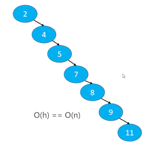
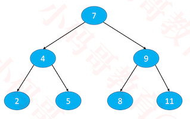
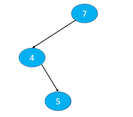
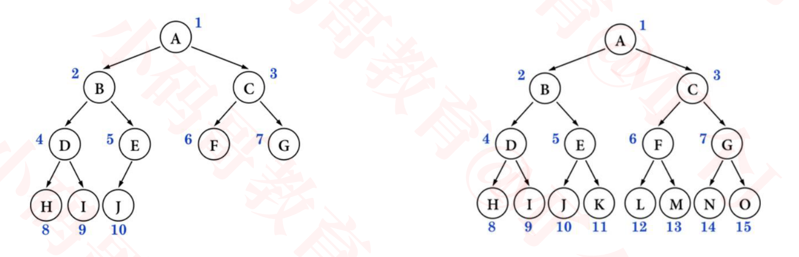

## 平衡二叉搜索树

### 二叉搜索树的复杂度分析

+ 如果是按照 7、4、9、2、5、8、11 的顺序添加节点

  

  - 此时顺序操作时，每次添加，删除时最坏的比较次数为logn，同时也是树的高度。

+ 如果是2，4，5，7，8，9，11, 从小到大添加节点

  

  + 此时二叉搜索树，退化成链表
  + 此时顺序操作时，每次添加，删除时最坏的比较次数为n，同时也是树的高度

  

+ 当 n 比较大时，两者的性能差异比较大
  - 比如 n = 1000000 时，二叉搜索树的最低高度是 20
  - 而退化成链表时，可能需要比1000000次

### 退化成链表的另一种情况

+ 删除节点时也可能会导致二叉搜索树退化成链表

  

  

+ 有没有办法防止二叉搜索树退化成链表？
  - 让添加、删除、搜索的复杂度维持在 O(logn)

### 平衡（Balance）

+  平衡：当节点数量固定时，左右子树的高度越接近，这棵二叉树就越平衡（高度越低）

  

### 理想平衡

+  最理想的平衡，就是像完全二叉树、满二叉树那样，高度是最小的

  

### 如何改进二叉搜索树？

+ 首先，节点的添加、删除顺序是无法限制的，可以认为是随机的

+ 所以，改进方案是：在节点的添加、删除操作之后，想办法让二叉搜索树恢复平衡（减小树的高度）

  

+ 如果接着继续调整节点的位置，完全可以达到理想平衡，但是付出的代价可能会比较大
  - 比如调整的次数会比较多，反而增加了时间复杂度
+ 总结来说，比较合理的改进方案是：用尽量少的调整次数达到适度平衡即可
+ 一棵达到适度平衡的二叉搜索树，可以称之为：平衡二叉搜索树

### 平衡二叉搜索树（Balanced Binary Search Tree）

+ 英文简称为：BBST
+  经典常见的平衡二叉搜索树有
  - AVL树
    - Windows NT 内核中广泛使用
  - 红黑树
    -  C++ STL（比如 map、set ）
    - Java 的 TreeMap、TreeSet、HashMap、HashSet
    - Linux 的进程调度
    - Ngix 的 timer 管理
  - 一般也称它们为：自平衡的二叉搜索树（Self-balancing Binary Search Tree）