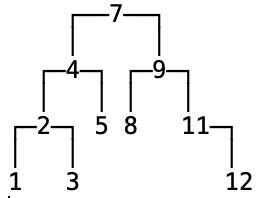

### 思考

+ 在 n 个动态的整数中搜索某个整数？（查看其是否存在）

+ 假设使用动态数组存放元素，从第 0 个位置开始遍历搜索，平均时间复杂度：O(n)

  

+ 如果维护一个有序的动态数组，使用二分搜索，最坏时间复杂度：O(logn)

  - 但是添加、删除的平均时间复杂度是 O(n):因为添加和删除后，其他元素要移动

    

+ 针对这个需求，有没有更好的方案？

  - 使用二叉搜索树，添加、删除、搜索的最坏时间复杂度均可优化至：O(logn)

### 二叉搜索树（Binary Search Tree）

+ 二叉搜索树是二叉树的一种，是应用非常广泛的一种二叉树，英文简称为 BST
  - 又被称为：二叉查找树、二叉排序树
  - 任意一个节点的值都大于其左子树所有节点的值
  - 任意一个节点的值都小于其右子树所有节点的值
  - 它的左右子树也是一棵二叉搜索树
+ 二叉搜索树可以大大提高搜索数据的效率
+ 二叉搜索树存储的元素必须具备可比较性
  - 比如 int、double 等
  - 如果是自定义类型，需要指定比较方式
  - 不允许为 null


+ 需要注意的是
  - 对于我们现在使用的二叉树来说，它的元素没有索引的概念

### 二叉搜索树方案设计

+ 二叉搜索树的接口设计

  - **int size()** : 元素的数量
  - **boolean isEmpty()** : 是否为空
  - **void clear()** :清空所有元素
  - **void add(E element)** : 添加元素
  - **void add(E element)** : 添加元素
  - **boolean contains(E element)** : 是否包含某元素
  - ...

+ 需要注意的是

  - 对于我们现在使用的二叉树来说，它的元素没有索引的概念

+ 如何添加节点

  0. 如果没有根节点，把它当做根节点

  1. 先找到父节点 parent
     + 比较传入的elment与节点中的element的值的大小
     + 如果传入的elment较大，则说明应该放在右边
     + 如果传入的elment较小，则说明应该放在左边 
     + 如果传入的elment相等，则将值进行覆盖
     + 最终找到父节点

  2. 创建新节点 node

  3. 将节点放在父节点后面
     - 比父节点小，则放在父节点左边 parent.left = node 
     - 比父节点大，则放在父节点右边 parent.right = node

  4. 遇到值相等的元素该如何处理?
     - 建议覆盖旧的值

+ 元素的比较方案设计

  1.  允许外界传入一个 Comparator 自定义比较方案
  2. 如果没有传入 Comparator，强制认定元素实现了 Comparable 接口

### 二叉树搜索树代码

+ 创建BinarySearchTree，并添加设计的接口

  ```java
  public class BinarySearchTree<E>{
  	private int size;
  	private Node<E> root;
    
    public int size() {
  		return size;
  	}
  	public boolean isEmpty() {
  		return size == 0;
  	}
  	public void clear() {
  	}
  	public void add(E element) {
  	}
  
  	public void remove(E element) {
  	}
    
  	public boolean contains(E element) {
  		return false;
  	}
    //内部的节点，设计成私有的，只有内部能访问
    private static class Node<E> {
  		E element;
  		Node<E> left;
  		Node<E> right;
  		@SuppressWarnings("unused")
  		Node<E> parent;
  		public Node(E element, Node<E> parent) {
  			this.element = element;
  			this.parent = parent;
  		}
  	}
  }
  
  ```

+ `void add(E element)`的实现方案

  ```java
  //元素非空判断
  private void elementNotNullCheck(E element) {
  		if (element == null) {
  			throw new IllegalArgumentException("element must not be null");
  		}
  }
  
  /**
  * @return 返回值等于0，代表e1和e2相等；返回值大于0，代表e1大于e2；返回值小于于0，代表e1小于e2
  */
  private int compare(E e1, E e2) {
  	return e1， e2的比较结果;
  }
  
  public void add(E element) {
      //元素非空
  		elementNotNullCheck(element);
  		//添加第一个节点
  		if (root == null) {
  			root = new Node<>(element, null);
  			size++;
  			return;
  		}
  		// 添加的不是第一个节点
  		// 找到父节点
  		Node<E> parent = root;
  		Node<E> node = root;
  		int cmp = 0;
  		while (node != null) {
  			cmp = compare(element, node.element);
  			parent = node;
  			if (cmp > 0) {
          //如果添加的元素比该节点的元素大，则应该添加到右侧，所以向右侧比较
  				node = node.right;
  			} else if (cmp < 0) {
           //如果添加的元素比该节点的元素小，则应该添加到左侧，所以向左侧比较
  				node = node.left;
  			} else { 
          //覆盖旧值
  				node.element = element;
  				return;
  			}
  		}
      //看看插入到父节点的哪个位置
  		Node<E> newNode = new Node<>(element, parent);
  		if (cmp > 0) {
  			parent.right = newNode;
  		} else {
  			parent.left = newNode;
  		}
  		size++;
  }
  ```

+ 添加方法，还缺少compare的实现,因为元素是泛型，所以比较方案一定是外部实现。同时提供两种方式:

  1. 允许外界传入一个比较器Comparator 自定义比较方案

  2. 如果没有传入 Comparator，强制认定元素实现了 Comparable 接口

     ```objc
     //定义比较器接口
     public interface Comparator<E> {
         int compare(E o1, T o2);
     }
     
     //定义Comparable接口
     public interface Comparable<T> {
        public int compareTo(T o);
     }
     
     public class BinarySearchTree<E>{
       ....
       //比较器
     	private Comparator<E> comparator;
     	...
       //默认比较器为空
     	public BinarySearchTree() {
     		this(null);
     	}
       //从外部传入一个比较器
     	public BinarySearchTree(Comparator<E> comparator) {
     		this.comparator = comparator;
     	}
       //此时compare的实现
       private int compare(E e1, E e2) {
         //如果有比较器，则使用比较器
     		if (comparator != null) {
     			return comparator.compare(e1, e2);
     		}
         //如果没有传入 Comparator，强制认定元素实现了 Comparable 接口
     		return ((Comparable<E>)e1).compareTo(e2);
     	}  
     }
     ```

  3. 如何定义比较

     ```java
     //1 定义元素
     public class Person implements Comparable<Person> {
     	private int age;
     	
     	public int getAge() {
     		return age;
     	}
     
     	public void setAge(int age) {
     		this.age = age;
     	}
     
     	public Person(int age) {
     		this.age = age;
     	}
     
     	@Override
     	public int compareTo(Person e) {
     //		if (age > e.age) return 1;
     //		if (age < e.age) return -1;
     //		return 0;
     		return age - e.age;
     	}
       
     	@Override
     	public String toString() {
     		return "age="  + age;
     	}
     }
     
     //2. 使用比较器
     public static void main(String[] args) {
         Integer data[] = new Integer[] {
     				7, 4, 9, 2, 5, 8, 11, 3, 12, 1
     		};
         BinarySearchTree<Person> bst = new BinarySearchTree<>(new Comparator<Person>() {
     			public int compare(Person o1, Person o2) {
     				return o2.getAge() - o1.getAge();
     			}
         });
         for (int i = 0; i < data.length; i++) {
     			bst.add(new Person(data[i]));
         }
         //打印树
         BinaryTrees.println(bst);
     }
     
     
     //3. 让元素遵循Comparable协议
     public static void main(String[] args) {
         Integer data[] = new Integer[] {
     				7, 4, 9, 2, 5, 8, 11, 3, 12, 1
     		};
         BinarySearchTree<Person> bst = new BinarySearchTree<>();
         for (int i = 0; i < data.length; i++) {
     			bst.add(new Person(data[i]));
         }
         //打印树
         BinaryTrees.println(bst);
     }
     ```

### 怎么打印树结构?

+ 让树实现`BinaryTreeInfo`接口结构

  ```objc
  //BinaryTreeInfo的具体实现去工程代码找
  public class BinarySearchTree<E> implements BinaryTreeInfo {
    ...
    ...
    ...
      
  	@Override
  	public Object root() {
  		return root;
  	}
  
  	@Override
  	public Object left(Object node) {
  		return ((Node<E>)node).left;
  	}
  
  	@Override
  	public Object right(Object node) {
  		return ((Node<E>)node).right;
  	}
    
  	@Override
  	public Object string(Object node) {
  		return ((Node<E>)node).element;
  	}
  }
  ```

+ 打印树结构

  ````objc
  public static void main(String[] args) {
      Integer data[] = new Integer[] {
  				7, 4, 9, 2, 5, 8, 11, 3, 12, 1
  		};
      BinarySearchTree<Person> bst = new BinarySearchTree<>();
      for (int i = 0; i < data.length; i++) {
  			bst.add(new Person(data[i]));
      }
      //打印树
      BinaryTrees.println(bst);
  }
  ````

  


