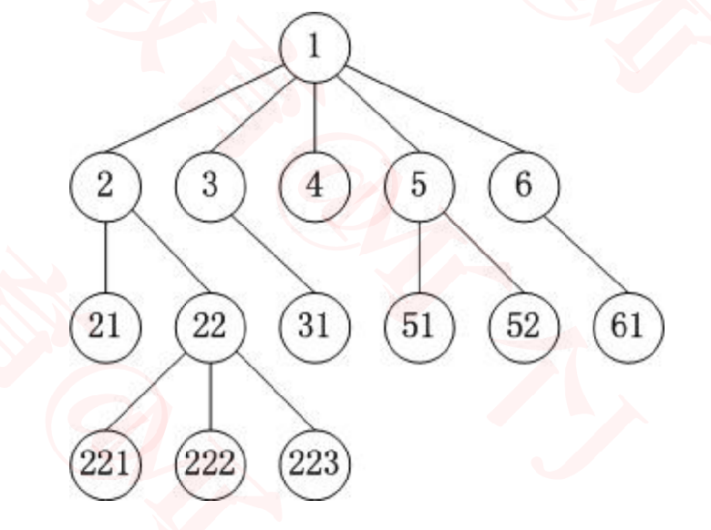
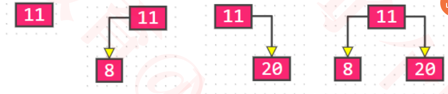
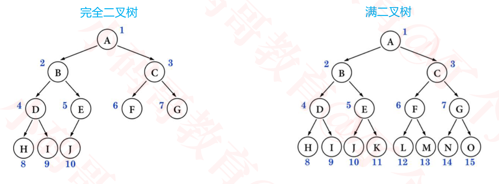

## 基本概念

### 树形结构

+ 使用树形结构可以大大提高效率
+ 树形结构是算法面试的重点


### 生活中的树形结构


### Tree的基本概念

+ 节点、根节点、父节点、子节点、兄弟节点
+ 一棵树可以没有任何节点，称为**空树**
+ 一棵树可以只有 1 个节点，也就是**只有根节点**
+ 子树、左子树、右子树
+ **节点的度**（degree）：子树的个数
+ **树的度**：所有节点度中的最大值
+ **叶子节点**: 度为0的节点
+ **非叶子节点**: 度不为0的节点

+ **层数**（level）：根节点在第 1 层，根节点的子节点在第 2 层，以此类推（有些教程也从第 0 层开始计算）
+ **节点的深度**（depth）：从根节点到当前节点的唯一路径上的节点总数
+ **节点的高度**（height）：从当前节点到最远叶子节点的路径上的节点总数
+ **树的深度**：所有节点深度中的最大值
+ **树的高度**：所有节点高度中的最大值
+ 树的深度 等于 树的高度

### 有序树、无序树、森林



+ 有序树
  - 树中任意节点的子节点之间有顺序关系
  - 上图的3，4 节点交换顺序后就不是同一棵树

+ 无序树
  - 树中任意节点的子节点之间没有顺序关系， 也称为“自由树”
  - 上图的3，4节点交换顺序后还是同一棵树
+ 深林
  - 由 m（m ≥ 0）棵互不相交的树组成的集合


### 二叉树（Binary Tree）

+ 二叉树的特点

  - 每个节点的度最大为 2（最多拥有 2 棵子树）

  - 左子树和右子树是有顺序的

  - 即使某节点只有一棵子树，也要区分左右子树

  - 即便只有一个根节点，也是一棵二叉树

  - 二叉树是有序树

    

    

### 二叉树的性质

+ 非空二叉树的第 i 层，最多有 2<sup>i − 1</sup> 个节点（ i ≥ 1 ）  
+ 在高度为 h 的二叉树上最多有 2<sup>h</sup> - 1 个结点（ h ≥ 1 ）

+ 对于任何一棵非空二叉树，如果叶子节点个数为 n0，度为 2 的节点个数为 n2，则有: n0 = n2 + 1
  - 假设度为 1 的节点个数为 n1，那么二叉树的节点总数 n = n0 + n1 + n2
  - 二叉树的边数 T = n1 + 2 * n2 = n – 1 = n0 + n1 + n2 – 1
  - 因此 n0 = n2 + 1
  - 因此，对于任何一棵非空二叉树，叶子节点个数 = 度为2的节点个数 + 1

### 真二叉树（Proper Binary Tree）

+  <font face="黑体" color=red size=3>真二叉树</font> ：所有节点的度都要么为 0，要么为 2

  


### 满二叉树（Full Binary Tree）

+ <font face="黑体" color=red size=3>满二叉树</font>：所有节点的度都要么为 0，要么为 2。且所有的叶子节点都在最后一层

+ 在同样高度的二叉树中，满二叉树的叶子节点数量最多、总节点数量最多
+ 满二叉树一定是真二叉树，真二叉树不一定是满二叉树
+ 假设满二叉树的高度为 h（ h ≥ 1 ），那么
  - 第 i 层的节点数量：2<sup>i − 1</sup> 
  - 叶子节点数量：2<sup>h − 1</sup> 
  - 总节点数量 n
    - n = 2<sup>h</sup> -1 = 2<sup>0</sup>  + 2<sup>1</sup>  + 2<sup>2</sup>  + ... + 2<sup>h-1</sup> 
    - h = log<sub>2</sub><sup>(n+1)</sup>

### 完全二叉树（Complete Binary Tree）

+ 完全二叉树：叶子节点只会出现最后 2 层，且最后 1 层的叶子结点都靠左对齐
+ 完全二叉树还可以定义为编号后，结点顺序和满二叉树一致
+ 完全二叉树从根结点至倒数第 2 层是一棵满二叉树
+ 满二叉树一定是完全二叉树，完全二叉树不一定是满二叉树
  

### 完全二叉树的性质

+ 度为 1 的节点只有左子树

+ 度为 1 的节点要么是 1 个，要么是 0 个

+ 同样节点数量的二叉树，完全二叉树的高度最小

+ 假设完全二叉树的高度为h (h>=1)，那么

  - 至少有2<sup>h-1</sup>个节点 (2<sup>0</sup>+2<sup>1</sup>+ 2<sup>2</sup> + ...+ 2<sup>h-2</sup> + 1 = 2<sup>h-1</sup> - 1 + 1 = 2<sup>h-1</sup>， 最后一层只有一个左节点)

  - 最多有2<sup>h</sup> -1 个节点， (2<sup>0</sup>+2<sup>1</sup>+ 2<sup>2</sup> + ...+ 2<sup>h-1</sup>  = 2<sup>h</sup> - 1 ，满二叉树 )

  - 总节点数量为n

    - 2<sup>h-1</sup> <= n < 2<sup>h</sup>

    - h - 1 <= 1og<sub>2</sub><sup>n</sup> < h

      - h肯定是整数, 
      - h = 1og<sub>2</sub><sup>n</sup> 的整数部分 + 1 =  1og<sub>2</sub><sup>n</sup> 向下取整 + 1

    - h = floor(1og<sub>2</sub><sup>n</sup> ) + 1 =  (int)1og<sub>2</sub><sup>n</sup>  + 1

      ```
      floor(向下取整):只取前面的整数。 比如floor(4.6) = 4
      ceiling(向上取整):如果小数不为0，取前面的整数 + 1。否则只取前面的数。
      比如ceiling(4.6)为5, ceiling(4.0)为4
      
      floor和ceiling都是不管四舍五入原则的
      ```

+ 一棵有 n 个节点的完全二叉树（n > 0），从上到下、从左到右对节点从 1 开始进行编号，对任意第 i 个节点

  - 如果 i = 1 ，它是根节点
  - 如果 i > 1 ，它的父节点编号为 floor( i / 2 )
  - 如果2i ≤ n ，它的左子节点编号为 2i
  - 如果2i > n ，它无左子节点
  - 如果 2i + 1 ≤ n ，它的右子节点编号为 2i + 1
  - 如果 2i + 1 > n ，它无右子节点

  


### 国外教材的说法

+ Full Binary Tree：完满二叉树
  - 所有非叶子节点的度都为2
  - 就的国内说的“真二叉树”
+ Perfect Binary Tree：完美二叉树
  - 所有非叶子节点的度都为 2，且所有的叶子节点都在最后一层
  - 就是国内说的“满二叉树”
+ Complete Binary Tree：完全二叉树
  - 跟国内的定义一样


### 面试题

+ 如果一棵完全二叉树有 768 个节点，求叶子节点的个数?

  - 假设叶子节点个数为 n0，度为 1 的节点个数为 n1，度为 2 的节点个数为 n2
  - 总结点个数 n = n0 + n1 + n2，而且 n0 = n2 + 1
    - n = 2n0 + n1 – 1
  - 完全二叉树的 n1 要么为 0，要么为 1
    - **n1为1时**，n = 2n0，**n 必然是偶数**
      - 叶子节点个数 n0 = n / 2，非叶子节点个数 n1 + n2 = n / 2
    - **n1为0时**，n = 2n0 – 1，**n 必然是奇数**
      - 叶子节点个数 n0 = (n + 1) / 2，非叶子节点个数 n1 + n2 = (n – 1) / 2
  - 叶子节点个数 n0 = floor( (n + 1) / 2 ) = ceiling( n / 2 ) 
  - 非叶子节点个数 n1 + n2 = floor( n / 2 ) = ceiling( (n – 1) / 2 ) 
  - 因此叶子节点个数为 384

  