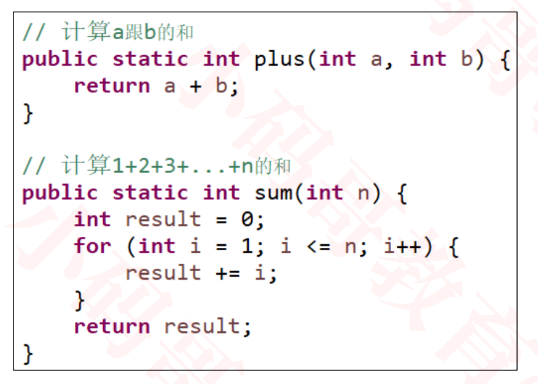
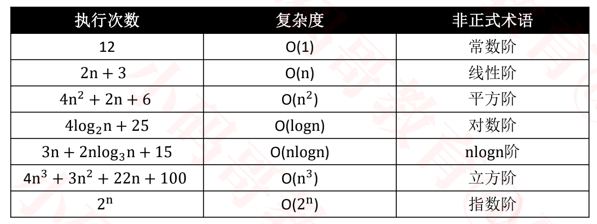
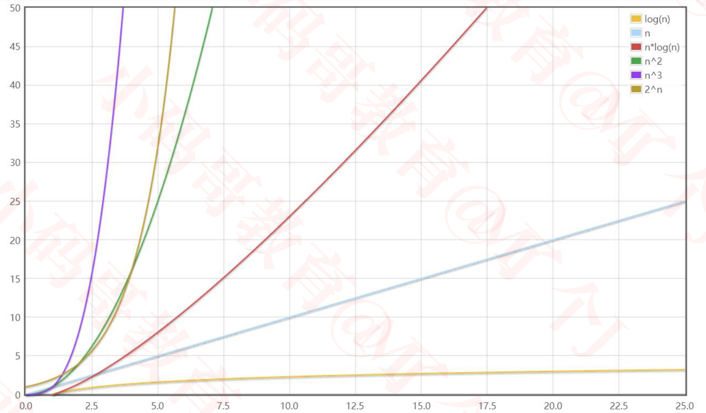
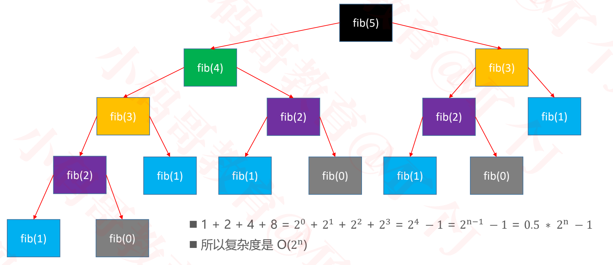
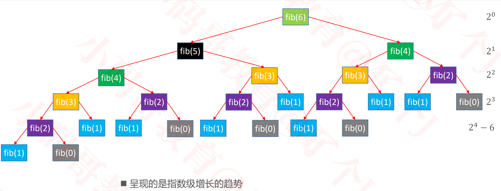
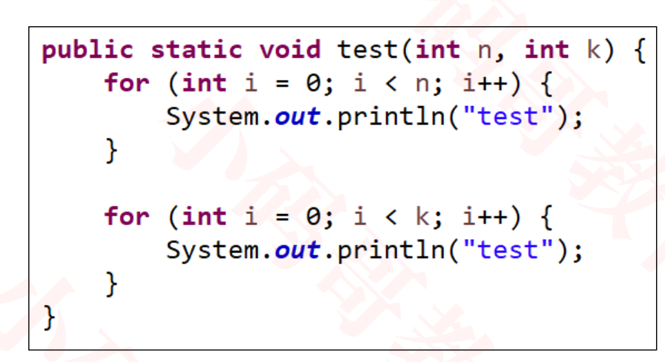

## 复杂度

### 什么是算法

+ 算法是用于解决特定问题的一系列的执行步骤

  

+ 使用不同算法，解决同一个问题，效率可能相差非常大

### 斐波那契数

> index:  0 1 2 3 4 5 6 7
>
> value:  0 1 1 2 3 5 8 13 ....
>
> 这个数列从第3项开始，每一项都等于前两项之和

+ 递归法

  ````java
  O(2^n)
  public static int fib1(int n) {
  		if (n <= 1) return n;
  		return fib1(n - 1) + fib1(n - 2);
  }
  
  1. 第一项,第二项直接返回值
  2. 第三项开始，是前两项的和。n > 1时,fib1(n) = fib1(n - 1) + fib1(n - 2);
  ````

+ 循环相加

  ```java
  O(n)
  public static int fib2(int n) {
  		if (n <= 1) return n;
  		int first = 0;
  		int second = 1;
  		for (int i = 0; i < n - 1; i++) {
        //second += first;
  			//first = second - first;
  			int sum = first + second;
  			first = second;
  			second = sum;
  		}
  		return second;
  }
  
  1. 第一项,第二项直接返回值
  2. 第三项开始，是前两项的和
     假设前一次为第一项first，第二项sencond，那么第三项为first + sencond
     下次求第四项时，原来的第二项变为第一项，原来的第三项变为第二项
     => int sum = first + second;
  			first = second;
  			second = sum; 
  3. 循环次数通过尝试可知，求第n项目的值时循环次数为n-1
  ```

+ 利用Times进行性能测试, 通过task执行前后的时间差来评估

  ```objc
  import java.text.SimpleDateFormat;
  import java.util.Date;
  
  public class Times {
  	private static final SimpleDateFormat fmt = new SimpleDateFormat("HH:mm:ss.SSS");
  	
  	public interface Task {
  		void execute();
  	}
  	
  	public static void test(String title, Task task) {
  		if (task == null) return;
  		title = (title == null) ? "" : ("【" + title + "】");
  		System.out.println(title);
  		System.out.println("开始：" + fmt.format(new Date()));
  		long begin = System.currentTimeMillis();
  		task.execute();
  		long end = System.currentTimeMillis();
  		System.out.println("结束：" + fmt.format(new Date()));
  		double delta = (end - begin) / 1000.0;
  		System.out.println("耗时：" + delta + "秒");
  		System.out.println("-------------------------------------");
  	}
  }
  
  ```

+ 时间评测情况如下

  

  

  + 递归法随着n的增大，时间迅速膨胀
  + 循环法随着n的增大，时间几乎没有变化


### 如何评判一个算法的好坏？

+ 如果单从执行效率上进行评估，可能会想到这么一种方案
  - 比较不同算法对同一组输入的执行处理时间
  - 这种方案也叫做：事后统计法
+ 上述方案有比较明显的缺点
  - 执行时间严重依赖硬件以及运行时各种不确定的环境因素
  - 必须编写相应的测算代码
  - 测试数据的选择比较难保证公正性
+ 一般从以下维度来评估算法的优劣
  - 正确性、可读性、健壮性（对不合理输入的反应能力和处理能力）
  -  **时间复杂度（time complexity）**：估算程序指令的执行次数（执行时间）
  - **空间复杂度（space complexity）**：估算所需占用的存储空间

### 大O表示法（Big O）

+ 一般用大O表示法来描述复杂度，它表示的是数据规模 n 对应的复杂度
+ 忽略常数、系数、低阶
  - 9 >> O(1)
  - 2n + 3 >> O(n)
  - n<sup>2</sup>  \+ 2n + 6 >> O(n<sup>2</sup>)
  - 4n<sup>3</sup> + 3n<sup>2</sup> + 22n + 100 >> O(n<sup>3</sup>)
  - 写法上, n<sup>3</sup>等价于 n^3

+ 注意：大O表示法仅仅是一种粗略的分析模型，是一种估算，能帮助我们短时间内了解一个算法的执行效率
+ 对数阶一般省略底数
  - log<sub>2</sub><sup>n</sup> = log<sub>2</sub><sup>10</sup> *   log<sub>10</sub><sup>n</sup> 
  - 所以log<sub>2</sub><sup>n</sup>  => log<sub>10</sub><sup>n</sup> == log<sup>n</sup>


### 估算汇编指令执行次数

+ 姑且把一个语句估算为一条指令

  ```objc
  public static void test1(int n) {
  		// 汇编指令
  		// 判断当做1次语句
  		if (n > 10) { 
  			System.out.println("n > 10");
  		} else if (n > 5) { // 2
  			System.out.println("n > 5");
  		} else {
  			System.out.println("n <= 5"); 
  		}
      // int i = 0,  执行1次
      // i < 4,  执行4次
      // 打印，执行4次
      // i++，执行4次
      // 总共执行14次
    
      //时间复杂度: O(1)
  		for (int i = 0; i < 4; i++) {
  			System.out.println("test");
  		}
      
  }
  
  	public static void test2(int n) {
  		// int i = 0; 1次
      // i < n;     n次
      // System.out.println("test");     n次
      // i++     n次
      // 总共执行1+3n次
      
      //时间复杂度: O(n)
  
  		for (int i = 0; i < n; i++) {
  			System.out.println("test");
  		}
  	}
  
  	public static void test3(int n) {
  		// 1 + 2n + n * (1 + 3n)
  		// 1 + 2n + n + 3n^2
  		// 3n^2 + 3n + 1
      
  		// 时间复杂度: O(n^2)
  		for (int i = 0; i < n; i++) {
  			for (int j = 0; j < n; j++) {
  				System.out.println("test");
  			}
  		}
      
  	}
  
  	public static void test4(int n) {
  		// 1 + 2n + n * (1 + 45)
  		// 1 + 2n + 46n
  		// 48n + 1
      
  		// 时间复杂度: O(n)
  		for (int i = 0; i < n; i++) {
  			for (int j = 0; j < 15; j++) {
  				System.out.println("test");
  			}
  		}
  	}
  
  	public static void test5(int n) {
  		// 8 = 2^3
  		// 16 = 2^4
  		// 3 = log2(8)
  		// 4 = log2(16)
  		
  		// 执行次数 = log2(n) 以2为底n的对数
  		// 时间复杂度: O(logn)
  		while ((n = n / 2) > 0) {
  			System.out.println("test");
  		}
  	}
  
  	public static void test6(int n) {
  		// 执行次数 = log5(n) 以5为底n的对数
  		// 时间复杂度: O(logn)
  		while ((n = n / 5) > 0) {
  			System.out.println("test");
  		}
  	}
  
  	public static void test7(int n) {
  		// 1 + 2*log2(n) + log2(n) * (1 + 3n)
  		// 1 + 3*log2(n) + 2 * nlog2(n)
  		// 时间复杂度: O(nlogn)
  		for (int i = 1; i < n; i = i * 2) {
  			// 1 + 3n
  			for (int j = 0; j < n; j++) {
  				System.out.println("test");
  			}
  		}
  	}
  ```

### 常见的复杂度



+ O(1) < O(log<sup>n</sup>) < O(n) < O(nlog<sup>n</sup>) < O(n<sup>2</sup>) < O(n<sup>3</sup>) < O(2<sup>n</sup>) < O(n!) < O(n<sup>n</sup>)

+ 可以借助函数生成工具对比复杂度的大小

  - https://zh.numberempire.com/graphingcalculator.php

  - 数据规模较小时

    

  - 数据规模较大时

    

  

### 斐波那契数复杂度分析






+ 他们的差别有多大？
  - 如果有一台1GHz的普通计算机，运算速度 109 次每秒（ n 为 64 ）
  - O(n) 大约耗时 6.4 ∗ 10−8 秒
  - O(2<sup>n</sup>) 大约耗时 584.94 年
  - 有时候算法之间的差距，往往比硬件方面的差距还要大
+ Something interesting
  - 我是一个斐波那契程序员
  - 因为我每天都在改昨天和前天的bug

### 斐波那契的线性代数解法 – 特征方程


+ 时间复杂度:视为O(1)

### 算法的优化方向

+ 用尽量少的存储空间
+ 用尽量少的执行步骤(执行时间)
+ 根据情况, 可以
  - 空间换时间
  - 时间换空间

###  多个数据规模的情况



+ 时间复杂度为： O(n+k)


### 更多复杂度相关的知识

+ 更多复杂度相关的知识，会在后续讲解数据结构、算法的过程中穿插
  - 最好、最坏复杂度
  - 均摊复杂度
  - 复杂度震荡
  - 平均复杂度
  - ...

### leetcode

+ 一个用于练习算法的好网站
  - https://leetcode-cn.com/
+ 斐波那契数
  - https://leetcode-cn.com/problems/fibonacci-number/