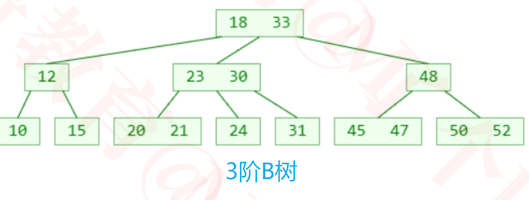
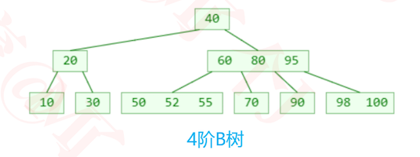
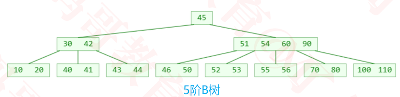
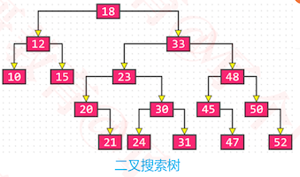
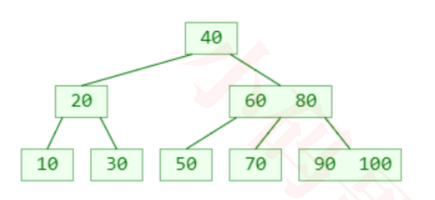
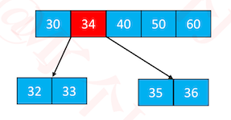
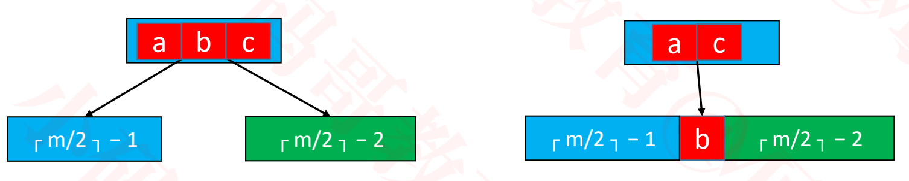
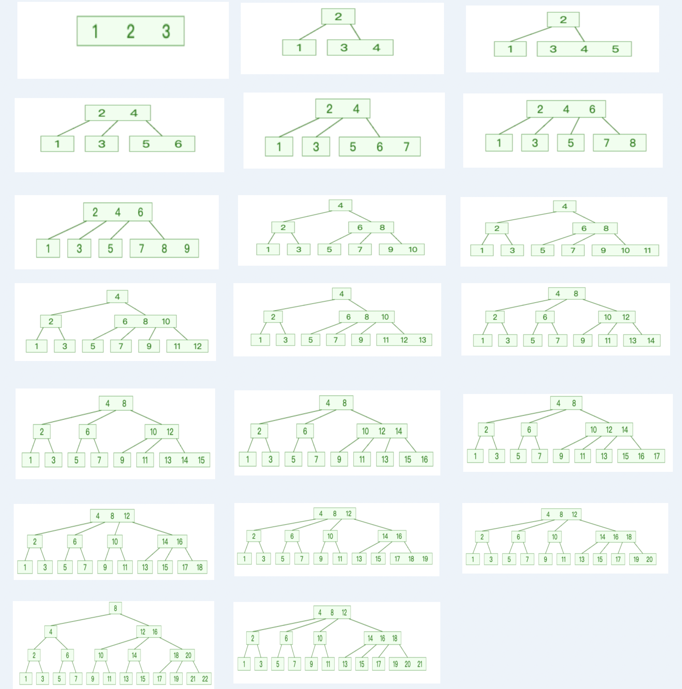
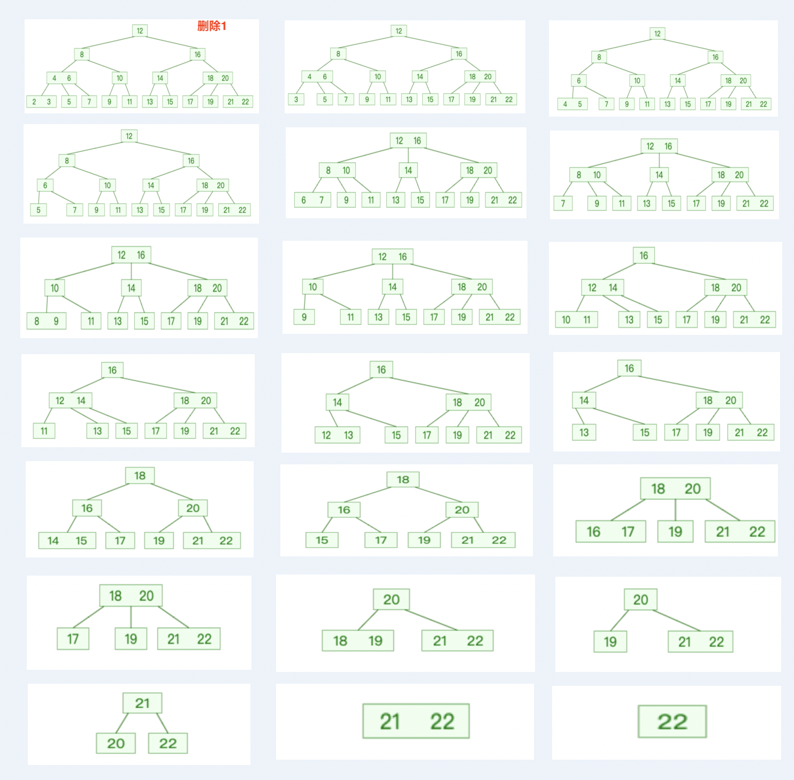

## B树

### 基本介绍

+ B树是一种平衡的多路搜索树，多用于文件系统、数据库的实现

  

  

  

+ 仔细观察B树，有什么眼前一亮的特点？
  - 1 个节点可以存储超过 2 个元素、可以拥有超过 2 个子节点
  - 拥有二叉搜索树的一些性质
  - 平衡，每个节点的所有子树高度一致
  - 比较矮

### m阶B树的性质（m≥2）

+ 最多拥有m个子树

+ 假设一个节点存储的元素个数为 x
  - 根节点：1 ≤ x ≤ m − 1
  - 非根节点：┌ m/2 ┐ − 1 ≤ x ≤ m − 1 （`┌ ┐`向上取整）
  - 如果有子节点，子节点个数 y = x + 1
    -  根节点：2 ≤ y ≤ m 
    - 非根节点：┌ m/2 ┐ ≤ y ≤ m 
      - 比如 m = 3，2 ≤ y ≤ 3，因此可以称为（2, 3）树、2-3树
      - 比如 m = 4，2 ≤ y ≤ 4，因此可以称为（2, 4）树、2-3-4树
      - 比如 m = 5，3 ≤ y ≤ 5，因此可以称为（3, 5）树
      -  比如 m = 6，3 ≤ y ≤ 6，因此可以称为（3, 6）树
      - 比如 m = 7，4 ≤ y ≤ 7，因此可以称为（4, 7）树

+ 思考：如果 m = 2，那B树是什么样子？
  - 二叉搜索树
+ 你猜数据库实现中一般用几阶B树？
  - 200 ~ 300

### B树 VS 二叉搜索树




+ B树和二叉搜索树，在逻辑上是等价的

  ```
  1. 如上图，两棵树存储的元素是一样的
  2. 将二叉搜索树的`18，33`， `23,30`， `20,31`, `45,47`, `50,52`合并可以得到下面的B树
  ```

+ 多代节点合并，可以获得一个超级节点

  ```
  将二叉搜索树上的多代结点进行合并可以获得B树上的超级结点。
  ```

  - 2代合并的超级节点，最多拥有 4 个子节点（至少是 4阶B树）

    ```
    将父、子两代合并，例如18， 12， 33合并，最多拥有4个子树
    ```

  - 3代合并的超级节点，最多拥有 8 个子节点（至少是 8阶B树）

    ```
    将爷、父、子三代合并，例如18， 12， 33， 10， 15， 23， 48合并，最多拥有8个子树
    ```

  - n代合并的超级节点，最多拥有 2<sup>n</sup>个子节点（ 至少是  2<sup>n</sup>阶B树）

+ m阶B树，最多需要 log<sub>2</sub><sup>m</sup> 代合并

### 搜索

+ 跟二叉搜索树的搜索类似

  

  1. 先在节点内部从小到大开始搜索元素
  2. 如果命中，搜索结束
  3. 如果未命中，再去对应的子节点中搜索元素，重复步骤 1

+ 搜索52的过程

  ```
  1. 先比较40，比40大，到60 80 55 节点中找
  2. 比较60， 比60小，到50， 52， 55中找
  3. 比较50，再比较52，搜索结束
  ```

+ 搜索57的过程

  ```
  1. 先比较40，比40大，到60 80 55 节点中找
  2. 比较60， 比60小，到50， 52， 55中找
  3. 比较50，比较52，比较55，没有找到
  ```

### 添加

+  **新添加的元素必定是添加到叶子节点**

  

+ 插入55

  

+ 插入95

  

+ 再插入 98 呢？（假设这是一棵 4阶B树）

  - 4阶B树的节点最多存储3个元素

  - 最右下角的叶子节点的元素个数将超过限制
  - 这种现象可以称之为：**上溢（overflow）**

### 添加 – 上溢的解决(假设5阶)

+ 上溢节点的元素个数必然等于 m
+ 假设上溢节点最中间元素的位置为 k
  - 将 k 位置的元素向上与父节点合并
  - 将 [0, k-1] 和 [k + 1, m - 1] 位置的元素分裂成 2 个子节点
    - 这 2 个子节点的元素个数，必然都不会低于最低限制（┌ m/2 ┐ − 1）

+ 一次分裂完毕后，有可能导致父节点上溢，依然按照上述方法解决

  - 最极端的情况，有可能一直分裂到根节点
  - 如果根节点也溢出，则让中间元素作为根节点
  - 中间元素左边的作为左子节点，右边的作为右子节点
  - 根节点也溢出，这是唯一导致B树增高的情况

+ 假如对下面的节点添加34导致溢出时

  

  - 此时中间元素位置为2，将34向上合并，`32 33`合并变为34的左节点，`35 36`合并变为34的右节点

  

  + 假设此时`30 34 40 50 60`为根节点， 根节点也是上溢的，将中间元素40作为根节点，`30 34`为左节点，`50 60`为右节点

    

  

-  示例-4阶

  + 先插入98， 再插入52，再插入54的过程

    

### 删除 – 叶子节点

+ 假如需要删除的元素在叶子节点中，那么直接删除即可

  

  

+ 删除30

  

### 删除 – 非叶子节点

+ 假如需要删除的元素在非叶子节点中

  1. 先找到前驱或后继元素，覆盖所需删除元素的值
  2. 再把前驱或后继元素删除

+ 删除 60

  - 先用元素55将60覆盖，然后再删除55

  

+ **非叶子节点**的前驱或后继元素，必定在**叶子节点中**
  - 所以这里的删除前驱或后继元素 ，就是最开始提到的情况：删除的元素在叶子节点中
  - **真正的删除元素都是发生在叶子节点中**

+ 删除 22 ？（假设这是一棵 5阶B树）

  

  - 叶子节点被删掉一个元素后，元素个数可能会低于最低限制（ ≥ ┌ m/2 ┐ − 1 ）
  - 这种现象称为：**下溢（underflow）**

### 删除 – 下溢的解决

+ 下溢节点的元素数量必然等于 ┌ m/2 ┐ − 2

+  如果下溢节点临近的兄弟节点，有至少 ┌ m/2 ┐ 个元素，可以向其借一个元素

   

  - 将父节点的元素 b 插入到下溢节点的 0 位置（最小位置）

  - 用兄弟节点的元素 a（最大的元素）替代父节点的元素 b

  - 这种操作其实就是：旋转

    

+ 如果下溢节点临近的兄弟节点，只有 ┌ m/2 ┐ − 1 个元素

  

  - 将父节点的元素 b 挪下来跟左右子节点进行合并

  - 合并后的节点元素个数等于┌ m/2 ┐ + ┌ m/2 ┐ − 2，不超过 m − 1

  - 这个操作可能会导致父节点下溢，依然按照上述方法解决，下溢现象可能会一直往上传播

    - 假如根节点依然是下溢的，则把根节点与子节点合并
    - 这是B树唯一使树高度降低的情况

    

### 4阶B树

+ 如果先学习4阶B树（2-3-4树），将能更好地学习理解红黑树
+ 4阶B树的性质
  - 所有节点能存储的元素个数 x ：1 ≤ x ≤ 3
  - 所有非叶子节点的子节点个数 y ：2 ≤ y ≤ 4 
+ 添加删除的动画过程可参考网页`Visualization->BTree.html`

#### 从1添加到 22



#### 从1删除到 22



