## 红黑树

### 初识红黑树


+ 红黑树也是一种自平衡的二叉搜索树
  - 以前也叫做平衡二叉B树（Symmetric Binary B-tree）
  - 红黑树将度为0或1的节点加上黑色的null节点，变为度为2的节点
  - 这些null节点是空想出来的，是为了实现红黑树的某些性质， 在代码中不会真的去创建这些黑色的null节点
  - 通过这些空节点，使其变为只有度为2或0的节点的树，即为真二叉树
+ 红黑树必须满足以下 5 条性质
  1. 节点是 <font color=red>**RED**</font> 或者 **BLACK**
  2. 根节点是 **BLACK**
  3. 叶子节点（外部节点，空节点）都是 **BLACK**
  4. <font color=red>**RED**</font> 节点的子节点都是 **BLACK**
     - <font color=red>**RED**</font> 节点的<font color=blue>**parent**</font>  都是 **BLACK**
     - 从根节点到**叶子节点**的所有路径上不能有 2 个连续的 <font color=red>**RED**</font> 节点
  5. 从任一节点到**叶子节点**的所有路径都包含相同数目的 **BLACK** 节点
+ 红黑树没有AVL树的平衡因子的概念，只要保证红黑树符合这五条性质就能保证红黑树是平衡的
+ 为何这些规则下，就能保证平衡？

### 错误示范

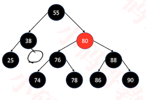

+ 这不是一棵红黑树，因为它不符合红黑树的第5条性质
  - 为38补上黑色的null节点， 55 38 null共有2个黑色节点。而55 38 25 null有3个黑色节点
  - 我们计算黑色节点时，可以计算null节点也可以不算null节点。
    - 例如55 38 null可以说有2个黑色节点，也可以说有3个黑色节点
    - 但是所有路径计算的时候要统一，推荐不计算黑色null节点

### 与4阶B树的等价交换


+ 红黑树 和 4阶B树（2-3-4树）具有等价性

  - 因此将红黑树类比成4阶B树进行添加， 删除，搜索等操作
  - 只要保证最终的树仍然是红黑树，那么它就可以等价为4阶B树，具有平衡性
  - 并不是将红黑树转换成4阶B树，而是当做4阶B树进行处理

+ <font color=black>**BLACK**</font>节点与它的 **<font color=red>RED</font>** 子节点融合在一起，形成1个B树节点

+ 红黑树的 **BLACK** 节点个数 与 4阶B树的节点总个数相等

  + 单独黑色的节点能成为B树的节点
  + 红色节点都被黑色的父节点融合类比为一个4阶B树节点

+ 网上有些教程：用 2-3树 与 红黑树 进行类比，这是极其不严谨的，2-3树 并不能完美匹配 红黑树 的所有情况

+ 注意：因为界面空间有限，后面展示的红黑树都会省略 NULL 节点

+ 类比的情形

  

  - 红黑类比变形后可以看到其仍然是二叉树，其仍旧是原来的红黑树,只是视觉上变化了
  - 但是变形后的结构我们可以把它当做是4阶B树来进行看待
  - 思考：如果上图最底层的 BLACK 节点是不存在的，在B树中是什么样的情形？
    - 整棵B树只有1个节点，而且是超级节点
  - 最后一棵树，没有红色节点，那么这课树本身就可以当做一个B树

### 几个英文单词

+ parent：父节点

+ sibling：兄弟节点

+ uncle：叔父节点（ parent 的兄弟节点）

+ grand：祖父节点（ parent 的父节点）

  

### 辅助函数

+ 我们为了方便的操作红黑树，因此定义了一系列的函数，用于对节点染色，判断颜色等等

  

+ 其具体的代码

  ```java
  public class RBTree<E> extends BBST<E> {
    //红色
  	private static final boolean RED = false;
    //黑色
  	private static final boolean BLACK = true;
  	
  	public RBTree() {
  		this(null);
  	}
  	
  	public RBTree(Comparator<E> comparator) {
  		super(comparator);
  	}
  	
  	
    //对某个结点进行染色
    private Node<E> color(Node<E> node, boolean color) {
  		if (node == null) return node;
  		((RBNode<E>)node).color = color;
  		return node;
  	}
  	
    //将节点染成红色
  	private Node<E> red(Node<E> node) {
  		return color(node, RED);
  	}
  	
    //将节点染成黑色
  	private Node<E> black(Node<E> node) {
  		return color(node, BLACK);
  	}
  	
    //获取节点的颜色， 空节点为黑色
  	private boolean colorOf(Node<E> node) {
  		return node == null ? BLACK : ((RBNode<E>)node).color;
  	}
    
  	//判断是否为黑色节点
  	private boolean isBlack(Node<E> node) {
  		return colorOf(node) == BLACK;
  	}
  	//判断是否为红色节点
  	private boolean isRed(Node<E> node) {
  		return colorOf(node) == RED;
  	}
    
  	@Override
  	protected Node<E> createNode(E element, Node<E> parent) {
  		return new RBNode<>(element, parent);
  	}
  
    //定义红黑树节点: 因为红黑树的节点具有颜色的特殊性质，所以需要自定义一个节点
  	private static class RBNode<E> extends Node<E> {
  		boolean color = RED;
  		public RBNode(E element, Node<E> parent) {
  			super(element, parent);
  		}
  	}
  	
  }
  
  //普通的Node节点中新增获取兄弟节点的方法
  protected static class Node<E> {
  		...
      ...
  		public Node<E> sibling() {
  			if (isLeftChild()) {
  				return parent.right;
  			}
  			if (isRightChild()) {
  				return parent.left;
  			}
  			return null;
  		}
  	}
  ```

### 添加


+ 理解红黑树时，一定要能联想出红黑树对应的B树的样子
  - 为了便于理解，我们经常把红黑树展示成B树的样子
+ 已知
  - B树中，新元素必定是添加到叶子节点中
    - 因此，红黑树也是上图的只能添加到最后一层
  - 4阶B树所有节点的元素个数 x 都符合 1 ≤ x ≤ 3
+  建议新添加的节点默认为 RED，这样能够让红黑树的性质尽快满足（性质 1、2、3、5 都满足，性质 4 不一定）
  - 当添加的是红色节点时，1，2，3，5的性质都满足
  - 只有当添加成两个相连的红色节点时，不满足性质4
+ 如果添加的是根节点，染成 BLACK 即可

### 添加-情况分析


+ 最后一层节点的情况只有这四种: `红黑红`, `黑红`, `红黑`，`黑`

+ 能够添加节点的位置如上图所示，共有12种情况

  ```
  17的左,右子节点   2
  33的左,右子节点   2
  46的左子节点      1
  50的左,右子节点   2
  72的左,右子节点   2
  76的右子节点      1
  88的左,右子节点    2
  
  共计12种情况
  ```

+ 有4种情况满足红黑树的性质4:<font color=blue> parent</font>为**BLACK**

  - 同样也满足4阶B树的性质

  - 因此不用做任何额外的处理

    

+ 有 8 种情况不满足红黑树的性质 4 ：parent 为<font color=red> **RED**</font>（ <font color=red>_**Double Red**_ </font>）

  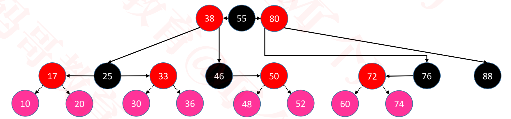

  - 其中前 4 种属于B树节点上溢的情况
  - 这八种情况添加红色的节点后都是双红节点，违背了红黑树的性质4

### 添加 – 修复性质4 – LL\RR- (uncle不是 RED)


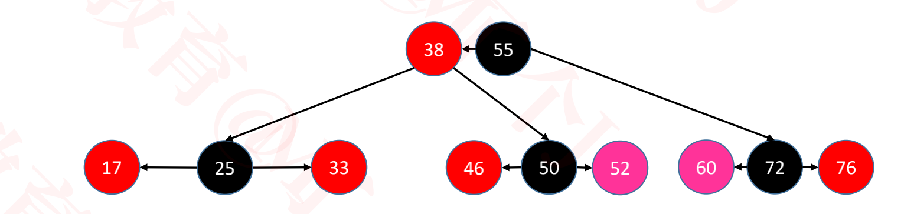

+ 添加52的情况分析
  - 如图，将红色节点52为添加到红色节点50右子节点时，双红，违背性质4，因此我们的目的是将它重新变成一棵红黑树。
  - 把`46 50`当做一个B树叶子节点时，添加52后，构成`46 50 52`的B树节点。
    - 4阶B树节点可以包含1~3个元素
    - 4阶B树的添加操作发生在叶子节点
      - 当`46 50`为B树叶子节点时，添加52后，构成`46 50 52`的B树节点
  - 在红黑树中，能够构成三个元素的B树节点结构，只有`红黑红`这种情况，且还要符合从小到大的顺序
    - 因此得出结论是:  46红色，50黑色， 52红色
    - 且50为父节点， 46， 52为左右子节点
  - 要将`46->50->52`的结构变为  `46<-50->52`则需要将46进行左旋转,此时修复了性质4，得到了一棵红黑树
    - 这恰好符合我们以前在AVL树中学过的RR的情况

+ 添加60的情况分析
  - 与添加52的分析正好相同
  - 唯一的不同时，需要进行右旋转
    - 要将`60<-72<-76`的结构变为  `60<-72->76`则需要将76进行右旋转
    - 这恰好符合我们以前在AVL树中学过的LL的情况

+ 总结 - uncle 不是 <font color=red> **RED**</font>
  1. <font color=blue>parent</font> 染成 **BLACK**，<font color=blue>grand</font> 染成<font color=red> **RED**</font>
  2. <font color=blue>grand</font> 进行单旋操作
     - LL：右旋转
     - RR：左旋转


### 添加 – 修复性质4 – LR\RL(uncle 不是 RED)


+ 添加48的情况分析
  - 与添加52的分析正好相同
  - 唯一的不同时，需要进行将50进行右旋转，再将46进行左旋转
    - 将`46->50->48`的结构变为  `46<-48->50`
    - 这恰好符合我们以前在AVL树中学过的RL的情况

+ 添加74的情况分析
  - 与添加52的分析正好相同
  - 唯一的不同时，需要进行将72进行左旋转，再将76进行右旋转
    - 将`74<-72<-76`的结构变为  `72<-70->76`

+ 总结- uncle 不是 <font color=red> **RED**</font>
  1. 自己染成 **BLACK**，<font color=blue>grand</font> 染成<font color=red> **RED**</font>
  2. 进行双旋操作
     - LR: <font color=blue>parent</font>  左旋转, <font color=blue>grand</font> 右旋转
     - RL: <font color=blue>parent</font>  右旋转, <font color=blue>grand</font> 左旋转

### 添加 – 修复性质4 – 上溢 – LL (uncle 是 RED)

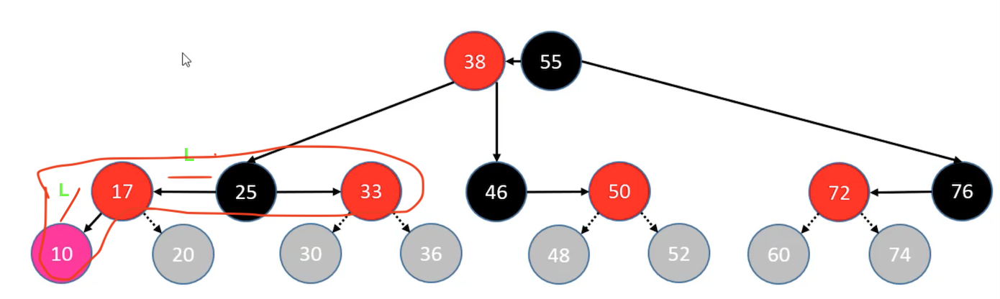


+ 添加10的分析

  - `10 17 25 33`构成的B树节点产生了上溢，将25节点向上合并。

    - 此时`10 17`, `13`为B树节点, 因此17，13要染成黑色

    - 将25向`38 55`合并的过程相当于向`38 55`插入一个新的25节点，因为我们定义新插入的节点为红色。所以25染成红色。

    - 新插入节点有12种情况，因此可以继续沿用插入的逻辑。(递归调用即可)

      - 为什么当做新插入的节点重新插入就可以达到平衡？
        - 插入新节点后，我们进行的一系列的染色，旋转等等操作，都是为了让它重新符合一个B树节点，从而仍然是一棵红黑树

    - 由上图可知，红色节点25插入的情况分析

      - 红色25的叔父节点时黑色76，符合uncle不是 RED， LL的逻辑。

      - 因此38为黑色， 25， 55为红色，且55右旋转

    - 最终红黑树结果为

      

+ 总结- uncle 是 <font color=red> **RED   **</font> 

  1. <font color=blue>parent</font>  , <font color=blue>uncle</font> 染成**BLACK**
  2. <font color=blue>grand</font>  向上合并
     - 染成<font color=red> **RED   **</font> ,当做新添加的节点进行处理
     - <font color=blue>grand</font>向上合并时，可能继续发生上溢
     - 若上溢持续到根节点，只需将根节点染成**BLACK**

+ 此时所做的操作简要概况为

  1. <font color=blue>parent</font>  , <font color=blue>uncle</font> 染成**BLACK**
  2. 将<font color=blue>grand</font> 染成<font color=red> **RED   **</font>， 继续调用插入的方法。不需要主动调用旋转。

### 添加 – 修复性质4 – 上溢 – RR (uncle 是 RED)

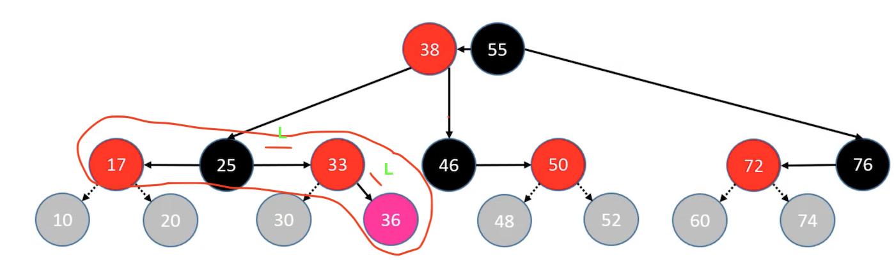

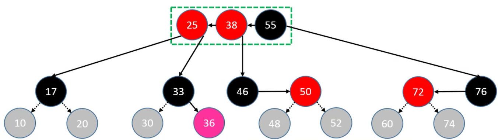


+ 添加50的情况分析
  - 与添加10的情况分析类似
+ 调整逻辑与`上溢-LL`一样

###  添加 – 修复性质4 – 上溢 – LR (uncle 是 RED)


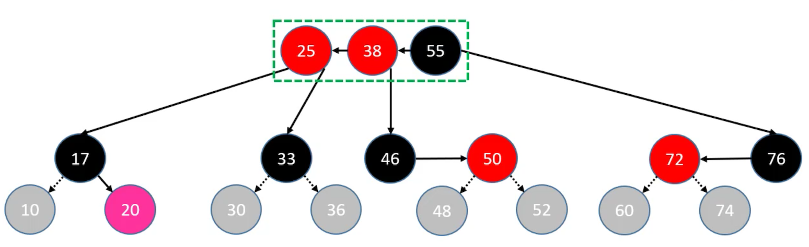

+ 添加50的情况分析
  - 与添加10的情况分析类似
+ 调整逻辑与`上溢-LL`一样

### 添加 – 修复性质4 – 上溢 – RL (uncle 是 RED)


+ 添加50的情况分析
  - 与添加10的情况分析类似
+ 调整逻辑与`上溢-LL`一样

### 添加的所有情况总结

+ <font color=blue> parent</font>为**BLACK**
  - 总共4种情况，添加后不需要调整
+ <font color=blue> parent</font>为<font color=red>**RED**</font>
  - <font color=blue> uncle</font>为**BLACK**
    1. LL
       + <font color=blue>parent</font> 染成 **BLACK**，<font color=blue>grand</font> 染成<font color=red> **RED**</font>
       + <font color=blue>grand</font> 进行右旋转
    2. RR
       - <font color=blue>parent</font> 染成 **BLACK**，<font color=blue>grand</font> 染成<font color=red> **RED**</font>
       - <font color=blue>grand</font> 进行左旋转
    3. LR
       - 自己染成 **BLACK**，<font color=blue>grand</font> 染成<font color=red> **RED**</font>
       -  <font color=blue>parent</font>  左旋转, <font color=blue>grand</font> 右旋转
    4. RL
       - 自己染成 **BLACK**，<font color=blue>grand</font> 染成<font color=red> **RED**</font>
       -  <font color=blue>parent</font>  右旋转, <font color=blue>grand</font> 左旋转
  - <font color=blue> unle</font>为<font color=red>**RED**</font>
    - LL/RR/LR/RL
      - <font color=blue>parent</font>  , <font color=blue>uncle</font> 染成**BLACK**
      - 将<font color=blue>grand</font> 染成<font color=red> **RED   **</font>， 继续调用插入的方法。不需要主动调用旋转。

### 更改继承结构-BBST

+ AVTree和RBTree都继承自平衡二叉搜索树BST

+ 但是AVTree和RBTree还有的旋转代码是相同的

+ 为了复用旋转的逻辑，我们再抽象出一层BBST，AVTree和RBTree继承自BBST

+ BBST相当于在BST的基础上增加了旋转的功能

+ BBST的代码

  ```java
  
  //BBST继承自BST,并添加了旋转的逻辑
  public class BBST<E> extends BST<E> {
  	public BBST() {
  		this(null);
  	}
  	public BBST(Comparator<E> comparator) {
  		super(comparator);
  	}
  
    protected void rotateLeft(Node<E> grand) {
  		Node<E> parent = grand.right;
  		Node<E> child = parent.left;
  		grand.right = child;
  		parent.left = grand;
  		afterRotate(grand, parent, child);
  	}
  	protected void rotateRight(Node<E> grand) {
  		Node<E> parent = grand.left;
  		Node<E> child = parent.right;
  		grand.left = child;
  		parent.right = grand;
  		afterRotate(grand, parent, child);
  	}
  	protected void afterRotate(Node<E> grand, Node<E> parent, Node<E> child) {
  		// 让parent称为子树的根节点
  		parent.parent = grand.parent;
  		if (grand.isLeftChild()) {
  			grand.parent.left = parent;
  		} else if (grand.isRightChild()) {
  			grand.parent.right = parent;
  		} else { // grand是root节点
  			root = parent;
  		}
  		// 更新child的parent
  		if (child != null) {
  			child.parent = grand;
  		}
  		// 更新grand的parent
  		grand.parent = parent;
  	}
  	
  	protected void rotate(
  			Node<E> r, // 子树的根节点
  			Node<E> b, Node<E> c,
  			Node<E> d,
  			Node<E> e, Node<E> f) {
  		// 让d成为这棵子树的根节点
  		d.parent = r.parent;
  		if (r.isLeftChild()) {
  			r.parent.left = d;
  		} else if (r.isRightChild()) {
  			r.parent.right = d;
  		} else {
  			root = d;
  		}
  		//b-c
  		b.right = c;
  		if (c != null) {
  			c.parent = b;
  		}
  		// e-f
  		f.left = e;
  		if (e != null) {
  			e.parent = f;
  		}
  		// b-d-f
  		d.left = b;
  		d.right = f;
  		b.parent = d;
  		f.parent = d;
  	}
  }
  
  //AVLTree继承自BBST
  public class AVLTree<E> extends BBST<E> {
  	public AVLTree() {
  		this(null);
  	}
  	
  	public AVLTree(Comparator<E> comparator) {
  		super(comparator);
  	}
  	
  	@Override
  	protected void afterRotate(Node<E> grand, Node<E> parent, Node<E> child) {
      //先旋转
  		super.afterRotate(grand, parent, child);
  		//再更新高度
  		updateHeight(grand);
  		updateHeight(parent);
  	}
  	
  	@Override
  	protected void rotate(Node<E> r, Node<E> b, Node<E> c, Node<E> d, Node<E> e, Node<E> f) {
      //先旋转
  		super.rotate(r, b, c, d, e, f);
  		// 再更新高度
  		updateHeight(b);
  		updateHeight(f);
  		updateHeight(d);
  	}
    ...
    ...
  }
  ```

### 添加的代码实现

```java
public class BST<E> extends BinaryTree<E> {
  public void add(E element) {
		elementNotNullCheck(element);
		
		// 添加第一个节点
		if (root == null) {
			root = createNode(element, null);
			size++;

			// 新添加节点之后的处理
			afterAdd(root);
			return;
		}
		
		// 添加的不是第一个节点
		// 找到父节点
		Node<E> parent = root;
		Node<E> node = root;
		int cmp = 0;
		do {
			cmp = compare(element, node.element);
			parent = node;
			if (cmp > 0) {
				node = node.right;
			} else if (cmp < 0) {
				node = node.left;
			} else { // 相等
				node.element = element;
				return;
			}
		} while (node != null);

		// 看看插入到父节点的哪个位置
		Node<E> newNode = createNode(element, parent);
		if (cmp > 0) {
			parent.right = newNode;
		} else {
			parent.left = newNode;
		}
		size++;
		
		// 新添加节点之后的处理
		afterAdd(newNode);
	}
}


public class RBTree<E> extends BBST<E> {
	private static final boolean RED = false;
	private static final boolean BLACK = true;
	
	public RBTree() {
		this(null);
	}
	
	public RBTree(Comparator<E> comparator) {
		super(comparator);
	}
  //添加完成后恢复平衡
	@Override
	protected void afterAdd(Node<E> node) {
		Node<E> parent = node.parent;
		
		// 添加的是根节点 或者 上溢到达了根节点
		if (parent == null) {
			black(node);
			return;
		}
		
		// 如果父节点是黑色，直接返回
		if (isBlack(parent)) return;
		
		// 叔父节点
		Node<E> uncle = parent.sibling();
		// 祖父节点
		Node<E> grand = parent.parent;
		if (isRed(uncle)) { // 叔父节点是红色【B树节点上溢】
			black(parent);
			black(uncle);
			// 把祖父节点当做是新添加的节点
			afterAdd(red(grand));
			return;
		}
		
		// 叔父节点不是红色
		if (parent.isLeftChild()) { // L
			if (node.isLeftChild()) { // LL
				black(parent);
        red(grand);
        rotateRight(grand);        
			} else { // LR
				black(node);
        red(grand);
				rotateLeft(parent);
        rotateRight(grand);        
			}
		} else { // R
			if (node.isLeftChild()) { // RL
				black(node);
        red(grand);
				rotateRight(parent);
        rotateLeft(grand);
			} else { // RR
				black(parent);
        red(grand);
        rotateLeft(grand);
			}
		}
	}
  
  //对上面的逻辑进行调整，已达到代码的复用
  @Override
	protected void afterAdd(Node<E> node) {
		Node<E> parent = node.parent;
		
		// 添加的是根节点 或者 上溢到达了根节点
		if (parent == null) {
			black(node);
			return;
		}
		
		// 如果父节点是黑色，直接返回
		if (isBlack(parent)) return;
		
		// 叔父节点
		Node<E> uncle = parent.sibling();
		// 祖父节点
		Node<E> grand = red(parent.parent);
		if (isRed(uncle)) { // 叔父节点是红色【B树节点上溢】
			black(parent);
			black(uncle);
			// 把祖父节点当做是新添加的节点
			afterAdd(grand);
			return;
		}
		// 叔父节点不是红色
		if (parent.isLeftChild()) { // L
			if (node.isLeftChild()) { // LL
				black(parent);
			} else { // LR
				black(node);
				rotateLeft(parent);
			}
			rotateRight(grand);
		} else { // R
			if (node.isLeftChild()) { // RL
				black(node);
				rotateRight(parent);
			} else { // RR
				black(parent);
			}
			rotateLeft(grand);
		}
	}
	...
	...
}
```

### 测试添加功能

+ 重写RBNode的toString方法

  ```java
  private static class RBNode<E> extends Node<E> {
  		boolean color = RED;
  		public RBNode(E element, Node<E> parent) {
  			super(element, parent);
  		}
  		@Override
  		public String toString() {
  			String str = "";
  			if (color == RED) {
  				str = "R_";
  			}
  			return str + element.toString();
  		}
  }
  ```

+ 测试代码

  ```java
  static void test3() {
  		Integer data[] = new Integer[] {
  				55, 87, 56, 74, 96, 22, 62, 20, 70, 68, 90, 50
  		};
  		
  		RBTree<Integer> rb = new RBTree<>();
  		for (int i = 0; i < data.length; i++) {
  			rb.add(data[i]);
  			System.out.println("【" + data[i] + "】");
  			BinaryTrees.println(rb);
  			System.out.println("---------------------------------------");
  		}
  }
  
  //打印结果
  【55】
  55
  ---------------------------------------
  【87】
  55─┐
     │
    R_87
  ---------------------------------------
  【56】
    ┌─56─┐
    │    │
  R_55  R_87
  ---------------------------------------
  【74】
   ┌─56─┐
   │    │
  55  ┌─87
      │
    R_74
  ---------------------------------------
  【96】
   ┌─56─┐
   │    │
  55  ┌─87─┐
      │    │
    R_74  R_96
  ---------------------------------------
  【22】
       ┌─56─┐
       │    │
    ┌─55  ┌─87─┐
    │     │    │
  R_22  R_74  R_96
  ---------------------------------------
  【62】
       ┌─56──┐
       │     │
    ┌─55  ┌─R_87─┐
    │     │      │
  R_22 ┌─74      96
       │
     R_62
  ---------------------------------------
  【20】
       ┌────56─────┐
       │           │
    ┌─22─┐      ┌─R_87─┐
    │    │      │      │
  R_20  R_55 ┌─74      96
             │
           R_62
  ---------------------------------------
  【70】
       ┌────56─────┐
       │           │
    ┌─22─┐      ┌─R_87─┐
    │    │      │      │
  R_20  R_55 ┌─70─┐    96
             │    │
           R_62  R_74
  ---------------------------------------
  【68】
           ┌─────70────┐
           │           │
       ┌─R_56─┐     ┌─R_87─┐
       │      │     │      │
    ┌─22─┐    62─┐ 74      96
    │    │       │
  R_20  R_55    R_68
  ---------------------------------------
  【90】
           ┌─────70────┐
           │           │
       ┌─R_56─┐     ┌─R_87─┐
       │      │     │      │
    ┌─22─┐    62─┐ 74    ┌─96
    │    │       │       │
  R_20  R_55    R_68   R_90
  ---------------------------------------
  【50】
          ┌────70───┐
          │         │
       ┌─56─┐     ┌─87─┐
       │    │     │    │
   ┌─R_22─┐ 62─┐ 74  ┌─96
   │      │    │     │
  20    ┌─55  R_68 R_90
        │
      R_50
  ---------------------------------------
  ```

  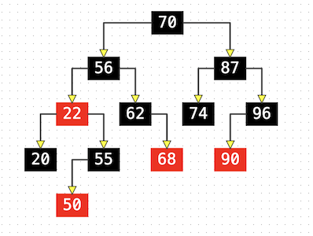


### 删除

+ 在B树中最后真正被删除的节点都在叶子节点中

+ 因此，以下讨论的都是发生在最后一层节点中的删除

  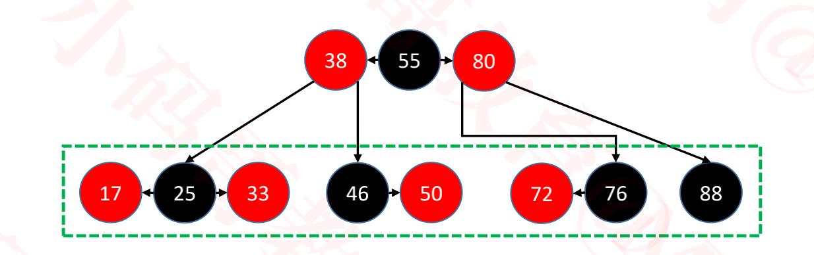

### 删除 – RED节点

+ 直接删除，不用作任何调整

  

  - 删除红色节点17，33，50，72时，直接删除即可

### 删除 – BLACK节点

+ 有3种情况
  - 拥有 2 个 <font color=red> **RED   **</font>子节点的 **BLACK** 节点
  - 拥有 1 个 <font color=red> **RED   **</font> 子节点的 **BLACK** 节点
  - **BLACK** 叶子节点

#### 拥有 2 个 <font color=red> **RED   **</font>子节点**BLACK** 节点


+ 不可能被直接删除，因为会找它的红色子节点替代删除

  ```
  找25的前驱或后继去删除
  
  1. 找黑色25的后继为红色的33
  2. 将元素33覆盖元素25
  3. 再删除红色的33
  ```

+ 所以仍然是删除红色节点的情况

#### 拥有1个<font color=red>**RED**</font>子节点的BLACK节点

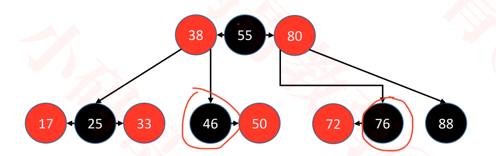


+ 判定条件：用以替代的子节点是 <font color=red> **RED   **</font>
+ 将替代的 <font color=red> **RED   **</font> 子节点染成 **BLACK** 即可保持红黑树性质
+ 情况分析
  + 删除黑色的46或76时，取代的分别是红色的50或72
  + 红色50或红色72要符合红黑树，且为独立的B树节点, 此时应该变为黑色

#### BLACK叶子节点

+ 下面考虑的都是叶子节点在右边的情况，左边的情况与右边对称处理即可

+ **BLACK** 叶子节点被删除后，会导致B树节点下溢（比如删除88）

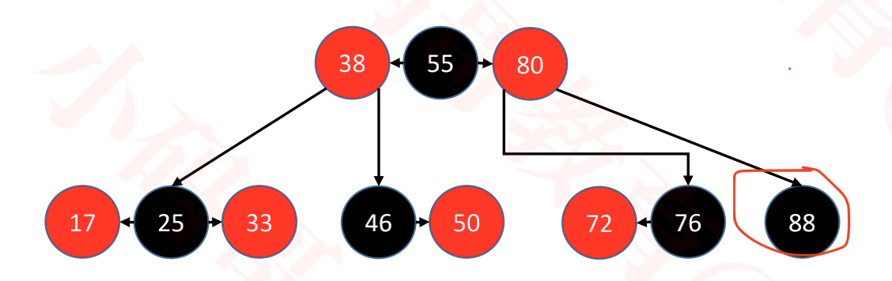


##### <font color=blue>sibling</font>为BLACK

+ 如果 <font color=blue>sibling</font> 至少有 1 个 <font color=red>**RED**</font> 子节点

  - 进行旋转操作
  - 旋转之后的中心节点继承   <font color=blue>parent</font> 的颜色
  - 旋转之后的左右节点染为 **BLACK**

  

  

  

  情况分析

  1. 这三种情况下，黑色88的 <font color=blue>sibling</font> 节点是黑色的76

  2. 且黑色的<font color=blue>sibling</font>76，有红色子节点。 则有三种情况

     - `黑红`, `红黑`, `红黑红`

  3. 此时把这三种情况的红黑树，类比成B树时，B树节点88的兄弟节点为 `76 78`或`72 76`或`72 76 87`，能够出借元素

     ```
     参考B树中，兄弟节点出借元素的规则
     ```

     

  4. 对第一种情况，`黑76 红78`的操作

     - 根据B树的出借元素规则的结果，78与55构成B树节点, 76, 80构成单独的B树节点
     - 因此78变为红色，76，80变为黑色
     - 且要将76先左旋，再将80右旋

  5. 对第二种情况，`红72 黑76 `的操作

     - 因此76变为红色，72，80变为黑色
     - 80进行右旋即可

  6. 对第三种情况，`红72 黑76 红78 `的操作

     - 情形1

       - LL的情况，对80进行右旋转

       - 节点染色， 注意78节点的位置

         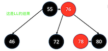

     - 情形2

       - LR的情况，对76进行左旋转，对80进行右旋转

       - 节点染色，注意78节点的位置

         

     - 因此，我们可知，不同选择导致我们最终得到的红黑树是不同的。

     - 所以不同平台运用的规则不同时，删除后的红黑树可能不一致。

+ 判定条件： <font color=blue>sibling</font>没有 1 个  <font color=red>**RED**</font>  子节点

  - 如果 <font color=blue>parent</font> 是<font color=red>**RED**</font>

    - 将  <font color=blue>sibling</font>染成  <font color=red>**RED**</font> 、 <font color=blue>parent</font> 染成 **BLACK** 即可修复红黑树性质

      

  - 如果 <font color=blue>parent</font> 是**BLACK**

    - 将  <font color=blue>sibling</font>染成  <font color=red>**RED**</font> 、 <font color=blue>parent</font> 染成 **BLACK** 

    - 会导致 <font color=blue>parent</font> 也下溢

    - 这时只需要把 <font color=blue>parent</font> 当做被删除的节点处理即可

      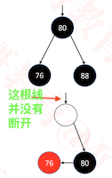

  - 情况分析

    1. 此时兄弟节点构成B树节点时，只有一个黑色的节点，所以不能出借

    2. 只能从B树的父节点出借元素

       - 当 <font color=blue>parent</font> 是<font color=red>**RED**</font>时，

         1. 说明B树的父节点至少有两个元素，把最后一个元素直接出借即可
         2. 由B树性质的下溢可知，出借的元素和其子元素构成新的B树节点
         3. 因此，要删除节点<font color=blue>parent</font> 染成黑色，要删除节点的 <font color=blue>sibling</font>节点染成红色

       - 当 <font color=blue>parent</font> 是**BLACK**时，

         1. 说明B树的父节点只有1个元素，把最后一个元素出借后，父节点由产生下溢

         2. 由B树性质的下溢可知，出借的元素和其子元素构成新的B树节点

         3. 因此，要删除节点<font color=blue>parent</font> 染成黑色，要删除节点的 <font color=blue>sibling</font>节点染成红色

         4. 这时只需要把 <font color=blue>parent</font> 当做被删除的节点处理即可

            ```
            此时80向下合并后，80原来的位置也产生了下溢，相当于把80从节点中删除了一样， 我们递归调用删除节点的逻辑即可
            
            递归调用肯定会结束，倒推回来此时空的圆圈节点如果不是根节点， 则相当于一定会被填充。
            ```

##### <font color=blue>sibling</font>为<font color=red>**RED**</font> 


- 要删除的黑色节点如果兄弟节点为红色，则站在B树的角度考虑，该结点被归为父级的B树节点，则其兄弟不可能出借元素

+ <font color=blue>sibling</font> 染成 **BLACK**，<font color=blue>parent</font> 染成 <font color=red>**RED**</font>，进行旋转
+ 于是又回到 <font color=blue>sibling</font> 是 **BLACK** 的情况

### 删除的所有情况的总结

+ 删除  <font color=red>**RED**</font>节点
  - 直接删除即可
+ 删除 **BLACK**节点
  - 拥有 2 个 <font color=red> **RED   **</font>子节点**BLACK** 节点
    - 真正删除的是前驱或后继的 <font color=red> **RED   **</font>节点
  - 拥有 1 个 <font color=red> **RED   **</font>子节点**BLACK** 节点
    - **BLACK** 节点被删除，其 <font color=red> **RED   **</font>子节点替代它的位置，被染成黑色
  - **BLACK**叶子节点- 在左边
    - 与在右边时完全对称
  - **BLACK**叶子节点- 在右边
    - <font color=blue>sibling</font>为**BLACK**
      1. 如果 <font color=blue>sibling</font> 至少有 1 个 <font color=red>**RED**</font> 子节点
         + 进行旋转操作
           - `黑红`:LR, <font color=blue>sibling</font>左旋转(旋转后变成LL)， <font color=blue>parent</font>右旋转
           - `红黑`:LL,  <font color=blue>parent</font>右旋转
           - `红黑红`:
             - LL时，  <font color=blue>parent</font>右旋转，且黑色节点的红色右子节点。变为旋转后原来的<font color=blue>parent</font>的红色左子节点
             - LR时， <font color=blue>sibling</font>左旋转， <font color=blue>parent</font>右旋转
             - 两种情况实际处理时二选一，实际选择LL的情况
           - 因为上述三种情况，都会包含LL情况，所以代码中可以统一转成LL进行处理
         + 旋转之后的中心节点继承   <font color=blue>parent</font> 的颜色
         + 旋转之后的左右节点染为 **BLACK**
      2. 判定条件： <font color=blue>sibling</font>没有 1 个  <font color=red>**RED**</font>  子节点
         1. 如果 <font color=blue>parent</font> 是<font color=red>**RED**</font>
            - 将  <font color=blue>sibling</font>染成  <font color=red>**RED**</font> 、 <font color=blue>parent</font> 染成 **BLACK** 即可修复红黑树性质
         2. 如果 <font color=blue>parent</font> 是**BLACK**
            - 会导致 <font color=blue>parent</font> 也下溢
            - 这时只需要把 <font color=blue>parent</font> 当做被删除的节点处理,递归调用删除操作即可
    - <font color=blue>sibling</font>为<font color=red>**RED**</font> 
      - <font color=blue>sibling</font> 染成 **BLACK**，<font color=blue>parent</font> 染成 <font color=red>**RED**</font>，进行右旋转
      - 于是又回到 <font color=blue>sibling</font> 是 **BLACK** 的情况

### 删除的代码实现

```java
public class BST<E> extends BinaryTree<E>{
  private void remove(Node<E> node) {
		if (node == null) return;
		size--;
		if (node.hasTwoChildren()) { // 度为2的节点
			// 找到后继节点
			Node<E> s = successor(node);
			// 用后继节点的值覆盖度为2的节点的值
			node.element = s.element;
			// 删除后继节点
			node = s;
		}
		
		// 删除node节点（node的度必然是1或者0）
		Node<E> replacement = node.left != null ? node.left : node.right;
		
		if (replacement != null) { // node是度为1的节点
			// 更改parent
			replacement.parent = node.parent;
			// 更改parent的left、right的指向
			if (node.parent == null) { // node是度为1的节点并且是根节点
				root = replacement;
			} else if (node == node.parent.left) {
				node.parent.left = replacement;
			} else { // node == node.parent.right
				node.parent.right = replacement;
			}			
			// 删除节点之后的处理
			afterRemove(node, replacement);
		} else if (node.parent == null) { // node是叶子节点并且是根节点
			root = null;
			// 删除节点之后的处理
			afterRemove(node, null);
		} else { // node是叶子节点，但不是根节点
			if (node == node.parent.left) {
				node.parent.left = null;
			} else { // node == node.parent.right
				node.parent.right = null;
			}
			// 删除节点之后的处理
			afterRemove(node, null);
		}
	}
  
  
}

public class RBTree<E> extends BBST<E> {
  ...
  ...
  //
  /**
	 * 删除node之后的调整
	 * @param node node为真正要删除的节点, replacement是度为1时，替代node的节点
	 */
  protected void afterRemove(Node<E> node, Node<E> replacement) {
		// 如果删除的节点是红色
		if (isRed(node)) return;
    // 用以取代node的子节点是红色
		if (isRed(replacement)) {
			black(replacement);
			return;
		}
		Node<E> parent = node.parent;
		// 删除的是根节点
		if (parent == null) return;
		
		// 删除的是黑色叶子节点【下溢】
		// 判断被删除的node是左还是右
    //为什么要两个逻辑配合判断?
    //因为有两种情况
    // 1. 删除的是黑色叶子节点
    // 2. 递归删除
		boolean left = parent.left == null || node.isLeftChild();
		Node<E> sibling = left ? parent.right : parent.left;
		if (left) { // 被删除的节点在左边，兄弟节点在右边
			if (isRed(sibling)) { // 兄弟节点是红色
				black(sibling);
				red(parent);
				rotateLeft(parent);
				// 更换兄弟
				sibling = parent.right;
			}
			
			// 兄弟节点必然是黑色
			if (isBlack(sibling.left) && isBlack(sibling.right)) {
				// 兄弟节点没有1个红色子节点，父节点要向下跟兄弟节点合并
				boolean parentBlack = isBlack(parent);
				black(parent);
				red(sibling);
				if (parentBlack) {
					afterRemove(parent, null);
				}
			} else { // 兄弟节点至少有1个红色子节点，向兄弟节点借元素
				// 兄弟节点的左边是黑色，兄弟要先旋转
				if (isBlack(sibling.right)) {
					rotateRight(sibling);
					sibling = parent.right;
				}
				
				color(sibling, colorOf(parent));
				black(sibling.right);
				black(parent);
				rotateLeft(parent);
			}
		} else { // 被删除的节点在右边，兄弟节点在左边
			if (isRed(sibling)) { // 兄弟节点是红色
				black(sibling);
				red(parent);
				rotateRight(parent);
				// 旋转后，被删除节点的兄弟节点变化了。需更换兄弟， 
				sibling = parent.left;
			}
			
			// 兄弟节点必然是黑色
			if (isBlack(sibling.left) && isBlack(sibling.right)) { //黑兄弟没有红色子节点
				// 兄弟节点没有1个红色子节点，父节点要向下跟兄弟节点合并
				boolean parentBlack = isBlack(parent);
				black(parent);
				red(sibling);
				if (parentBlack) {
					afterRemove(parent, null);
				}
			} else { // 兄弟节点至少有1个红色子节点，向兄弟节点借元素
				// 兄弟节点的左边是黑色，兄弟要先旋转
				if (isBlack(sibling.left)) { //"黑红"的情况
					rotateLeft(sibling); //兄弟向左旋转后，变成LL
          //此时要删除的节点的兄弟节点改变，下面全都统一为LL的情况
					sibling = parent.left;
				}
        //旋转之后的中心节点继承parent的颜色
				color(sibling, colorOf(parent));
        //旋转之后的左右节点继承parent的颜色
				black(sibling.left);
				black(parent);
        //LL情况要右旋转
				rotateRight(parent);
			}
		}
	}  
}
```

### 测试删除功能

+ 测试代码

  ```java
  static void test() {
  		Integer data[] = new Integer[] {
  				55, 87, 56, 74, 96, 22, 62, 20, 70, 68, 90, 50
  		};
  		RBTree<Integer> rb = new RBTree<>();
  		for (int i = 0; i < data.length; i++) {
  			rb.add(data[i]);
  		}
  
  		BinaryTrees.println(rb);
  		for (int i = 0; i < data.length; i++) {
  			rb.remove(data[i]);
  			System.out.println("---------------------------------------");
  			System.out.println("【" + data[i] + "】");
  			BinaryTrees.println(rb);
  		}
  }
  
  //打印结果
          ┌────70───┐
          │         │
       ┌─56─┐     ┌─87─┐
       │    │     │    │
   ┌─R_22─┐ 62─┐ 74  ┌─96
   │      │    │     │
  20    ┌─55  R_68 R_90
        │
      R_50
  ---------------------------------------
  【55】
          ┌────70───┐
          │         │
       ┌─56─┐     ┌─87─┐
       │    │     │    │
   ┌─R_22─┐ 62─┐ 74  ┌─96
   │      │    │     │
  20      50  R_68 R_90
  ---------------------------------------
  【87】
          ┌────70───┐
          │         │
       ┌─56─┐     ┌─90─┐
       │    │     │    │
   ┌─R_22─┐ 62─┐ 74    96
   │      │    │
  20      50  R_68
  ---------------------------------------
  【56】
          ┌───70──┐
          │       │
       ┌─62─┐   ┌─90─┐
       │    │   │    │
   ┌─R_22─┐ 68 74    96
   │      │
  20      50
  ---------------------------------------
  【74】
      ┌───62──┐
      │       │
   ┌─22─┐   ┌─70─┐
   │    │   │    │
  20    50 68    90─┐
                    │
                   R_96
  ---------------------------------------
  【96】
      ┌───62──┐
      │       │
   ┌─22─┐   ┌─70─┐
   │    │   │    │
  20    50 68    90
  ---------------------------------------
  【22】
       ┌─62─┐
       │    │
    ┌─50 ┌─R_70─┐
    │    │      │
  R_20  68      90
  ---------------------------------------
  【62】
       ┌─68─┐
       │    │
    ┌─50    70─┐
    │          │
  R_20        R_90
  ---------------------------------------
  【20】
   ┌─68─┐
   │    │
  50    70─┐
           │
          R_90
  ---------------------------------------
  【70】
   ┌─68─┐
   │    │
  50    90
  ---------------------------------------
  【68】
    ┌─90
    │
  R_50
  ---------------------------------------
  【90】
  50
  ---------------------------------------
  【50】
  
  ```

###删除-去除replacement参数 

```java
public class BST<E> extends BinaryTree<E>{
  ...
  ...
  private void remove(Node<E> node) {
		if (node == null) return;
		
		size--;
		
		if (node.hasTwoChildren()) { // 度为2的节点
			// 找到后继节点
			Node<E> s = successor(node);
			// 用后继节点的值覆盖度为2的节点的值
			node.element = s.element;
			// 删除后继节点
			node = s;
		}
		
		// 删除node节点（node的度必然是1或者0）
		Node<E> replacement = node.left != null ? node.left : node.right;
		
		if (replacement != null) { // node是度为1的节点
			// 更改parent
			replacement.parent = node.parent;
			// 更改parent的left、right的指向
			if (node.parent == null) { // node是度为1的节点并且是根节点
				root = replacement;
			} else if (node == node.parent.left) {
				node.parent.left = replacement;
			} else { // node == node.parent.right
				node.parent.right = replacement;
			}			
			// 删除节点之后的处理
			afterRemove(replacement);//这个replacement必然为红色节点
		} else if (node.parent == null) { // node是叶子节点并且是根节点
			root = null;
			
			// 删除节点之后的处理
			afterRemove(node);
		} else { // node是叶子节点，但不是根节点
			if (node == node.parent.left) {
				node.parent.left = null;
			} else { // node == node.parent.right
				node.parent.right = null;
			}
			
			// 删除节点之后的处理
			afterRemove(node);
		}
	}
  
}

public class RBTree<E> extends BBST<E> {
  ...
  ...
  /**
	 * 删除node之后的调整
	 * @param node 被删除的节点 或者 用以取代被删除节点的子节点（当被删除节点的度为1）
	 */
  protected void afterRemove(Node<E> node) {
		// 如果删除的节点是红色
    // 或者用以取代node的子节点是红色
		if (isRed(node)) {
			black(node);
			return;
		}
		Node<E> parent = node.parent;
		// 删除的是根节点
		if (parent == null) return;
		
		// 删除的是黑色叶子节点【下溢】
		// 判断被删除的node是左还是右
    //为什么要两个逻辑配合判断?
    //因为有两种情况
    // 1. 删除的是黑色叶子节点
    // 2. 递归删除
		boolean left = parent.left == null || node.isLeftChild();
		Node<E> sibling = left ? parent.right : parent.left;
		if (left) { // 被删除的节点在左边，兄弟节点在右边
			if (isRed(sibling)) { // 兄弟节点是红色
				black(sibling);
				red(parent);
				rotateLeft(parent);
				// 更换兄弟
				sibling = parent.right;
			}
			
			// 兄弟节点必然是黑色
			if (isBlack(sibling.left) && isBlack(sibling.right)) {
				// 兄弟节点没有1个红色子节点，父节点要向下跟兄弟节点合并
				boolean parentBlack = isBlack(parent);
				black(parent);
				red(sibling);
				if (parentBlack) {
					afterRemove(parent, null);
				}
			} else { // 兄弟节点至少有1个红色子节点，向兄弟节点借元素
				// 兄弟节点的左边是黑色，兄弟要先旋转
				if (isBlack(sibling.right)) {
					rotateRight(sibling);
					sibling = parent.right;
				}
				
				color(sibling, colorOf(parent));
				black(sibling.right);
				black(parent);
				rotateLeft(parent);
			}
		} else { // 被删除的节点在右边，兄弟节点在左边
			if (isRed(sibling)) { // 兄弟节点是红色
				black(sibling);
				red(parent);
				rotateRight(parent);
				// 旋转后，被删除节点的兄弟节点变化了。需更换兄弟， 
				sibling = parent.left;
			}
			
			// 兄弟节点必然是黑色
			if (isBlack(sibling.left) && isBlack(sibling.right)) { //黑兄弟没有红色子节点
				// 兄弟节点没有1个红色子节点，父节点要向下跟兄弟节点合并
				boolean parentBlack = isBlack(parent);
				black(parent);
				red(sibling);
				if (parentBlack) {
					afterRemove(parent, null);
				}
			} else { // 兄弟节点至少有1个红色子节点，向兄弟节点借元素
				// 兄弟节点的左边是黑色，兄弟要先旋转
				if (isBlack(sibling.left)) { //"黑红"的情况
					rotateLeft(sibling); //兄弟向左旋转后，变成LL
          //此时要删除的节点的兄弟节点改变，下面全都统一为LL的情况
					sibling = parent.left;
				}
        //旋转之后的中心节点继承parent的颜色
				color(sibling, colorOf(parent));
        //旋转之后的左右节点继承parent的颜色
				black(sibling.left);
				black(parent);
        //LL情况要右旋转
				rotateRight(parent);
			}
		}
	}  
}
```

### 学红黑树的目的

+ AVL树和红黑树等是为了理解一些常见的数据结构的底层
+ 例如TreeMap，HashMap, HashSet等等

### 红黑树的平衡

+ 最初遗留的困惑：为何那5条性质，就能保证红黑树是平衡的？

  

  - 那5条性质，可以保证红黑树等价于4阶B树， 而四阶B树是平衡的

+  相比AVL树，红黑树的平衡标准比较宽松：没有一条路径会大于其他路径的2倍

  ```
  从根节点出发的每条路径上黑节点数量都相同，所以其节点数量最少的就是整个路径都是纯黑节点，最多的就是黑红节点相间路径。
  最多是最少的两倍
  ```

+ 是一种弱平衡、黑高度平衡

  - 弱平衡

    ```
    AVL是一种强平衡，红黑树是一种弱平衡
    
    AVL:
    AVL要求节点的平衡因子只能是-1,0,1，整棵树极度平衡
    
    红黑树:
    我们认为高度越小越平衡，可以看到B树的高度很小。但B树展开为对应的红黑树时，比B树高挺多。
    然而相对而言，展开后的红黑树的高度依然是比较低的，不会让高度变得很夸张。
    
    不会像普通的二叉搜索树一样退化成链表
    ```

  - 黑高度平衡

    ```
    从根节点到任何一个叶子节点的路径，黑色节点的数量都相同
    ```

+ 红黑树的最大高度是 2 ∗ log<sub>2</sub>(n + 1) ，依然是 O(logn) 级别

  - 不用推导，直接用即可

### 平均时间复杂度

+ 搜索：O(logn)

+ 添加：O(logn)，O(1) 次的旋转操作

+ 删除：O(logn)，O(1) 次的旋转操作

  ```
  添加，删除，搜索都和树高有关，因此时间复杂度为O(logn)。
  虽然在添加，删除时，可能会有递归调用，但是经过统计实测，其旋转操作始终是O(1)级别的
  
  AVL删除时，最坏要logn级别的旋转
  ```

### AVL树、红黑树性能对比

+ AVL树
  - 平衡标准比较严格：<font color=red>每个左右子树的高度差不超过1</font>
  - 最大高度是 1.44 ∗ log<sub>2</sub> (n + 2) − 1.328（100W个节点，AVL树最大树高28）
  - 搜索、添加、删除都是 O(logn) 复杂度，其中添加仅需 O(1) 次旋转调整、删除最多需要 O(logn) 次旋转调整
+ 红黑树
  - 平衡标准比较宽松：<font color=red>没有一条路径会大于其他路径的2倍</font>
  - 最大高度是 2 ∗ log<sub>2</sub>(n + 1)（ 100W个节点，红黑树最大树高40）
  - 搜索、添加、删除都是 O(logn) 复杂度，其中添加、删除都仅需 O(1) 次旋转调整
+ 搜索的次数远远大于插入和删除，选择AVL树；搜索、插入、删除次数几乎差不多，选择红黑树
+ 相对于AVL树来说，红黑树牺牲了部分平衡性以换取插入/删除操作时少量的旋转操作，整体来说性能要优于AVL树
+ 红黑树的平均统计性能优于AVL树，实际应用中更多选择使用红黑树

