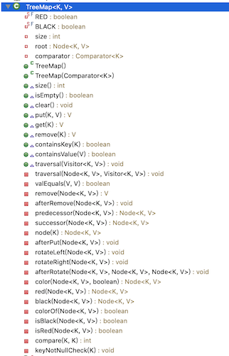

## 映射(Map)

### 简介

+ Map 在有些编程语言中也叫做字典（dictionary，比如 Python、Objective-C、Swift 等
+ Map 的每一个 key 是唯一的

### Map的接口设计

```java
public interface Map<K, V> {
	int size();
	boolean isEmpty();
	void clear();
	V put(K key, V value);
	V get(K key);
	V remove(K key);
	boolean containsKey(K key);
	boolean containsValue(V value);
	void traversal(Visitor<K, V> visitor);
	
	public static abstract class Visitor<K, V> {
		boolean stop;
		public abstract boolean visit(K key, V value);
	}
}

```

+ Map也可以直接利用之前学习的链表、二叉搜索树（AVL树、红黑树）等数据结构来实现

### TreeMap的设计

+ 将key, value放在一个节点中

+ 利用红黑树的特性来提升性能

+ 因此将TreeMap设计成一棵红黑树

+ 其代码实现如下

  ```java
  @SuppressWarnings({"unchecked", "unused"})
  public class TreeMap<K, V> implements Map<K, V> {
  	private static final boolean RED = false;
  	private static final boolean BLACK = true;
  	private int size;
  	private Node<K, V> root;
  	private Comparator<K> comparator;
  	
  	public TreeMap() {
  		this(null);
  	}
  	
  	public TreeMap(Comparator<K> comparator) {
  		this.comparator = comparator;
  	}
  	
  	public int size() {
  		return size;
  	}
  
  	public boolean isEmpty() {
  		return size == 0;
  	}
  
  	public void clear() {
  		root = null;
  		size = 0;
  	}
  
  	@Override
  	public V put(K key, V value) {
  		keyNotNullCheck(key);
  		
  		// 添加第一个节点
  		if (root == null) {
  			root = new Node<>(key, value, null);
  			size++;
  
  			// 新添加节点之后的处理
  			afterPut(root);
  			return null;
  		}
  		
  		// 添加的不是第一个节点
  		// 找到父节点
  		Node<K, V> parent = root;
  		Node<K, V> node = root;
  		int cmp = 0;
  		do {
  			cmp = compare(key, node.key);
  			parent = node;
  			if (cmp > 0) {
  				node = node.right;
  			} else if (cmp < 0) {
  				node = node.left;
  			} else { // 相等
  				node.key = key;
  				V oldValue = node.value;
  				node.value = value;
  				return oldValue;
  			}
  		} while (node != null);
  
  		// 看看插入到父节点的哪个位置
  		Node<K, V> newNode = new Node<>(key, value, parent);
  		if (cmp > 0) {
  			parent.right = newNode;
  		} else {
  			parent.left = newNode;
  		}
  		size++;
  		
  		// 新添加节点之后的处理
  		afterPut(newNode);
  		return null;
  	}
  
  	@Override
  	public V get(K key) {
  		Node<K, V> node = node(key);
  		return node != null ? node.value : null;
  	}
  
  	@Override
  	public V remove(K key) {
  		return remove(node(key));
  	}
  
  	@Override
  	public boolean containsKey(K key) {
  		return node(key) != null;
  	}
  
    //中序遍历node，然后跟node.value比较
  	@Override
  	public boolean containsValue(V value) {
  		if (root == null) return false;
  		
  		Queue<Node<K, V>> queue = new LinkedList<>();
  		queue.offer(root);
  		
  		while (!queue.isEmpty()) {
  			Node<K, V> node = queue.poll();
  			if (valEquals(value, node.value)) return true;
  			
  			if (node.left != null) {
  				queue.offer(node.left);
  			}
  			
  			if (node.right != null) {
  				queue.offer(node.right);
  			}
  		}
  		
  		return false;
  	}
  
  	@Override
  	public void traversal(Visitor<K, V> visitor) {
      //中序遍历
  		if (visitor == null) return;
  		traversal(root, visitor);
  	}
  	
  	private void traversal(Node<K, V> node, Visitor<K, V> visitor) {
  		if (node == null || visitor.stop) return;
  		
  		traversal(node.left, visitor);
  		if (visitor.stop) return;
  		visitor.visit(node.key, node.value);
  		traversal(node.right, visitor);
  	}
  	
  	private boolean valEquals(V v1, V v2) {
  		return v1 == null ? v2 == null : v1.equals(v2);
  	}
  	
  	private V remove(Node<K, V> node) {
  		if (node == null) return null;
  		size--;
  		V oldValue = node.value;
  		
  		if (node.hasTwoChildren()) { // 度为2的节点
  			// 找到后继节点
  			Node<K, V> s = successor(node);
  			// 用后继节点的值覆盖度为2的节点的值
  			node.key = s.key;
  			node.value = s.value;
  			// 删除后继节点
  			node = s;
  		}
  		
  		// 删除node节点（node的度必然是1或者0）
  		Node<K, V> replacement = node.left != null ? node.left : node.right;
  		
  		if (replacement != null) { // node是度为1的节点
  			// 更改parent
  			replacement.parent = node.parent;
  			// 更改parent的left、right的指向
  			if (node.parent == null) { // node是度为1的节点并且是根节点
  				root = replacement;
  			} else if (node == node.parent.left) {
  				node.parent.left = replacement;
  			} else { // node == node.parent.right
  				node.parent.right = replacement;
  			}
  			
  			// 删除节点之后的处理
  			afterRemove(replacement);
  		} else if (node.parent == null) { // node是叶子节点并且是根节点
  			root = null;
  		} else { // node是叶子节点，但不是根节点
  			if (node == node.parent.left) {
  				node.parent.left = null;
  			} else { // node == node.parent.right
  				node.parent.right = null;
  			}
  			
  			// 删除节点之后的处理
  			afterRemove(node);
  		}
  		
  		return oldValue;
  	}
  	
  	private void afterRemove(Node<K, V> node) {
  		// 如果删除的节点是红色
  		// 或者 用以取代删除节点的子节点是红色
  		if (isRed(node)) {
  			black(node);
  			return;
  		}
  		
  		Node<K, V> parent = node.parent;
  		if (parent == null) return;
  		
  		// 删除的是黑色叶子节点【下溢】
  		// 判断被删除的node是左还是右
  		boolean left = parent.left == null || node.isLeftChild();
  		Node<K, V> sibling = left ? parent.right : parent.left;
  		if (left) { // 被删除的节点在左边，兄弟节点在右边
  			if (isRed(sibling)) { // 兄弟节点是红色
  				black(sibling);
  				red(parent);
  				rotateLeft(parent);
  				// 更换兄弟
  				sibling = parent.right;
  			}
  			
  			// 兄弟节点必然是黑色
  			if (isBlack(sibling.left) && isBlack(sibling.right)) {
  				// 兄弟节点没有1个红色子节点，父节点要向下跟兄弟节点合并
  				boolean parentBlack = isBlack(parent);
  				black(parent);
  				red(sibling);
  				if (parentBlack) {
  					afterRemove(parent);
  				}
  			} else { // 兄弟节点至少有1个红色子节点，向兄弟节点借元素
  				// 兄弟节点的左边是黑色，兄弟要先旋转
  				if (isBlack(sibling.right)) {
  					rotateRight(sibling);
  					sibling = parent.right;
  				}
  				
  				color(sibling, colorOf(parent));
  				black(sibling.right);
  				black(parent);
  				rotateLeft(parent);
  			}
  		} else { // 被删除的节点在右边，兄弟节点在左边
  			if (isRed(sibling)) { // 兄弟节点是红色
  				black(sibling);
  				red(parent);
  				rotateRight(parent);
  				// 更换兄弟
  				sibling = parent.left;
  			}
  			
  			// 兄弟节点必然是黑色
  			if (isBlack(sibling.left) && isBlack(sibling.right)) {
  				// 兄弟节点没有1个红色子节点，父节点要向下跟兄弟节点合并
  				boolean parentBlack = isBlack(parent);
  				black(parent);
  				red(sibling);
  				if (parentBlack) {
  					afterRemove(parent);
  				}
  			} else { // 兄弟节点至少有1个红色子节点，向兄弟节点借元素
  				// 兄弟节点的左边是黑色，兄弟要先旋转
  				if (isBlack(sibling.left)) {
  					rotateLeft(sibling);
  					sibling = parent.left;
  				}
  				
  				color(sibling, colorOf(parent));
  				black(sibling.left);
  				black(parent);
  				rotateRight(parent);
  			}
  		}
  	}
  
  	private Node<K, V> predecessor(Node<K, V> node) {
  		if (node == null) return null;
  		
  		// 前驱节点在左子树当中（left.right.right.right....）
  		Node<K, V> p = node.left;
  		if (p != null) {
  			while (p.right != null) {
  				p = p.right;
  			}
  			return p;
  		}
  		
  		// 从父节点、祖父节点中寻找前驱节点
  		while (node.parent != null && node == node.parent.left) {
  			node = node.parent;
  		}
  
  		// node.parent == null
  		// node == node.parent.right
  		return node.parent;
  	}
  	
  	private Node<K, V> successor(Node<K, V> node) {
  		if (node == null) return null;
  		
  		// 前驱节点在左子树当中（right.left.left.left....）
  		Node<K, V> p = node.right;
  		if (p != null) {
  			while (p.left != null) {
  				p = p.left;
  			}
  			return p;
  		}
  		
  		// 从父节点、祖父节点中寻找前驱节点
  		while (node.parent != null && node == node.parent.right) {
  			node = node.parent;
  		}
  
  		return node.parent;
  	}
  	
  	private Node<K, V> node(K key) {
  		Node<K, V> node = root;
  		while (node != null) {
  			int cmp = compare(key, node.key);
  			if (cmp == 0) return node;
  			if (cmp > 0) {
  				node = node.right;
  			} else { // cmp < 0
  				node = node.left;
  			}
  		}
  		return null;
  	}
  	
  	private void afterPut(Node<K, V> node) {
  		Node<K, V> parent = node.parent;
  		
  		// 添加的是根节点 或者 上溢到达了根节点
  		if (parent == null) {
  			black(node);
  			return;
  		}
  		
  		// 如果父节点是黑色，直接返回
  		if (isBlack(parent)) return;
  		
  		// 叔父节点
  		Node<K, V> uncle = parent.sibling();
  		// 祖父节点
  		Node<K, V> grand = red(parent.parent);
  		if (isRed(uncle)) { // 叔父节点是红色【B树节点上溢】
  			black(parent);
  			black(uncle);
  			// 把祖父节点当做是新添加的节点
  			afterPut(grand);
  			return;
  		}
  		
  		// 叔父节点不是红色
  		if (parent.isLeftChild()) { // L
  			if (node.isLeftChild()) { // LL
  				black(parent);
  			} else { // LR
  				black(node);
  				rotateLeft(parent);
  			}
  			rotateRight(grand);
  		} else { // R
  			if (node.isLeftChild()) { // RL
  				black(node);
  				rotateRight(parent);
  			} else { // RR
  				black(parent);
  			}
  			rotateLeft(grand);
  		}
  	}
  	
  	private void rotateLeft(Node<K, V> grand) {
  		Node<K, V> parent = grand.right;
  		Node<K, V> child = parent.left;
  		grand.right = child;
  		parent.left = grand;
  		afterRotate(grand, parent, child);
  	}
  	
  	private void rotateRight(Node<K, V> grand) {
  		Node<K, V> parent = grand.left;
  		Node<K, V> child = parent.right;
  		grand.left = child;
  		parent.right = grand;
  		afterRotate(grand, parent, child);
  	}
  	
  	private void afterRotate(Node<K, V> grand, Node<K, V> parent, Node<K, V> child) {
  		// 让parent成为子树的根节点
  		parent.parent = grand.parent;
  		if (grand.isLeftChild()) {
  			grand.parent.left = parent;
  		} else if (grand.isRightChild()) {
  			grand.parent.right = parent;
  		} else { // grand是root节点
  			root = parent;
  		}
  		
  		// 更新child的parent
  		if (child != null) {
  			child.parent = grand;
  		}
  		
  		// 更新grand的parent
  		grand.parent = parent;
  	}
  
  	private Node<K, V> color(Node<K, V> node, boolean color) {
  		if (node == null) return node;
  		node.color = color;
  		return node;
  	}
  	
  	private Node<K, V> red(Node<K, V> node) {
  		return color(node, RED);
  	}
  	
  	private Node<K, V> black(Node<K, V> node) {
  		return color(node, BLACK);
  	}
  	
  	private boolean colorOf(Node<K, V> node) {
  		return node == null ? BLACK : node.color;
  	}
  	
  	private boolean isBlack(Node<K, V> node) {
  		return colorOf(node) == BLACK;
  	}
  	
  	private boolean isRed(Node<K, V> node) {
  		return colorOf(node) == RED;
  	}
  	
  	private int compare(K e1, K e2) {
  		if (comparator != null) {
  			return comparator.compare(e1, e2);
  		}
  		return ((Comparable<K>)e1).compareTo(e2);
  	}
  	
  	private void keyNotNullCheck(K key) {
  		if (key == null) {
  			throw new IllegalArgumentException("key must not be null");
  		}
  	}
  
  	private static class Node<K, V> {
  		K key;
  		V value;
  		boolean color = RED;
  		Node<K, V> left;
  		Node<K, V> right;
  		Node<K, V> parent;
  		public Node(K key, V value, Node<K, V> parent) {
  			this.key = key;
  			this.value = value;
  			this.parent = parent;
  		}
  		
  		public boolean isLeaf() {
  			return left == null && right == null;
  		}
  		
  		public boolean hasTwoChildren() {
  			return left != null && right != null;
  		}
  		
  		public boolean isLeftChild() {
  			return parent != null && this == parent.left;
  		}
  		
  		public boolean isRightChild() {
  			return parent != null && this == parent.right;
  		}
  		
  		public Node<K, V> sibling() {
  			if (isLeftChild()) {
  				return parent.right;
  			}
  			
  			if (isRightChild()) {
  				return parent.left;
  			}
  			
  			return null;
  		}
  	}
  }
  
  ```

  

  

+ java官方的TreeMap也是这种实现


#### Node节点设计

```java
private static class Node<K, V> {
		K key;
		V value;
		boolean color = RED;
		Node<K, V> left;
		Node<K, V> right;
		Node<K, V> parent;
		public Node(K key, V value, Node<K, V> parent) {
			this.key = key;
			this.value = value;
			this.parent = parent;
		}
		
		public boolean isLeaf() {
			return left == null && right == null;
		}
		
		public boolean hasTwoChildren() {
			return left != null && right != null;
		}
		
		public boolean isLeftChild() {
			return parent != null && this == parent.left;
		}
		
		public boolean isRightChild() {
			return parent != null && this == parent.right;
		}
		
		public Node<K, V> sibling() {
			if (isLeftChild()) {
				return parent.right;
			}
			
			if (isRightChild()) {
				return parent.left;
			}
			
			return null;
		}
	}
```

#### put

```java
public class TreeMap<K, V> implements Map<K, V> {
	private static final boolean RED = false;
	private static final boolean BLACK = true;
	private int size;
	private Node<K, V> root;
	private Comparator<K> comparator;
	
	public TreeMap() {
		this(null);
	}
	
	public TreeMap(Comparator<K> comparator) {
		this.comparator = comparator;
	}
	
	@Override
	public V put(K key, V value) {
		keyNotNullCheck(key);
		
		// 添加第一个节点
		if (root == null) {
			root = new Node<>(key, value, null);
			size++;
			// 新添加节点之后的处理
			afterPut(root);
			return null;
		}
		
		// 添加的不是第一个节点
		// 找到父节点
		Node<K, V> parent = root;
		Node<K, V> node = root;
		int cmp = 0;
		do {
			cmp = compare(key, node.key);
			parent = node;
			if (cmp > 0) {
				node = node.right;
			} else if (cmp < 0) {
				node = node.left;
			} else { // 相等
				node.key = key;
				V oldValue = node.value;
				node.value = value;
				return oldValue;
			}
		} while (node != null);

		// 看看插入到父节点的哪个位置
		Node<K, V> newNode = new Node<>(key, value, parent);
		if (cmp > 0) {
			parent.right = newNode;
		} else {
			parent.left = newNode;
		}
		size++;
		
		// 新添加节点之后的处理
		afterPut(newNode);
		return null;
	}
  
  private void afterPut(Node<K, V> node) {
		Node<K, V> parent = node.parent;
		
		// 添加的是根节点 或者 上溢到达了根节点
		if (parent == null) {
			black(node);
			return;
		}
		
		// 如果父节点是黑色，直接返回
		if (isBlack(parent)) return;
		
		// 叔父节点
		Node<K, V> uncle = parent.sibling();
		// 祖父节点
		Node<K, V> grand = red(parent.parent);
		if (isRed(uncle)) { // 叔父节点是红色【B树节点上溢】
			black(parent);
			black(uncle);
			// 把祖父节点当做是新添加的节点
			afterPut(grand);
			return;
		}
		
		// 叔父节点不是红色
		if (parent.isLeftChild()) { // L
			if (node.isLeftChild()) { // LL
				black(parent);
			} else { // LR
				black(node);
				rotateLeft(parent);
			}
			rotateRight(grand);
		} else { // R
			if (node.isLeftChild()) { // RL
				black(node);
				rotateRight(parent);
			} else { // RR
				black(parent);
			}
			rotateLeft(grand);
		}
	}
  
  private void rotateLeft(Node<K, V> grand) {
		Node<K, V> parent = grand.right;
		Node<K, V> child = parent.left;
		grand.right = child;
		parent.left = grand;
		afterRotate(grand, parent, child);
	}
	
	private void rotateRight(Node<K, V> grand) {
		Node<K, V> parent = grand.left;
		Node<K, V> child = parent.right;
		grand.left = child;
		parent.right = grand;
		afterRotate(grand, parent, child);
	}
	
	private void afterRotate(Node<K, V> grand, Node<K, V> parent, Node<K, V> child) {
		// 让parent称为子树的根节点
		parent.parent = grand.parent;
		if (grand.isLeftChild()) {
			grand.parent.left = parent;
		} else if (grand.isRightChild()) {
			grand.parent.right = parent;
		} else { // grand是root节点
			root = parent;
		}
		
		// 更新child的parent
		if (child != null) {
			child.parent = grand;
		}
		
		// 更新grand的parent
		grand.parent = parent;
	}
  
  private Node<K, V> color(Node<K, V> node, boolean color) {
		if (node == null) return node;
		node.color = color;
		return node;
	}
	
	private Node<K, V> red(Node<K, V> node) {
		return color(node, RED);
	}
	
	private Node<K, V> black(Node<K, V> node) {
		return color(node, BLACK);
	}
	
	private boolean colorOf(Node<K, V> node) {
		return node == null ? BLACK : node.color;
	}
	
	private boolean isBlack(Node<K, V> node) {
		return colorOf(node) == BLACK;
	}
	
	private boolean isRed(Node<K, V> node) {
		return colorOf(node) == RED;
	}
	
	private int compare(K e1, K e2) {
		if (comparator != null) {
			return comparator.compare(e1, e2);
		}
		return ((Comparable<K>)e1).compareTo(e2);
	}
	
	private void keyNotNullCheck(K key) {
		if (key == null) {
			throw new IllegalArgumentException("key must not be null");
		}
	}
	...
	...
}
```

#### get

```java
@Override
	public V get(K key) {
		Node<K, V> node = node(key);
		return node != null ? node.value : null;
}
private Node<K, V> node(K key) {
		Node<K, V> node = root;
		while (node != null) {
			int cmp = compare(key, node.key);
			if (cmp == 0) return node;
			if (cmp > 0) {
				node = node.right;
			} else { // cmp < 0
				node = node.left;
			}
		}
		return null;
}
```

#### remove

```java
  @Override
	public V remove(K key) {
		return remove(node(key));
	}
	private Node<K, V> node(K key) {
		Node<K, V> node = root;
		while (node != null) {
			int cmp = compare(key, node.key);
			if (cmp == 0) return node;
			if (cmp > 0) {
				node = node.right;
			} else { // cmp < 0
				node = node.left;
			}
		}
		return null;
}

private V remove(Node<K, V> node) {
		if (node == null) return null;
		
		size--;
		
		V oldValue = node.value;
		
		if (node.hasTwoChildren()) { // 度为2的节点
			// 找到后继节点
			Node<K, V> s = successor(node);
			// 用后继节点的值覆盖度为2的节点的值
			node.key = s.key;
			node.value = s.value;
			// 删除后继节点
			node = s;
		}
		
		// 删除node节点（node的度必然是1或者0）
		Node<K, V> replacement = node.left != null ? node.left : node.right;
		
		if (replacement != null) { // node是度为1的节点
			// 更改parent
			replacement.parent = node.parent;
			// 更改parent的left、right的指向
			if (node.parent == null) { // node是度为1的节点并且是根节点
				root = replacement;
			} else if (node == node.parent.left) {
				node.parent.left = replacement;
			} else { // node == node.parent.right
				node.parent.right = replacement;
			}
			
			// 删除节点之后的处理
			afterRemove(replacement);
		} else if (node.parent == null) { // node是叶子节点并且是根节点
			root = null;
		} else { // node是叶子节点，但不是根节点
			if (node == node.parent.left) {
				node.parent.left = null;
			} else { // node == node.parent.right
				node.parent.right = null;
			}
			
			// 删除节点之后的处理
			afterRemove(node);
		}
		
		return oldValue;
	}

private void afterRemove(Node<K, V> node) {
		// 如果删除的节点是红色
		// 或者 用以取代删除节点的子节点是红色
		if (isRed(node)) {
			black(node);
			return;
		}
		
		Node<K, V> parent = node.parent;
		if (parent == null) return;
		
		// 删除的是黑色叶子节点【下溢】
		// 判断被删除的node是左还是右
		boolean left = parent.left == null || node.isLeftChild();
		Node<K, V> sibling = left ? parent.right : parent.left;
		if (left) { // 被删除的节点在左边，兄弟节点在右边
			if (isRed(sibling)) { // 兄弟节点是红色
				black(sibling);
				red(parent);
				rotateLeft(parent);
				// 更换兄弟
				sibling = parent.right;
			}
			
			// 兄弟节点必然是黑色
			if (isBlack(sibling.left) && isBlack(sibling.right)) {
				// 兄弟节点没有1个红色子节点，父节点要向下跟兄弟节点合并
				boolean parentBlack = isBlack(parent);
				black(parent);
				red(sibling);
				if (parentBlack) {
					afterRemove(parent);
				}
			} else { // 兄弟节点至少有1个红色子节点，向兄弟节点借元素
				// 兄弟节点的左边是黑色，兄弟要先旋转
				if (isBlack(sibling.right)) {
					rotateRight(sibling);
					sibling = parent.right;
				}
				
				color(sibling, colorOf(parent));
				black(sibling.right);
				black(parent);
				rotateLeft(parent);
			}
		} else { // 被删除的节点在右边，兄弟节点在左边
			if (isRed(sibling)) { // 兄弟节点是红色
				black(sibling);
				red(parent);
				rotateRight(parent);
				// 更换兄弟
				sibling = parent.left;
			}
			
			// 兄弟节点必然是黑色
			if (isBlack(sibling.left) && isBlack(sibling.right)) {
				// 兄弟节点没有1个红色子节点，父节点要向下跟兄弟节点合并
				boolean parentBlack = isBlack(parent);
				black(parent);
				red(sibling);
				if (parentBlack) {
					afterRemove(parent);
				}
			} else { // 兄弟节点至少有1个红色子节点，向兄弟节点借元素
				// 兄弟节点的左边是黑色，兄弟要先旋转
				if (isBlack(sibling.left)) {
					rotateLeft(sibling);
					sibling = parent.left;
				}
				
				color(sibling, colorOf(parent));
				black(sibling.left);
				black(parent);
				rotateRight(parent);
			}
		}
	}
private Node<K, V> predecessor(Node<K, V> node) {
		if (node == null) return null;
		
		// 前驱节点在左子树当中（left.right.right.right....）
		Node<K, V> p = node.left;
		if (p != null) {
			while (p.right != null) {
				p = p.right;
			}
			return p;
		}
		
		// 从父节点、祖父节点中寻找前驱节点
		while (node.parent != null && node == node.parent.left) {
			node = node.parent;
		}

		// node.parent == null
		// node == node.parent.right
		return node.parent;
	}
	
	private Node<K, V> successor(Node<K, V> node) {
		if (node == null) return null;
		
		// 前驱节点在左子树当中（right.left.left.left....）
		Node<K, V> p = node.right;
		if (p != null) {
			while (p.left != null) {
				p = p.left;
			}
			return p;
		}
		
		// 从父节点、祖父节点中寻找前驱节点
		while (node.parent != null && node == node.parent.right) {
			node = node.parent;
		}

		return node.parent;
	}
	
```

#### contains

```java
@Override
	public boolean containsKey(K key) {
		return node(key) != null;
	}

	@Override
	public boolean containsValue(V value) {
		if (root == null) return false;
		//层序遍历所有的节点，去比较value
		Queue<Node<K, V>> queue = new LinkedList<>();
		queue.offer(root);
		
		while (!queue.isEmpty()) {
			Node<K, V> node = queue.poll();
			if (valEquals(value, node.value)) return true;
			
			if (node.left != null) {
				queue.offer(node.left);
			}
			
			if (node.right != null) {
				queue.offer(node.right);
			}
		}
		
		return false;
	}

  private boolean valEquals(V v1, V v2) {
		return v1 == null ? v2 == null : v1.equals(v2);
	}
```

####  traversal

```java
  @Override
	public void traversal(Visitor<K, V> visitor) {
		if (visitor == null) return;
		traversal(root, visitor);
	}
	//中序遍历
	private void traversal(Node<K, V> node, Visitor<K, V> visitor) {
		if (node == null || visitor.stop) return;
		
		traversal(node.left, visitor);
		if (visitor.stop) return;
		visitor.visit(node.key, node.value);
		traversal(node.right, visitor);
	}
```


### 测试

+ 测试代码

  ```java
  static void test1() {
  		Map<String, Integer> map = new TreeMap<>();
  		map.put("c", 2);
  		map.put("a", 5);
  		map.put("b", 6);
  		map.put("a", 8);
  		
  		map.traversal(new Visitor<String, Integer>() {
  			public boolean visit(String key, Integer value) {
  				System.out.println(key + "_" + value);
  				return false;
  			}
  		});
  }
  //打印结果
  a_8
  b_6
  c_2
  ```


### 利用TreeMap实现TreeSet

+ Map 的所有 key 组合在一起，其实就是一个 Set
+ 因此，Set 可以间接利用 Map 来作内部实现

+ 代码实现

  ```java
  public class TreeSet<E> implements Set<E> {
  	Map<E, Object> map = new TreeMap<>(); 
  
  	@Override
  	public int size() {
  		return map.size();
  	}
  
    @Override
  	public boolean isEmpty() {
  		return map.isEmpty();
  	}
  
  	@Override
  	public void clear() {
  		map.clear();
  	}
  
  	@Override
  	public boolean contains(E element) {
  		return map.containsKey(element);
  	}
  
  	@Override
  	public void add(E element) {
  		map.put(element, null);
  	}
  
  	@Override
  	public void remove(E element) {
  		map.remove(element);
  	}
  
  	@Override
  	public void traversal(Visitor<E> visitor) {
  		map.traversal(new Map.Visitor<E, Object>() {
  			public boolean visit(E key, Object value) {
  				return visitor.visit(key);
  			}
  		});
  	}
  }
  
  ```

+ 测试代码

  ```java
  static void test3() {
  		Set<String> set = new TreeSet<>();
  		set.add("c");
  		set.add("b");
  		set.add("c");
  		set.add("c");
  		set.add("a");
  		
  		set.traversal(new Set.Visitor<String>() {
  			public boolean visit(String element) {
  				System.out.println(element);
  				return false;
  			}
  		});
  	}
  	
  //打印结果，有顺序的
  a
  b
  c
  ```

### TreeMap-TreeSet源码分析

+ 查看java.util.TreeMap官方源码可知，其就是像上面一样利用红黑树的逻辑实现的

+ 查看java.util.TreeSet官方源码可知, 其就像上面一样利用系统的TreeMap来实现的

  ```java
  public class TreeSet<E> extends AbstractSet<E>
      implements NavigableSet<E>, Cloneable, java.io.Serializable
  {
   
      private transient NavigableMap<E,Object> m;
  
      TreeSet(NavigableMap<E,Object> m) {
          this.m = m;
      }
      public TreeSet() {
          this(new TreeMap<E,Object>());
      }
      ...
      ...
  }
  ```

+ java官方没有RBTree代码，其把红黑树的逻辑直接写在TreeMap，HashMap等数据结构中

+ 看一下ios的array,dictionary,set的底层实现