## 哈希表

###TreeMap复杂度分析

+ 时间复杂度（平均）
  - 添加、删除、搜索：O(logn)

+ 特点
  - Key 必须具备可比较性
  - 元素的分布是有顺序的
+ 在实际应用中，很多时候的需求
  - Map 中存储的元素不需要讲究顺序
  - Map 中的 Key 不需要具备可比较性
+ 不考虑顺序、不考虑 Key 的可比较性，Map 有更好的实现方案，平均时间复杂度可以达到 O(1)
  - 那就是采取<font color=red>**哈希表**</font>来实现 Map

### 需求

+ 设计一个写字楼通讯录，存放所有公司的通讯信息

  - 座机号码作为 key（假设座机号码最长是 8 位），公司详情（名称、地址等）作为 value
  - 添加、删除、搜索的时间复杂度要求是 O(1)

  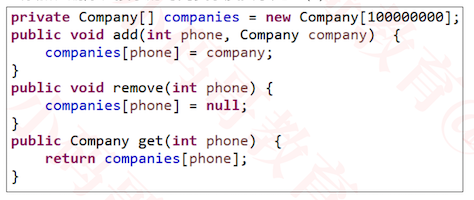

  

+ 存在什么问题?
  - 空间复杂度非常大
  - 空间使用率极其低，非常浪费内存空间
  - 其实数组 companies 就是一个哈希表，典型的【空间换时间】

### 哈希表（Hash Table）

+ 哈希表也叫做散列表（ hash 有"剁碎"的意思）, 哈希表本质上是一个数组

+ 它是如何实现高效处理数据的？

  - put("Jack", 666);

  - put("Rose", 777);

  - put("Kate", 888);

    

+ 添加、搜索、删除的流程都是类似的

  1. 利用哈希函数生成 key 对应的 index【O(1)】
  2. 根据 index 操作定位数组元素【O(1)】

+  哈希表是【空间换时间】的典型应用

+ 哈希函数，也叫做散列函数

+ 哈希表内部的数组元素，很多地方也叫 Bucket（桶），整个数组叫 Buckets 或者 Bucket Array

### 哈希冲突(Hash Collision)

+ 哈希冲突也叫做哈希碰撞

  - 2 个不同的 key，经过哈希函数计算出相同的结果
  - key1 ≠ key2 ，hash(key1) = hash(key2)

  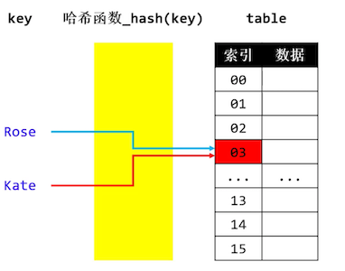

+ 解决哈希冲突的常见方法

  1.  开放定址法（Open Addressing）

     - 按照一定规则向其他地址探测，直到遇到空桶

       ```
       规则1
       顺序向下探测，直到遇到空桶
       
       规则2
       平方间隔法，第一次间隔1的平方位置，如果还冲突。第二次间隔2的平方位置，如果还冲突，第三次间隔3的平方位置....
       ```

  2.  再哈希法（Re-Hashing）

     - 设计多个哈希函数

       ````
       当产生hash碰撞时，换用其他的hash函数计算
       ````

  3. 链地址法（Separate Chaining）

     - 比如通过链表将同一index的元素串起来

       

### JDK1.8的哈希冲突解决方案

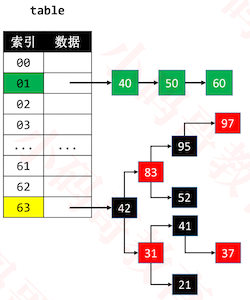

+ 默认使用`单向链`表将元素串起来

+ 在添加元素时，可能会由`单向链表`转为`红黑树`来存储元素

  - 比如当哈希表容量 ≥ 64 且 `单向链表`的节点数量大于 8 时

+ 当`红黑树`节点数量少到一定程度时，又会转为`单向链表`

+  JDK1.8中的哈希表是使用`链表+红黑树`解决哈希冲突

+ 思考：这里为什么使用单链表？

  - 每次都是从头节点开始遍历

    ```
    1. 每个节点的都存储着key和value
    2. 当一个index存储多个元素时，说明多个key的hash算出的index是相等的
    3. 通过从头到尾比较key是否相等来决定是替换值，还是新插入值。
    4. 比较完后，如果是插入新值，那么直接插入到最后，此时插入这一刻的操作是O(1)的复杂度。
    ```

  - 单向链表比双向链表少一个指针，可以节省内存空间

### 哈希函数

+ 哈希表中哈希函数的实现步骤大概如下

  1. 先生成 `key 的哈希值`（必须是`整数`）

  2. 再让 `key 的哈希值`跟`数组的大小`进行相关运算，生成一个`索引值`

     ```java
     public int hash(Object key) {
       return hash_code(key) % table.length;
     }
     ```

+ 为了提高效率，可以使用 & 位运算取代 % 运算【前提：将数组的长度2的幂 (2<sup>n</sup>) 】

  ```java
  public int hash(Object key) {
    return hash_code(key) & (table.length -1);
  }
  //通过&位运算得到的值的范围是 0~(table.length -1)
  
  (2的4次方-1)的二进制位表示:1111
  (2的5次方-1)的二进制位表示:11111
  (2的n次方-1)的二进制位表示:n个1
  ```

​       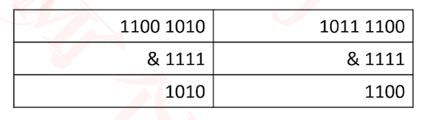

+ 位运算比%运算效率高?
  - 可以汇编后，查看其汇编指令的多少
+ 良好的哈希函数
  - 让哈希值更加均匀分布 → 减少哈希冲突次数 → 提升哈希表的性能

### 哈希值计算

+ key 的常见种类可能有
  - 整数、浮点数、字符串、自定义对象
  - 不同种类的 key，哈希值的生成方式不一样，但目标是一致的
    - 尽量让每个 key 的哈希值是唯一的
    - 尽量让 key 的所有信息参与运算

+ 在Java中，HashMap 的 key 必须实现 hashCode、equals 方法，也允许 key 为 null
+ hash值为什么用int？
  - hash表实质上是一个数组，而数组的索引就是int类型

#### Integer

- 整数值当做哈希值

- 比如 10 的哈希值就是 10

  ```java
  public static int hashCode(int value) {
     return value;
  }
  ```

#### Float

+ 将存储的二进制格式转化为整数值

  ```java
  public static int hashCode(int value) {
     return floatToIntBits(value);
  }
  ```

#### Long和Double

+ Long和Double都是64位的，但是int是32的，为了充分利用Long，Double的所有的信息，需将64信息经过转换变成32的值，作为hash值

  ```java
  //long长整型
  public static int hashCode(long value) {
     return (int)(value ^ (value >>> 32));
  }
  //将double的二进制转成long
  public static int hashCode(double value) {
     long bits = doubleToLongBits(value);
     return (int)(bits ^ (bits >>> 32));
  }
  ```

+ `>>>`和 `^`的作用是?

  + 高32bit 和 低32bit `^位运算`计算出 32bit 的哈希值

    ```
    为什么使用异或位运算?
    使用^可以充分利用高32位和低32位，减少hash碰撞的概率
    ```

    

  + 充分利用所有信息计算出哈希值

    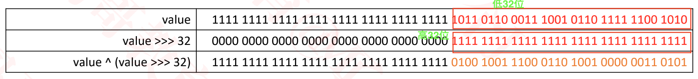

#### 字符串

+ 整数 5489 是如何计算出来的？

  - 5 ∗ 10<sup>3</sup> + 4 ∗ 10<sup>2</sup>  + 8 ∗ 10<sup>1</sup>  + 9 ∗ 10<sup>0</sup> 

+ 字符串是由若干个字符组成的

  - 比如字符串 jack，由 j、a、c、k 四个字符组成（字符的本质就是一个整数）

  - 因此，jack 的哈希值可以表示为 j ∗ n<sup>3</sup> + a * n<sup>2</sup> + c * n<sup>1</sup> + k * n<sup>0</sup>, 等价于 [ ( j ∗ n + a ) ∗ n + c ] ∗ n + k

    ```
    如果直接先计算n的3次方，再计算n的平方，相当于重复计算。因此，可以优化成后面的计算方式。
    ```

  - 在JDK中，乘数 n 为 31，为什么使用 31？

    - 31 是一个奇素数，JVM会将 31 * i 优化成 (i << 5) – i

    - 我们将乘法优化成位运算和减法，提高效率

      ```
      将n定义为31时，当遇到乘以n的情况时，可以优化成 (i << 5) -i的形式，这样又大大提高了效率
      
      java虚拟机会把31*i自动进行优化，但是其他语言并不一定会有这样的机制，因此其他语言进行实现时可以直接优化成 (i<<5) -i的形式
      ```

    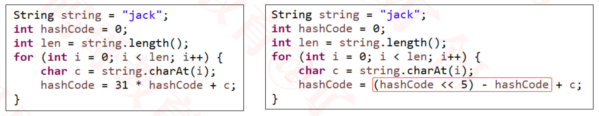

+ 字符串的hashCode实现

  ```java
  public int hashCode() {
          int h = hash;
          if (h == 0 && value.length > 0) {
              char val[] = value;
              for (int i = 0; i < value.length; i++) {
                  h = 31 * h + val[i];
              }
              hash = h;
          }
          return h;
      }
  ```

### 关于31的探讨

+ 31 * i = (2<sup>5</sup> – 1) * i = i * 2<sup>5</sup> – i = (i << 5) – i
+ 31不仅仅是符合2<sup>n</sup> – 1，它是个奇素数（既是奇数，又是素数(质数) ）
  - 素数和其他数相乘的结果比其他方式更容易产成唯一性，减少哈希冲突
  - 最终选择31是经过观测分布结果后的选择

+ 数学术语解释
  - 奇素数是指不能被2整除而且因数只有1和它本身的正整数。
  - 奇数（odd）指不能被2整除的数 ，数学表达形式为：2k+1
  - 素数(质数)是指在大于1的自然数中，除了1和它本身以外不再有其他因数的自然数

### 自定义对象作为key

+ Object对象的hashCode方法默认实现和内存地址相关

+ 自定义对象计算hash值时，要重写hashCode方法

  ```java
  public class Person extends Object{
  	private int age;   // 10  20
  	private float height; // 1.55 1.67
  	private String name; // "jack" "rose"
  	
  	public Person(int age, float height, String name) {
  		this.age = age;
  		this.height = height;
  		this.name = name;
  	}
  	
    //计算hash值
  	@Override
  	public int hashCode() {
  		int hashCode = Integer.hashCode(age);
  		hashCode = hashCode * 31 + Float.hashCode(height);
  		hashCode = hashCode * 31 + (name != null ? name.hashCode() : 0);
  		return hashCode;
  	}
  }
  
  ```

+ equals

  ```java
  public class Person extends Object {
  	private int age;   // 10  20
  	private float height; // 1.55 1.67
  	private String name; // "jack" "rose"
  	
  	public Person(int age, float height, String name) {
  		this.age = age;
  		this.height = height;
  		this.name = name;
  	}
  	
  	@Override
  	/**
  	 * 用来比较2个对象是否相等
  	 */
  	public boolean equals(Object obj) {
  		// 内存地址
  		if (this == obj) return true;
  		if (obj == null || obj.getClass() != getClass()) return false;
      //下面这句不推荐，obj instanceof Person, obj为Person子类时，也会返回true
  		// if (obj == null || !(obj instanceof Person)) return false;
  		
  		// 比较成员变量
  		Person person = (Person) obj;
  		return person.age == age
  				&& person.height == height
  				&& (person.name == null ? name == null : person.name.equals(name));
  	}
  }
  
  ```

+ 思考几个问题
  - 哈希值太大，整型溢出怎么办?
    - 不用作任何处理

+ 自定义对象作为 key，最好同时重写 hashCode 、equals 方法

  - 用以判断 2 个 key 是否为同一个 key

    - 对于任何非 null 的 x，x.equals(x)必须返回true
    - 对于任何非 null 的 x、y，如果 y.equals(x) 返回 true，x.equals(y) 必须返回 true
    - 传递性：对于任何非 null 的 x、y、z，如果 x.equals(y)、y.equals(z) 返回 true，那么x.equals(z) 必须返回 true
    - 一致性：对于任何非 null 的 x、y，只要 equals 的比较操作在对象中所用的信息没有被修改，多次调用x.equals(y) 就会一致地返回 true，或者一致地返回 false

  - hashCode ：必须保证 equals 为 true 的 2 个 key 的哈希值一样

    ```
    因为equels为true，代表是同一个key，因此hashCode必须相同
    ```

  - 反过来 hashCode 相等的 key，不一定 equals 为 true

+ 不重写 hashCode 方法只重写 equals 会有什么后果？
  
- 可能会导致 2 个 equals 为 true 的 key 同时存在哈希表中
  
+ hashCode方法和equals方法的调用时机 

  - hashCode方法在计算索引的时候调用
  - equals在hash冲突时，比较两个key是否相等的时候调用

+ 因此自定义对象要作为key，需重写hashCode,equals两个方法

  ```java
  Person p1 = new Person(10, 1.67f, "jack");
  Person p2 = new Person(10, 1.67f, "jack");
  		
  Map<Object, Object> map = new HashMap<>();
  map.put(p1, "1111");
  map.put(p2, "2222");
  System.out.println(map.get(p1));
  
  //打印结果
  2222
  ```

### 哈希值的进一步处理：扰动计算

```java
public int hash(Object key) {
  return hash_code(key) & (table.length -1);
}
   
```

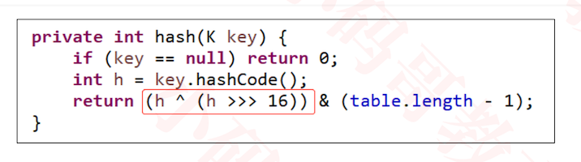

+ java官方会将哈希值的高16位和低16位再进行一个^位运算，以防止用户自定义的hash值不均匀

### HashMap的自实现

+ java的HashMap是链表+红黑树的结构

+ 这里的实现只使用红黑树结构

+ 基本结构

  ````java
  public interface Map<K, V> {
  	int size();
  	boolean isEmpty();
  	void clear();
  	V put(K key, V value);
  	V get(K key);
  	V remove(K key);
  	boolean containsKey(K key);
  	boolean containsValue(V value);
  	void traversal(Visitor<K, V> visitor);
  	
  	public static abstract class Visitor<K, V> {
  		boolean stop;
  		public abstract boolean visit(K key, V value);
  	}
  }
  
  
  @SuppressWarnings({"unchecked", "rawtypes"})
  public class HashMap<K, V> implements Map<K, V> {
    
  	private static final boolean RED = false;
  	private static final boolean BLACK = true;
  	private int size;//键值对的数量
  	private Node<K, V>[] table; //hashTable，每一个bucket存储一个树的根节点
  	private static final int DEFAULT_CAPACITY = 1 << 4; //默认的容量为16
    private static final float DEFAULT_LOAD_FACTOR = 0.75f;
  	
  	public HashMap() {
  		table = new Node[DEFAULT_CAPACITY];
  	}
  
  	@Override
  	public int size() {
  		return size;
  	}
  
  	@Override
  	public boolean isEmpty() {
  		return size == 0;
  	}
  
  	@Override
  	public void clear() {
  	}
  
  	@Override
  	public V put(K key, V value) {
  		return null;
  	}
  
  	@Override
  	public V get(K key) {
  		return null;
  	}
  
  	@Override
  	public V remove(K key) {
  		return null;
  	}
  
  	@Override
  	public boolean containsKey(K key) {
  		return false;
  	}
  
  	@Override
  	public boolean containsValue(V value) {
  		return false;
  	}
  
  	@Override
  	public void traversal(Visitor<K, V> visitor) {
  	}
  	
    //红黑树的一些辅助函数
  	private Node<K, V> color(Node<K, V> node, boolean color) {
  		if (node == null) return node;
  		node.color = color;
  		return node;
  	}
  	
  	private Node<K, V> red(Node<K, V> node) {
  		return color(node, RED);
  	}
  	
  	private Node<K, V> black(Node<K, V> node) {
  		return color(node, BLACK);
  	}
  	
  	private boolean colorOf(Node<K, V> node) {
  		return node == null ? BLACK : node.color;
  	}
  	
  	private boolean isBlack(Node<K, V> node) {
  		return colorOf(node) == BLACK;
  	}
  	
  	private boolean isRed(Node<K, V> node) {
  		return colorOf(node) == RED;
  	}
  	
    //节点：存储着键值对
  	protected static class Node<K, V> {
  		int hash;
  		K key;
  		V value;
  		boolean color = RED;
  		Node<K, V> left;
  		Node<K, V> right;
  		Node<K, V> parent;
  		public Node(K key, V value, Node<K, V> parent) {
  			this.key = key;
        //在这里计算节点中key的hash，避免同一个key哈希值多次计算
  			int hash = key == null ? 0 : key.hashCode();
  			this.hash = hash ^ (hash >>> 16);
  			this.value = value;
  			this.parent = parent;
  		}
  		
  		public boolean hasTwoChildren() {
  			return left != null && right != null;
  		}
  		
  		public boolean isLeftChild() {
  			return parent != null && this == parent.left;
  		}
  		
  		public boolean isRightChild() {
  			return parent != null && this == parent.right;
  		}
  		
  		public Node<K, V> sibling() {
  			if (isLeftChild()) {
  				return parent.right;
  			}
  			
  			if (isRightChild()) {
  				return parent.left;
  			}
  			
  			return null;
  		}
  		
  		@Override
  		public String toString() {
  			return "Node_" + key + "_" + value;
  		}
  	}
  }
  
  ````

### clear

```java
@Override
	public void clear() {
		if (size == 0) return;
		size = 0;
		for (int i = 0; i < table.length; i++) {
			table[i] = null;
		}
	}
```

### 计算key真实的索引

```java

//获取key的hash值
private int hash(K key) {
		if (key == null) return 0;
  
		int hash = key.hashCode();
		return hash ^ (hash >>> 16);
}

//获取key对应的index
private int index(K key) {
		return hash(key) & (table.length - 1);
}

//获取节点对应的索引
//int hash = key == null ? 0 : key.hashCode();
//node.hash = hash ^ (hash >>> 16);
private int index(Node<K, V> node) {
		return node.hash & (table.length - 1);
}
```

### containsKey

```java
@Override
	public boolean containsKey(K key) {
		return node(key) != null;
	}
```

### containsValue

```java
@Override
	public boolean containsValue(V value) {
		if (size == 0) return false;
		Queue<Node<K, V>> queue = new LinkedList<>();
		for (int i = 0; i < table.length; i++) {
			if (table[i] == null) continue;
			//对所有的红黑树进行层序遍历
			queue.offer(table[i]);
			while (!queue.isEmpty()) {
				Node<K, V> node = queue.poll();
				if (Objects.equals(value, node.value)) return true;
				
				if (node.left != null) {
					queue.offer(node.left);
				}
				if (node.right != null) {
					queue.offer(node.right);
				}
			}
		}
		return false;
}
```

### traversal

```java
@Override
	public void traversal(Visitor<K, V> visitor) {
		if (size == 0 || visitor == null) return;
		
		Queue<Node<K, V>> queue = new LinkedList<>();
		for (int i = 0; i < table.length; i++) {
			if (table[i] == null) continue;
			//对所有的红黑树进行层序遍历
			queue.offer(table[i]);
			while (!queue.isEmpty()) {
				Node<K, V> node = queue.poll();
				if (visitor.visit(node.key, node.value)) return;
				
				if (node.left != null) {
					queue.offer(node.left);
				}
				if (node.right != null) {
					queue.offer(node.right);
				}
			}
		}
	}
```

+ 因为key是无序的，所以直接遍历所有的红黑树

### put

```java
private int compare(K k1, K k2, int h1, int h2) {
		// 比较哈希值
		int result = h1 - h2;
		if (result != 0) return result;
    
		// 比较equals
		if (Objects.equals(k1, k2)) return 0;
		// 哈希值相等，但是不equals
		if (k1 != null && k2 != null 
				&& k1.getClass() == k2.getClass()
				&& k1 instanceof Comparable) {
			// 同一种类型并且具备可比较性
			if (k1 instanceof Comparable) {
				return ((Comparable) k1).compareTo(k2);
			}
		}
		// 同一种类型，哈希值相等，但是不equals，但是不具备可比较性
		// k1不为null，k2为null
		// k1为null，k2不为null
		return System.identityHashCode(k1) - System.identityHashCode(k2);
	}
```

```java
public class HashMap<K, V> implements Map<K, V> {

  @Override
	public V put(K key, V value) {
		resize();
		//获取key对应的index
		int index = index(key);
		// 取出index位置的红黑树根节点
		Node<K, V> root = table[index];
		if (root == null) {
      //创建根节点
			root = createNode(key, value, null);
      //放到对应的位置
			table[index] = root;
			size++;
      //修复红黑树性质，染黑
			fixAfterPut(root);
			return null;
		}
		// 添加新的节点到红黑树上面
		Node<K, V> parent = root;
		Node<K, V> node = root;
		int cmp = 0;
		K k1 = key;
    //新增的key的hash值
		int h1 = hash(k1);
    do {
			cmp = compare(key, node.key, h1, node.hash);
      parent = node;
			if (cmp > 0) { //往右边比较
				node = node.right;
			} else if (cmp < 0) {//往左边比较
				node = node.left;
			} else { // 相等
				V oldValue = node.value;
				node.key = key;
				node.value = value;
				node.hash = h1;
				return oldValue;
			}
		} while (node != null);

		// 看看插入到父节点的哪个位置
		Node<K, V> newNode = createNode(key, value, parent);
		if (cmp > 0) {
			parent.right = newNode;
		} else {
			parent.left = newNode;
		}
		size++;
		
		// 新添加节点之后的处理
		fixAfterPut(newNode);
		return null;
	}
  //创建节点
  protected Node<K, V> createNode(K key, V value, Node<K, V> parent) {
		return new Node<>(key, value, parent);
	}
  
  //添加后修复红黑树性质
  private void fixAfterPut(Node<K, V> node) {
		Node<K, V> parent = node.parent;
		// 添加的是根节点 或者 上溢到达了根节点
		if (parent == null) {
			black(node);
			return;
		}
		
		// 如果父节点是黑色，直接返回
		if (isBlack(parent)) return;
		
		// 叔父节点
		Node<K, V> uncle = parent.sibling();
		// 祖父节点
		Node<K, V> grand = red(parent.parent);
		if (isRed(uncle)) { // 叔父节点是红色【B树节点上溢】
			black(parent);
			black(uncle);
			// 把祖父节点当做是新添加的节点
			fixAfterPut(grand);
			return;
		}
		
		// 叔父节点不是红色
		if (parent.isLeftChild()) { // L
			if (node.isLeftChild()) { // LL
				black(parent);
			} else { // LR
				black(node);
				rotateLeft(parent);
			}
			rotateRight(grand);
		} else { // R
			if (node.isLeftChild()) { // RL
				black(node);
				rotateRight(parent);
			} else { // RR
				black(parent);
			}
			rotateLeft(grand);
		}
	}
  
	private void rotateLeft(Node<K, V> grand) {
		Node<K, V> parent = grand.right;
		Node<K, V> child = parent.left;
		grand.right = child;
		parent.left = grand;
		afterRotate(grand, parent, child);
	}
	
	private void rotateRight(Node<K, V> grand) {
		Node<K, V> parent = grand.left;
		Node<K, V> child = parent.right;
		grand.left = child;
		parent.right = grand;
		afterRotate(grand, parent, child);
	}
	
	private void afterRotate(Node<K, V> grand, Node<K, V> parent, Node<K, V> child) {
		// 让parent称为子树的根节点
		parent.parent = grand.parent;
		if (grand.isLeftChild()) {
			grand.parent.left = parent;
		} else if (grand.isRightChild()) {
			grand.parent.right = parent;
		} else { // grand是root节点
      //grand, parent, child都在同一棵红黑树上，证明三个节点算出的index都相同
			table[index(grand)] = parent;
		}
		
		// 更新child的parent
		if (child != null) {
			child.parent = grand;
		}
		// 更新grand的parent
		grand.parent = parent;
	}
  ...
  ...

}
```

### node

```java

private Node<K, V> node(K key) {
		Node<K, V> root = table[index(key)];
		return root == null ? null : node(root, key);
}

private Node<K, V> node(Node<K, V> node, K k1) {
		int h1 = k1 == null ? 0 : k1.hashCode();
		int cmp = 0;
		while (node != null) {
			cmp = compare(k1, node.key, h1, node.hashCode());
			if (cmp == 0) return node;
			if (cmp > 0) {
				node = node.right;
			} else if (cmp < 0) {
				 node = node.left;
			}				
		}
		return null;
}
```


### 存在的问题

+ 如果node. put都使用compare进行比较的时候，在以内存进行比较时，会存在问题

+ 打印整个Map

  ```java
  public void print() {
  		if (size == 0) return;
      //遍历打印每个红黑树
  		for (int i = 0; i < table.length; i++) {
  			final Node<K, V> root = table[i];
  			System.out.println("【index = " + i + "】");
  			BinaryTrees.println(new BinaryTreeInfo() {
  				@Override
  				public Object string(Object node) {
  					return node;
  				}
  				
  				@Override
  				public Object root() {
  					return root;
  				}
  				@Override
  				public Object right(Object node) {
  					return ((Node<K, V>)node).right;
  				}
  				@Override
  				public Object left(Object node) {
  					return ((Node<K, V>)node).left;
  				}
  			});
  			System.out.println("---------------------------------------------------");
  		}
  	}
  
  ```

  

+ 测试代码如下

  ````java
  public class Key {
  	protected int value;
  	public Key(int value) {
  		this.value = value;
  	}
  	@Override
  	public int hashCode() {
  		return value / 20;
  	}
  	
  	@Override
  	public boolean equals(Object obj) {
  		if (obj == this) return true;
  		if (obj == null || obj.getClass() != getClass()) return false;
  		return ((Key) obj).value == value;
  	}
  	
  	@Override
  	public String toString() {
  		return "v(" + value + ")";
  	}
  }
  
  public void test() {
     HashMap<Object, Object> map = new HashMap<>();
  		for (int i = 1; i <= 19; i++) {
        //这20个key的hash值相等，因此都处在同一个index
  			map.put(new Key(i), i);
  		}
     //获取的值有的时候为null
     System.out.println(map.get(new Key(1)));
     map.print();
  }
  
````
  

  
  ```
  当new Key(1)作为key与 Node_v(4)_4的key Key(4)进行比较时，比较的是内存地址
  其新创建的内存地址可能比 Key(4)的内存地址大，也可能比Key(4)的内存地址小
  当比Key(4)的内存地址小的时候，其就会向左子树进行比较，此后根本不可能找到原来的Key(1)
  当比Key(4)的内存地址大的时候，往右比较，就能找到Key(1)获取值为1
  
  因此，这种比较随机性比较高，需要继续改进
  ```

### node的优化

```java
	private Node<K, V> node(K key) {
    //通过key，找到index，然后得出root结点
		Node<K, V> root = table[index(key)];
		return root == null ? null : node(root, key);
	}
	
  //以某个node结点为根节点的树，搜索其中是否有包含k1的节点
	private Node<K, V> node(Node<K, V> node, K k1) {
		int h1 = hash(k1);
		// 存储查找结果
		Node<K, V> result = null;
		int cmp = 0;
		while (node != null) {
			K k2 = node.key;
			int h2 = node.hash;
			// 先比较哈希值
			if (h1 > h2) { //往右边找
				node = node.right;
			} else if (h1 < h2) {//往左边找
				node = node.left;
			} else if (Objects.equals(k1, k2)) {
        //找到节点
				return node;
			} else if (k1 != null && k2 != null 
					&& k1 instanceof Comparable
					&& k1.getClass() == k2.getClass()
					&& (cmp = ((Comparable)k1).compareTo(k2)) != 0) {
        //根据比较结果决定向左找，还是向右边找
				node = cmp > 0 ? node.right : node.left;
        //当无法进行比较后，我们遍历其左右子树，查看是否已经存在key了
			} else if (node.right != null && (result = node(node.right, k1)) != null) {//遍历右子树
				return result;
			} else { // 遍历左子树
				node = node.left;
			}
		}
		return null;
	}

//总结
1. 先根据hash值进行比较
   如果传入key的hash值大，则向右子树找
   如果传入key的hash值小，则向左子树找
2. 如果hash值相等时，则比较是否equals
3. 如果不equals,则看元素本身否具有可比较性
4. 元素本身不具备可比较性，则说明其是根据内存地址大小进行的比较的，这种情况只能进行遍历搜索
```

### put的优化

```java
public V put(K key, V value) {
		resize();
		//获取key对应的index
		int index = index(key);
		// 取出index位置的红黑树根节点
		Node<K, V> root = table[index];
		if (root == null) {
      //创建根节点
			root = createNode(key, value, null);
      //放到对应的位置
			table[index] = root;
			size++;
      //修复红黑树性质，染黑
			fixAfterPut(root);
			return null;
		}
		// 添加新的节点到红黑树上面
		Node<K, V> parent = root;
		Node<K, V> node = root;
		int cmp = 0;
		K k1 = key;
    //新增的key的hash值
		int h1 = hash(k1);
		Node<K, V> result = null;
		boolean searched = false; // 是否已经搜索过这个key
		do {
			parent = node;
      //在同一个index下的节点
			K k2 = node.key;
			int h2 = node.hash;
      //比较hash值的大小
      //使用h1 > h2, 而不是h1-h2 > 0，是因为h1如果是很大的正值，h2是很大的负值，结果会越界，造成结果变成小于0
			if (h1 > h2) {//h1大时，放到右边
				cmp = 1;
			} else if (h1 < h2) {//
				cmp = -1;
			} else if (Objects.equals(k1, k2)) {
        //当hash值相等，且key1 == key2
				cmp = 0;
			} else if (k1 != null && k2 != null 
					&& k1 instanceof Comparable
					&& k1.getClass() == k2.getClass()
					&& (cmp = ((Comparable)k1).compareTo(k2)) != 0) {//看key是否具有可比性
			} else if (searched) { // 已经扫描了
        //只要扫描过一次，就证明树中没有这个key，此后就不需要再扫描了
        //while循环，通过内存地址的比较为这个key找到合适的位置（合适的父节点）
				cmp = System.identityHashCode(k1) - System.identityHashCode(k2);
			} else { 
        //这个时候不具有可比较性，我们先扫描看是否存在key
        //如果不存在则比较其内存地址，通过这样的方法为这个key，value找到一个合适的位置
        
        // searched == false; 还没有扫描，先进行扫描
        // h1 == h2, equals为false，
        //扫描当前根节点的左右子树
				if ((node.left != null && (result = node(node.left, k1)) != null)
						|| (node.right != null && (result = node(node.right, k1)) != null)) {
					// 已经存在这个key
					node = result;
					cmp = 0;
				} else { // 不存在这个key
					searched = true;
          //比较内存地址大小来决定
					cmp = System.identityHashCode(k1) - System.identityHashCode(k2);
				}
			}
			
			if (cmp > 0) { //往右边比较
				node = node.right;
			} else if (cmp < 0) {//往左边比较
				node = node.left;
			} else { // 相等
				V oldValue = node.value;
				node.key = key;
				node.value = value;
				node.hash = h1;
				return oldValue;
			}
		} while (node != null);

		// 看看插入到父节点的哪个位置
		Node<K, V> newNode = createNode(key, value, parent);
		if (cmp > 0) {
			parent.right = newNode;
		} else {
			parent.left = newNode;
		}
		size++;
		
		// 新添加节点之后的处理
		fixAfterPut(newNode);
		return null;
	}
```

### compareTo

+ 假如出现equals为false,但是compareTo为0的情况时，那么这两个key到底认不认为是相等的呢？

+ equals为true我们认为这两个key相等，compareTo为0时，我们依然走扫描的逻辑，这样两者就不会相互矛盾了

+ 因此在node和put方法中，我们对compareTo为0时，不认为key是相等的，依然去扫描

  ```java
  else if (k1 != null && k2 != null 
  					&& k1 instanceof Comparable
  					&& k1.getClass() == k2.getClass()
  					&& (cmp = ((Comparable)k1).compareTo(k2)) != 0) {//看key是否具有可比性
  }
  ```

### get

```java
@Override
	public V get(K key) {
		Node<K, V> node = node(key);
		return node != null ? node.value : null;
	}
```

### remove

```java
@Override
public V remove(K key) {
		return remove(node(key));
}
protected V remove(Node<K, V> node) {
		if (node == null) return null;
		
		Node<K, V> willNode = node;
		
		size--;
		
		V oldValue = node.value;
		
		if (node.hasTwoChildren()) { // 度为2的节点
			// 找到后继节点
			Node<K, V> s = successor(node);
			// 用后继节点的值覆盖度为2的节点的值
			node.key = s.key;
			node.value = s.value;
			node.hash = s.hash;
			// 删除后继节点
			node = s;
		}
		
		// 删除node节点（node的度必然是1或者0）
		Node<K, V> replacement = node.left != null ? node.left : node.right;
		int index = index(node);
		
		if (replacement != null) { // node是度为1的节点
			// 更改parent
			replacement.parent = node.parent;
			// 更改parent的left、right的指向
			if (node.parent == null) { // node是度为1的节点并且是根节点
				table[index] = replacement;
			} else if (node == node.parent.left) {
				node.parent.left = replacement;
			} else { // node == node.parent.right
				node.parent.right = replacement;
			}
			
			// 删除节点之后的处理
			fixAfterRemove(replacement);
		} else if (node.parent == null) { // node是叶子节点并且是根节点
			table[index] = null;
		} else { // node是叶子节点，但不是根节点
			if (node == node.parent.left) {
				node.parent.left = null;
			} else { // node == node.parent.right
				node.parent.right = null;
			}
			
			// 删除节点之后的处理
			fixAfterRemove(node);
		}
		
		// 交给子类去处理
		afterRemove(willNode, node);
		
		return oldValue;
	}
	//交给子类去实现：例如LinkedHashMap去维护顺序
  protected void afterRemove(Node<K, V> willNode, Node<K, V> removedNode) { }

	private Node<K, V> successor(Node<K, V> node) {
		if (node == null) return null;
		
		// 前驱节点在左子树当中（right.left.left.left....）
		Node<K, V> p = node.right;
		if (p != null) {
			while (p.left != null) {
				p = p.left;
			}
			return p;
		}
		
		// 从父节点、祖父节点中寻找前驱节点
		while (node.parent != null && node == node.parent.right) {
			node = node.parent;
		}

		return node.parent;
	}
	
```

### 测试用例

```java
	static void test2(HashMap<Object, Integer> map) {
		for (int i = 1; i <= 20; i++) {
			map.put(new Key(i), i);
		}
		for (int i = 5; i <= 7; i++) {
			map.put(new Key(i), i + 5);
		}
		Asserts.test(map.size() == 20);
		Asserts.test(map.get(new Key(4)) == 4);
		Asserts.test(map.get(new Key(5)) == 10);
		Asserts.test(map.get(new Key(6)) == 11);
		Asserts.test(map.get(new Key(7)) == 12);
		Asserts.test(map.get(new Key(8)) == 8);
	}
	
	static void test3(HashMap<Object, Integer> map) {
		map.put(null, 1); // 1
		map.put(new Object(), 2); // 2
		map.put("jack", 3); // 3
		map.put(10, 4); // 4
		map.put(new Object(), 5); // 5
		map.put("jack", 6);
		map.put(10, 7);
		map.put(null, 8);
		map.put(10, null);
		Asserts.test(map.size() == 5);
		Asserts.test(map.get(null) == 8);
		Asserts.test(map.get("jack") == 6);
		Asserts.test(map.get(10) == null);
		Asserts.test(map.get(new Object()) == null);
		Asserts.test(map.containsKey(10));
		Asserts.test(map.containsKey(null));
		Asserts.test(map.containsValue(null));
		Asserts.test(map.containsValue(1) == false);
	}
	
	static void test4(HashMap<Object, Integer> map) {
		map.put("jack", 1);
		map.put("rose", 2);
		map.put("jim", 3);
		map.put("jake", 4);		
		map.remove("jack");
		map.remove("jim");
		for (int i = 1; i <= 10; i++) {
			map.put("test" + i, i);
			map.put(new Key(i), i);
		}
		for (int i = 5; i <= 7; i++) {
			Asserts.test(map.remove(new Key(i)) == i);
		}
		for (int i = 1; i <= 3; i++) {
			map.put(new Key(i), i + 5);
		}
		Asserts.test(map.size() == 19);
		Asserts.test(map.get(new Key(1)) == 6);
		Asserts.test(map.get(new Key(2)) == 7);
		Asserts.test(map.get(new Key(3)) == 8);
		Asserts.test(map.get(new Key(4)) == 4);
		Asserts.test(map.get(new Key(5)) == null);
		Asserts.test(map.get(new Key(6)) == null);
		Asserts.test(map.get(new Key(7)) == null);
		Asserts.test(map.get(new Key(8)) == 8);
		map.traversal(new Visitor<Object, Integer>() {
			public boolean visit(Object key, Integer value) {
				System.out.println(key + "_" + value);
				return false;
			}
		});
	}
	
	static void test5(HashMap<Object, Integer> map) {
		for (int i = 1; i <= 20; i++) {
			map.put(new SubKey1(i), i);
		}
		map.put(new SubKey2(1), 5);
		Asserts.test(map.get(new SubKey1(1)) == 5);
		Asserts.test(map.get(new SubKey2(1)) == 5);
		Asserts.test(map.size() == 20);
	}
	
```

### 装填因子

+ 装填因子（Load Factor）：节点总数量 / 哈希表桶数组长度，也叫做负载因子

+ 在JDK1.8的HashMap中，如果装填因子超过0.75，就扩容为原来的2倍

+ 此时节点的索引情况有两种

  1. index不变

  2. index= index + 旧的hashTable容量

     ```
     假设扩容前容量为4
     1110     
      &11 容量
     ----
       10
       
     1001
      &11 容量
     ----
       01
     假设扩容后容量为8
     1110
     &111 容量
     ----
      110 index= index + 旧的hashTable容量
      
     1001
     &111 容量
     ----
       01   index不变   
     ```

+ 因为节点的index可能发生变化，所以容量变大后，原来的节点，只能遍历，然后重新进行添加

  ```java
  @Override
  public V put(K key, V value) {
    //在添加前进行扩容
  	resize();
    ...
    ...
   }
  private void resize() {
  		// 装填因子 <= 0.75
  		if (size / table.length <= DEFAULT_LOAD_FACTOR) return;
  		
  		Node<K, V>[] oldTable = table;
  		table = new Node[oldTable.length << 1];
  
  		Queue<Node<K, V>> queue = new LinkedList<>();
  		for (int i = 0; i < oldTable.length; i++) {
  			if (oldTable[i] == null) continue;
  			
  			queue.offer(oldTable[i]);
  			while (!queue.isEmpty()) {
  				Node<K, V> node = queue.poll();
  				if (node.left != null) {
  					queue.offer(node.left);
  				}
  				if (node.right != null) {
  					queue.offer(node.right);
  				}
  				
  				// 挪动代码得放到最后面
  				moveNode(node);
  			}
  		}
  	}
  	
  	private void moveNode(Node<K, V> newNode) {
  		// 重置
  		newNode.parent = null;
  		newNode.left = null;
  		newNode.right = null;
  		newNode.color = RED;
  		
  		int index = index(newNode);
  		// 取出index位置的红黑树根节点
  		Node<K, V> root = table[index];
  		if (root == null) {
  			root = newNode;
  			table[index] = root;
  			fixAfterPut(root);
  			return;
  		}
  		
  		// 添加新的节点到红黑树上面
  		Node<K, V> parent = root;
  		Node<K, V> node = root;
  		int cmp = 0;
  		K k1 = newNode.key;
  		int h1 = newNode.hash;
  		do {
  			parent = node;
  			K k2 = node.key;
  			int h2 = node.hash;
        //不用考虑key相等的情况，因为原来的key都是唯一的
  			if (h1 > h2) {
  				cmp = 1;
  			} else if (h1 < h2) {
  				cmp = -1;
  			} else if (k1 != null && k2 != null 
  					&& k1 instanceof Comparable
  					&& k1.getClass() == k2.getClass()
  					&& (cmp = ((Comparable)k1).compareTo(k2)) != 0) {
  			} else {
  				cmp = System.identityHashCode(k1) - System.identityHashCode(k2);
  			}
  			
  			if (cmp > 0) {
  				node = node.right;
  			} else if (cmp < 0) {
  				node = node.left;
  			}
  		} while (node != null);
  
  		// 看看插入到父节点的哪个位置
  		newNode.parent = parent;
  		if (cmp > 0) {
  			parent.right = newNode;
  		} else {
  			parent.left = newNode;
  		}
  		
  		// 新添加节点之后的处理
  		fixAfterPut(newNode);
  	}
  ```


### 扩容前后对比

+ 测试代码

  ````java
  static void test1() {
  		String filepath = "/Users/liuhuajian/Documents/abc360/OralSparring_IOS";
  		FileInfo fileInfo = Files.read(filepath, new String[]{"m"});
  		String[] words = fileInfo.words();
  
  		System.out.println("总行数：" + fileInfo.getLines());
  		System.out.println("单词总数：" + words.length);
  		System.out.println("-------------------------------------");
  
  		test1Map(new HashMap_v0<>(), words);//扩容前
  		test1Map(new HashMap<>(), words);   //扩容后
  }
  static void test1Map(Map<String, Integer> map, String[] words) {
  		Times.test(map.getClass().getName(), new Task() {
  			@Override
  			public void execute() {
  				for (String word : words) {
  					Integer count = map.get(word);
  					count = count == null ? 0 : count;
  					map.put(word, count + 1);
  				}
  				System.out.println(map.size()); // 17188
  				
  				int count = 0;
  				for (String word : words) {
  					Integer i = map.get(word);
  					count += i == null ? 0 : i;
  					map.remove(word);
  				}
  				Asserts.test(count == words.length);
  				Asserts.test(map.size() == 0);
  			}
  		});
  }
  
  //打印结果
  com.mj.map.HashMap_v0】
  开始：10:10:19.049
  12888
  结束：10:10:19.220
  耗时：0.171秒
  -------------------------------------
  【com.mj.map.HashMap】
  开始：10:10:19.222
  12888
  结束：10:10:19.322
  耗时：0.099秒
  -------------------------------------
  ````

  + 从测试结果来看，当进行了扩容之后，我们的代码性能有了明显的提升
  + jdk只有扩容的操作，而没有缩容的操作

### equals的规范

+ key1.equals(key2)为true时，key2.equals(key1)也为true

### TreeMap vs HashMap

+ 何时选择TreeMap?
  
  - 元素具备可比较性且要求升序遍历(按照元素从小到大)
+ 何时选择HashMap?
  - 无序遍历
+ 性能对比

  - HashMap的效率是比较高的

  ```java
  static void test1() {
  		String filepath = "/Users/liuhuajian/Documents/abc360/OralSparring_IOS";
  		FileInfo fileInfo = Files.read(filepath, new String[]{"m"});
  		String[] words = fileInfo.words();
  
  		System.out.println("总行数：" + fileInfo.getLines());
  		System.out.println("单词总数：" + words.length);
  		System.out.println("-------------------------------------");
  
  		test1Map(new TreeMap<>(), words);
  		test1Map(new HashMap<>(), words);
  }
  static void test1Map(Map<String, Integer> map, String[] words) {
  		Times.test(map.getClass().getName(), new Task() {
  			@Override
  			public void execute() {
  				for (String word : words) {
  					Integer count = map.get(word);
  					count = count == null ? 0 : count;
  					map.put(word, count + 1);
  				}
  				System.out.println(map.size()); 
  				
  				int count = 0;
  				for (String word : words) {
  					Integer i = map.get(word);
  					count += i == null ? 0 : i;
  					map.remove(word);
  				}
  				Asserts.test(count == words.length);
  				Asserts.test(map.size() == 0);
  			}
  		});
  	}
  
  //打印结果
  总行数：69227
  单词总数：199101
  -------------------------------------
  【com.mj.map.TreeMap】
  开始：10:27:31.670
  12888
  结束：10:27:31.833
  耗时：0.162秒
  -------------------------------------
  【com.mj.map.HashMap】
  开始：10:27:31.839
  12888
  结束：10:27:31.953
  耗时：0.114秒
  -------------------------------------
  ```

### 为什么是HashMap时间复杂度的O(1)级别?

````
因为我们通过0.75来作为装填因子来控制容量的，hash表的容量比节点数还要大。
这就更加减少了Hash冲突的概率。因此一般而言，即使发生Hash冲突, 红黑树的高度相当于在常数级别
因此可以理解为O(1)级别的时间复杂度，用空间换时间。
````

### 关于使用%来计算索引

```java
public int hash(Object key) {
  return hash_code(key) % (table.length -1);
}

public int hash(Object key) {
  return hash_code(key) & (table.length -1);
}
```

+ 如果使用%来计算索引

  - 建议把哈希表的长度设计为素(质)数

  - 可以大大减少哈希冲突

    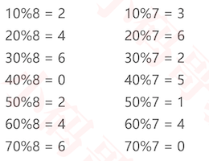

+ 下面的表格列出了不同数据规模对应的最佳素数，特点如下

  - 每个素数略小于前一个素数的2倍

  - 每个素数尽可能接近2的幂（2<sup>n</sup>）

    

### LinkedHashMap

+ 在HashMap的基础上维护元素的添加顺序，使得遍历的结果是遵从添加顺序的
+ 要想让元素遍历的时候是遵从添加顺序的，那么在添加和删除的时候要维护一个双向链表
+ 扩容时，逻辑依然有效。因为节点的prev和next并没有改变
+ 链表是一个跨树的双向链表
+ 官方也是这样的实现逻辑

### LinkedHashMap-创建节点

````java
@SuppressWarnings({ "rawtypes", "unchecked" })
public class LinkedHashMap<K, V> extends HashMap<K, V> {
  //维护双向链表
	private LinkedNode<K, V> first;
	private LinkedNode<K, V> last;
	
  ...
  ...
	private static class LinkedNode<K, V> extends Node<K, V> {
		LinkedNode<K, V> prev;//前一个节点
		LinkedNode<K, V> next;//下一个结点
		public LinkedNode(K key, V value, Node<K, V> parent) {
			super(key, value, parent);
		}
	}
}

````

### LinkedHashMap-clear

```java
@Override
public void clear() {
	super.clear();
	first = null;
	last = null;
}
```


### LinkedHashMap-containsValue

```java
 @Override
	public boolean containsValue(V value) {
		LinkedNode<K, V> node = first;
		while (node != null) {
			if (Objects.equals(value, node.value)) return true;
			node = node.next;
		}
		return false;
	}
```

### LinkedHashMap-traversal

```java
@Override

	public void traversal(Visitor<K, V> visitor) {
		if (visitor == null) return;
     //直接使用双向链表进行遍历
		LinkedNode<K, V> node = first;
		while (node != null) {
			if (visitor.visit(node.key, node.value)) return;
			node = node.next;
		}
	}
```

+ 此时遍历的顺序就是添加的顺序


### LinkedHashMap- 添加节点的处理

```java
@SuppressWarnings({ "rawtypes", "unchecked" })
public class LinkedHashMap<K, V> extends HashMap<K, V> {
	private LinkedNode<K, V> first;
	private LinkedNode<K, V> last;
	...
	...
  //在添加的时候，调用创建节点方法，维护好双向链表
	@Override
	protected Node<K, V> createNode(K key, V value, Node<K, V> parent) {
		LinkedNode node = new LinkedNode(key, value, parent);
		if (first == null) {
      //如果是根节点
			first = last = node;
		} else {
      //如果不是根节点，则每次都添加到最后
			last.next = node;
			node.prev = last;
			last = node;
		}
		return node;
	}
	
	private static class LinkedNode<K, V> extends Node<K, V> {
		LinkedNode<K, V> prev;
		LinkedNode<K, V> next;
		public LinkedNode(K key, V value, Node<K, V> parent) {
			super(key, value, parent);
		}
	}
}

```

###LinkedHashMap-删除节点

+ 情况分析

  + 度不为2的节点，在红黑树的角度是直接删除该节点。在链表的角度也是直接删除该节点

    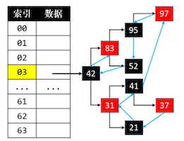

    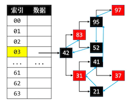

    - 上图仅仅展示了next指针，其实它是一个双向链表。其添加顺序为`37<->21<->31<->41<->97<->95<->52<->42<->83`

    - 假如是删除97节点，如上图，我们更改一下链表的指针即可

      ```java
         //从链表中移除节点
      		LinkedNode<K, V> prev = node.prev;
      		LinkedNode<K, V> next = node.next;
      		if (prev == null) {
      			first = next;
      		} else {
      			prev.next = next;
      		}
      		if (next == null) {
      			last = prev;
      		} else {
      			next.prev = prev;
      		}
      ```

  + 度为2的节点，在红黑树中真正删除的节点是后继节点。因此从链表的角度，需要注意更换node与前驱或后继节点的连接，再删掉了真正删除的节点

    + 在链表的角度，如果只是直接删除真正删除结点(后继节点)，会出现顺序错乱的情况

      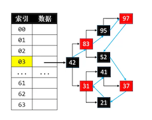

      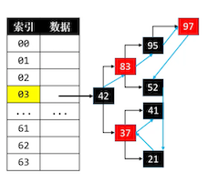

      + 部分添加顺序为 `52<->37<->21<->31<->41`
      + 当删除31节点时，从红黑树角度，真正被删除的是37节点，删除后期待的链表顺序为 `52<->37<->21<->41`
      + 但是实际顺序如图所示， `52<->21<->37<->41`,顺序错乱
      + 此时应该先交换要删除节点31和真正被删除节点37在链表中的位置(红黑树中的位置不变)之后，再删除37位置。

    + 在链表的角度，更换node与前驱或后继节点的连接，再删掉了真正删除的节点时，如下

      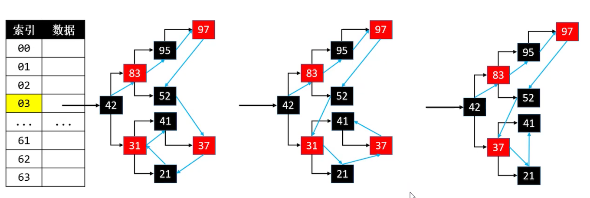

+ 更换节点的连接位置

  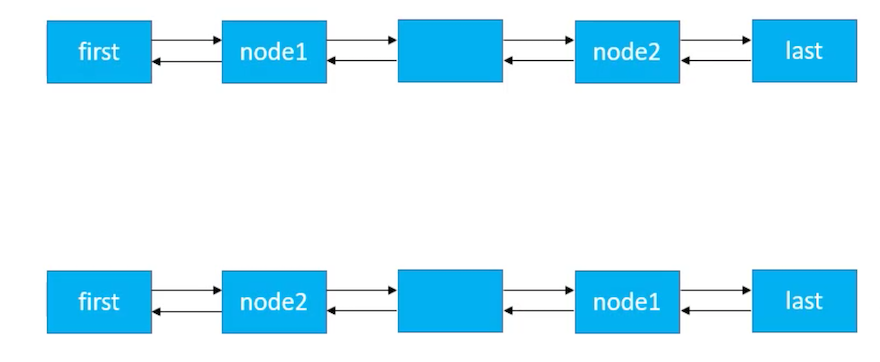

  + 需要交换node1和node2的prev，并且需要更新原来node1.prev的next，原来node2.prev的next

  + 需要交换node1和node2的next，并且需要更新原来node1.next的prev，原来node2.next的prev

    ```java
          //交换node1和node2的prev
          LinkedNode<K, V> tmp = node1.prev;
    			node1.prev = node2.prev;
    			node2.prev = tmp;
          //更新原来node2.prev的next
    			if (node1.prev == null) {
    				first = node1;
    			} else {
    				node1.prev.next = node1;
    			}
          //更新原来node1.prev的next
    			if (node2.prev == null) {
    				first = node2;
    			} else {
    				node2.prev.next = node2;
    			}
    			////交换node1和node2的next
    			tmp = node1.next;
    			node1.next = node2.next;
    			node2.next = tmp;
          
          //更新原来node2.next的prev
    			if (node1.next == null) {
    				last = node1;
    			} else {
    				node1.next.prev = node1;
    			}
          //更新原来node1.next的prev
    			if (node2.next == null) {
    				last = node2;
    			} else {
    				node2.next.prev = node2;
    }
    ```

+ 代码实现

  ```java
  public class HashMap<K, V> implements Map<K, V> {
    protected V remove(Node<K, V> node) {
  		if (node == null) return null;
  		
  		Node<K, V> willNode = node;
  		
  		size--;
  		
  		V oldValue = node.value;
  		
  		if (node.hasTwoChildren()) { // 度为2的节点
  			// 找到后继节点
  			Node<K, V> s = successor(node);
  			// 用后继节点的值覆盖度为2的节点的值
  			node.key = s.key;
  			node.value = s.value;
  			node.hash = s.hash;
  			// 删除后继节点
  			node = s;
  		}
  		
  		// 删除node节点（node的度必然是1或者0）
  		Node<K, V> replacement = node.left != null ? node.left : node.right;
  		int index = index(node);
  		
  		if (replacement != null) { // node是度为1的节点
  			// 更改parent
  			replacement.parent = node.parent;
  			// 更改parent的left、right的指向
  			if (node.parent == null) { // node是度为1的节点并且是根节点
  				table[index] = replacement;
  			} else if (node == node.parent.left) {
  				node.parent.left = replacement;
  			} else { // node == node.parent.right
  				node.parent.right = replacement;
  			}
  			
  			// 删除节点之后的处理
  			fixAfterRemove(replacement);
  		} else if (node.parent == null) { // node是叶子节点并且是根节点
  			table[index] = null;
  		} else { // node是叶子节点，但不是根节点
  			if (node == node.parent.left) {
  				node.parent.left = null;
  			} else { // node == node.parent.right
  				node.parent.right = null;
  			}
  			
  			// 删除节点之后的处理
  			fixAfterRemove(node);
  		}
  		
  		// 交给子类去处理
      //willNode将要删除的节点
      //node真正要删除的节点
  		afterRemove(willNode, node);
  		
  		return oldValue;
  	}
  
  }
  
  //LinkedHashMap的处理
  @SuppressWarnings({ "rawtypes", "unchecked" })
  public class LinkedHashMap<K, V> extends HashMap<K, V> {
  	private LinkedNode<K, V> first;
  	private LinkedNode<K, V> last;
  	
    ...
    ...
  	@Override
  	protected void afterRemove(Node<K, V> willNode, Node<K, V> removedNode) {
  		LinkedNode<K, V> node1 = (LinkedNode<K, V>) willNode;
  		LinkedNode<K, V> node2 = (LinkedNode<K, V>) removedNode;
  		
  		if (node1 != node2) {//说明是度为2的节点
  			// 交换linkedWillNode和linkedRemovedNode在链表中的位置
  			
        // 交换prev
  			LinkedNode<K, V> tmp = node1.prev;
  			node1.prev = node2.prev;
  			node2.prev = tmp;
        //更新原来node2.prev的next
  			if (node1.prev == null) {
  				first = node1;
  			} else {
  				node1.prev.next = node1;
  			}
        //更新原来node1.prev的next
  			if (node2.prev == null) {
  				first = node2;
  			} else {
  				node2.prev.next = node2;
  			}
  			//交换next
  			tmp = node1.next;
  			node1.next = node2.next;
  			node2.next = tmp;
        
        //更新原来node2.next的prev
  			if (node1.next == null) {
  				last = node1;
  			} else {
  				node1.next.prev = node1;
  			}
        //更新原来node1.next的prev
  			if (node2.next == null) {
  				last = node2;
  			} else {
  				node2.next.prev = node2;
  			}
  		}
  		
      //从链表中移除节点
  		LinkedNode<K, V> prev = node2.prev;
  		LinkedNode<K, V> next = node2.next;
  		if (prev == null) {
  			first = next;
  		} else {
  			prev.next = next;
  		}
  		if (next == null) {
  			last = prev;
  		} else {
  			next.prev = prev;
  		}
  	}
  	...
  	...
  	...
  	
  	private static class LinkedNode<K, V> extends Node<K, V> {
  		LinkedNode<K, V> prev;
  		LinkedNode<K, V> next;
  		public LinkedNode(K key, V value, Node<K, V> parent) {
  			super(key, value, parent);
  		}
  	}
  }
  ```


### HashSet & LinkedHashSet

+ HashSet是对HashMap的封装，底层由HashMap进行实现

+ 官方就是这么实现的

  ```java
  public interface Set<E> {
  	int size();
  	boolean isEmpty();
  	void clear();
  	boolean contains(E element);
  	void add(E element);
  	void remove(E element);
  	void traversal(Visitor<E> visitor);
  	
  	public static abstract class Visitor<E> {
  		boolean stop;
  		public abstract boolean visit(E element);
  	}
  }
  
  public class HashSet<E> implements Set<E> {
  	private HashMap<E, Object> map = new HashMap<>();
  
  	@Override
  	public int size() {
  		return map.size();
  	}
  
  	@Override
  	public boolean isEmpty() {
  		return map.isEmpty();
  	}
  
  	@Override
  	public void clear() {
  		map.clear();
  	}
  
  	@Override
  	public boolean contains(E element) {
  		return map.containsKey(element);
  	}
  
  	@Override
  	public void add(E element) {
  		map.put(element, null);
  	}
  
  	@Override
  	public void remove(E element) {
  		map.remove(element);
  	}
  
  	@Override
  	public void traversal(Visitor<E> visitor) {
  		map.traversal(new Map.Visitor<E, Object>() {
  			public boolean visit(E key, Object value) {
  				return visitor.visit(key);
  			}
  		});
  	}
  
  }
  
  ```


### LinkedHashSet

+ LinkedHashSet是对LinkedHashMap的封装，底层由LinkedHashMap进行实现

+ 官方LinkedHashSet继承于HashSet

  ```java
  public interface Set<E> {
  	int size();
  	boolean isEmpty();
  	void clear();
  	boolean contains(E element);
  	void add(E element);
  	void remove(E element);
  	void traversal(Visitor<E> visitor);
  	
  	public static abstract class Visitor<E> {
  		boolean stop;
  		public abstract boolean visit(E element);
  	}
  }
  
  public class LinkedHashSet<E> implements Set<E> {
  	private LinkedHashMap<E, Object> map = new LinkedHashMap<>();
  
  	@Override
  	public int size() {
  		return map.size();
  	}
  
  	@Override
  	public boolean isEmpty() {
  		return map.isEmpty();
  	}
  
  	@Override
  	public void clear() {
  		map.clear();
  	}
  
  	@Override
  	public boolean contains(E element) {
  		return map.containsKey(element);
  	}
  
  	@Override
  	public void add(E element) {
  		map.put(element, null);
  	}
  	@Override
  	public void remove(E element) {
  		map.remove(element);
  	}
  
  	@Override
  	public void traversal(Visitor<E> visitor) {
  		map.traversal(new Map.Visitor<E, Object>() {
  			public boolean visit(E key, Object value) {
  				return visitor.visit(key);
  			}
  		});
  	}
  
  }
  
  ```

  

### HashMap&LinkedHashMap源码

+ 自行查看源码，会先实现逻辑与我们自定义的非常像
+ HashMap官方是链表+红黑树的结构

```java
HashMap
//默认容量
static final int DEFAULT_INITIAL_CAPACITY = 1 << 4; //  16
//最大容量
static final int MAXIMUM_CAPACITY = 1 << 30;
//装填因子
static final float DEFAULT_LOAD_FACTOR = 0.75f;
//当同一个index元素大于8的时候，转成红黑树
static final int TREEIFY_THRESHOLD = 8;
//当同一个index元素小于6的时候，如果是红黑树则，转成链表
static final int UNTREEIFY_THRESHOLD = 6;
//要想转成红黑树，还要满足hash表的容量至少为64
static final int MIN_TREEIFY_CAPACITY = 64;
```

