## 二叉堆

### 思考

+ 设计一种数据结构，用来存放整数，要求提供 3 个接口

  - 添加元素
  - 获取最大值
  - 删除最大值

  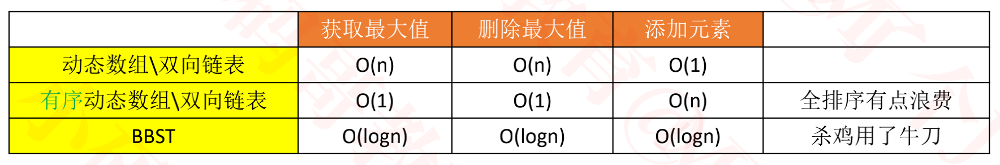

+ 有没有更优的数据结构?
  - 堆
    - 获取最大值:O(1), 删除最大值: O(logn), 添加最大值O(logn)

### 堆（Heap）

+ 堆（Heap）也是一种树状的数据结构（不要跟内存模型中的“堆空间”混淆），常见的堆实现有

  - 二叉堆（Binary Heap，完全二叉堆）
  - 多叉堆（D-heap、D-ary Heap）
  - 索引堆（Index Heap）
  - 二项堆（Binomial Heap）
  - 斐波那契堆（Fibonacci Heap）
  - 左倾堆（Leftist Heap，左式堆）
  - 斜堆（Skew Heap）

+ 堆的一个重要性质：任意节点的值总是 ≥（ ≤ ）子节点的值

  - 如果任意节点的值总是 ≥ 子节点的值，称为：最大堆、大根堆、大顶堆

  - 如果任意节点的值总是 ≤ 子节点的值，称为：最小堆、小根堆、小顶堆

    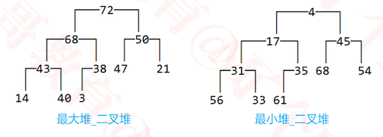

+ 由此可见，堆中的元素必须具备可比较性（跟二叉搜索树一样）

### 堆的基本接口设计


### 二叉堆（Binary Heap）

+ 二叉堆的逻辑结构就是一棵完全二叉树，所以也叫完全二叉堆

  

+ 鉴于完全二叉树的一些特性，二叉堆的底层（物理结构）一般用数组实现即可

  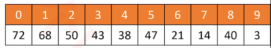

+ 索引 i 的规律（ n 是元素数量）

  - 如果 i = 0 ，它是<font color=red> 根</font>节点
  
  - 如果 i > 0 ，它的<font color=red> 父</font>节点的索引为<font color=red> floor( (i – 1) / 2 )</font>
  
  - 如果 2i + 1 ≤ n – 1，它的<font color=red> 左</font>子节点的索引为 <font color=red> 2i + 1</font>
  
  - 如果 2i + 1 > n – 1 ，它<font color=red> 无左</font>子节点
  
  - 如果 2i + 2 ≤ n – 1 ，它的<font color=red> 右</font>子节点的索引为 2i + 2
  
  - 如果 2i + 2 > n – 1 ，它<font color=red> 无右</font>子节点
  
    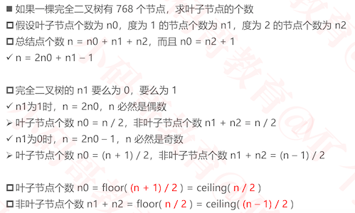


### 基本接口实现

```java
public interface Heap<E> {
	int size();	// 元素的数量
	boolean isEmpty();	// 是否为空
	void clear();	// 清空
	void add(E element);	 // 添加元素
	E get();	// 获得堆顶元素
	E remove(); // 删除堆顶元素
	E replace(E element); // 删除堆顶元素的同时插入一个新元素
}

@SuppressWarnings("unchecked")
public abstract class AbstractHeap<E> implements Heap<E> {
	protected int size;
	protected Comparator<E> comparator;
	
	public AbstractHeap(Comparator<E> comparator) {
		this.comparator = comparator;
	}
	
	public AbstractHeap() {
		this(null);
	}
	
	@Override
	public int size() {
		return size;
	}

	@Override
	public boolean isEmpty() {
		return size == 0;
	}
	
	protected int compare(E e1, E e2) {
		return comparator != null ? comparator.compare(e1, e2) 
				: ((Comparable<E>)e1).compareTo(e2);
	}
}

public class BinaryHeap<E> extends AbstractHeap<E>  {
	private E[] elements;
	private static final int DEFAULT_CAPACITY = 10;
	
  ...
  ...
	@Override
	public void clear() {
		for (int i = 0; i < size; i++) {
			elements[i] = null;
		}
		size = 0;
	}

	@Override
	public void add(E element) {
    
	}

	@Override
	public E get() {
		return null;
	}

	@Override
	public E remove() {
		return null;
	}

	@Override
	public E replace(E element) {
		return null;
	}
	
  //判断是二叉堆否为空
	private void emptyCheck() {
		if (size == 0) {
			throw new IndexOutOfBoundsException("Heap is empty");
		}
	}
  //判断元素是否为null
	private void elementNotNullCheck(E element) {
		if (element == null) {
			throw new IllegalArgumentException("element must not be null");
		}
	}
}

```

### get

+ 时间复杂度为O(1)

```java
@Override
public E get() {
		emptyCheck();
		return elements[0];
}
```


###  add-最大堆

#### 思路

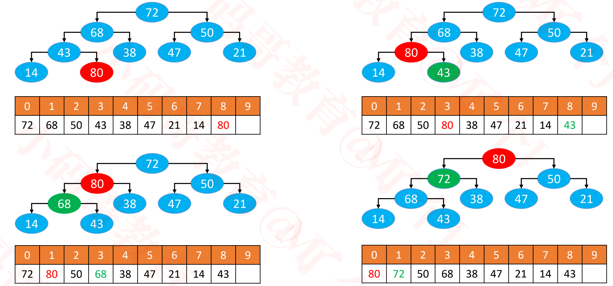

+ 添加80的过程
  - 先将80添加到最后，然后计算出此时其父节点为43，80比43大，所以80与43位置交换
  - 然后计算出此时其父节点为68，80比68大，所以80与68位置交换
  - 然后计算出此时其父节点为72，80比72大，所以80与72位置交换
  - 此时80已经为根节点了，此时上滤结束

+ 总结
  - 循环执行以下操作（图中的 80 简称为 node）
    - 如果 node ＞ 父节点, 与父节点交换位置
    - 如果 node ≤ 父节点，或者 node 没有父节点, 退出循环
  -  这个过程，叫做上滤（Sift Up）
    - 时间复杂度：O(logn)

#### 实现

```java
@Override
	public void add(E element) {
    //检查元素是否为null
		elementNotNullCheck(element);
    //扩容
		ensureCapacity(size + 1);
    //先放到最后
		elements[size++] = element;
    //进行上滤
		siftUp(size - 1);
}
/**
 * 让index位置的元素上滤
 * @param index
 */
private void siftUp(int index) {
		E e = elements[index];
		while (index > 0) {
      //父节点位置floor((i – 1)/2)
			int parentIndex = (index - 1) >> 1;
			E parent = elements[parentIndex];
      //如果元素小于等于父节点元素，则终止循环
			if (compare(e, parent) <= 0) return;
			// 交换index、parentIndex位置的内容
			E tmp = elements[index];
			elements[index] = parent;
			elements[parentIndex] = tmp;
			// 重新赋值index
			index = parentIndex;
		}
}
//扩容代码
private void ensureCapacity(int capacity) {
		int oldCapacity = elements.length;
		if (oldCapacity >= capacity) return;
		
		// 新容量为旧容量的1.5倍
		int newCapacity = oldCapacity + (oldCapacity >> 1);
		E[] newElements = (E[]) new Object[newCapacity];
		for (int i = 0; i < size; i++) {
			newElements[i] = elements[i];
		}
		elements = newElements;
	}
```

#### 优化

+ 一般交换位置需要3行代码，可以进一步优化

  - 将新添加节点备份，确定最终位置才摆放上去

  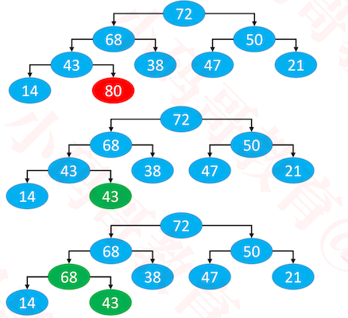

  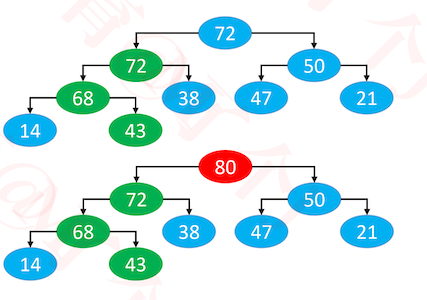

+ 仅从交换位置的代码角度看
  
- 可以由大概的 3 * O(logn) 优化到 1 * O(logn) + 1
  
+ 优化的实现

  ```java
  /**
   * 让index位置的元素上滤
   * @param index
   */
  private void siftUp(int index) {
  		E element = elements[index];
      //循环计算出元素最终存放的位置
  		while (index > 0) {
  			int parentIndex = (index - 1) >> 1;
  			E parent = elements[parentIndex];
  			if (compare(element, parent) <= 0) break;
  
        // 将父元素存储在index位置
  			elements[index] = parent;
  			
  			// 重新赋值index
  			index = parentIndex;
  		}
  		elements[index] = element;
  }
  ```

### 树状打印调试

+ 使BinaryHeap遵循BinaryTreeInfo

  ```java
  public class BinaryHeap<E> extends AbstractHeap<E> implements BinaryTreeInfo {
    ...
    ...
    @Override
  	public Object root() {
      //根节点时0位置
  		return 0;
  	}
  
  	@Override
  	public Object left(Object node) {
      //左节点
  		int index = ((int)node << 1) + 1;
  		return index >= size ? null : index;
  	}
  
  	@Override
  	public Object right(Object node) {
      //右节点
  		int index = ((int)node << 1) + 2;
  		return index >= size ? null : index;
  	}
  
  	@Override
  	public Object string(Object node) {
      //节点字符串化
  		return elements[(int)node];
  	}
  }
  ```
  
+ 测试打印情况

  ```java
  static void test1() {
  		BinaryHeap<Integer> heap = new BinaryHeap<>();
  		heap.add(68);
  		heap.add(72);
  		heap.add(43);
  		heap.add(50);
  		heap.add(38);
  		heap.add(10);
  		heap.add(90);
  		heap.add(65);
  		BinaryTrees.println(heap);
  }
  
  //打印结果如下
         ┌───90──┐
         │       │
      ┌─68─┐   ┌─72─┐
      │    │   │    │
   ┌─65    38 10    43
   │
  50
  ```

### remove-最大堆

#### 思路

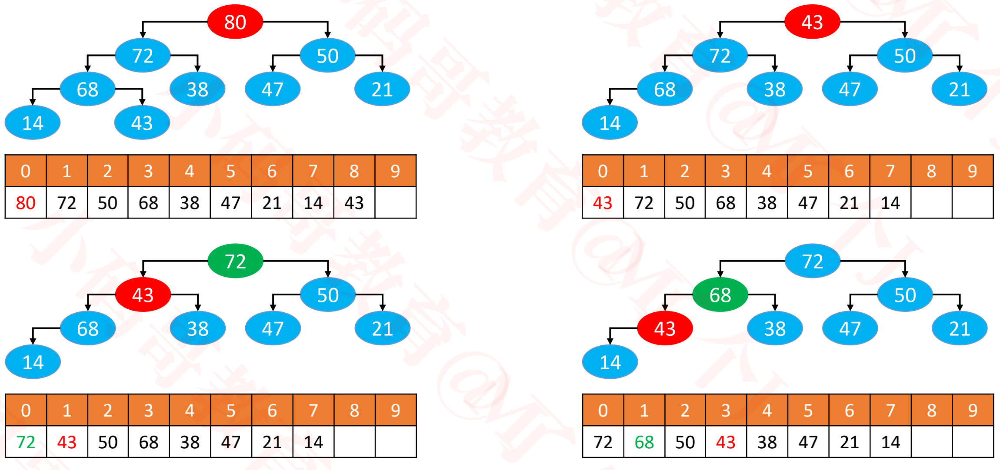

+ 删除最大节点80的过程
  1. 先用最后的元素43覆盖80，然后删除最后的位置元素
  2. 将43和此时左右子节点中最大的进行比较， 43小于72，所以跟72交换位置
  3. 将43和此时左右子节点中最大的进行比较， 43小68，所以跟68交换位置
  4. 将43和此时左右子节点中最大的进行比较， 43是最大的，退出循环
+ 总结
  1. 用最后一个节点覆盖根节点
  2.  删除最后一个节点
  3. 循环执行以下操作（图中的 43 简称为 node）
     - 如果 node < 最大的子节点, 与最大的子节点交换位置
     - 如果 node ≥ 最大的子节点， 或者 node 没有子节点, 退出循环
+ 这个过程，叫做下滤（Sift Down），时间复杂度：O(logn)
+ 同样的，交换位置的操作可以像添加那样进行优化

#### 实现

```java
@Override
	public E remove() {
		emptyCheck();
		
		int lastIndex = --size;
    //取出根节点
		E root = elements[0];
    //用最后的元素覆盖根节点
		elements[0] = elements[lastIndex];
    //删除最后的元素
		elements[lastIndex] = null;
		//进行下滤操作
		siftDown(0);
		return root;
	}
	
 /**
	 * 让index位置的元素下滤
	 * @param index
	 */
	private void siftDown(int index) {
		E element = elements[index];
    //叶子节点个数 = floor((n+1)/2)
    //非叶子节点个数 = floor(n/2)
    //half即为非叶子节点个数
		int half = size >> 1;
		// 第一个叶子节点的索引 == 非叶子节点的数量
		// index < 第一个叶子节点的索引
		// 必须保证index位置是非叶子节点
		while (index < half) { 
			// index的节点有2种情况
			// 1.只有左子节点
			// 2.同时有左右子节点
			
			// 默认为左子节点跟它进行比较
			int childIndex = (index << 1) + 1;
			E child = elements[childIndex];
			
			// 右子节点
			int rightIndex = childIndex + 1;
			
			// 选出左右子节点最大的那个
			if (rightIndex < size && compare(elements[rightIndex], child) > 0) {
        //右子节点存在，且右子节点大于左子节点时
        //childIndex = rightIndex;
				//child = elements[rightIndex];
        child = elements[childIndex = rightIndex;];
			}
			if (compare(element, child) >= 0) break;

			// 将子节点存放到index位置
			elements[index] = child;
			// 重新设置index
			index = childIndex;
		}
		elements[index] = element;
	}

```

+ 测试

  ```java
  static void test1() {
  		BinaryHeap<Integer> heap = new BinaryHeap<>();
  		heap.add(68);
  		heap.add(72);
  		heap.add(43);
  		heap.add(50);
  		heap.add(38);
  		heap.add(10);
  		heap.add(90);
  		heap.add(65);
  		BinaryTrees.println(heap);
  		heap.remove();
  		BinaryTrees.println(heap);
  	}
  //打印结果
         ┌───90──┐
         │       │
      ┌─68─┐   ┌─72─┐
      │    │   │    │
   ┌─65    38 10    43
   │
  50
      ┌───72──┐
      │       │
   ┌─68─┐   ┌─50─┐
   │    │   │    │
  65    38 10    43
  ```

  

### replace

+ 删除堆顶元素的同时插入一个新元素

  ```java
  	@Override
  	public E replace(E element) {
  		elementNotNullCheck(element);
  		E root = null;
  		if (size == 0) {
  			elements[0] = element;
  			size++;
  		} else {
        //直接替换掉顶元素，然后下滤
  			root = elements[0];
  			elements[0] = element;
  			siftDown(0);
  		}
  		return root;
  	}
  ```

### heapify-最大堆-自上而下的上滤

+ 批量建堆: 对于一组元素，从上到下，依次将每个元素进行上滤，最终构成一个最大堆

+ 对于元素30, 34, 73, 60, 68, 43，其树化后结构如下，从上到下，依次将每个元素进行上滤

  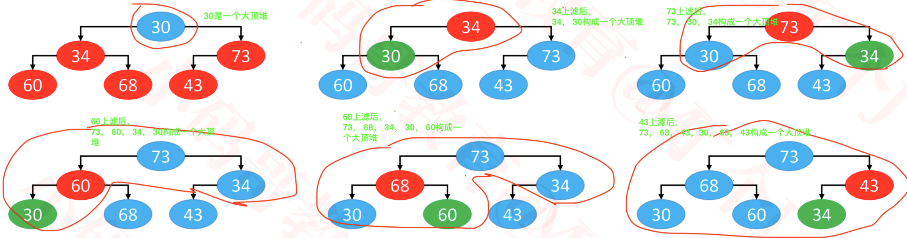

```java
/**
 * 二叉堆（最大堆）
 *
 * @param <E>
 */
@SuppressWarnings("unchecked")
public class BinaryHeap<E> extends AbstractHeap<E> implements BinaryTreeInfo {
	private E[] elements;
	private static final int DEFAULT_CAPACITY = 10;
	//批量建堆的构造函数
	public BinaryHeap(E[] elements, Comparator<E> comparator)  {
		super(comparator);
		
		if (elements == null || elements.length == 0) {
			this.elements = (E[]) new Object[DEFAULT_CAPACITY];
		} else {
			size = elements.length;
			int capacity = Math.max(elements.length, DEFAULT_CAPACITY);
			this.elements = (E[]) new Object[capacity];
			for (int i = 0; i < elements.length; i++) {
				this.elements[i] = elements[i];
			}
			heapify();
		}
	}
	
	public BinaryHeap(E[] elements)  {
		this(elements, null);
	}
	
	public BinaryHeap(Comparator<E> comparator) {
		this(null, comparator);
	}
	
	public BinaryHeap() {
		this(null, null);
	}

	/**
	 * 批量建堆
	 */
	private void heapify() {
		// 自上而下的上滤
		for (int i = 1; i < size; i++) {
      //遍历上滤
			siftUp(i);
		}
	}
	/**
	 * 让index位置的元素上滤
	 * @param index
	 */
	private void siftUp(int index) {
		E element = elements[index];
		while (index > 0) {
			int parentIndex = (index - 1) >> 1;
			E parent = elements[parentIndex];
			if (compare(element, parent) <= 0) break;
			
			// 将父元素存储在index位置
			elements[index] = parent;
			
			// 重新赋值index
			index = parentIndex;
		}
		elements[index] = element;
	}
	
}

```

### heapify--最大堆-自下而上的下滤

+ 效率比自上而下的上滤高，推荐使用

+ 批量建堆: 对于一组元素，从下到上，依次将每个非叶子节点素进行下滤，最终构成一个最大堆

  ```
  叶子节点不用下滤，因为其没有子节点
  ```

+ 对于元素30, 34, 73, 60, 68, 43，其树化后的结构，只有30， 34， 73为非叶子节点，将它们从下到上，依次下滤即可

  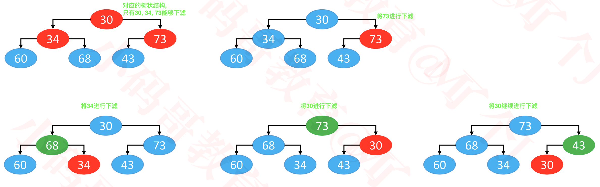

+ 代码实现

  ```java
  /**
   * 二叉堆（最大堆）
   * @author MJ Lee
   *
   * @param <E>
   */
  @SuppressWarnings("unchecked")
  public class BinaryHeap<E> extends AbstractHeap<E> implements BinaryTreeInfo {
  	private E[] elements;
  	private static final int DEFAULT_CAPACITY = 10;
  	
  	public BinaryHeap(E[] elements, Comparator<E> comparator)  {
  		super(comparator);
  		
  		if (elements == null || elements.length == 0) {
  			this.elements = (E[]) new Object[DEFAULT_CAPACITY];
  		} else {
  			size = elements.length;
  			int capacity = Math.max(elements.length, DEFAULT_CAPACITY);
  			this.elements = (E[]) new Object[capacity];
  			for (int i = 0; i < elements.length; i++) {
  				this.elements[i] = elements[i];
  			}
  			heapify();
  		}
  	}
  	
  	public BinaryHeap(E[] elements)  {
  		this(elements, null);
  	}
  	
  	public BinaryHeap(Comparator<E> comparator) {
  		this(null, comparator);
  	}
  	
  	public BinaryHeap() {
  		this(null, null);
  	}
  
  	@Override
  	public void clear() {
  		for (int i = 0; i < size; i++) {
  			elements[i] = null;
  		}
  		size = 0;
  	}
  
  	@Override
  	public void add(E element) {
  		elementNotNullCheck(element);
  		ensureCapacity(size + 1);
  		elements[size++] = element;
  		siftUp(size - 1);
  	}
  
  	/**
  	 * 批量建堆
  	 */
  	private void heapify() {		
  		// 自下而上的下滤
  		for (int i = (size >> 1) - 1; i >= 0; i--) {
  			siftDown(i);
  		}
  	}
  	
  	/**
  	 * 让index位置的元素下滤
  	 * @param index
  	 */
  	private void siftDown(int index) {
  		E element = elements[index];
  		int half = size >> 1;
  		// 第一个叶子节点的索引 == 非叶子节点的数量
  		// index < 第一个叶子节点的索引
  		// 必须保证index位置是非叶子节点
  		while (index < half) { 
  			// index的节点有2种情况
  			// 1.只有左子节点
  			// 2.同时有左右子节点
  			
  			// 默认为左子节点跟它进行比较
  			int childIndex = (index << 1) + 1;
  			E child = elements[childIndex];
  			
  			// 右子节点
  			int rightIndex = childIndex + 1;
  			
  			// 选出左右子节点最大的那个
  			if (rightIndex < size && compare(elements[rightIndex], child) > 0) {
  				child = elements[childIndex = rightIndex];
  			}
  			
  			if (compare(element, child) >= 0) break;
  
  			// 将子节点存放到index位置
  			elements[index] = child;
  			// 重新设置index
  			index = childIndex;
  		}
  		elements[index] = element;
  	}
  	
  	
  }
  
  ```

### 最大堆 – 批量建堆 – 效率对比


+ 所有节点的深度之和

  - **节点的深度**（depth）：从根节点到当前节点的唯一路径上的节点总数

  - 自上而下的上滤效率低

    ```
    叶子节点最多，需要做最长的操作，比较多的节点都在做工作量比较大的事
    ```

  - 仅仅是叶子节点，就有近 n/2 个，而且每一个叶子节点的深度都是 O(logn) 级别的
  - 因此，在叶子节点这一块，就达到了 O(nlogn) 级别
  - O(nlogn) 的时间复杂度足以利用排序算法对所有节点进行全排序

+ 所有节点的高度之和

  - **节点的高度**（height）：从当前节点到最远叶子节点的路径上的节点总数

  - 自下而上的下滤效率高

    ```
    顶部节点最少，做最长的操作
    比较少的节点，做的操作比较长
    比较少的节点，做的操作比较短
    ```

  - 假设是满树，节点总个数为 n，树高为 h，那么 n = 2<sup>h</sup>-1
  - 所有节点的树高之和 H(n) = 2<sup>0</sup> * (h-0) +  2<sup>1</sup> * (h-1)  +  2<sup>2</sup> * (h-2) +...+  2<sup>h-1</sup> * (h-(h-1)) 
  - H(n)  = h * ( 2<sup>0</sup> +  2<sup>1</sup> +  2<sup>2</sup> + ... +  2<sup>h-1</sup>) - [1 *  2<sup>1</sup> + 2 *  2<sup>2</sup> + 3 *  2<sup>3</sup> + ... + (h-1) *  2<sup>h-1</sup>]
  - H(n)  = h * (2<sup>h</sup>-1) - [h-2) *  2<sup>h</sup>+2]
  - H(n)  =   h * 2<sup>h</sup> -h - h * 2<sup>h</sup> +   2<sup>h+1</sup> -2
  - H(n)  =   2<sup>h+1</sup>-h -2 =  2 * (2<sup>h</sup>-1) -h = 2n-h = 2n - log2(n+1) =  <font color=red>**O(n)**</font>

+ 公式推导

  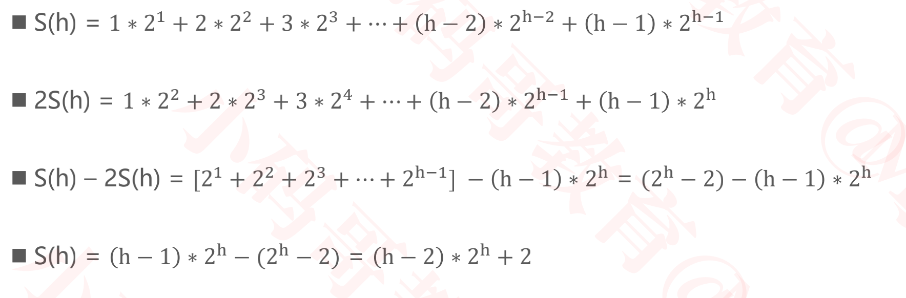

### 遍历调用add批量建堆

+ 遍历调用add方法批量建堆效率比较低，因为其都是从最下往上进行上滤，操作每次都是最长的

  ```java
  Integer[] data = {51, 30, 39, 92, 74};
  for (int i = 0; i < data.length; i++) {
  	heap.add(data[i]); 
  }
  ```

### 小顶堆

+ 传入一个比较器，与大顶堆的比较逻辑正好相反即可

+ 此时较小元素就会放到顶部了

  ```java
  static void test3() {
  		Integer[] data = {88, 44, 53, 41, 16, 6, 70, 18, 85, 98, 81, 23, 36, 43, 37};
  		BinaryHeap<Integer> heap = new BinaryHeap<>(data, new Comparator<Integer>() {
  			public int compare(Integer o1, Integer o2) {
  				return o2 - o1;
  			}
  		});
  		BinaryTrees.println(heap);
  	}
  //打印结果
           ┌────────6───────┐
           │                │
      ┌───16──┐         ┌───23──┐
      │       │         │       │
   ┌─18─┐   ┌─44─┐   ┌─36─┐   ┌─37─┐
   │    │   │    │   │    │   │    │
  41    85 98    81 53    88 43    70
  
  ```

### Top K问题

+ 从 n 个整数中，找出最大的前 k 个数（ k 远远小于 n ）

+  如果使用排序算法进行全排序，需要 O(nlogn) 的时间复杂度

+ 如果使用二叉堆来解决，可以使用 O(nlogk) 的时间复杂度来解决

+ 解决方案

  - 新建一个小顶堆
  - 扫描 n 个整数
    - 先将遍历到的前 k 个数放入堆中
    - 从第 k + 1 个数开始，如果大于堆顶元素，就使用 replace 操作（删除堆顶元素，将第 k + 1 个数添加到堆中）
  - 扫描完毕后，堆中剩下的就是最大的前 k 个数

+ 如果是找出最小的前 k 个数呢？

  - 用大顶堆
  - 如果小于堆顶元素，就使用 replace 操作

+ 代码实现

  ```java
  static void test4() {
  		// 新建一个小顶堆
  		BinaryHeap<Integer> heap = new BinaryHeap<>(new Comparator<Integer>() {
  			public int compare(Integer o1, Integer o2) {
  				return o2 - o1;
  			}
  		});
  		
  		// 找出最大的前k个数
  		int k = 3;
  		Integer[] data = {51, 30, 39, 92, 74, 25, 16, 93, 
  				91, 19, 54, 47, 73, 62, 76, 63, 35, 18, 
  				90, 6, 65, 49, 3, 26, 61, 21, 48};
      //时间复杂度O(nlogk)
  		for (int i = 0; i < data.length; i++) {
  			if (heap.size() < k) { // 前k个数添加到小顶堆
  				heap.add(data[i]); // logk
  			} else if (data[i] > heap.get()) { // 如果是第k + 1个数，并且大于堆顶元素
  				heap.replace(data[i]); // logk
  			}
  		}
  		// O(nlogk)
  		BinaryTrees.println(heap);
  	}
  ```

  

