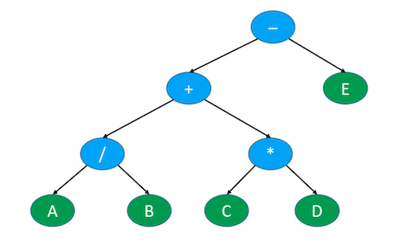
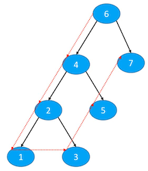
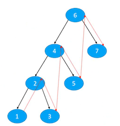
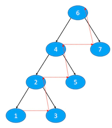

## 总结和补充

### 总结

+ 复杂度
  - 时间复杂度
  - 空间复杂度
+ 线性数据结构
  - 动态数组(ArrayLit)
  - 链表 (LinkedList)
    - 单向链表
    - 双向链表
    - 循环链表
    - 静态链表
  - 栈(stack)
  - 队列(queue)
    - 双端队列(Dequeue)
    - 循环队列
  - 哈希表(HashTable)
+ 树形数据结构
  - 二叉树(BinaryTree)
  - 平衡二叉搜索树(BalancedBinarySearchTree, BBST)
    - AVL树 (AVLTree)， 红黑树(RedBlackTree)
  - B树(B-Tree)
  - 集合(TreeSet)、映射(TreeMap)
  - 哈夫曼树
  - Trie

+ 线性+树形数据结构
  - 集合(HashSet)
  - 映射(HashMap, LinkedHashMap)
  - 二叉堆(BinaryHeap)
  - 优先级队列(PriorityQueue)

### zig , zag

+ 有些教程里面
  - 把右旋转叫做zig， 旋转之后的状态叫做zigged
  - 把左旋转叫做zag,  旋转之后的状态叫做zagged

### 四则运算

+ 四则运算的表达式可以分为3中
  - 前缀表达式(prefix expression), 又称为波兰表达式
  - 中缀表达式(infix expression)
  - 后缀表达式(postfix expression),又称为逆波兰表达式

### 表达式树

+ 如果将表达式的操作数作为叶子节点，运算符作为父节点(假设只是四则运算)

  - 这些节点刚好可以组成一棵二叉树

  - 比如表达式: A/B + C * D - E

    

    

+ 如果对这棵二叉树进行遍历
  - 前序遍历
    + `- + / A B * C D E`
    + 刚好就是前缀表达式
  - 中序遍历
    - `A / B + C * D - E`
    - 刚好就是中缀表达式
  - 后续遍历
    - `A B / C D * + E -`
    - 刚好就是后缀表达式


### 前序遍历-非递归



#### 思路

+ 思路分析
  - 遍历顺序如图所示，6， 4， 2，1 ，3， 5， 7
  - 从根节点6开始，一直向左遍历到底，遍历右边的节点顺序恰好与遇到右边结点的顺序相反
    - 遍历6时，可遇到7。遍历4时，遇到5。遍历2时，遇到3。
    - 但是访问顺序却为3,5,7,因此可以用栈的结构
+ 利用栈实现
  1. 设置node = root
  2. 循环执行以下操作
     - 如果node!= null
       - 对node进行访问
       - 将node.right入栈
       - 设置node=node.left
     - 如果node= null
       - 如果栈为空，结束遍历
       - 如果栈不为空，弹出栈顶元素并赋值给node

#### 实现

```java
public void preorder(Visitor<E> visitor) {
		if (visitor == null || root == null) return;
		Node<E> node = root;
		Stack<Node<E>> stack = new Stack<>();
		while (true) {
			if (node != null) {
				//访问node节点
				if (visitor.visit(node.element)) return;
				//将右节点入栈
				if (node.right != null) {
					stack.push(node.right);
				}
				//向左走
				node = node.left;
			} else if (stack.isEmpty()) {
				return;
			} else {
				//将右节点出栈，作为node，继续while循环进行前序遍历
				node = stack.pop();
			}
		}
	}
```

+ 时间复杂度为O(n),因为每个元素只会遍历一遍
+ 因此递归遍历也是O(n)

### 中序遍历- 非递归



#### 思路

+ 利用栈实现
  1. 设置node = root
  2. 循环执行以下操作
     - 如果node!= null
       - 将node入栈
       - 设置node=node.left
     - 如果node== null
       - 如果栈为空，结束遍历
       - 如果栈不为空，弹出栈顶元素并赋值给node
         - 对node进行访问
         - 设置node=node.right

#### 实现

```java
public void inorder(Visitor<E> visitor) {
		if (visitor == null || root == null) return;
		Node<E> node = root;
		Stack<Node<E>> stack = new Stack<>();
		while (true) {
			if (node != null) {
        stack.push(node);
        node = node.left;
			} else if (stack.isEmpty()) {
				return;
			} else {
        node = stack.pop();
				//访问node节点
        if (visitor.visit(node.element)) return;
        //让右节点进行中序遍历
				node = stack.pop();
			}
		}
}
```

### 后序遍历- 非递归



#### 思路

+ 思路分析

  - 遍历顺序如图所示，1， 3， 2，5 ，4， 7， 6

  - 将6入栈，将右子节点7入栈， 将左子节点4入栈。此时栈`4 7 6`，弹出顺序恰好为4, 7, 6 符合后序遍历`左，右，根`的顺序

  - 此时发现栈顶是4，将右子节点5入栈， 将左子节点2入栈。此时栈`2 5 4 7 6`

  - 此时发现栈顶是2，将右子节点3入栈， 将左子节点1入栈。此时栈` 1 3 2 5 4 7 6`

  - 此时发现栈顶是1，且1没有左右节点，将1出栈。此时栈`3 2 5 4 7 6`

  - 此时发现栈顶是3，且3没有左右节点，将3出栈。此时栈`2 5 4 7 6`

    ```
    如果3有左右节点，需将3的右节点入栈，左节点入栈。这样出栈时，必然是先访问左节点，再访问右节点，最后访问根节点。符合后序遍历
    ```

  - 此时发现栈顶是2，2有左右叶子节点，且上次出栈的3是2的子节点，说明2的子节点访问完了，此时直接访问2，正好符合`左右根`的顺序。此时栈`5 4 7 6 `

  - 将5， 4， 7， 6按对应情况出栈即可

+ 利用栈实现
  1. 将<font color=red>root</font>入栈
  2. 循环执行以下操作,直到栈为空
     - 如果栈顶节点时叶子节点或者上一次访问的节点是栈顶的子节点
       - 弹出栈顶节点，进行<font color=red>访问</font>
     - 否则
       - 将栈顶节点的<font color=red>right、left</font>按顺序入栈

#### 实现

```java
public void postorder2(Visitor<E> visitor) {
		if (visitor == null || root == null) return;
    //用于记录上一次出栈的节点
		Node<E> prev = null;
		Stack<Node<E>> stack = new Stack<>();
		stack.push(root);
		while (!stack.isEmpty()) {
      //查看栈顶节点
			Node<E> top = stack.peek();
      //如果栈顶为叶子节点 或上次出栈的为当前栈顶节点的子节点（说明子节点已经都出栈了，符合左右根的顺序）
			if (top.isLeaf() || (prev != null && prev.parent == top )) {
        //将栈顶出栈
				prev = stack.pop();
				//访问节点
				if (visitor.visit(prev.element)) return;
			} else {
        //先将右节点入栈
				if (top.right != null) {
					stack.push(top.right);
				}
        //再将左节点入栈
				if (top.left != null) {
					stack.push(top.left);
				}
			}
		}
	}
```

### 前序遍历- 非递归-另一种思路


#### 思路

+ 思路分析

  + 遍历顺序如图所示，6， 4， 2，1 ，3， 5， 7

  + 先将6入栈，此时栈中为` 6`

  + 将<font color=red>6</font>弹出栈，并将右子节点7入栈，将左子节点4入栈。栈中为 `4 7 `,符合前序遍历先访问4，再访问7

  + 将<font color=red>4</font>弹出栈，并将右子节点5入栈，将左子节点2入栈。栈中为 `2 5 7 `,符合前序遍历先访问2，再访问5

  + 将<font color=red>2</font>弹出栈，并将右子节点3入栈，将左子节点1入栈。栈中为 `1 3 5 7 `,符合前序遍历先访问1，再访问3

  + 将<font color=red>1</font>弹出栈，接着将<font color=red>3 5 7</font>依次弹出栈

    ```
    每次弹栈，都是相当于访问根节点，然后把右节点入栈，左节点入栈。这样出栈时，必然是先访问左节点，然后再访问右节点。恰好符合前序遍历: 根-左-右 的顺序
    ```

  + 弹栈的顺序，恰好就是就是前序遍历的顺序

+ 利用栈实现
  1. 将<font color=red>root</font>入栈
  2. 循环执行以下操作,直到栈为空
     - 弹出栈顶节点<font color=red>top</font>，进行<font color=red>访问</font>
     - 将<font color=red>top.right</font>入栈
     - 将<font color=red>top.left</font>入栈

#### 实现

```java
	public void preorder3(Visitor<E> visitor) {
		if (visitor == null || root == null) return;
		Stack<Node<E>> stack = new Stack<>();
		stack.push(root);
		while (!stack.isEmpty()) {
			Node<E> node = stack.pop();
			//访问node节点
			if (visitor.visit(node.element)) return;
			if (node.right != null) {
				stack.push(node.right);
			}
			if (node.left != null) {
				stack.push(node.left);
			}
		}
	}
```

