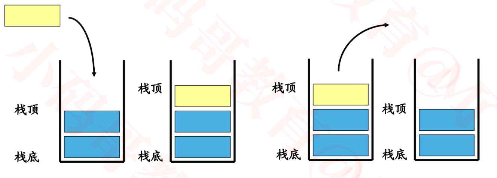
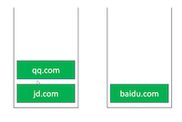
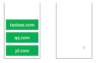

## 栈(Stack)

### 简介

+ 栈是一种特殊的线性表，只能在一端进行操作

  - 往栈中添加元素的操作，一般叫做 push，入栈

  - 从栈中移除元素的操作，一般叫做 pop，出栈（只能移除栈顶元素，也叫做：弹出栈顶元素）

  - 后进先出的原则，Last In First Out，LIFO

    

+ 注意：这里说的“栈”与内存中的“栈空间”是两个不同的概念

### 栈的接口设计

+ `int size(); `// 元素的数量
+ `boolean isEmpty(); `// 是否为空
+ `void push(E element); `// 入栈
+ `E pop(); `// 出栈
+ `E top();` // 获取栈顶元素
+ `void clear();` // 清空

+ 栈的内部实现是否可以直接利用以前学过的数据结构？
  - 动态数组、链表
  - 动态数组和链表操作最后一个元素的时间复杂度都是O(1)

### 栈的实现

+ 方案1:继承ArrayList或linkedList

  ```java
  public class Stack<E> extends ArrayList<E> //或extends linkedList<E>
  {
    /**
  
    public int size();
    public boolean isEmpty();
    public void clear();
    
    这些接口在ArrayList， linkedList已经实现了，继承过来即可
    *
    */
  
  	public void push(E element) {
  		add(element);
  	}
    
  	public E pop() {
  		return remove(size - 1);
  	}
  	public E top() {
  		return get(size - 1);
  	}
  }
  
  ```

  - 该方案的弊端:Stack能够访问ArrayList或LinkedList中其他接口

+ 方案2: Stack内部包含ArrayList或linkedList (**推荐使用**)

  ```java
  public class Stack<E> {
  	private List<E> list = new ArrayList<>();// new linkedList<>();
  	
  	public void clear() {
  		list.clear();
  	}
  	
  	public int size() {
  		return list.size();
  	}
  
  	public boolean isEmpty() {
  		return list.isEmpty();
  	}
  
  	public void push(E element) {
  		list.add(element);
  	}
  
  	public E pop() {
  		return list.remove(list.size() - 1);
  	}
  
  	public E top() {
  		return list.get(list.size() - 1);
  	}
  }
  
  ```

### 系统的Stack

+ 系统的Stack源码位于java.util.stack中

+ 其具体实现如下

  ```java
  public
  class Stack<E> extends Vector<E> {
    
      public Stack() {
        
      }
      public E push(E item) {
          addElement(item);
  
          return item;
      }
  
      public synchronized E pop() {
          E       obj;
          int     len = size();
  
          obj = peek();
          removeElementAt(len - 1);
  
          return obj;
      }
  
      public synchronized E peek() {//获取栈顶元素，也就是上面的top方法
          int     len = size();
  
          if (len == 0)
              throw new EmptyStackException();
          return elementAt(len - 1);
      }
      public boolean empty() {
          return size() == 0;
      }
  
  
      public synchronized int search(Object o) {
          int i = lastIndexOf(o);
  
          if (i >= 0) {
              return size() - i;
          }
          return -1;
      }
    private static final long serialVersionUID = 1224463164541339165L;
  }
  
  ```

  + Vector类似于动态数组的结构，但是添加线程安全的内容
  + Stack继承于Vector，其实现也是线程安全。但是弊端在于暴露了一些不需要的接口

### 栈的应用 – 浏览器的前进和后退

+ 浏览器的前进和后退，实际上利用了两个栈

+ 从下面过程来了解其过程

  - 输入 jd.com

    - 将`jd.com ` push到第一个栈中

    

  - 输入 qq.com

    - 将`qq.com ` push到第一个栈中

    

  - 输入 baidu.com

    - 将`baidu.com ` push到第一个栈中

    

  - 后退

    - 将`baidu.com ` 从第一个栈pop掉
    - 将`baidu.com ` push第二个栈中

    

  - 后退

    - 将`qq.com ` 从第一个栈pop掉
    - 将`qq.com ` push第二个栈中

    

  - 前进

    - 将`qq.com ` 从第二个栈pop掉
    - 将`qq.com ` push第一个栈中

    

  - 输入 taobao.com

    - 将`taobao.com ` push到第一个栈中
    - 并将第二个栈清空

    

+ 类似的应用场景
  
  - 软件的撤销（Undo）、恢复（Redo）功能


### 练习-有效括号

+ https://leetcode-cn.com/problems/valid-parentheses/solution/

  

+ 思路分析
  1. 遇见左字符，将左字符入栈
  2. 遇见右字符
     - 如果栈是空的，说明**括号无效** 
     - 如果栈不为空，将栈顶字符出栈，与右字符之匹配
       - 如果左右字符不匹配，说明**括号无效**
       - 如果左右字符匹配，继续扫描下一个字符
  3. 所有字符扫描完毕后
     - 栈为空，说明括号有效
     - 栈不为空，说明**括号无效**

+ 实现方案

  ```java
  public class _20_有效的括号 {
  	private static HashMap<Character, Character> map = new HashMap<>();
  	static {
  		// key - value
  		map.put('(', ')');
  		map.put('{', '}');
  		map.put('[', ']');
  	}
  	
  	public boolean isValid(String s) {
  		Stack<Character> stack = new Stack<>();
  		
  		int len = s.length();
  		for (int i = 0; i < len; i++) {
  			char c = s.charAt(i);
  			if (map.containsKey(c)) { // 左括号
          //遇到左括号，则入栈
  				stack.push(c);
  			} else { // 右括号
          //如果此时栈为空，则无效
  				if (stack.isEmpty()) return false;
  				//将栈顶的左括号出栈，看与右括号是否匹配
  				if (c != map.get(stack.pop())) return false;
  			}
  		}
      //看最终栈是否为空
  		return stack.isEmpty();
    }
  	
  	public boolean isValid1(String s) {
  		Stack<Character> stack = new Stack<>();
  		
  		int len = s.length();
  		for (int i = 0; i < len; i++) {
  			char c = s.charAt(i);
  			if (c == '(' || c == '{' || c == '[') { // 左括号
  				stack.push(c);
  			} else { // 右括号
  				if (stack.isEmpty()) return false;
  				char left = stack.pop();
  				if (left == '(' && c != ')') return false;
  				if (left == '{' && c != '}') return false;
  				if (left == '[' && c != ']') return false;
  			}
  		}
  		return stack.isEmpty();
      }
    
    //字符串替换方案，性能消耗较大，因为字符串的查找和替换都比价消耗性能
    public boolean isValid2(String s) {
  		 while (s.contains("{}")
  				|| s.contains("[]")
  				|| s.contains("()")) {
  			s = s.replace("{}", "");
  			s = s.replace("()", "");
  			s = s.replace("[]", "");
  		}
  		return s.isEmpty();
    }
  	
  }
  
  ```


### 作业

+ 括号的分数
  - https://leetcode-cn.com/problems/score-of-parentheses/
+ 逆波兰表达式求值
  - https://leetcode-cn.com/problems/evaluate-reverse-polish-notation/
+ 基本计算器
  - https://leetcode-cn.com/problems/basic-calculator/comments/
  - 前缀表达式，中缀表达式，后缀表达式