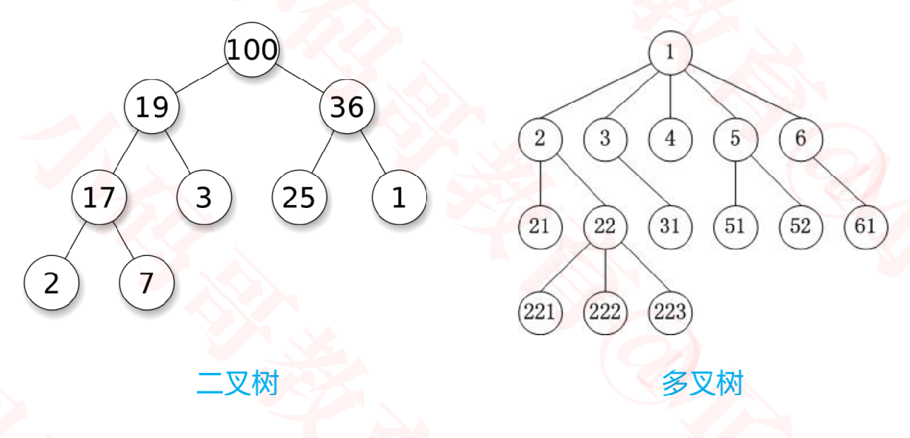
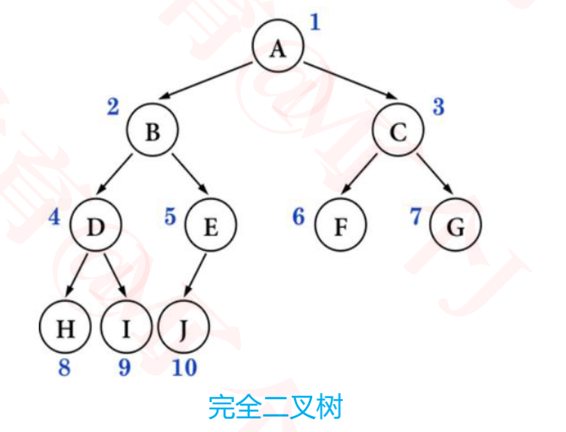
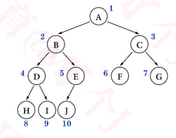
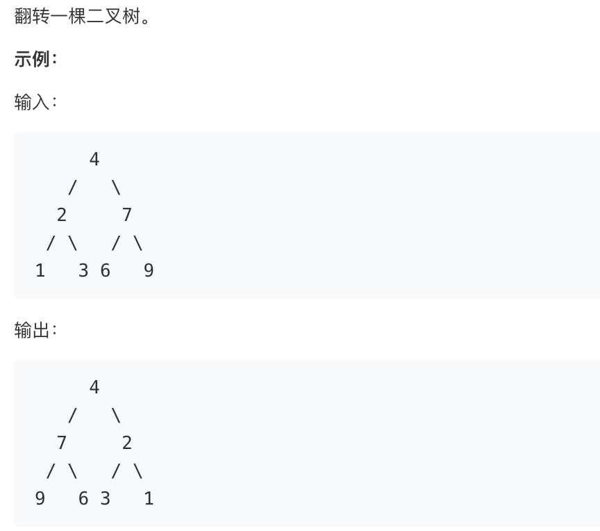
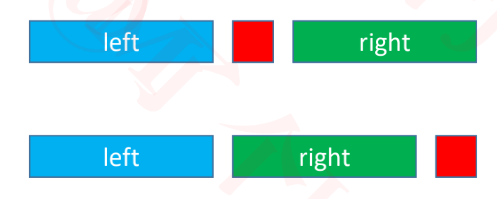
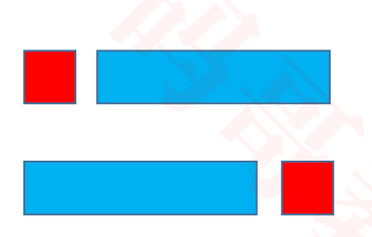
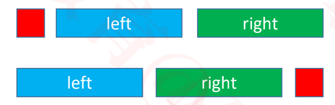
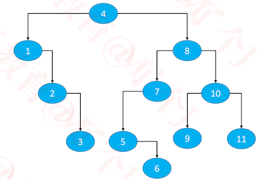

## 二叉树

### 树形结构

+ 使用树形结构可以大大提高效率
+ 树形结构是算法面试的重点




### 生活中的树形结构


### Tree的基本概念

+ 节点、根节点、父节点、子节点、兄弟节点
+ 一棵树可以没有任何节点，称为**空树**
+ 一棵树可以只有 1 个节点，也就是**只有根节点**
+ 子树、左子树、右子树
+ **节点的度**（degree）：子树的个数
+ **树的度**：所有节点度中的最大值
+ **叶子节点**: 度为0的节点
+ **非叶子节点**: 度不为0的节点

+ **层数**（level）：根节点在第 1 层，根节点的子节点在第 2 层，以此类推（有些教程也从第 0 层开始计算）
+ **节点的深度**（depth）：从根节点到当前节点的唯一路径上的节点总数
+ **节点的高度**（height）：从当前节点到最远叶子节点的路径上的节点总数
+ **树的深度**：所有节点深度中的最大值
+ **树的高度**：所有节点高度中的最大值
+ 树的深度 等于 树的高度

### 有序树、无序树、森林


+ 有序树
  - 树中任意节点的子节点之间有顺序关系
  - 上图的3，4 节点交换顺序后就不是同一棵树

+ 无序树
  - 树中任意节点的子节点之间没有顺序关系， 也称为“自由树”
  - 上图的3，4节点交换顺序后还是同一棵树
+ 深林
  - 由 m（m ≥ 0）棵互不相交的树组成的集合


### 二叉树（Binary Tree）

+ 二叉树的特点

  - 每个节点的度最大为 2（最多拥有 2 棵子树）

  - 左子树和右子树是有顺序的

  - 即使某节点只有一棵子树，也要区分左右子树

  - 即便只有一个根节点，也是一棵二叉树

  - 二叉树是有序树

    

    

### 二叉树的性质

+ 非空二叉树的第 i 层，最多有 2<sup>i − 1</sup> 个节点（ i ≥ 1 ）  
+ 在高度为 h 的二叉树上最多有 2<sup>h</sup> - 1 个结点（ h ≥ 1 ）

+ 对于任何一棵非空二叉树，如果叶子节点个数为 n0，度为 2 的节点个数为 n2，则有: n0 = n2 + 1
  - 假设度为 1 的节点个数为 n1，那么二叉树的节点总数 n = n0 + n1 + n2
  - 二叉树的边数 T = n1 + 2 * n2 = n – 1 = n0 + n1 + n2 – 1
  - 因此 n0 = n2 + 1
  - 因此，对于任何一棵非空二叉树，叶子节点个数 = 度为2的节点个数 + 1

### 真二叉树（Proper Binary Tree）

+  <font face="黑体" color=red size=3>真二叉树</font> ：所有节点的度都要么为 0，要么为 2

  


### 满二叉树（Full Binary Tree）

+ <font face="黑体" color=red size=3>满二叉树</font>：所有节点的度都要么为 0，要么为 2。且所有的叶子节点都在最后一层

+ 在同样高度的二叉树中，满二叉树的叶子节点数量最多、总节点数量最多
+ 满二叉树一定是真二叉树，真二叉树不一定是满二叉树
+ 假设满二叉树的高度为 h（ h ≥ 1 ），那么
  - 第 i 层的节点数量：2<sup>i − 1</sup> 
  - 叶子节点数量：2<sup>h − 1</sup> 
  - 总节点数量 n
    - n = 2<sup>h</sup> -1 = 2<sup>0</sup>  + 2<sup>1</sup>  + 2<sup>2</sup>  + ... + 2<sup>h-1</sup> 
    - h = log<sub>2</sub><sup>(n+1)</sup>

### 完全二叉树（Complete Binary Tree）

+ 完全二叉树：叶子节点只会出现最后 2 层，且最后 1 层的叶子结点都靠左对齐
+ 完全二叉树还可以定义为编号后，结点顺序和满二叉树一致
+ 完全二叉树从根结点至倒数第 2 层是一棵满二叉树
+ 满二叉树一定是完全二叉树，完全二叉树不一定是满二叉树
  

### 完全二叉树的性质

+ 度为 1 的节点只有左子树

+ 度为 1 的节点要么是 1 个，要么是 0 个

+ 同样节点数量的二叉树，完全二叉树的高度最小

+ 假设完全二叉树的高度为h (h>=1)，那么

  - 至少有2<sup>h-1</sup>个节点 (2<sup>0</sup>+2<sup>1</sup>+ 2<sup>2</sup> + ...+ 2<sup>h-2</sup> + 1 = 2<sup>h-1</sup> - 1 + 1 = 2<sup>h-1</sup>， 最后一层只有一个左节点)

  - 最多有2<sup>h</sup> -1 个节点， (2<sup>0</sup>+2<sup>1</sup>+ 2<sup>2</sup> + ...+ 2<sup>h-1</sup>  = 2<sup>h</sup> - 1 ，满二叉树 )

  - 总节点数量为n

    - 2<sup>h-1</sup> <= n < 2<sup>h</sup>

    - h - 1 <= 1og<sub>2</sub><sup>n</sup> < h

      - h肯定是整数, 
      - h = 1og<sub>2</sub><sup>n</sup> 的整数部分 + 1 =  1og<sub>2</sub><sup>n</sup> 向下取整 + 1

    - h = floor(1og<sub>2</sub><sup>n</sup> ) + 1 =  (int)1og<sub>2</sub><sup>n</sup>  + 1

      ```
      floor(向下取整):只取前面的整数。 比如floor(4.6) = 4
      ceiling(向上取整):如果小数不为0，取前面的整数 + 1。否则只取前面的数。
      比如ceiling(4.6)为5, ceiling(4.0)为4
      
      floor和ceiling都是不管四舍五入原则的
      ```

+ 一棵有 n 个节点的完全二叉树（n > 0），从上到下、从左到右对节点从 1 开始进行编号，对任意第 i 个节点

  - 如果 i = 1 ，它是根节点
  - 如果 i > 1 ，它的父节点编号为 floor( i / 2 )
  - 如果2i ≤ n ，它的左子节点编号为 2i
  - 如果2i > n ，它无左子节点
  - 如果 2i + 1 ≤ n ，它的右子节点编号为 2i + 1
  - 如果 2i + 1 > n ，它无右子节点

  


### 国外教材的说法

+ Full Binary Tree：完满二叉树
  - 所有非叶子节点的度都为2
  - 就的国内说的“真二叉树”
+ Perfect Binary Tree：完美二叉树
  - 所有非叶子节点的度都为 2，且所有的叶子节点都在最后一层
  - 就是国内说的“满二叉树”
+ Complete Binary Tree：完全二叉树
  - 跟国内的定义一样

### 面试题

+ 如果一棵完全二叉树有 768 个节点，求叶子节点的个数?

  - 假设叶子节点个数为 n0，度为 1 的节点个数为 n1，度为 2 的节点个数为 n2
  - 总结点个数 n = n0 + n1 + n2，而且 n0 = n2 + 1
    - n = 2n0 + n1 – 1
  - 完全二叉树的 n1 要么为 0，要么为 1
    - **n1为1时**，n = 2n0，**n 必然是偶数**
      - 叶子节点个数 n0 = n / 2，非叶子节点个数 n1 + n2 = n / 2
    - **n1为0时**，n = 2n0 – 1，**n 必然是奇数**
      - 叶子节点个数 n0 = (n + 1) / 2，非叶子节点个数 n1 + n2 = (n – 1) / 2
  - 叶子节点个数 n0 = floor( (n + 1) / 2 ) = ceiling( n / 2 ) 
  - 非叶子节点个数 n1 + n2 = floor( n / 2 ) = ceiling( (n – 1) / 2 ) 
  - 因此叶子节点个数为 384


###  二叉树的遍历

+ 遍历是数据结构中的常见操作
  - 把所有元素都访问一遍
+ 线性数据结构的遍历比较简单
  - 正序遍历
  - 逆序遍历
+ 根据节点访问顺序的不同，二叉树的常见遍历方式有4种
  - 前序遍历（Preorder Traversal）
  - 中序遍历（Inorder Traversal）
  - 后序遍历（Postorder Traversal）
  - 层序遍历（Level Order Traversal）

### 前序遍历(Preorder Traversal)

+ 访问顺序

  - 根节点、前序遍历左子树、前序遍历右子树

  - 7、4、2、1、3、5、9、8、11、10、12

    

+ 代码如下

  ```java
  	/**
  	 * 前序遍历
  	 */
  	public void preorderTraversal() {
  		preorderTraversal(root);
  	}
  	
  	private void preorderTraversal(Node<E> node) {
  		if (node == null) return;
  		//根节点
  		System.out.println(node.element);
      //左子树
  		preorderTraversal(node.left);
      //右子树
  		preorderTraversal(node.right);
  	}
  ```

### 中序遍历(Inorder Traversal)

+ 访问顺序

  - 中序遍历左子树、根节点、中序遍历右子树

  - 1、2、3、4、5、7、8、9、10、11、12

    


+ 如果访问顺序是下面这样呢？

  - 中序遍历右子树、根节点、中序遍历左子树

  - 12、11、10、9、8 、7、5、4、3、2、1

    

+ 二叉搜索树的中序遍历结果是升序或者降序的

+ 代码如下

  ```java
  	/**
  	 * 中序遍历
  	 */
  	public void inorderTraversal() {
  		inorderTraversal(root);
  	}
  	
  	private void inorderTraversal(Node<E> node) {
  		if (node == null) return;
  		
  		inorderTraversal(node.left);
  		System.out.println(node.element);
  		inorderTraversal(node.right);
  	}
  	
  ```

### 后序遍历(Postorder Traversal)

+ 访问顺序

  - 后序遍历左子树、后序遍历右子树、根节点
  - 1、3、2、5、4、8、10、12、11、9、7

+ 代码如下

  ```java
  	/**
  	 * 后序遍历
  	 */
  	public void postorderTraversal() {
  		postorderTraversal(root);
  	}
  	
  	private void postorderTraversal(Node<E> node) {
  		if (node == null) return;
  
  		postorderTraversal(node.left);
  		postorderTraversal(node.right);
  		System.out.println(node.element);
  	}
  ```

  

### 层序遍历(Level Order Traversal)

+ 访问顺序

  - 从上到下、从左到右依次访问每一个节点

  - 7、4、9、2、5、8、11、1、3、10、12

    

+ 实现思路

  1. 将根节点入队
  2. 循环执行以下操作，直到队列为空
     - 将队头节点 A 出队，进行访问
     - 将 A 的左子节点入队
     - 将 A 的右子节点入队

+ 代码如下

  ```java
  	/**
  	 * 层序遍历
  	 */
  	public void levelOrderTraversal() {
  		if (root == null) return;
  		
  		Queue<Node<E>> queue = new LinkedList<>();
  		queue.offer(root);//将root入队
  		
  		while (!queue.isEmpty()) {
        //将队头结点入队
  			Node<E> node = queue.poll();
  			System.out.println(node.element);
  			if (node.left != null) {
          //将左子节点入队
  				queue.offer(node.left);
  			}
  			if (node.right != null) {
          //将右子节点入队
  				queue.offer(node.right);
  			}
  		}
  	}
  ```


### 遍历接口设计

+ 在外界对元素进行遍历

+ 设计访问器接口，从外面传递访问器，内部拿到访问器后将元素遍历返回

+ 访问器代码设计如下

  ```java
  public static interface Visitor<E> {
  		public void visit(E element);
  }
  ```

+ 此时前序，中序，后续，层序遍历代码如下

  - 前序遍历

    ```java
    public void preorder(Visitor<E> visitor) {
    		if (visitor == null) return;
    		preorder(root, visitor);
    	}
    	
    	private void preorder(Node<E> node, Visitor<E> visitor) {
    		if (node == null) return;
    		visitor.visit(node.element);
    		preorder(node.left, visitor);
    		preorder(node.right, visitor);
    	}
    ```

  - 中序遍历

    ```java
    public void inorder(Visitor<E> visitor) {
    		if (visitor == null) return;
    		inorder(root, visitor);
    	}
    	
    	private void inorder(Node<E> node, Visitor<E> visitor) {
    		if (node == null) return;
    		
    		inorder(node.left, visitor);
    	  visitor.visit(node.element);
    		inorder(node.right, visitor);
    	}
    ```

  - 后序遍历

    ```java
    	public void postorder(Visitor<E> visitor) {
    		if (visitor == null) return;
    		postorder(root, visitor);
    	}
    	
    	private void postorder(Node<E> node, Visitor<E> visitor) {
    		if (node == null) return;
    		
    		postorder(node.left, visitor);
    		postorder(node.right, visitor);
    		visitor.visit(node.element);
    	}
    ```

  - 层序遍历

    ```java
    public void levelOrder(Visitor<E> visitor) {
    		if (root == null || visitor == null) return;
    		
    		Queue<Node<E>> queue = new LinkedList<>();
    		queue.offer(root);
    		
    		while (!queue.isEmpty()) {
    			Node<E> node = queue.poll();
    			visitor.visit(node.element);
    			if (node.left != null) {
    				queue.offer(node.left);
    			}
    			
    			if (node.right != null) {
    				queue.offer(node.right);
    			}
    		}
    	}
    ```

### 增强遍历接口

+ 上面的遍历设计已经能够满足，遍历所有元素的需求

+ 假如，我们只需要遍历前面一部分元素，后面的元素停止遍历，以减少性能消耗

+ 此时访问器接口要重新进行设计

  ```java
  //因为需要stop变量来保存上一次遍历后的返回值，所以Visitor被设计成抽象类
  public static abstract class Visitor<E> {
  		boolean stop; //保留遍历上个返回的值，如果为true，就停止下面的遍历
  		/**
  		 * @return 如果返回true，就代表停止遍历
  		 * 之所以设计成返回true，停止遍历。是因为java默认返回为false，而我们默认的行为是遍历所有元素。
  		 */
  		public abstract boolean visit(E element);
  	}
  ```

+ 此时前序，中序，后续，层序遍历代码如下

  - 前序遍历

    ```java
    public void preorder(Visitor<E> visitor) {
    		if (visitor == null) return;
    		preorder(root, visitor);
    	}
    	
    	private void preorder(Node<E> node, Visitor<E> visitor) {
    		if (node == null || visitor.stop) return;
    		//如果遍历上一个元素时，返回true就停止下面所有的遍历
    		visitor.stop = visitor.visit(node.element);
    		preorder(node.left, visitor);
    		preorder(node.right, visitor);
    	}
    ```

  - 中序遍历

    ```java
    public void inorder(Visitor<E> visitor) {
    		if (visitor == null) return;
    		inorder(root, visitor);
    	}
    	
    	private void inorder(Node<E> node, Visitor<E> visitor) {
        //visitor.stop作用:为了停止下面的递归调用
    		if (node == null || visitor.stop) return;
    		
    		inorder(node.left, visitor);
        //visitor.stop作用:
        //假如inorder(node.left, visitor)中已经使visitor.stop=true，那么后面的遍历也要停止
    		if (visitor.stop) return;
    		visitor.stop = visitor.visit(node.element);
    		inorder(node.right, visitor);
    	}
    ```

  - 后续遍历

    ```java
    public void postorder(Visitor<E> visitor) {
    		if (visitor == null) return;
    		postorder(root, visitor);
    	}
    	
    	private void postorder(Node<E> node, Visitor<E> visitor) {
        //visitor.stop作用:为了停止下面的递归调用
    		if (node == null || visitor.stop) return;
    		
    		postorder(node.left, visitor);
    		postorder(node.right, visitor);
        //visitor.stop作用:
        //假如inorder(node.left, visitor)或postorder(node.right, visitor)中已经使visitor.stop=true，那么后面的遍历也要停止
    		if (visitor.stop) return;
    		visitor.stop = visitor.visit(node.element);
    	}
    ```

  - 层序遍历

    ```java
    public void levelOrder(Visitor<E> visitor) {
    		if (root == null || visitor == null) return;
    		
    		Queue<Node<E>> queue = new LinkedList<>();
    		queue.offer(root);
    		
    		while (!queue.isEmpty()) {
    			Node<E> node = queue.poll();
          //返回为true时，直接停止循环
    			if (visitor.visit(node.element)) return;
    			
    			if (node.left != null) {
    				queue.offer(node.left);
    			}
    			
    			if (node.right != null) {
    				queue.offer(node.right);
    			}
    		}
    	}
    ```

    

+ 测试代码

  ```java
  static void test9() {
  		Integer data[] = new Integer[] {
  				7, 4, 9, 2, 1
  		};
  		
  		BinarySearchTree<Integer> bst = new BinarySearchTree<>();
  		for (int i = 0; i < data.length; i++) {
  			bst.add(data[i]);
  		}
  		BinaryTrees.println(bst);
  		
      //前序遍历到2停止遍历
  		bst.preorder(new Visitor<Integer>() {
  			public boolean visit(Integer element) {
  				System.out.print(element + " ");
  				return element == 2 ? true : false;
  			}
  		});
  		System.out.println();
  	}
  ```


### 遍历的应用

+ 前序遍历
  - 树状结构展示（注意左右子树的顺序）
+ 中序遍历
  - 二叉搜索树的中序遍历按升序或者降序处理节点
+ 后序遍历
  - 适用于一些先子后父的操作
+ 层序遍历
  - 计算二叉树的高度
  - 判断一棵树是否为完全二叉树

### 树状打印二叉树

+ 实现二叉树的toString()方法，遍历打印出二叉树的结构

+ 通过前序遍历进行打印。

  - 可以在打印出的元素前面加一些字符串前缀，就可以区分出结构了

    ```java
    @Override
    	public String toString() {
    		StringBuilder sb = new StringBuilder();
    		toString(root, sb, "");
    		return sb.toString();
    	}
    	
    	private void toString(Node<E> node, StringBuilder sb, String prefix) {
    		if (node == null) return;
    
    		toString(node.left, sb, prefix + "L---");
    		sb.append(prefix).append(node.element).append("\n");
    		toString(node.right, sb, prefix + "R---");
    	}
    
    //打印结果如下
    7
    L---4
    L---L---2
    L---L---L---1
    L---L---R---3
    L---R---5
    R---9
    R---L---8
    R---R---11
    R---R---R---12
    ```

### 计算二叉树高度

+ 递归

  - 一棵树的高度= max(左子树的高度, 右子树的高度) + 1

  - 代码实现

    ```java
    public int height() {
    		return height(root);
    	}
    	
    private int height(Node<E> node) {
    	if (node == null) return 0;
    	return 1 + Math.max(height(node.left), height(node.right));
    }
    ```

+ 迭代

  - 由对层序遍历的观察可知，当一次循环结束，上一层的最后一个元素出队后，队列中剩余的元素，即为下一层的所有元素

  - 代码实现如下

    ```java
    public int height() {
    		if (root == null) return 0;
    		
    		// 树的高度
    		int height = 0;
    		// 存储着每一层的元素数量
    		int levelSize = 1;
    		Queue<Node<E>> queue = new LinkedList<>();
    		queue.offer(root);
    		
    		while (!queue.isEmpty()) {
    			Node<E> node = queue.poll();
          //当前层，每出队一个元素，数量减1。当减为0时，队列中的元素，即为下一层的所有元素
    			levelSize--;
    			if (node.left != null) {
    				queue.offer(node.left);
    			}
    			if (node.right != null) {
    				queue.offer(node.right);
    			}
    			if (levelSize == 0) { // 意味着即将要访问下一层
    				levelSize = queue.size();
    				height++;
    			}
    		}
    		return height;
    	}
    ```

    

### 判断一棵二叉树是否为完全二叉树

+ 利用层序遍历访问元素，来看是否符合完全二叉树的特征

+ 思路

  - 如果树为空，返回 false

  - 如果树不为空，开始层序遍历二叉树（用队列）

    - 如果 node.left!=null && node.right != null
    - 如果 node.left==null && node.right!=null，返回 false
    - 如果 node.left!=null && node.right==null或node.left==null&& node.right==null
      - 那么后面遍历的节点应该都为叶子节点，才是完全二叉树
      - 否则返回 false
    - 遍历结束，返回 true

    

+ 代码实现如下

  ````java
  private static class Node<E> {
  		E element;
  		Node<E> left;
  		Node<E> right;
  		Node<E> parent;
  		public Node(E element, Node<E> parent) {
  			this.element = element;
  			this.parent = parent;
  		}
  		//是否为叶子节点
  		public boolean isLeaf() {
  			return left == null && right == null;
  		}
  		
  		public boolean hasTwoChildren() {
  			return left != null && right != null;
  		}
  	}
  
  public boolean isComplete() {
  		if (root == null) return false;
  		
  		Queue<Node<E>> queue = new LinkedList<>();
  		queue.offer(root);
  		
  		boolean leaf = false;
  		while (!queue.isEmpty()) {
  			Node<E> node = queue.poll();
  			if (leaf && !node.isLeaf()) return false;
  
  			if (node.left != null && node.right != null) {
  				queue.offer(node.left);
  				queue.offer(node.right);
  			} else if (node.left == null && node.right != null) {
  				return false;
  			} else { // 后面遍历的节点都必须是叶子节点
  				leaf = true;
  				if (node.left != null) {
            //必须要将node的左子节点入队，其左子节点有可能不是叶子节点
  					queue.offer(node.left);
  				}
  			}
  		}
  		return true;
  	}
  
  //推荐这种写法
  public boolean isComplete() {
  		if (root == null) return false;
  		
  		Queue<Node<E>> queue = new LinkedList<>();
  		queue.offer(root);
  
  		boolean leaf = false;
  		while (!queue.isEmpty()) {
  			Node<E> node = queue.poll();
        //如果后面要求是叶子节点，但该结点又不是叶子节点
  			if (leaf && !node.isLeaf()) return false;
  			
  			if (node.left != null) {
  				queue.offer(node.left);
  			} else if (node.right != null) { 
          // node.left == null && node.right != null
  				return false;
  			}
  			if (node.right != null) {
  				queue.offer(node.right);
  			} else { 
          // node.left == null&&node.right == null
          // node.left != null&&node.right == null
  				leaf = true;
  			}
  		}
  		return true;
  	}
  
  
  ````

  + 假如我们要用到层序遍历，那么最好先把层序遍历的结构写出来，然后在这个结构的基础上去做事情。


### letcode-翻转二叉树

+ https://leetcode-cn.com/problems/invert-binary-tree/

  

+ 思路分析

  - 遍历每一个节点，并将它的左右子节点进行交换

+ 代码如下

  ```java
  public class TreeNode {
  	int val;
  	TreeNode left;
  	TreeNode right;
  	TreeNode(int x) { 
  		val = x; 
  	}
  }
  ```

  + 通过前序遍历翻转二叉树

    ```java
     public TreeNode invertTree(TreeNode root) {
    	   if (root == null) return root;
         //交换当前节点的左右子节点
    	   TreeNode tmp = root.left;
    	   root.left = root.right;
    	   root.right = tmp;
    	   //交换左子节点的左右子节点
         invertTree(root.left);
         //交换右子节点的左右子节点
         invertTree(root.right);
           
           return root;
       }
    ```

  + 通过中序遍历翻转二叉树

    ````java
    public TreeNode invertTree(TreeNode root) {
    	   if (root == null) return root;
    	   //交换左子节点的左右子节点
         invertTree(root.left);
         //交换当前节点的左右子节点
    	   TreeNode tmp = root.left;
    	   root.left = root.right;
    	   root.right = tmp;
         //交换右子节点的左右子节点，因为此时当前节点的左右节点已经交换，所以root.left是原来的右节点
          invertTree(root.left);
          return root;
     }
    ````
    
+ 通过后序遍历翻转二叉树
  
  ```java
    public TreeNode invertTree(TreeNode root) {
    	   if (root == null) return root;
    	   //交换左子节点的左右子节点
          invertTree(root.left);
         //交换右子节点的左右子节点
          invertTree(root.right);
    	   //交换当前节点的左右子节点
    	   TreeNode tmp = root.left;
    	   root.left = root.right;
    	   root.right = tmp;
           
           return root;
        }
    ```

  + 通过层序遍历翻转二叉树

    ```java
    public TreeNode invertTree(TreeNode root) {
    		if (root == null) return root;
    		
    		Queue<TreeNode> queue = new LinkedList<>();
    		queue.offer(root);
    		
    		while (!queue.isEmpty()) {
    			TreeNode node = queue.poll();
    		    TreeNode tmp = node.left;
    		    node.left = node.right;
    		    node.right = tmp;
    			
    			if (node.left != null) {
    				queue.offer(node.left);
    			}
    			
    			if (node.right != null) {
    				queue.offer(node.right);
    			}
    		}
    		return root;
    	}
    ```

### 根据遍历结果重构二叉树

- 前序遍历 + 中序遍历 =>  唯一的一棵二叉树

  

  + 前序遍历=> 根节点 , 左子树 , 右子树
  + 中序遍历=> 左子树, 根节点  , 右子树
  + 通过前序遍历，知道第一个节点是根节点。
  + 通过中序遍历，根节点左边是左子树节点。根节点右是右子树节点
  + 左子树又可以根据上面的规则，拆分出根节点, 左子树,右子树

- 后序遍历 + 中序遍历 =>  唯一的一棵二叉树

  

  + 与前序遍历 + 中序遍历类似

+  前序遍历 + 后序遍历

  - 如果它不是一棵真二叉树，结果不唯一

    

    - 非真二叉树时，其左子树或右子树可能为空
    - 根据前序遍历，其根节点后面，可能是左子树也可能是右子树
    - 根据后序遍历，其根节点前面，可能是左子树也可能是右子树
    - 所以确定根节点后，无法确定左右子树

  - 如果它是一棵真二叉树（Proper Binary Tree），结果是唯一的

    

    + 真二叉树时，其左子树， 右子树要么为空，要么都存在
    + 根据前序遍历，其根节点后面，先左子树，后右子树
    + 根据后序遍历，其根节点前面，先左子树，后右子树
    + 前序遍历的左子树的第一个节点，也是根节点
    + 从后序遍历的序列中，可知，该根节点前面的所有节点都是左子树，后面的所有节点都是右子树。
    + 此时根节点，左，右子树就拆分出来了

+ 前序遍历+中序遍历构造二叉树的示例

  + 前序遍历：4 2 1 3 6 5

  + 中序遍历：1 2 3 4 5 6

    

    

### 前驱节点(predecessor)


+ 前驱节点：中序遍历时的前一个节点

  - 如果是二叉搜索树，前驱节点就是前一个比它小的节点

+ 思路分析

  1. node.left != null

     ```
     当左子树不为空时，前驱节点即为左子树中最右边的节点
     ```

     - 举例：6、13、8
     - predecessor = node.left.right.right.right...
     - 终止条件：right 为 null

  2. node.left == null && node.parent != null

     ```
     当左子树为空，但是父节点不为空时，那么假如该结点位于某个祖父节点的右子树中，那么该祖父节点就是前驱节点
     
     对于节点1，其左子树不为空，并且其也不位于右子树中，其前驱节点为空
     ```

     - 举例：7、11、9、1
     - predecessor = node.parent.parent.parent...
     - 终止条件：node 在 parent 的右子树中

  3.  node.left == null && node.parent == null

     - 那就没有前驱节点
     - 举例：没有左子树的根节点

+ 代码实现

  ```java
  private Node<E> predecessor(Node<E> node) {
  		if (node == null) return null;
  		// 前驱节点在左子树当中（left.right.right.right....）
  		Node<E> p = node.left;
  		if (p != null) {
  			while (p.right != null) {
  				p = p.right;
  			}
  			return p;
  		}
  		// 从父节点、祖父节点中寻找前驱节点
  		while (node.parent != null && node == node.parent.left) {
  			node = node.parent;
  		}
  		// node.parent == null  例如节点1
  		// node == node.parent.right 如果此时node是父节点的右节点，则返回父节点
  		return node.parent;
  	}
  ```

  

### 后继节点(successor)



+ 其逻辑正好与前驱节点相反

+ 后继节点：中序遍历时的后一个节点

  +  如果是二叉搜索树，后继节点就是后一个比它大的节点

+ 思路分析

  1. node.right != null
     - 举例：1、8、4
     - successor = node.right.left.left.left...
     - 终止条件：left 为 null
  2. node.right == null && node.parent != null
     - 举例：7、6、3、11
     - successor = node.parent.parent.parent...
     - 终止条件：node 在 parent 的左子树中
  3. node.right == null && node.parent == null
     - 那就没有前驱节点
     - 举例：没有右子树的根节点

+ 代码实现

  ```java
  //与前驱节点逻辑正好相反
  private Node<E> successor(Node<E> node) {
  		if (node == null) return null;
  		
  		// 前驱节点在左子树当中（right.left.left.left....）
  		Node<E> p = node.right;
  		if (p != null) {
  			while (p.left != null) {
  				p = p.left;
  			}
  			return p;
  		}
  		// 从父节点、祖父节点中寻找前驱节点
  		while (node.parent != null && node == node.parent.right) {
  			node = node.parent;
  		}
  		return node.parent;
  	}
  ```

  


### 作业

+ 二叉树的前序遍历： https://leetcode-cn.com/problems/binary-tree-preorder-traversal/ （递归+迭代）
+  二叉树的中序遍历： https://leetcode-cn.com/problems/binary-tree-inorder-traversal/ （递归+迭代）
+ 二叉树的后序遍历： https://leetcode-cn.com/problems/binary-tree-postorder-traversal/ （递归+迭代）
+ 二叉树的层次遍历： https://leetcode-cn.com/problems/binary-tree-level-order-traversal/ （迭代）
+ 二叉树的最大深度： https://leetcode-cn.com/problems/maximum-depth-of-binary-tree/ （递归+迭代）

+ 二叉树的层次遍历II： https://leetcode-cn.com/problems/binary-tree-level-order-traversal-ii/
+ 二叉树最大宽度：https://leetcode-cn.com/problems/maximum-width-of-binary-tree/
+ N叉树的前序遍历： https://leetcode-cn.com/problems/n-ary-tree-preorder-traversal/
+ N叉树的后序遍历： https://leetcode-cn.com/problems/n-ary-tree-postorder-traversal/
+ N叉树的最大深度： https://leetcode-cn.com/problems/maximum-depth-of-n-ary-tree/
+ 二叉树展开为链表: https://leetcode-cn.com/problems/flatten-binary-tree-to-linked-list/
+ 从中序与后序遍历序列构造二叉树: https://leetcode-cn.com/problems/construct-binary-tree-from-inorder-and-postorder-traversal/
+ 从前序与中序遍历序列构造二叉树: https://leetcode-cn.com/problems/construct-binary-tree-from-preorder-and-inorder-traversal/
+ 根据前序和后序遍历构造二叉树: https://leetcode-cn.com/problems/construct-binary-tree-from-preorder-and-postorder-traversal/
+ 对称二叉树: https://leetcode-cn.com/problems/symmetric-tree/
+ 已知前序、中序遍历结果，求出后序遍历结果
+ 已经中序、后序遍历结果，求出前序遍历结果
  

