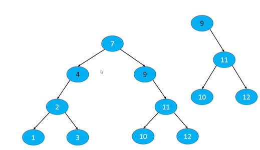
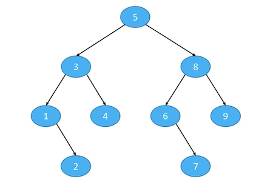
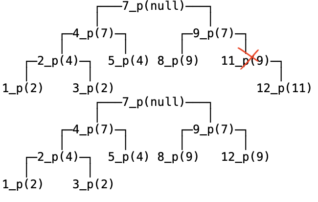
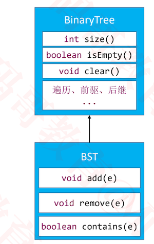
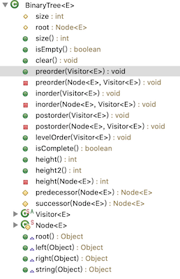
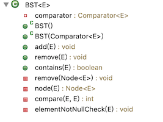

### 思考

+ 在 n 个动态的整数中搜索某个整数？（查看其是否存在）

+ 假设使用动态数组存放元素，从第 0 个位置开始遍历搜索，平均时间复杂度：O(n)

  

+ 如果维护一个有序的动态数组，使用二分搜索，最坏时间复杂度：O(logn)

  - 但是添加、删除的平均时间复杂度是 O(n):因为添加和删除后，其他元素要移动

    

+ 针对这个需求，有没有更好的方案？

  - 使用二叉搜索树，添加、删除、搜索的最坏时间复杂度均可优化至：O(logn)

### 二叉搜索树（Binary Search Tree）

+ 二叉搜索树是二叉树的一种，是应用非常广泛的一种二叉树，英文简称为 BST
  - 又被称为：二叉查找树、二叉排序树
  - 任意一个节点的值都大于其左子树所有节点的值
  - 任意一个节点的值都小于其右子树所有节点的值
  - 它的左右子树也是一棵二叉搜索树
+ 二叉搜索树可以大大提高搜索数据的效率
+ 二叉搜索树存储的元素必须具备可比较性
  - 比如 int、double 等
  - 如果是自定义类型，需要指定比较方式
  - 不允许为 null


+ 需要注意的是
  - 对于我们现在使用的二叉树来说，它的元素没有索引的概念

### 二叉搜索树方案设计

+ 二叉搜索树的接口设计

  - **int size()** : 元素的数量
  - **boolean isEmpty()** : 是否为空
  - **void clear()** :清空所有元素
  - **void add(E element)** : 添加元素
  - **void remove(E element)** : 删除元素
  - **boolean contains(E element)** : 是否包含某元素
  - ...

+ 需要注意的是

  - 对于我们现在使用的二叉树来说，它的元素没有索引的概念

+ 如何添加节点

  0. 如果没有根节点，把它当做根节点

  1. 先找到父节点 parent
     + 比较传入的elment与节点中的element的值的大小
     + 如果传入的elment较大，则说明应该放在右边
     + 如果传入的elment较小，则说明应该放在左边 
     + 如果传入的elment相等，则将值进行覆盖
     + 最终找到父节点

  2. 创建新节点 node

  3. 将节点放在父节点后面
     - 比父节点小，则放在父节点左边 parent.left = node 
     - 比父节点大，则放在父节点右边 parent.right = node

  4. 遇到值相等的元素该如何处理?
     - 建议覆盖旧的值

+ 元素的比较方案设计

  1.  允许外界传入一个 Comparator 自定义比较方案
  2. 如果没有传入 Comparator，强制认定元素实现了 Comparable 接口

### 二叉树搜索树代码

+ 创建BinarySearchTree，并添加设计的接口

  ```java
  public class BinarySearchTree<E>{
  	private int size;
  	private Node<E> root;
    
    public int size() {
  		return size;
  	}
  	public boolean isEmpty() {
  		return size == 0;
  	}
  	public void clear() {
  	}
  	public void add(E element) {
  	}
  
  	public void remove(E element) {
  	}
    
  	public boolean contains(E element) {
  		return false;
  	}
    //内部的节点，设计成私有的，只有内部能访问
    private static class Node<E> {
  		E element;
  		Node<E> left;
  		Node<E> right;
  		@SuppressWarnings("unused")
  		Node<E> parent;
  		public Node(E element, Node<E> parent) {
  			this.element = element;
  			this.parent = parent;
  		}
  	}
  }
  
  ```

+ `void add(E element)`的实现方案

  ```java
  //元素非空判断
  private void elementNotNullCheck(E element) {
  		if (element == null) {
  			throw new IllegalArgumentException("element must not be null");
  		}
  }
  
  /**
  * @return 返回值等于0，代表e1和e2相等；返回值大于0，代表e1大于e2；返回值小于于0，代表e1小于e2
  */
  private int compare(E e1, E e2) {
  	return e1， e2的比较结果;
  }
  
  public void add(E element) {
      //元素非空
  		elementNotNullCheck(element);
  		//添加第一个节点
  		if (root == null) {
  			root = new Node<>(element, null);
  			size++;
  			return;
  		}
  		// 添加的不是第一个节点
  		// 找到父节点
  		Node<E> parent = root;
  		Node<E> node = root;
  		int cmp = 0;
  		while (node != null) {
  			cmp = compare(element, node.element);
  			parent = node;
  			if (cmp > 0) {
          //如果添加的元素比该节点的元素大，则应该添加到右侧，所以向右侧比较
  				node = node.right;
  			} else if (cmp < 0) {
           //如果添加的元素比该节点的元素小，则应该添加到左侧，所以向左侧比较
  				node = node.left;
  			} else { 
          //覆盖旧值
  				node.element = element;
  				return;
  			}
  		}
      //看看插入到父节点的哪个位置
  		Node<E> newNode = new Node<>(element, parent);
  		if (cmp > 0) {
  			parent.right = newNode;
  		} else {
  			parent.left = newNode;
  		}
  		size++;
  }
  ```

+ 添加方法，还缺少compare的实现,因为元素是泛型，所以比较方案一定是外部实现。同时提供两种方式:

  1. 允许外界传入一个比较器Comparator 自定义比较方案

  2. 如果没有传入 Comparator，强制认定元素实现了 Comparable 接口

     ```objc
     //定义比较器接口
     public interface Comparator<E> {
         int compare(E o1, T o2);
     }
     
     //定义Comparable接口
     public interface Comparable<T> {
        public int compareTo(T o);
     }
     
     public class BinarySearchTree<E>{
       ....
       //比较器
     	private Comparator<E> comparator;
     	...
       //默认比较器为空
     	public BinarySearchTree() {
     		this(null);
     	}
       //从外部传入一个比较器
     	public BinarySearchTree(Comparator<E> comparator) {
     		this.comparator = comparator;
     	}
       //此时compare的实现
       private int compare(E e1, E e2) {
         //如果有比较器，则使用比较器
     		if (comparator != null) {
     			return comparator.compare(e1, e2);
     		}
         //如果没有传入 Comparator，强制认定元素实现了 Comparable 接口
     		return ((Comparable<E>)e1).compareTo(e2);
     	}  
     }
     ```

  3. 如何定义比较

     ```java
     //1 定义元素
     public class Person implements Comparable<Person> {
     	private int age;
       
     	public int getAge() {
     		return age;
     	}
     	public void setAge(int age) {
     		this.age = age;
     	}
     
     	public Person(int age) {
     		this.age = age;
     	}
     
     	@Override
     	public int compareTo(Person e) {
     //		if (age > e.age) return 1;
     //		if (age < e.age) return -1;
     //		return 0;
     		return age - e.age;
     	}
       
     	@Override
     	public String toString() {
     		return "age="  + age;
     	}
     }
     
     //2. 使用比较器
     public static void main(String[] args) {
         Integer data[] = new Integer[] {
     				7, 4, 9, 2, 5, 8, 11, 3, 12, 1
     		};
         BinarySearchTree<Person> bst = new BinarySearchTree<>(new Comparator<Person>() {
     			public int compare(Person o1, Person o2) {
     				return o2.getAge() - o1.getAge();
     			}
         });
         for (int i = 0; i < data.length; i++) {
     			bst.add(new Person(data[i]));
         }
         //打印树
         BinaryTrees.println(bst);
     }
     
     
     //3. 让元素遵循Comparable协议
     public static void main(String[] args) {
         Integer data[] = new Integer[] {
     				7, 4, 9, 2, 5, 8, 11, 3, 12, 1
     		};
         BinarySearchTree<Person> bst = new BinarySearchTree<>();
         for (int i = 0; i < data.length; i++) {
     			bst.add(new Person(data[i]));
         }
         //打印树
         BinaryTrees.println(bst);
     }
     ```


### 怎么打印树结构?

+ 工具 https://github.com/CoderMJLee/BinaryTrees

+ 使用步骤

  1. 实现 BinaryTreeInfo 接口
  2. 调用打印API：`BinaryTrees.println(bst);`

  

+ 让树实现`BinaryTreeInfo`接口结构

  ```objc
  //BinaryTreeInfo的具体实现去工程代码找
  public class BinarySearchTree<E> implements BinaryTreeInfo {
    ...
    ...
    ...
    
    //下面是BinaryTreeInfo接口方法
  	@Override
  	public Object root() {
  		return root;
  	}
  
  	@Override
  	public Object left(Object node) {
  		return ((Node<E>)node).left;
  	}
  
  	@Override
  	public Object right(Object node) {
  		return ((Node<E>)node).right;
  	}
    
  	@Override
  	public Object string(Object node) {
  		Node<E> myNode = (Node<E>)node;
  		String parentString = "null";
  		if (myNode.parent != null) {
  			parentString = myNode.parent.element.toString();
        //将父节点的内容也打印出来，便于调试
  		}
  		return myNode.element + "_p(" + parentString + ")";
  	}  
  }
  ```
  
+ 打印树结构

  ````objc
  public static void main(String[] args) {
      Integer data[] = new Integer[] {
  				7, 4, 9, 2, 5, 8, 11, 3, 12, 1
  		};
      BinarySearchTree<Person> bst = new BinarySearchTree<>();
      for (int i = 0; i < data.length; i++) {
  			bst.add(new Person(data[i]));
      }
      //打印树
      BinaryTrees.println(bst);
  }
  

  ````
  
  


+ 打印到文件中

  ```java
  import java.io.BufferedWriter;
  import java.io.File;
  import java.io.FileWriter;
  
  public class Files {
  	
  	public static void writeToFile(String filePath, Object data) {
  		writeToFile(filePath, data, false);
  	}
  	
  	public static void writeToFile(String filePath, Object data, boolean append) {
  		if (filePath == null || data == null) return;
  		
  		try {
  			File file = new File(filePath);
  			if (!file.exists()) {
  				file.getParentFile().mkdirs();
  				file.createNewFile();
  			}
  			
  			try (FileWriter writer = new FileWriter(file, append);
  					BufferedWriter out = new BufferedWriter(writer) ) {
  				out.write(data.toString());
                  out.flush();
              }
  		} catch (Exception e) {
  			e.printStackTrace();
  		}
  	}
  	
  }
  
  ```

  ```java
  static void test3() {
  		BinarySearchTree<Integer> bst = new BinarySearchTree<>();
  		for (int i = 0; i < 40; i++) {
  			bst.add((int)(Math.random() * 100));
  		}
      //将树结构作为字符串返回
  		String str = BinaryTrees.printString(bst);
  		str += "\n";
      //第一个参数:文件路径
      //第二个参数:内容
      //第三个参数:true，追加到原来的文件内容之后。覆盖原来的文件内容
  		Files.writeToFile("F:/1.txt", str, true);
  }
  ```

  

+ 注意不要打印中文，可能会位置错乱

### 网站推荐

+ http://520it.com/binarytrees/
+ http://btv.melezinek.cz/binary-search-tree.html
+ https://www.cs.usfca.edu/~galles/visualization/Algorithms.html
+ https://yangez.github.io/btree-js
+ https://www.codelike.in
+ 可以通过这些网站，查看操作树的动画效果以及最后的结果

### 值相等的处理

+ 值相等时，要覆盖旧值

+ 案例如下

  ```java
  public class Person implements Comparable<Person> {
  	private int age;
  	private String name;
  	
  	public int getAge() {
  		return age;
  	}
  
  	public void setAge(int age) {
  		this.age = age;
  	}
  
  	public Person(int age) {
  		this.age = age;
  	}
  	public Person(int age, String name) {
  		this.age = age;
  		this.name = name;
  	}
  	@Override
  	public int compareTo(Person e) {
  		return age - e.age;
  	}
  	@Override
  	public String toString() {
  		return age + "_" + name;
  	}
  }
  
  ```

  + 此时如果新加入到person对象与某个旧的对象的年龄相等，但是名字不一样时，只有覆盖旧的person，才能达到添加的目的

+ 我们定义的规则是值相等的时候，覆盖旧值。但有些网站定义的规则是不一样的，对于相等的值，它可能会添加到左边或右边。这不是bug,只是对于相等值的处理不同

  

  

### 删除节点-remove

+ 为了保持二叉搜索树的性质，删除节点后要保证依然还要是二叉搜索树

+ 删除叶子节点

  

  - 直接删除
    1. node == node.parent.left
       + node.parent.left = null
       + 例如删除8, 10
    2. node == node.parent.right
       - node.parent.right = null
       - 例如删除3, 5
    3. node.parent == null
       - root = null
       - 例如只有一个根节点时，删除根节点

+ 删除度为1的节点

  

  

  + 用子节点替代原节点的位置

    - child 是 node.left 或者 child 是 node.right

    1. 如果 node 是左子节点
       -  child.parent = node.parent
       - node.parent.left = child
    2.  如果 node 是右子节点
       - child.parent = node.parent
       - node.parent.right = child
    3.  如果 node 是根节点
       - root = child
       -  child.parent = null

+ 删除度为2的节点

  

  

  + 为了符合二叉搜索树的性质，删除度为2的节点时，要先找到其前驱节点或后继节点

  + 先用前驱或者后继节点的值覆盖原节点的值

  + 然后删除相应的前驱或者后继节点

    ```
    因此真正销毁内存的节点为该结点的前驱或后继
    ```

  + 如果一个节点的度为 2，那么

    - 它的前驱、后继节点的度只可能是 1 和 0

      ```
      度为2的节点有左子树和右子树
      
      其前驱节点一定是左子树的最右节点，最右节点只可能是叶子节点或只有左子节点
      其后继节点一定是右子树的最左节点，最左节点只可能是叶子节点或只有右子节点
      ```

  + 举例：先删除 5、再删除 4

    ```
    1. 先用4覆盖5，再度为1的节点4
    2. 先用3覆盖4，在删除度1的节点3
    ```

+ 代码实现

  ```java
  public void remove(E element) {
  		remove(node(element));
  }
  private void remove(Node<E> node) {
  		if (node == null) return;
  		size--;
  		if (node.hasTwoChildren()) { // 度为2的节点
  			// 找到后继节点
  			Node<E> s = successor(node);
  			// 用后继节点的值覆盖度为2的节点的值
  			node.element = s.element;
  			// 用以后面， 删除后继节点
  			node = s;
  		}
  		// 删除node节点（node的度必然是1或者0）
  		Node<E> replacement = node.left != null ? node.left : node.right;
  		
  		if (replacement != null) { // node是度为1的节点
  			// 更改parent
  			replacement.parent = node.parent;
  			// 更改parent的left、right的指向
  			if (node.parent == null) { // node是度为1的节点并且是根节点
  				root = replacement;
  			} else if (node == node.parent.left) {
  				node.parent.left = replacement;
  			} else { // node == node.parent.right
  				node.parent.right = replacement;
  			}
  		} else if (node.parent == null) { // node是叶子节点并且是根节点
  			root = null;
  		} else { // node是叶子节点，但不是根节点
  			if (node == node.parent.left) {
  				node.parent.left = null;
  			} else { // node == node.parent.right
  				node.parent.right = null;
  			}
  		}
  	}
  ```

+ 测试

  + 删除叶子节点

    ```java
    Integer data[] = new Integer[] {
    				7, 4, 9, 2, 5, 8, 11, 3, 12, 1
    		};
    		
    		BinarySearchTree<Integer> bst = new BinarySearchTree<>();
    		for (int i = 0; i < data.length; i++) {
    			bst.add(data[i]);
    		}
    		BinaryTrees.println(bst);
    		bst.remove(1);
    		bst.remove(12);
    		BinaryTrees.println(bst);
    ```

    

  + 删除度为1的节点

    ```java
    Integer data[] = new Integer[] {
    				7, 4, 9, 2, 5, 8, 11, 3, 12, 1
    		};
    		
    		BinarySearchTree<Integer> bst = new BinarySearchTree<>();
    		for (int i = 0; i < data.length; i++) {
    			bst.add(data[i]);
    		}
    		BinaryTrees.println(bst);
    		bst.remove(11);
    		BinaryTrees.println(bst);
    ```

    

  + 删除度为2的节点

    ```java
    Integer data[] = new Integer[] {
    				7, 4, 9, 2, 5, 8, 11, 3, 12, 1
    		};
    		
    		BinarySearchTree<Integer> bst = new BinarySearchTree<>();
    		for (int i = 0; i < data.length; i++) {
    			bst.add(data[i]);
    		}
    		BinaryTrees.println(bst);
    		bst.remove(9);
    		BinaryTrees.println(bst);
    ```

    

  

### contains

```java
public boolean contains(E element) {
		return node(element) != null;
	}
```

### clear

```java
public void clear() {
		root = null;
		size = 0;
}
```

### 代码重构



+ 将二叉树通用的接口放到二叉树中

  ```
  普通二叉树没有添加删除规则，所以add,remove实现是没有意义的
  普通的二叉树没有顺序，所以没有比较逻辑
  ```

  + size

  + isEmpty()

  + 前，中，后，层序遍历

    ....

    

+ 将二叉搜索树特有的接口放到二叉搜索树中

  + add

  + remove

  + contains

    ...

    

+ 二叉树BinaryTree的代码实现

  ```java
  @SuppressWarnings("unchecked")
  public class BinaryTree<E> implements BinaryTreeInfo {
  	protected int size;
  	protected Node<E> root;
  	
  	public int size() {
  		return size;
  	}
  
  	public boolean isEmpty() {
  		return size == 0;
  	}
  
  	public void clear() {
  		root = null;
  		size = 0;
  	}
  	
  	public void preorder(Visitor<E> visitor) {
  		if (visitor == null) return;
  		preorder(root, visitor);
  	}
  	
  	private void preorder(Node<E> node, Visitor<E> visitor) {
  		if (node == null || visitor.stop) return;
  		
  		visitor.stop = visitor.visit(node.element);
  		preorder(node.left, visitor);
  		preorder(node.right, visitor);
  	}
  	
  	public void inorder(Visitor<E> visitor) {
  		if (visitor == null) return;
  		inorder(root, visitor);
  	}
  	
  	private void inorder(Node<E> node, Visitor<E> visitor) {
  		if (node == null || visitor.stop) return;
  		
  		inorder(node.left, visitor);
  		if (visitor.stop) return;
  		visitor.stop = visitor.visit(node.element);
  		inorder(node.right, visitor);
  	}
  	
  	public void postorder(Visitor<E> visitor) {
  		if (visitor == null) return;
  		postorder(root, visitor);
  	}
  	
  	private void postorder(Node<E> node, Visitor<E> visitor) {
  		if (node == null || visitor.stop) return;
  		
  		postorder(node.left, visitor);
  		postorder(node.right, visitor);
  		if (visitor.stop) return;
  		visitor.stop = visitor.visit(node.element);
  	}
  	
  	public void levelOrder(Visitor<E> visitor) {
  		if (root == null || visitor == null) return;
  		
  		Queue<Node<E>> queue = new LinkedList<>();
  		queue.offer(root);
  		
  		while (!queue.isEmpty()) {
  			Node<E> node = queue.poll();
  			if (visitor.visit(node.element)) return;
  			
  			if (node.left != null) {
  				queue.offer(node.left);
  			}
  			
  			if (node.right != null) {
  				queue.offer(node.right);
  			}
  		}
  	}
  	
  	public boolean isComplete() {
  		if (root == null) return false;
  		Queue<Node<E>> queue = new LinkedList<>();
  		queue.offer(root);
  		
  		boolean leaf = false;
  		while (!queue.isEmpty()) {
  			Node<E> node = queue.poll();
  			if (leaf && !node.isLeaf()) return false;
  
  			if (node.left != null) {
  				queue.offer(node.left);
  			} else if (node.right != null) {
  				return false;
  			}
  			
  			if (node.right != null) {
  				queue.offer(node.right);
  			} else { // 后面遍历的节点都必须是叶子节点
  				leaf = true;
  			}
  		}
  		
  		return true;
  	}
  	
  	public int height() {
  		if (root == null) return 0;
  		
  		// 树的高度
  		int height = 0;
  		// 存储着每一层的元素数量
  		int levelSize = 1;
  		Queue<Node<E>> queue = new LinkedList<>();
  		queue.offer(root);
  		
  		while (!queue.isEmpty()) {
  			Node<E> node = queue.poll();
  			levelSize--;
  			
  			if (node.left != null) {
  				queue.offer(node.left);
  			}
  			
  			if (node.right != null) {
  				queue.offer(node.right);
  			}
  
  			if (levelSize == 0) { // 意味着即将要访问下一层
  				levelSize = queue.size();
  				height++;
  			}
  		}
  		
  		return height;
  	}
  	
  	public int height2() {
  		return height(root);
  	}
  	
  	private int height(Node<E> node) {
  		if (node == null) return 0;
  		return 1 + Math.max(height(node.left), height(node.right));
  	}
  
  	protected Node<E> predecessor(Node<E> node) {
  		if (node == null) return null;
  		
  		// 前驱节点在左子树当中（left.right.right.right....）
  		Node<E> p = node.left;
  		if (p != null) {
  			while (p.right != null) {
  				p = p.right;
  			}
  			return p;
  		}
  		
  		// 从父节点、祖父节点中寻找前驱节点
  		while (node.parent != null && node == node.parent.left) {
  			node = node.parent;
  		}
  
  		// node.parent == null
  		// node == node.parent.right
  		return node.parent;
  	}
  	
  	protected Node<E> successor(Node<E> node) {
  		if (node == null) return null;
  		
  		// 前驱节点在左子树当中（right.left.left.left....）
  		Node<E> p = node.right;
  		if (p != null) {
  			while (p.left != null) {
  				p = p.left;
  			}
  			return p;
  		}
  		
  		// 从父节点、祖父节点中寻找前驱节点
  		while (node.parent != null && node == node.parent.right) {
  			node = node.parent;
  		}
  
  		return node.parent;
  	}
  
  	public static abstract class Visitor<E> {
  		boolean stop;
  		/**
  		 * @return 如果返回true，就代表停止遍历
  		 */
  		abstract boolean visit(E element);
  	}
  	
  	protected static class Node<E> {
  		E element;
  		Node<E> left;
  		Node<E> right;
  		Node<E> parent;
  		public Node(E element, Node<E> parent) {
  			this.element = element;
  			this.parent = parent;
  		}
  		
  		public boolean isLeaf() {
  			return left == null && right == null;
  		}
  		
  		public boolean hasTwoChildren() {
  			return left != null && right != null;
  		}
  	}
  
  	@Override
  	public Object root() {
  		return root;
  	}
  
  	@Override
  	public Object left(Object node) {
  		return ((Node<E>)node).left;
  	}
  
  	@Override
  	public Object right(Object node) {
  		return ((Node<E>)node).right;
  	}
  
  	@Override
  	public Object string(Object node) {
  		Node<E> myNode = (Node<E>)node;
  		String parentString = "null";
  		if (myNode.parent != null) {
  			parentString = myNode.parent.element.toString();
  		}
  		return myNode.element + "_p(" + parentString + ")";
  	}
  }
  
  ```

+ 二叉搜索树BST继承BinaryTree

  ```java
  public class BST<E> extends BinaryTree<E> {
  	private Comparator<E> comparator;
  	
  	public BST() {
  		this(null);
  	}
  	
  	public BST(Comparator<E> comparator) {
  		this.comparator = comparator;
  	}
  
  	public void add(E element) {
  		elementNotNullCheck(element);
  		
  		// 添加第一个节点
  		if (root == null) {
  			root = new Node<>(element, null);
  			size++;
  			return;
  		}
  		
  		// 添加的不是第一个节点
  		// 找到父节点
  		Node<E> parent = root;
  		Node<E> node = root;
  		int cmp = 0;
  		do {
  			cmp = compare(element, node.element);
  			parent = node;
  			if (cmp > 0) {
  				node = node.right;
  			} else if (cmp < 0) {
  				node = node.left;
  			} else { // 相等
  				node.element = element;
  				return;
  			}
  		} while (node != null);
  
  		// 看看插入到父节点的哪个位置
  		Node<E> newNode = new Node<>(element, parent);
  		if (cmp > 0) {
  			parent.right = newNode;
  		} else {
  			parent.left = newNode;
  		}
  		size++;
  	}
  
  	public void remove(E element) {
  		remove(node(element));
  	}
  
  	public boolean contains(E element) {
  		return node(element) != null;
  	}
  	
  	private void remove(Node<E> node) {
  		if (node == null) return;
  		
  		size--;
  		
  		if (node.hasTwoChildren()) { // 度为2的节点
  			// 找到后继节点
  			Node<E> s = successor(node);
  			// 用后继节点的值覆盖度为2的节点的值
  			node.element = s.element;
  			// 删除后继节点
  			node = s;
  		}
  		
  		// 删除node节点（node的度必然是1或者0）
  		Node<E> replacement = node.left != null ? node.left : node.right;
  		
  		if (replacement != null) { // node是度为1的节点
  			// 更改parent
  			replacement.parent = node.parent;
  			// 更改parent的left、right的指向
  			if (node.parent == null) { // node是度为1的节点并且是根节点
  				root = replacement;
  			} else if (node == node.parent.left) {
  				node.parent.left = replacement;
  			} else { // node == node.parent.right
  				node.parent.right = replacement;
  			}
  		} else if (node.parent == null) { // node是叶子节点并且是根节点
  			root = null;
  		} else { // node是叶子节点，但不是根节点
  			if (node == node.parent.left) {
  				node.parent.left = null;
  			} else { // node == node.parent.right
  				node.parent.right = null;
  			}
  		}
  	}
  	
  	private Node<E> node(E element) {
  		Node<E> node = root;
  		while (node != null) {
  			int cmp = compare(element, node.element);
  			if (cmp == 0) return node;
  			if (cmp > 0) {
  				node = node.right;
  			} else { // cmp < 0
  				node = node.left;
  			}
  		}
  		return null;
  	}
  	
  	/**
  	 * @return 返回值等于0，代表e1和e2相等；返回值大于0，代表e1大于e2；返回值小于于0，代表e1小于e2
  	 */
  	private int compare(E e1, E e2) {
  		if (comparator != null) {
  			return comparator.compare(e1, e2);
  		}
  		return ((Comparable<E>)e1).compareTo(e2);
  	}
  	
  	private void elementNotNullCheck(E element) {
  		if (element == null) {
  			throw new IllegalArgumentException("element must not be null");
  		}
  	}
  }
  
  ```


### 作业

+ 删除二叉搜索树中的节点：https://leetcode-cn.com/problems/delete-node-in-a-bst/
+ 二叉搜索树中的搜索：https://leetcode-cn.com/problems/search-in-a-binary-search-tree/
+ 二叉搜索树中的插入操作：https://leetcode-cn.com/problems/insert-into-a-binary-search-tree/
+ 验证二叉搜索树：https://leetcode-cn.com/problems/validate-binary-search-tree/comments/
+ 二叉搜索树的最小绝对差：https://leetcode-cn.com/problems/minimum-absolute-difference-inbst/comments/
+ 二叉搜索树结点最小距离：https://leetcode-cn.com/problems/minimum-distance-between-bstnodes/comments/
+ 将有序数组转换为二叉搜索树：https://leetcode-cn.com/problems/convert-sorted-array-to-binary-searchtree/
+ 二叉搜索树的范围和：https://leetcode-cn.com/problems/range-sum-of-bst/
+ 二叉搜索树的最近公共祖先：https://leetcode-cn.com/problems/lowest-common-ancestor-of-a-binarysearch-tree/
+ 二叉搜索树中第K小的元素：https://leetcode-cn.com/problems/kth-smallest-element-in-a-bst/
+ 二叉搜索树迭代器：https://leetcode-cn.com/problems/binary-search-tree-iterator/
+ 恢复二叉搜索树：https://leetcode-cn.com/problems/recover-binary-search-tree/


