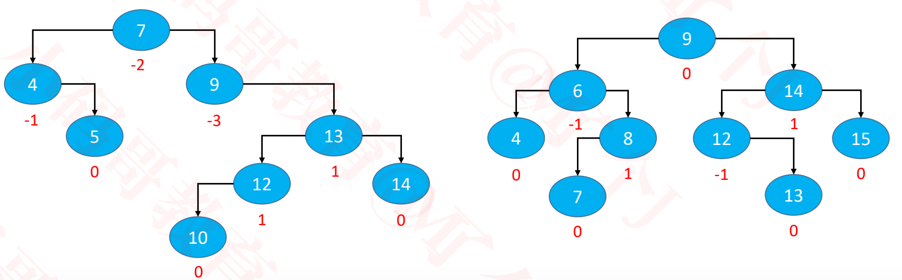
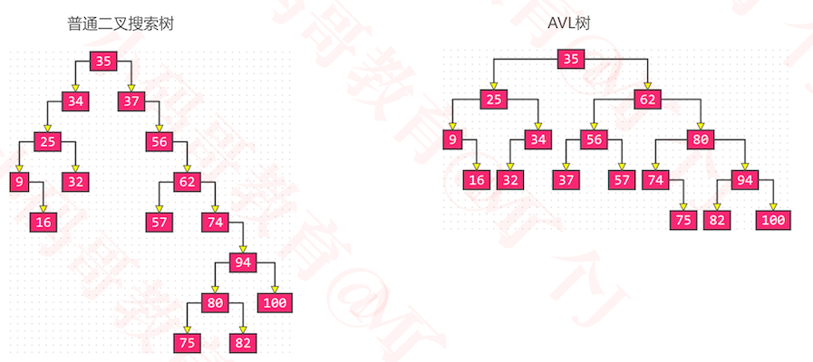
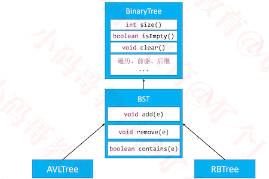
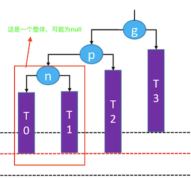
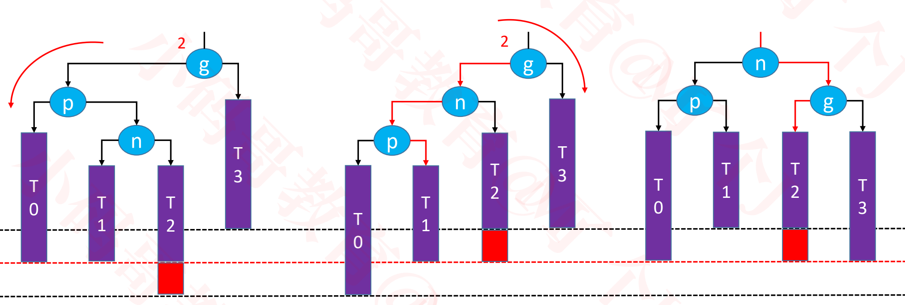
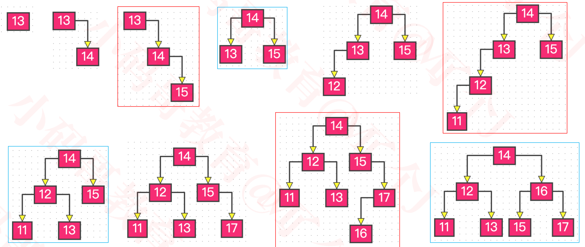
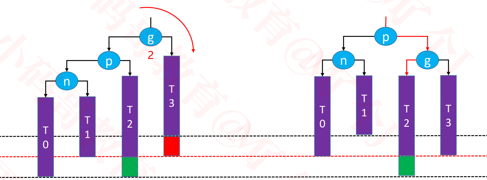
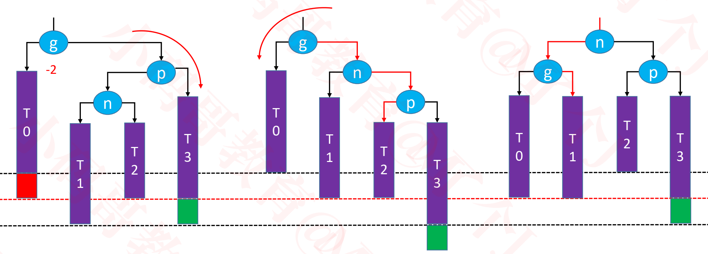

### 基本概念

+ AVL树是最早发明的自平衡二叉搜索树之一
+ AVL 取名于两位发明者的名字
  - G. M. **A**delson-**V**elsky 和 E. M. **L**andis（来自苏联的科学家）

+ Something interesting

  - 有人把AVL树念做“艾薇儿树”
  - 加拿大女歌手，几首不错的歌：《Complicated》、《When You're Gone》、《Innocence》

+ 平衡因子（Balance Factor）：某结点的左右子树的高度差

+  AVL树的特点

  - 每个节点的平衡因子只可能是 1、0、-1（绝对值 ≤ 1，如果超过 1，称之为“失衡”）
  - 每个节点的左右子树高度差不超过 1
  - 搜索、添加、删除的时间复杂度是 O(logn)

  

### 平衡对比

+ 输入数据：35, 37, 34, 56, 25, 62, 57, 9, 74, 32, 94, 80, 75, 100, 16, 82

  

+ AVL树比普通的二叉搜索树平衡多了

### 简单的继承结构



+ AVL继承BST

  ````java
  import java.util.Comparator;
  
  public class AVLTree<E> extends BST<E> {
    
    //默认只有无参构造器
  	public AVLTree() {
  		this(null);
  	}
    
  	public AVLTree(Comparator<E> comparator) {
  		super(comparator);
  	}
    
    ....
    ....
  }
  ````

### 添加导致的失衡

+ 示例：往下面这棵子树中添加 13

+ 最坏情况：可能会导致所有祖先节点都失衡

  ```
  添加了13，导致14, 15,9都失衡了
  
  因为添加的节点只会影响其祖先节点的左右子树的高度，所以可能导致所有祖先节点失衡
  ```

+ 父节点、非祖先节点，都不可能失衡

  ```
  父节点不可能失衡?
  因为父节点原本是平衡的。此时父节点要么为叶子节点，添加节点后，平衡因子为1或-1
  要么只有左子节点或右子节点。添加上该结点后，平衡因子为0。
  
  非祖先节点不可能失衡？
  因为非祖先节点的左右子树的高度并没有发生变化
  ```

  

+ 可通过旋转使其恢复平衡 

###  LL-右旋转(单旋)

+ 把一个结点A添加到二叉搜索树中，添加完成后，A肯定被添加到某个节点上。那么该节点是

  + 只有一个子节点的节点， 且添加后变成该结点变成有2个子节点，此时以该结点为根节点的这棵树高度不变，不会导致其父系节点失衡
  + 或是叶子节点,添加后该结点的高度添加1，**只有这种情况可能会导致不平衡**

+ 当添加了一个结点后，如果会发生失衡，那么其祖父节点必然有一个失衡，我们把最近失衡的祖父节点抽象为`g`节点。`g`在添加节点之前平衡因子必然为1或-1

+ 距离最近的失衡祖父节点此时必然有一个结点的平衡因子为1或-1。我们把该结点抽象为`p`节点，因此该p节点在添加之前一定是平衡因子为0的节点。

+ 我们把p节点一下的部分抽象为以`n`为根节点的树。因为添加完节点后，以n为根节点的树的高度增加1。所以以n为根节点的树在添加之前必然左右子树高度相等，平衡因子为0。

+ 因此可以抽象成`n, p, g`模型,其中LL情况如下

  

  + 我们这里的T0, T1, T2, T3 表示自身平衡的子树或空树

+ LL含义: left-left，失衡节点g的left子节点p的left子树的高度增加1，导致节点失衡

+ 当添加节点后，通过右旋转达到平衡

  

  + 特殊情况, 添加新节点后n子树只有一个结点的情况

    

  + 旋转操作

    + g.left = p.right

    + p.right = g

    + 还需要注意维护的内容

      - T2、p、g 的 parent 属性

      - 先后更新 g、p 的高度

        ```
        因为g，p的高度有变化，所以要更新高度
        先更新g的高度，因为此时g是p的子树
        
        为什么不更新n的高度?
        
        因为n是平衡的，当循环判断是否平衡时已经更新过高度了。
        g,p高度也向n一样更新过了，但是g,p旋转了，高度变化了，所以要再次更新g,p的高度
        ```

        

    + 让p成为这棵子树的的根节点

    + 添加前的子树，添加并旋转后的子树的高度不变，所以g以上的可能失衡的祖先节点都平衡了。

    + 最后仍然是一棵二叉搜索树 T0 < n < T1 < p < T2 < g < T3

    + 整棵树都达到平衡

  + 为什么通过上述旋转能达到平衡?

    ```
    当一棵树是平衡的时候， 如果添加一个节点导致其祖先节点失衡，那么最近失衡节点的因子为2或-2。我们需要把最先失衡的节点g的较高子树的高度降低1，此时最先失衡的节点g变平衡了
    
    如果要使可能失衡的其他祖先的也平衡。那么添加节点前后，以g为根节点的子树的高度与调整后的子树的高度必须相等。
    ```

  + 上图的操作过程解析

    ```
    添加节点后，当g节点失衡时，此时平衡因子为2，需要g的左子树高度降低1。 g.left = p.right,
    达到了将g的左子树高度降低1的目的。因此此时g节点达到平衡。
    
    让p.right = g, 并让p成为这棵子树的根节点，p树本身也是平衡的。此时p节点高度与原来相比已经升高1。整体子树的高度不变，因此所有的祖先节点都平衡。
    ```

    

### RR-左旋转(单旋)

+ 关于旋转的操作的理解与LL是一样的

+ RR含义: right-right，失衡节点g的right子节点p的right子树的高度增加1，导致节点失衡

+ 当添加节点后，通过右旋转达到平衡

  

  + 旋转操作
    - g.right = p.left
    - p.left = g
    - 还需要注意维护的内容
      - T1、p、g 的 parent 属性
      - 先后更新 g、p 的高度
    - 让p成为这棵子树的根节点
    - 仍然是一棵二叉搜索树：T0 < g < T1 < p < T2 < n < T3
    - 整棵树都达到平衡

### LR – RR左旋转，LL右旋转（双旋）

+ 当添加节点后，通过先左旋转，后右旋转达到平衡

  - 先左旋转p，后右旋转g

  

### RL – LL右旋转，RR左旋转（双旋）

+ 当添加节点后，通过先右旋转，后左旋转达到平衡

  - 先右旋转p，后左旋转g

    

### afterAdd

+ AVL继承于BST， 当添加了节点之后，在afterAdd方法里进行恢复平衡操作

+ 此时BST和AVL的结构

  ```java
  public class BST<E> extends BinaryTree<E> {
    
      public void add(E element) {
        //BST的原来的添加逻辑
        ...
        ...
        //新添加节点之后的处理
        afterAdd(newNode);
      }
    
      /**
  	   * 添加node之后的调整,由子类实现具体的逻辑
  	   * @param node 新添加的节点
  	   */
  	  protected void afterAdd(Node<E> node) { }
  }
  
  public class AVLTree<E> extends BST<E> {
    ...
    ...
    //在AVLTree中进行平衡的操作
    @Override
  	protected void afterAdd(Node<E> node) {
      //找到最近的不平衡的祖先节点
  		while ((node = node.parent) != null) {
  			if (isBalanced(node)) {//对于平衡的节点更新其高度
  				// 更新高度
  				updateHeight(node);
  			} else {//不平衡的节点
  				// 恢复平衡后，直接跳出循环
  				rebalance(node);
  				// 整棵树恢复平衡
  				break;
  			}
  		}
  	}
    ...
    ...  
  }
  
  ```

### 计算平衡因子


+ 在节点中保存当前节点的高度，通过左右子节点的差值，计算当前节点的平衡因子

+ 因为height是用来计算平衡因子的，所以height应该保存到AVL树的AVLNode节点中，而不是保存在BST的节点中

+ 因此代码实现如下

  ```java
  public class AVLTree<E> extends BST<E> {
    ...
    ...
    //重写子类的createNode方法
    //父类的createNode返回Node类型
    @Override
    protected Node<E> createNode(E element, Node<E> parent) {
      return new AVLNode<>(element, parent);
    }
    
    //判断该结点是否平衡
    private boolean isBalanced(Node<E> node) {
  		return Math.abs(((AVLNode<E>)node).balanceFactor()) <= 1;
  	}
    //
    private static class AVLNode<E> extends Node<E> {
      //新添加的节点默认高度为1
  		int height = 1;
  		public AVLNode(E element, Node<E> parent) {
  			super(element, parent);
  		}
      //该结点的平衡因子
  		public int balanceFactor() {
  			int leftHeight = left == null ? 0 : ((AVLNode<E>)left).height;
  			int rightHeight = right == null ? 0 : ((AVLNode<E>)right).height;
  			return leftHeight - rightHeight;
  		}
      ...
      ...
    }
    
  }
  ```

### 更新高度

+ 为什么不采用递归的方式更新高度，因为性能太差了

+ 在afterAdd中更新高度。当每次添加后，如果树是平衡的就更新该结点和其所有祖先节点。如果祖先节点有不平衡的，那么先调整最近祖先节点，并跳出循环。其他祖先节点同时也就平衡了。

  ```java
  protected void afterAdd(Node<E> node) {
      //找到最近的不平衡的祖先节点
  		while ((node = node.parent) != null) {
  			if (isBalanced(node)) {//对于平衡的节点更新其高度
  				// 更新高度
  				updateHeight(node);
  			} else {//不平衡的节点
  				// 恢复平衡
  				rebalance(node);
  				// 整棵树恢复平衡
  				break;
  			}
  		}
  	}
  ```

  ```java
  public class AVLTree<E> extends BST<E> {
    ...
    ...
    //重写子类的createNode方法
    //父类的createNode返回Node类型
    @Override
    protected Node<E> createNode(E element, Node<E> parent) {
      return new AVLNode<>(element, parent);
    }
    //更新高度
    private void updateHeight(Node<E> node) {
  		((AVLNode<E>)node).updateHeight();
  	}
    private static class AVLNode<E> extends Node<E> {
      //更新高度
      public void updateHeight() {
        int leftHeight = left == null ? 0 : ((AVLNode<E>)left).height;
        int rightHeight = right == null ? 0 : ((AVLNode<E>)right).height;
        height = 1 + Math.max(leftHeight, rightHeight);
      }
      ...
      ...
    } 
  }
  ```

### 恢复平衡

```java
 /**
	 * 恢复平衡
	 * @param grand 高度最低的那个不平衡节点
	 */
	@SuppressWarnings("unused")
	private void rebalance(Node<E> grand) {
    //获取g那个较高的子节点，即为p
		Node<E> parent = ((AVLNode<E>)grand).tallerChild();
    //p以下较高的子节点，即为以n为根节点的子树
		Node<E> node = ((AVLNode<E>)parent).tallerChild();
		if (parent.isLeftChild()) { // L
			if (node.isLeftChild()) { // LL
				rotateRight(grand);// 对g进行右旋转
			} else { // LR
				rotateLeft(parent);//对p进行左旋转
				rotateRight(grand);//对g进行进旋转
			}
		} else { // R
			if (node.isLeftChild()) { // RL
				rotateRight(parent);//对p进行右旋转
				rotateLeft(grand);//对g进行左旋转
			} else { // RR
				rotateLeft(grand);//g进行左旋转
			}
		}
	}
//对g向左旋转 RR
private void rotateLeft(Node<E> grand) {
		Node<E> parent = grand.right;
		Node<E> child = parent.left;
		grand.right = child;
		parent.left = grand;
		afterRotate(grand, parent, child);
	}
//对g向右旋转 LL
private void rotateRight(Node<E> grand) {
		Node<E> parent = grand.left;
		Node<E> child = parent.right;
		grand.left = child;
		parent.right = grand;
		afterRotate(grand, parent, child);
	}
	
private void afterRotate(Node<E> grand, Node<E> parent, Node<E> child) {
		// 让parent称为子树的根节点
		parent.parent = grand.parent;
		if (grand.isLeftChild()) {
			grand.parent.left = parent;
		} else if (grand.isRightChild()) {
			grand.parent.right = parent;
		} else { // grand是root节点
			root = parent;
		}
		// 更新child的parent
		if (child != null) {
			child.parent = grand;
		}

    // 更新grand的parent
		grand.parent = parent;
		
		// 更新高度
		updateHeight(grand);
		updateHeight(parent);
	}

private static class AVLNode<E> extends Node<E> {
		int height = 1;
		
		public AVLNode(E element, Node<E> parent) {
			super(element, parent);
		}
		
		//较高的子节点
		public Node<E> tallerChild() {
			int leftHeight = left == null ? 0 : ((AVLNode<E>)left).height;
			int rightHeight = right == null ? 0 : ((AVLNode<E>)right).height;
      
			if (leftHeight > rightHeight) return left;
			if (leftHeight < rightHeight) return right;
      //如果当前节点时父节点的左子节点，就返回当前节点的左节点
      //如果当前节点时父节点的右子节点，就返回当前节点的右节点
			return isLeftChild() ? left : right;
		}
	}
```

### 示例

+ 输入数据13, 14, 15, 12, 11, 17, 16, 8 , 9, 1, 其调整平衡的过程为

  

  


### 统一旋转操作


+ 最终平衡后结构是一样的，d成为整棵子树的根节点
+ d前面的3个构成左子树，并且中间的节点b为左子树的根节点
+ d后面的3个构成右子树，并且中间的节点f为右子树的根节点
+ a,g两条线并没有调整

+ 新的恢复平衡的代码

  ```java
  /**
  	 * 恢复平衡
  	 * @param grand 高度最低的那个不平衡节点
  	 */
  	private void rebalance(Node<E> grand) {
  		Node<E> parent = ((AVLNode<E>)grand).tallerChild();
  		Node<E> node = ((AVLNode<E>)parent).tallerChild();
  		if (parent.isLeftChild()) { // L
  			if (node.isLeftChild()) { // LL
  				rotate(grand, node, node.right, parent, parent.right, grand);
  			} else { // LR
  				rotate(grand, parent, node.left, node, node.right, grand);
  			}
  		} else { // R
  			if (node.isLeftChild()) { // RL
  				rotate(grand, grand, node.left, node, node.right, parent);
  			} else { // RR
  				rotate(grand, grand, parent.left, parent, node.left, node);
  			}
  		}
  	}
  
  //传入原来的根节点,以便让d称为新的根节点
  private void rotate(
  			Node<E> r, // 子树的根节点
  			Node<E> b, Node<E> c,
  			Node<E> d,
  			Node<E> e, Node<E> f) {
  		// 让d成为这棵子树的根节点
  		d.parent = r.parent;
      //如果原来的根节点是左子节点，那么d也作为左子节点
  		if (r.isLeftChild()) {
  			r.parent.left = d;
  		} else if (r.isRightChild()) {
       //如果原来的根节点是右子节点，那么d也作为右子节点
  			r.parent.right = d;
  		} else {
        //此时d是整个树的根节点
  			root = d;
  		}
  		
  		//b-c
  		b.right = c;
  		if (c != null) {
  			c.parent = b;
  		}
      //b的右子树变化，更新b的高度
  		updateHeight(b);
  		
  		// e-f
  		f.left = e;
  		if (e != null) {
  			e.parent = f;
  		}
      //f的左子树变化，更新f的高度
  		updateHeight(f);
  		
  		// b-d-f
  		d.left = b;
  		d.right = f;
  		b.parent = d;
  		f.parent = d;
      //d的左,右子树变化，更新d的高度
  		updateHeight(d);
  	}
  ```

### 删除导致的失衡

+ 示例：删除子树中的16

+ 可能会导致父节点或祖先节点失衡(只有1个节点会失衡)，其他节点都不可能失衡

  - 如果是父节点失衡，那么失衡后，父节点的高度不会改变，所以其上的所有祖先节点不会失衡

    

  - 如果是祖先节点失衡，那么失衡后，祖先节点的高度不会改变，所以其上的所有祖先节点不会失衡

    

  


### 删除后的平衡方案

+ 删除后，通过旋转来达到重新平衡

#### LL – 右旋转（单旋）

+  如果绿色节点不存在，更高层的祖先节点可能也会失衡，需要再次恢复平衡，然后又可能导致更高层的祖先节点失衡...

  ```
  如果没有绿色的节点，可以知道平衡前的树和平衡后的树的高度不一样，这可能导致更高层的祖先节点失衡
  ```

  

+ 极端情况下，所有祖先节点都需要进行恢复平衡的操作，共 O(logn) 次调整

  

#### RR – 左旋转（单旋）


#### LR – RR左旋转，LL右旋转（双旋）


#### RL – LL右旋转，RR左旋转（双旋）



### afterRemove

+ AVL继承于BST， 当删除节点之后，在afterRemove方法里进行恢复平衡操作

+ 此时BST和AVL的结构

  ```java
  public class BST<E> extends BinaryTree<E> {
     ...
     ...
     ...
     private void remove(Node<E> node) {
  		if (node == null) return;
  		
  		size--;
  		
      // 度为2的节点, 当删除度为2的节点时，真正被删除的是该结点的前驱或后继节点
  		if (node.hasTwoChildren()) { 
  			// 找到后继节点
  			Node<E> s = successor(node);
  			// 用后继节点的值覆盖度为2的节点的值
  			node.element = s.element;
  			// 删除后继节点
  			node = s;
  		}
  		
  		// 删除node节点（node的度必然是1或者0）
  		Node<E> replacement = node.left != null ? node.left : node.right;
  		
  		if (replacement != null) { // node是度为1的节点
  			// 更改parent
  			replacement.parent = node.parent;
  			// 更改parent的left、right的指向
  			if (node.parent == null) { // node是度为1的节点并且是根节点
  				root = replacement;
  			} else if (node == node.parent.left) {
  				node.parent.left = replacement;
  			} else { // node == node.parent.right
  				node.parent.right = replacement;
  			}
  			
  			// node是真正被删除的节点, 删除节点之后的处理,对执行完删除的树恢复平衡
  			afterRemove(node);
  		} else if (node.parent == null) { // node是叶子节点并且是根节点
  			root = null;
  			// node是真正被删除的节点, 删除节点之后的处理,对执行完删除的树恢复平衡
  			afterRemove(node);
  		} else { // node是叶子节点，但不是根节点
  			if (node == node.parent.left) {
  				node.parent.left = null;
  			} else { // node == node.parent.right
  				node.parent.right = null;
  			}
  			// node是真正被删除的节点, 删除节点之后的处理,对执行完删除的树恢复平衡
  			afterRemove(node);
  		}
  	}
    
    /**
  	 * 删除node之后的调整，由子类实现具体逻辑
  	 * @param node 被删除的节点
  	 */
  	protected void afterRemove(Node<E> node) { }
  }
  
  
  public class AVLTree<E> extends BST<E> {
    ...
    ...
    @Override
  	protected void afterRemove(Node<E> node) {
  		while ((node = node.parent) != null) {
  			if (isBalanced(node)) {
  				// 更新高度
  				updateHeight(node);
  			} else {
  				// 恢复平衡,不跳出循环，以防止恢复平衡后，又造成更高层的祖先不平衡。所以要一直向上遍历恢复平衡
  				rebalance(node);
  			}
  		}
  	}  
  }
  
  
  ```

### 总结

+ 添加

  - 可能会导致所有祖先节点都失衡

  - 只要让高度最低的失衡节点恢复平衡，整棵树就恢复平衡【仅需 O(1) 次调整】

    ```
    1. 寻找找到失衡节点，最多需要找logn次
    2. 找到失衡节点后， 只需要调整一个失衡节点，因此仅需 O(1) 次调整
    ```

+ 删除

  - 可能会导致父节点或祖先节点失衡（只有1个节点会失衡）

  - 恢复平衡后，可能会导致更高层的祖先节点失衡【最多需要 O(logn) 次调整】

    ```
    1. 寻找找到失衡节点，需要找logn次
    2. 最多有logn个祖先节点，所以最多需要 O(logn) 次调整
    ```

+ 平均时间复杂度

  - 搜索：O(logn)
  - 添加：O(logn)，仅需 O(1) 次的旋转操作
  - 删除：O(logn)，最多需要 O(logn) 次的旋转操作

### 作业
◼ 平衡二叉树：https://leetcode-cn.com/problems/balanced-binary-tree/