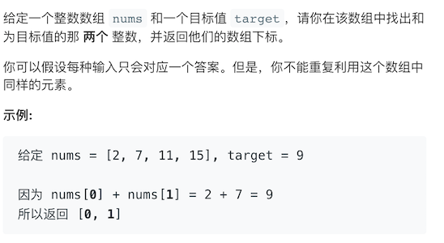

## 精选top面试题

### 1-1-两数之和

+ https://leetcode-cn.com/problems/two-sum/



+ 代码实现

  ```java
  class Solution {
      public int[] twoSum(int[] nums, int target) {
          Map<Integer, Integer> map = new HashMap<>();
          for(int i = 0 ; i < nums.length; i++) {
              int tmp = target - nums[i];
              if (map.containsKey(tmp)) {
                  return new int[] {map.get(tmp), i};
              }
              map.put(nums[i],i);
          }
          return new int[] {-1, -1};
      }
  }
  ```

### 2-5 最长回文字串

+ https://leetcode-cn.com/problems/longest-palindromic-substring

  