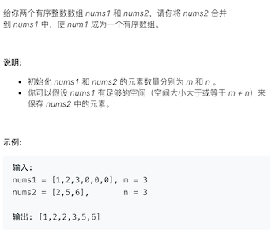
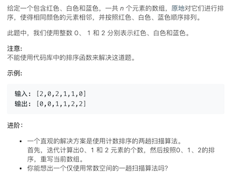
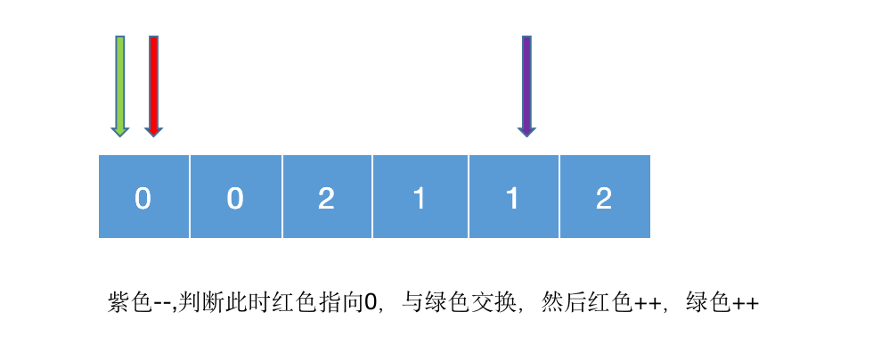
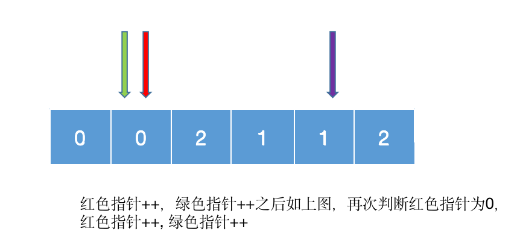
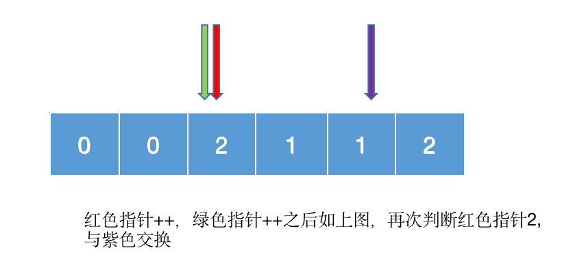
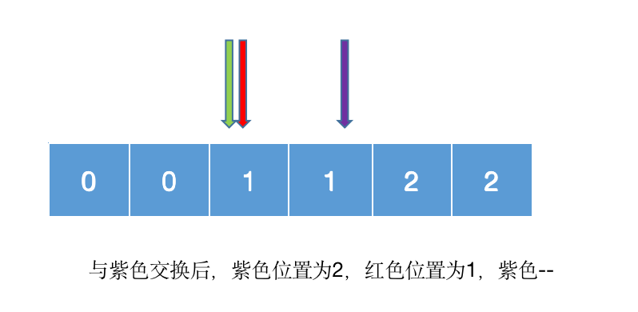
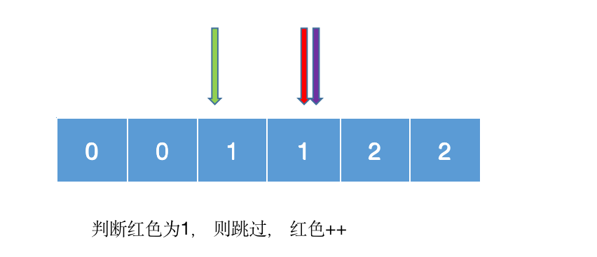
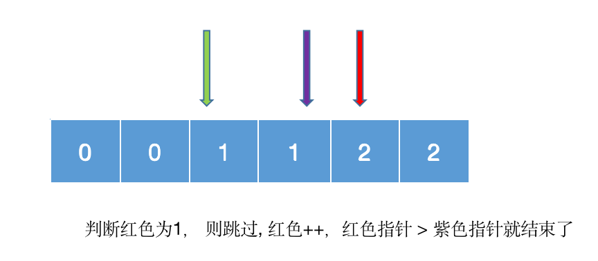
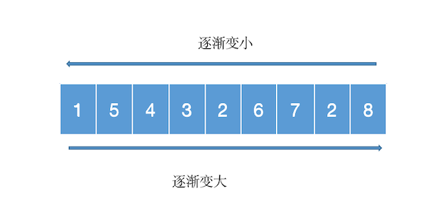

## 数组_排序

### 88-合并两个有序数组

+ https://leetcode-cn.com/problems/merge-sorted-array/



+ 思路
  + 两个数组都是有序数组，所以我们从后往前比，选出最大值
  + 采用三个变量来保存元素索引
    - i1先指向nums1的最后一个元素,即i1 = m -1
    -  i2先指向nums2的最后一个元素,即 i2 = n -1
    - 先比较末尾选出最大值，因此cur = m + n -1
  + 当nums2[i2] < nums1[i1],将此时nums1中对应的值放在cur位置
    -  nums1[cur--] = nums1[i1--];
  + 当nums2[i1] >= nums1[i1], 将此时nums2中对应的值放在cur位置
    - nums1[cur--] = nums1[i2--];
  + 如果i2提前退出，则表明num2已经完全放到num1中，数组已经完全有序
  + 如果i1提前退出，则num2中剩余的值都是较小的值，依次放到num1中即可。 
    - nums1[cur--] = nums1[i2--]

+ 代码实现

  ```java
  public void merge(int[] nums1, int m , int[] nums2, int n) {
  		int i1 = m -1; //指向nums1的最后一个元素
  		int i2 = n -1; //指向nums2的最后一个元素
  		int cur = m + n -1; //最终nums1中有效的元素长度
  		while (i2 >= 0) {
  			if (i1 >=0 && nums2[i2] < nums1[i1] ) {
  				nums1[cur--] = nums1[i1--];
  			} else { // i1 < 0 || nums2[i2] >= nums1[i1] 
  				nums1[cur--] = nums2[i2--];
  			}
  		}
  	}
  ```

  


### 75-颜色分类

+ https://leetcode-cn.com/problems/sort-colors/

  

+ 这种要求扫描一趟就解决问题的一般要使用双指针或三指针

+ 思路

  ```
  红色指针用来进行扫描
  绿色指针用来进行指向0
  紫色指针用来进行指向2
  
  红色指针扫描
  遇到1: 跳过,红色++
  遇到0: 跟绿色指针交换值，绿色指针++,红色指针++
  遇到2: 跟紫色指针交换值, 紫色指针--, 再次对红色指针的值进行判断
  
  当红色指针 > 紫色指针就结束了
  ```

+ 图解

  

  

  

  

  

  

  

+ 代码实现

  ```java
  public void sortColors(int[] nums) {
      //红色指针
  		int i = 0;
      //绿色指针
  		int l = 0;
      //紫色指针
  		int r = nums.length -1;
  		while (i <= r) { 红色指针 <= 紫色指针 
  			int v = nums[i];
  			if (v == 0) {
  				swap(nums, i++, l++);
  			} else if (v == 1) {
  				i++;
  			} else {
  				swap(nums, i, r--);
  			}
  		}
     }
  	
  	private void swap(int[] nums, int i, int j) {
  		int tmp = nums[i];
  		nums[i] = nums[j];
  		nums[j] = tmp;
  	}
  ```

### 16.16. 部分排序

+ https://leetcode-cn.com/problems/sub-sort-lcci/

  

+ 思路

  - 关键在于寻找逆序对

  - 从左到右，理论上是逐渐变大的，那么找到最后一个逆序对，逆序对的最后一个元素的位置，即为最右位置

    ```
    最右位置后的所有元素:从左到右看，一定是升序的，且大于前面所有的元素
    ```

  - 从右到左，理论上是逐渐减小的，那么找到最后一个逆序对，逆序对的第一个元素的位置，即为最左位置

    ```
    最左位置前的元素:从右往左看，一定是降序的，且小于其后面所有的元素
    ```

+ 怎么找最右位置，最左位置?

  

  + 最右位置

    ```
    扫描1， 最大值为1
    扫描5， 与最大值1相比，大于最大值，则最大值变为5
    扫描4， 与最大值5相比，小于最大值，则当前最右位置为2
    
    扫描3， 与最大值5相比，小于最大值，则当前最右位置为3
    扫描2， 与最大值5相比，小于最大值，则当前最右位置为4
    扫描6， 与最大值5相比，大于最大值，则最大值变为6
    扫描7， 与最大值6相比，大于最大值，则最大值变为7
    扫描2， 与最大值7相比，小于最大值，则当前最右位置为7
    扫描8， 与最大值7相比，大于最大值，则最大值变为8
    继续扫描，发现数组结束，结束扫描。 得到最右位置为7
    
    总结:
    扫描的值 >= 最大值, 则更新最大值
    扫描的值 < 最大值, 则更新最右位置
    ```

  + 最左位置

    ```
    扫描8， 最小值为8
    扫描2， 与最小值8相比，小于最小值，则最小值变为2
    扫描7， 与最小值2相比，大于最小值，则当前最左位置为6
    
    扫描6， 与最小值2相比，大于最小值，则当前最左位置为5
    扫描2， 与最小值2相比，等于最小值，则跳过, 最小值仍为2，最左位置不变
    扫描3， 与最小值2相比，大于最小值，则当前最左位置为3
    扫描4， 与最小值2相比，大于最小值，则当前最左位置为2
    扫描5， 与最小值2相比，大于最小值，则当前最左位置为1
    扫描1， 与最小值2相比，小于最大值，则最小值变为1
    继续扫描，发现数组结束，结束扫描。 得到最左位置为1
    
    为什么要跳过，防止其此时6前面的值已经构成了升序
    如果此时没有跳过2，那么此时得到范围就是 【2， 6， 7， 2】，明显不是最小的序列
    
    总结:
    扫描的值 <= 最小值, 则更新最小值
    扫描的值 > 最小值, 则更新最左位置
    ```

+ 代码实现

  ```java
  public int [] subSort(int[] nums) {
  		if (nums.length == 0) {
  			return new int[] {-1, -1};
  		}
  		//从左扫描到右寻找逆序对(正序:逐渐变大)
  		int max = nums[0];
  		//用来记录最右的那个逆序对位置
  		int r = -1;
  		for(int i = 1; i < nums.length; i++) {
  			int v = nums[i];
  			if (v >= max) {
  				max = v;
  			} else {
  				r = i;
  			}
  		}
    
      if (r == -1) return new int[] {-1, -1}; 
  		
  		//从右扫描到左寻找逆序对(正序:逐渐变小)
  		int min = nums[nums.length -1];
  		//用来记录最左的那个逆序对位置
  		int l = -1;
  		for(int i = nums.length -2; i >=0; i--) {
  			int v = nums[i];
  			if (v <= min) {
  				min = v;
  			} else {
  				l = i;
  			}
  		}		
  		return new int[] {l, r};
  	}
  ```

  + 时间复杂度为O(n)


### 作业

+ 有序数组的平方: https://leetcode-cn.com/problems/squares-of-a-sorted-array/
+ 最大间距: https://leetcode-cn.com/problems/maximum-gap/