## 链表

### 说明

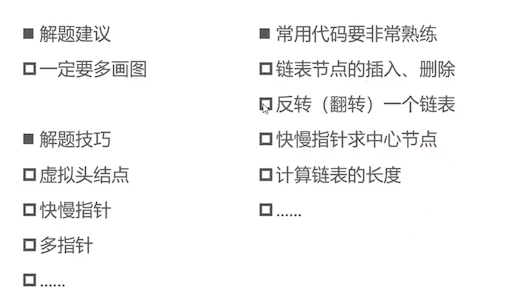

### 203-移除链表中的元素

+ https://leetcode-cn.com/problems/remove-linked-list-elements/

  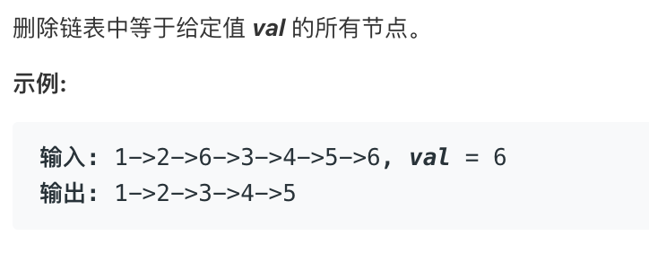

  - 要求时间复杂度为O(n),空间复杂度为O(1)

+ 代码实现

  ```java
  public ListNode removeElements(ListNode head, int val) {
  		if (head == null) {
  			return null;
  		}
  		//head用来扫描链表节点
  		//newHead是新链表头节点
  		//newTail是新链表的最后一个节点
  		ListNode newHead = null;
  		ListNode newTail = null;
  		while (head != null) {
  			if (head.val != val) {
  				if (newHead == null) {
  					newHead = head;
  					newTail = head;
  				} else {
  					newTail.next = head;
  					newTail = head;
  				}
  			} 
  			head = head.next;
  		}
      //所有节点都被删除时
      //链表一定要注意判断node == null或node.next.xx = null的情况
  		if (newTail == null) {
  			return null;
  		} else {
  			newTail.next = null;
  		}
  		return newHead;
    }
  ```

+ 使用虚拟头节点优化逻辑

  ````java
  public ListNode removeElements(ListNode head, int val) {
  		if (head == null) {
  			return null;
  		}
      //增加了虚拟头节点，使代码更加简洁
    
  		//head用来扫描链表节点
  		//newHead是新链表虚拟头节点
  		//newTail是新链表的最后一个节点
  		ListNode newHead = ListNode(0);
  		ListNode newTail = newHead;
  		while (head != null) {
  			if (head.val != val) {
          newTail.next = head;
          newTail = head;
  			} 
  			head = head.next;
  		}
      //newTail一定不为null
  		newTail.next = null;
  		return newHead.next;
    }
  ````

### 160- 相交链表

+ https://leetcode-cn.com/problems/intersection-of-two-linked-lists/

  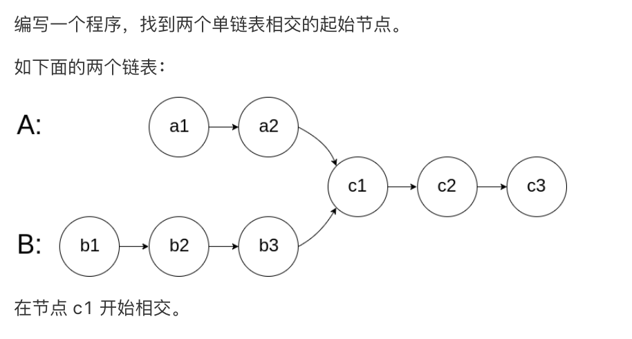

  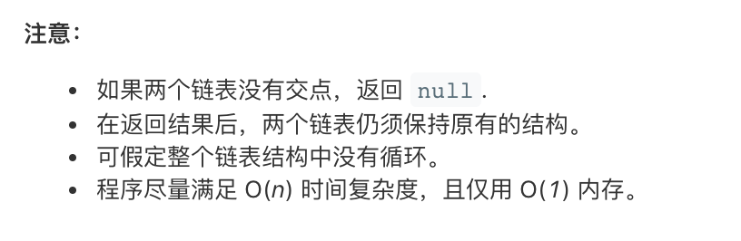

+ 思路

  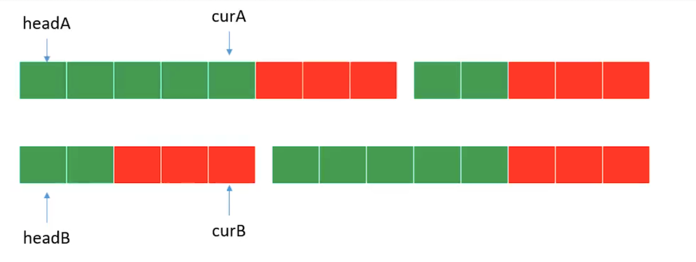

  + headA和headB不动，curA和curB向后移动
  + 当curB指向null时，让它指向headA
  + 当curA指向null时，让它指向headB
  + 这样如上图，它们长度一致了，当curA == curB时，即为相交的节点
  + 如果没有相交的节点，则curA == curB == null

+ 代码实现

  ```java
  public ListNode getIntersectionNode(ListNode headA, ListNode headB) {
  		if (headA == null || headB == null) return null;
  		ListNode curA = headA, curB = headB;
  		while (curA != curB) {
        //curA == null, 当链表A遍历到最后时，curA开始遍历链表B
        //curB == null, 当链表B遍历到最后时，curB开始遍历链表A
  			curA = curA == null ? headB: curA.next;
  			curB = curB == null ? headA: curB.next;					
  		}
      return curA;
  }
  ```


### 86-分隔链表

+ https://leetcode-cn.com/problems/partition-list/

  

  + 时间复杂度为O(n)，空间复杂度为O(1)

+ 思路

  - 如果涉及到把一个链表分割为几部分，并且空间复杂度为O(1)
  - 则把各自的部分先弄成一个独立的链表，然后把各部分链表收尾相连

+ 代码实现

  ```java
  public ListNode partition(ListNode head, int x) {
  	        if (head == null) return null;
            //虚拟头节点
  	        ListNode head1 = new ListNode(0);
  	        ListNode cur1 =  head1;
            //虚拟头节点
  	        ListNode head2 = new ListNode(0);
  	        ListNode cur2 =  head2;
  	        while(head != null) {
  	            if (head.val < x) {
  	                cur1.next = head;
  	                cur1 = head;
  	            } else {
  	                cur2.next = head;
  	                cur2 = head;
  	            }
  	            head = head.next;
  	        }
           //将链表2拼接到链表1后面
  	        cur1.next = head2.next;
  	        //记得将尾结点的next变为null
  	        cur2.next = null;
  	        return head1.next;
  	    }
  ```


### 234-回文链表

+ https://leetcode-cn.com/problems/palindrome-linked-list/

  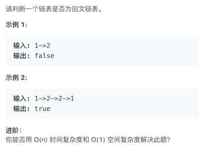

  + 如果要求不能破坏回文链表的结构呢

  

+ 思路

  1. 找到链表的中间节点,即为右半部分链表的头结点的前一个节点

     + 采用快慢指针的思想

  2. 将右半部分链表的链表进行翻转

     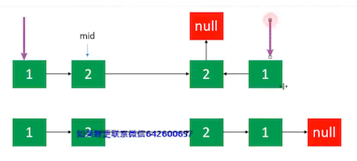

     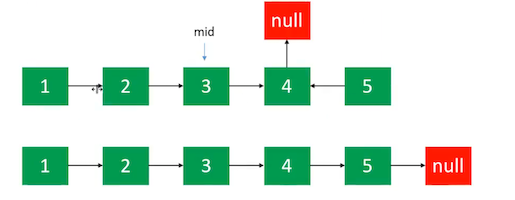

  3. 将左半部分链表和翻转后的右半部分链表进行一一对比，知道右半部分链表节点为null

  4. 最后再将右半部分链表翻转回来

     - 不破坏回文链表的结构

+ 如何通过快慢指针找到中间节点?

  + 链表长度为奇数, fast.next == null时，slow指向中间节点

    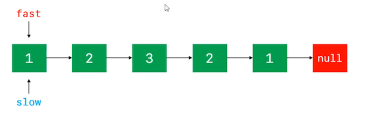

    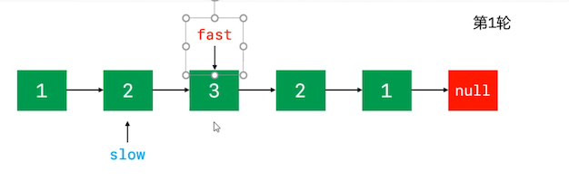

    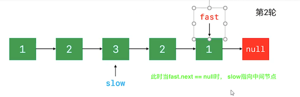

  + 链表长度为偶数, fast.next.next == null时，slow指向中间节点

    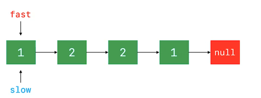

    

    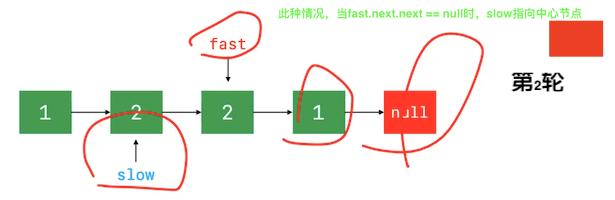

    

+ 代码实现

  ```java
  public boolean isPalindrome(ListNode head) {
  		if (head != null || head.next == null ) return true;
  		if (head.next.next == null) return head.val == head.next.val;
  		//找到中间节点
  		ListNode mid = middleNode(head);
  		//反转右半部分(中间节点的右半部分)
  		ListNode rHead = reverseList(mid.next);
  		ListNode rOldHead = rHead;
  		ListNode lHead = head;
  		boolean result = true;
  		while (rHead != null) {
  			if (lHead != rHead) {
  				result = false;
  				break;
  			}
  			rHead = rHead.next;
  			lHead = lHead.next;
  		}
      //将右半部分链表翻转回来
  		reverseList(rOldHead);
  		return result;
  	}
  	/**
  	 * 找到中间节点 (右半部分链表的头结点的前一个节点)
  	 * 比如 1>2>3>2>1>null中的3是中间节点
  	 * 比如 1>2>2>1>null中的2是中间节点
  	 * @param head
  	 * @return
  	 */
  	
  	private ListNode middleNode(ListNode head) {
  		ListNode fast = head;
  		ListNode slow = head;
  		while (fast.next != null && fast.next.next != null) {
  			slow = slow.next;
  			fast = fast.next.next;
  		}
  		return slow;
  	}
  	/**
  	 * 翻转链表
  	 * @param head 原链表的头节点
  	 * 比如原链表: 1>2>3>4>null。 翻转之后是: 4>3>2>1>null
  	 * @return 翻转之后链表的头节点
  	 */
  	private  ListNode reverseList(ListNode head) {
  		ListNode newHead = null;
  		while (head != null) {
  			ListNode tmp = head.next;
  			head.next  = newHead;
  			newHead = head;
  			head = tmp;
  		}
  		return newHead;
  	}
  ```

  

  