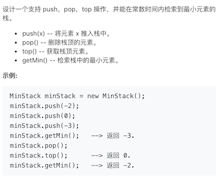
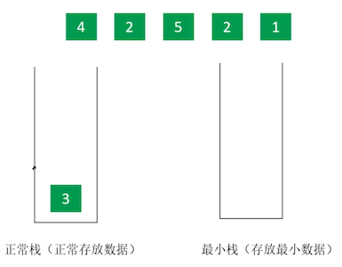
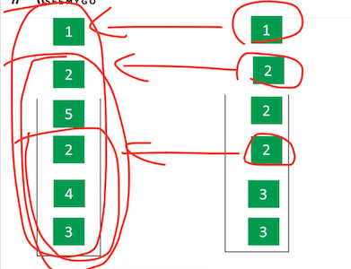
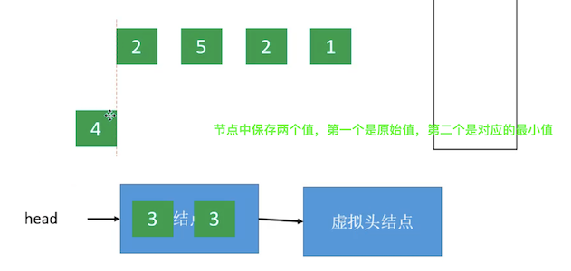
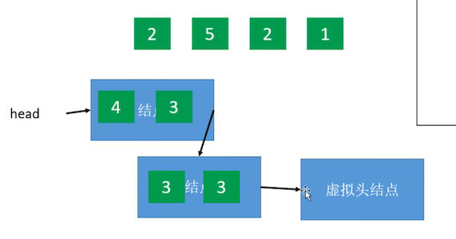
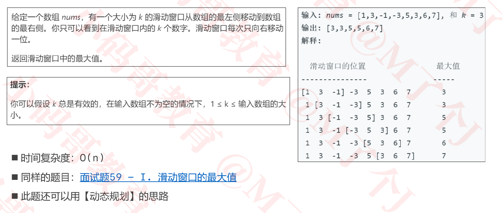
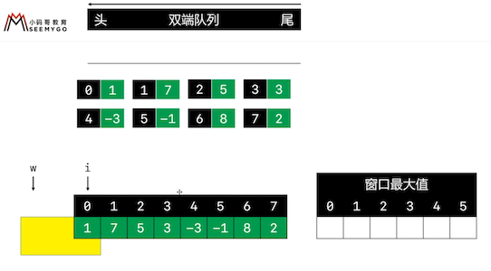

### 栈_队列

### 155. 最小栈

+ https://leetcode-cn.com/problems/min-stack/

  

+ 思路

  - 正常来说，获取getMin获取最小值，时间复杂度为O(n)。要想使getMin()为O(1),则可能牺牲其他方面的性能，例如使用空间换时间

  - 使用两个栈，一个是正常栈，一个是最小栈

  - 如下图所示

    

    

    ```
    正常栈push 3， 此时最小为3，则最小栈push 3。 此时最小栈的栈顶3， 即为正常栈3的最小值
    正常栈push 4， 此时最小为3，则最小栈push 3。 此时最小栈的栈顶3， 即为正常栈4 3的最小值
    正常栈push 2,  此时最小为2，则最小栈push 2。 此时最小栈的栈顶2， 即为正常栈2 4 3的最小值
    正常栈push 5， 此时最小为2，则最小栈push2。 此时最小栈的栈顶2， 即为正常栈5 2 4 3的最小值
    正常栈push 2， 此时最小为2，则最小栈push 2。此时最小栈的栈顶2， 即为正常栈2 5 2 4 3的最小值
    正常栈push 1， 此时最小为1，则最小栈push 1。此时最小栈的栈顶1， 即为正常栈1 2 5 2 4 3的最小值
    ```

+ 代码实现

  ```java
  //这种实现性能比较差
  public class MinStack {
  	//正常栈
  	private Stack<Integer> stack;
  	//最小栈，用来存放最小数据
  	private Stack<Integer> minStack;
  	
  	public MinStack() {
  		stack = new Stack<>();
  		minStack = new Stack<>();		
  	}
  	public void push(int x) {
  		stack.push(x);
  		if (minStack.isEmpty()) {
  			minStack.push(x);
  		} else {
  			//将要放到正常栈中的元素，与当前最小栈的栈顶比较，把较小的存到最小栈中
  			minStack.push(Math.min(x, minStack.peek()));
  		}
  	}
  	public void pop() {
  		stack.pop();
  		minStack.pop();		
  	}
  	public int top() {
  		return stack.peek();
  	}
  	public int getMin() {
  		return minStack.peek();
  	}
  
  }
  ```

  

+ 思路2

  - 使用链表，创建节点，包含
    + val:  当前节点对应的值
    + min: 当前链表的最小值
    + next: 下一个节点

  - 每次新push节点都把新的节点插入到原来的头结点前面,head即存储着最小值和top

    

    

+ 代码实现2

  ```java
  import java.util.Stack;
  
  public class MinStack {
  	private Node head;
  	public MinStack() {
      //虚拟头结点
  		head = new Node(0, Integer.MAX_VALUE, null);
  	}
  	public void push(int x) {
  		head = new Node(x, Math.min(x, head.min), head);
  	}
  	public void pop() {
  		head = head.next;
  	}
  	public int top() {
  		return head.val;
  	}
  	public int getMin() {
  		return head.min;
  	}
  	
  	public static class Node {
  		public int val;
  		public int min;
  		public Node next;
  		public Node(int val, int min, Node next) {
  			this.val = val;
  			this.min = min;
  			this.next = next;
  		}
  	}
  
  }
  
  ```

### 239 - 滑动窗口最大值



+ 思路

  

  + i和w的就是k的首尾，i从0开始扫描元素
  + 双端队列中放的是索引。 上面把索引和值放在一起只是为了便于理解
  + 双端队列的元素需符合从头到尾是逐渐减小的

+ 代码实现

  ```java
  /**
  	 * 1. 如果nums[i] > nums[队尾], 不断删除队尾, 知道nums[队尾] > nums[i]为止
  	 * 2. 将i加入队尾
  	 * 3. 如果 w>=0
  	 *   1> 如果对头失效，就移除对头(如果队头 < w就代表失效)
  	 *   2> 设置w窗口的最大值为nums[队头]
  	 * @param nums
  	 * @param k
  	 * @return
  	 */
  	 public int[] maxSlidingWindow(int[] nums, int k) {
  		 if (nums == null || nums.length == 0 || k < 1)  return new int[] {};
  		 if (k == 1) return nums;
  		 
  		 int[] maxes = new int[nums.length - (k - 1)];
  		 
  		 //peek: 取值(偷偷看一眼)
  		 //poll: 删除(削)
  		 //offer: 添加(入队)
  		 Deque<Integer> deque = new LinkedList<>();
  		 for (int i = 0; i < nums.length; i++) {
  			//只要nums[队尾] <= [i],就删除队尾
  			 while (!deque.isEmpty() && nums[i] >= nums[deque.peekLast()]) {
  				//deque.pollLast();
  				 deque.removeLast();
  			}
  			//将i加到队尾
  			 //deque.offerLast(i);
  			 deque.addLast(i);
  			 
  			 //检查窗口的索引是否合法
  			 int w = i -k + 1;
  			 if (w < 0) continue;
  			 
  			 //检查队头的合法性
  			 if (deque.peekFirst() < w) {
  				 //队头不合法(失效，不在滑动窗口的范围之内)
  				//deque.pollFirst();
  				 deque.removeFirst();
  			}
  			 //设置窗口的最大值
  			 maxes[w] = nums[deque.peekFirst()];
  		}
  		 return maxes;
  	 }
  ```

  