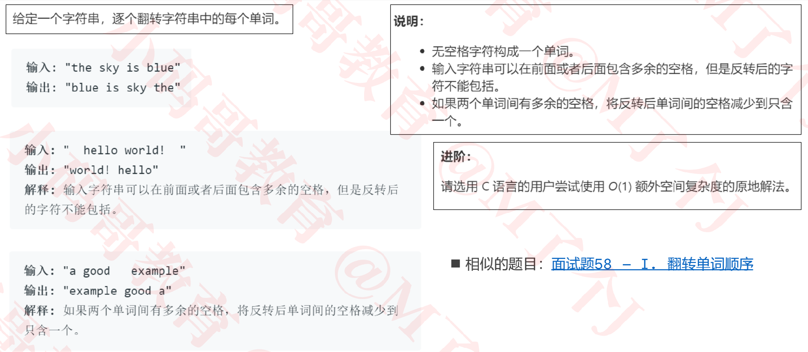
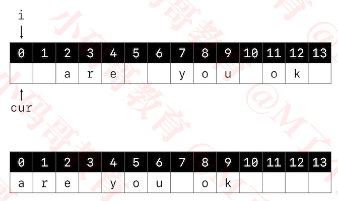
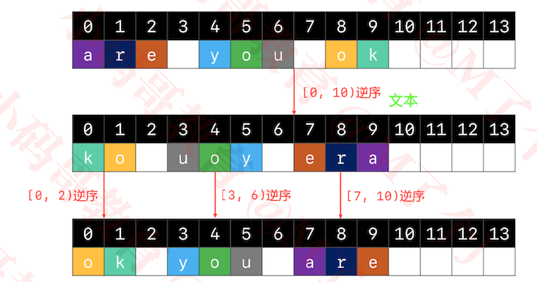
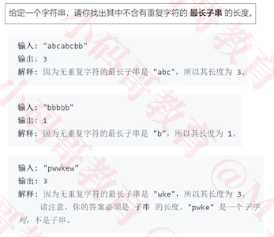
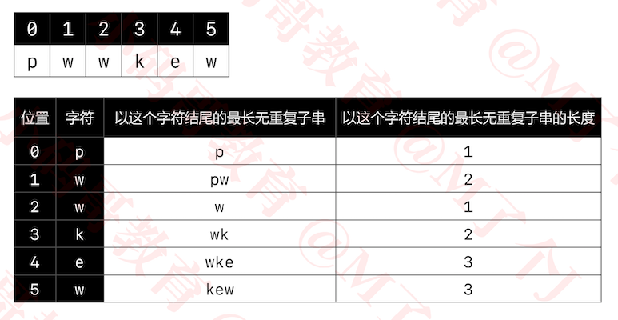
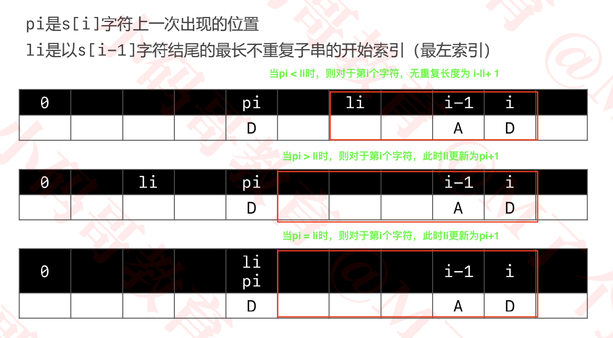

## 字符串

### 151_翻转字符串里的单词

+ https://leetcode-cn.com/problems/reverse-words-in-a-string/




+ 思路

  1. 先消除字符串中的多余空格

     

     + 通过i进行整个字符串的扫描

     + cur指向下一个存放字符的文字

       1. 当i扫描到的是字符时，将字符存放到cur指向的位置， 并将cur++

       2. 当i扫描到的是空格字符时

          - i扫描的前一个字符不是空格时， 则cur位置存放" "，并将cur++

            ```
            当最后一个字符不是空格时，则此时 字符串的有效长度 = cur 
            ```

          - i扫描的前一个字符是空格时，则cur位置不动。

            ```
            当最后一个字符是空格时，则此时  字符串的有效长度 = cur - 1
            ```

       3. 直到整个字符串扫描完成

  2. 此时的字符串， 指定范围的字符串逆序

     

     1. 先将整个有效字符串逆序
     2. 再将每个单词逆序即可

+ 代码实现

  ```java
  public class _151_翻转字符串里的单词 {
      public static String reverseWords(String s) {
      	if (s == null) return "";
      	char[] chars = s.toCharArray();
      	// 消除多余的空格
      	// 字符串最终的有效长度
      	int len = 0;
      	// 当前用来存放字符的位置
      	int cur = 0;
      	// 前一个字符是否为空格字符
      	boolean space = true;//默认为true，防止开头是空格字符串
      	for (int i = 0; i < chars.length; i++) {
  			if (chars[i] != ' ') { // chars[i]是非空格字符
  				chars[cur++] = chars[i];
  				space = false;
  			} else if (space == false) { // chars[i]是空格字符，chars[i - 1]是非空格字符
  				chars[cur++] = ' ';
  				space = true;
  			}
  		}
      	len = space ? (cur - 1) :cur;
      	if (len <= 0) return "";
  
      	// 对整一个有效字符串进行逆序
      	reverse(chars, 0, len);
      	
      	// 对每一个单词进行逆序
      	// 前一个空格字符的位置（有-1位置有个假想的哨兵，就是一个假想的空格字符）
      	int prevSapceIdx = -1; 
      	for (int i = 0; i < len; i++) {
  			if (chars[i] != ' ') continue;
  			// i是空格字符的位置
  			reverse(chars, prevSapceIdx + 1, i);
  			prevSapceIdx = i;
  		}
      	// 翻转最后一个单词
      	reverse(chars, prevSapceIdx + 1, len);
        //将字符数组chars转换成字符串
      	return new String(chars, 0, len);
      }
      
      /**
       * 将[li, ri)范围内的字符串进行逆序
       */
      private static void reverse(char[] chars, int li, int ri) {
      	ri--;
      	while (li < ri) {
      		char tmp = chars[li];
      		chars[li] = chars[ri];
      		chars[ri] = tmp;
      		li++;
      		ri--;
      	}
      }
      
      public static void main(String[] args) {
  		System.out.println("666_" + reverseWords("") + "_666");
  		System.out.println("666_" + reverseWords("  hello world!     ") + "_666");
  		System.out.println("666_" + reverseWords("a good   example") + "_666");
  		System.out.println("666_" + reverseWords("are you ok") + "_666");
  	}
  }
  ```


### 3_无重复字符的最长字串

+ https://leetcode-cn.com/problems/longest-substring-without-repeating-characters/

  

+ 思路

  1. 遍历整个字符串分析，对每个字符，求以其结尾的无重复字符的最长字串

     

  2. 对于以第i字符结尾的无重复字符的最长字串， 其跟以第i-1字符结尾的无重复字符的最长字串的关系如下

     

  3. 比较**以每个字符为结尾**得到的最长无重复字串的长度的**最大值**， 即**为整个字符串**的无重复字符的最长字串的长度

+ 代码实现

  ```java
  public class _3_无重复字符的最长子串 {
      public int lengthOfLongestSubstring(String s) {
      	if (s == null) return 0;
      	char[] chars = s.toCharArray();
      	if (chars.length == 0) return 0;
      	
      	// 用来保存每一个字符上一次出现的位置
      	int[] prevIdxes = new int[128];
      	for (int i = 0; i < prevIdxes.length; i++) {
  			prevIdxes[i] = -1;
  		}
      	prevIdxes[chars[0]] = 0;
      	// 以i - 1位置字符结尾的最长不重复字符串的开始索引（最左索引）
      	int li = 0;
      	int max = 1;
      	for (int i = 1; i < chars.length; i++) {
      		// i位置字符上一次出现的位置
      		int pi = prevIdxes[chars[i]];
      		if (li <= pi) {
      			li = pi + 1;
      		}
          	// 存储这个字符出现的位置
      		prevIdxes[chars[i]] = i;
          	// 求出最长不重复子串的长度
          	max = Math.max(max, i - li + 1);
  		}
      	return max;
      }
      
      public int lengthOfLongestSubstring2(String s) {
      	if (s == null) return 0;
      	char[] chars = s.toCharArray();
      	if (chars.length == 0) return 0;
      	
      	// 用来保存每一个字符上一次出现的位置
      	Map<Character, Integer> prevIdxes = new HashMap<>();
      	prevIdxes.put(chars[0], 0);
      	// 以i - 1位置字符结尾的最长不重复字符串的开始索引（最左索引）
      	int li = 0;
      	int max = 1;
      	for (int i = 1; i < chars.length; i++) {
      		// i位置字符上一次出现的位置
      		Integer pi = prevIdxes.get(chars[i]);
          //当pi < li时，最左位置不需要改变
      		if (pi != null && li <= pi) {
      			li = pi + 1;
      		}
          	// 存储这个字符出现的位置
          	prevIdxes.put(chars[i], i);
          	// 求出最长不重复子串的长度
          	max = Math.max(max, i - li + 1);
  		}
      	return max;
      }
  }
  
  ```

  

