## 动态规划

### 47_礼物的最大价值

+ https://leetcode-cn.com/problems/li-wu-de-zui-da-jie-zhi-lcof/

  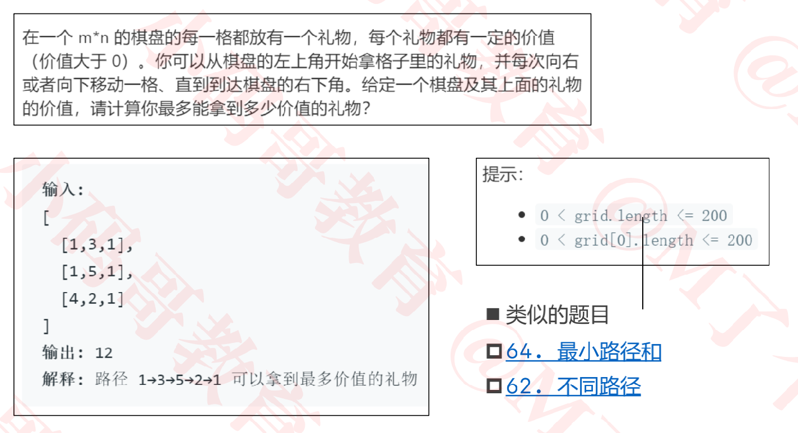

  +  [64_最小路径和](https://leetcode-cn.com/problems/minimum-path-sum/)
  + [62_不同路径](https://leetcode-cn.com/problems/unique-paths/)

+ 思路

  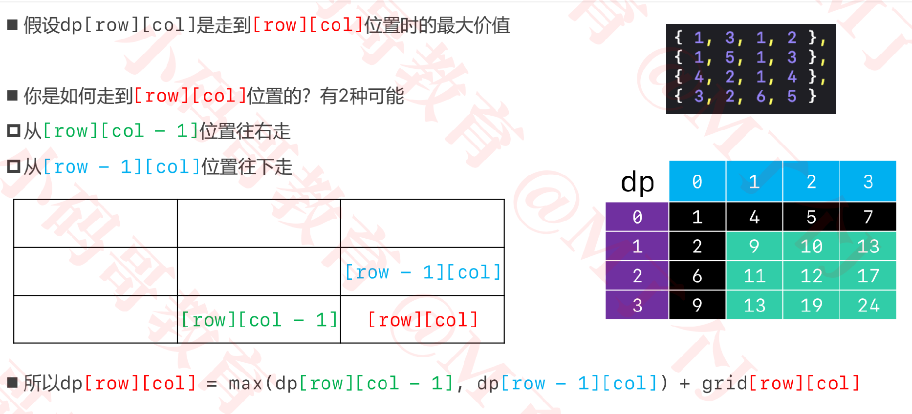

  + 第0行和第0列的数据可以直接得到

+ 代码实现

  ```java
  public class 面试题47_礼物的最大价值 {
      public int maxValue(int[][] grid) {
      	int rows = grid.length;
      	int cols = grid[0].length;
      	
      	int[][] dp = new int[rows][cols];
      	dp[0][0] = grid[0][0];
      	// 第0行
      	for (int col = 1; col < cols; col++) {
  			dp[0][col] = dp[0][col - 1] + grid[0][col];
        }
      	// 第0列
      	for (int row = 1; row < rows; row++) {
  			dp[row][0] = dp[row - 1][0] + grid[row][0];
        }
        
      	for (int row = 1; row < rows; row++) {
  			for (int col = 1; col < cols; col++) {
  				dp[row][col] = Math.max(dp[row - 1][col], dp[row][col - 1]) + grid[row][col];
        }}
      	return dp[rows - 1][cols - 1];
      }
  }
  
  ```


### 121_买卖股票的最佳时机

+ https://leetcode-cn.com/problems/best-time-to-buy-and-sell-stock/

  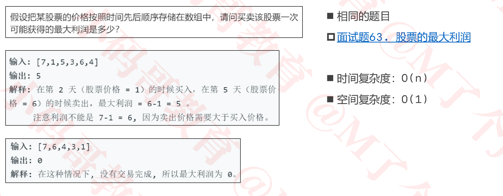

+ 思路

  - 假设第i天卖出，则此时的最大利润即为`当前的卖出价 - 前i-1天中股票的最低值`

    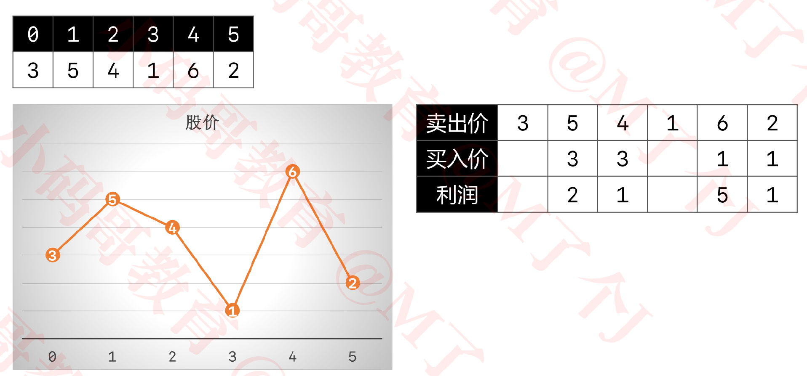

  - 则每一天卖出获得的最大利润中的最大值即为所求

+ 代码实现

  ```java
  public class _121_买卖股票的最佳时机 {
      public int maxProfit(int[] prices) {
      	if (prices == null || prices.length == 0) return 0;
      	// 前面扫描过的最小价格
      	int minPrice = prices[0];
      	// 前面扫描过的最大利润
      	int maxProfit = 0;
      	// 扫描所有的价格
      	for (int i = 1; i < prices.length; i++) {
  			if (prices[i] < minPrice) {
  				minPrice = prices[i];
  			} else { // 把第i天的股票卖出
  				maxProfit = Math.max(maxProfit, prices[i] - minPrice);
  			}
  		 }
      	return maxProfit;
      }
  }
  
  ```

+ 动态规划思路

  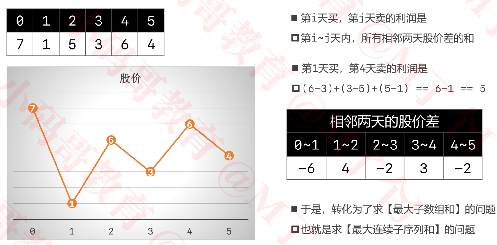


### 72_编辑距离

+ https://leetcode-cn.com/problems/edit-distance/

  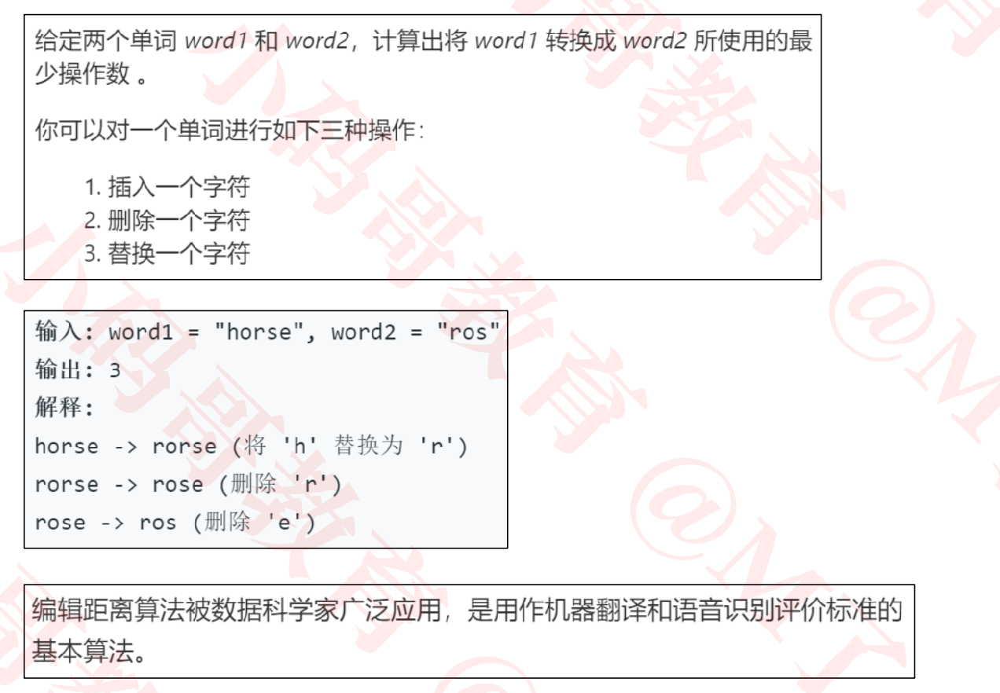

+ 思路

  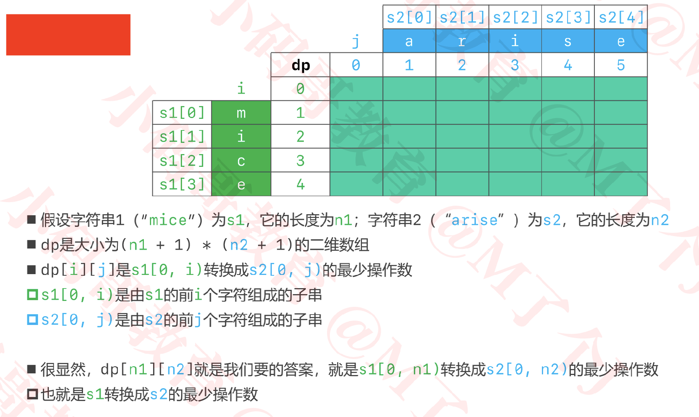

  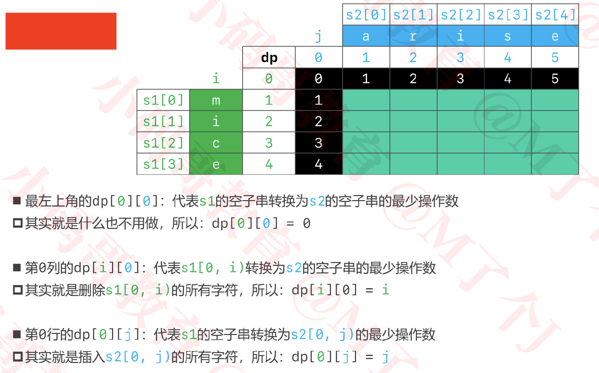

  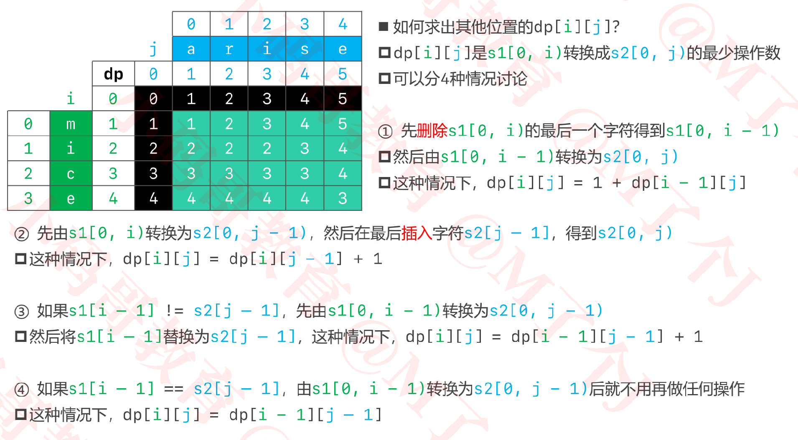

+ 代码实现

  ```java
  public class _72_编辑距离 {
      public int minDistance(String word1, String word2) {
      	if (word1 == null || word2 == null) return 0;
      	char[] cs1 = word1.toCharArray();
      	char[] cs2 = word2.toCharArray();
      	int[][] dp = new int[cs1.length + 1][cs2.length + 1];
      	dp[0][0] = 0;
      	// 第0列
      	for (int i = 1; i <= cs1.length; i++) {
  			dp[i][0] = i;
  		}
      	// 第0行
      	for (int j = 1; j <= cs2.length; j++) {
  			dp[0][j] = j;
  		}
      	// 其他行其他列
      	for (int i = 1; i <= cs1.length; i++) {
  			for (int j = 1; j <= cs2.length; j++) {
  				int top = dp[i - 1][j] + 1;
  				int left = dp[i][j - 1] + 1;
  				int leftTop = dp[i - 1][j - 1];
  				if (cs1[i - 1] != cs2[j - 1]) {
  					leftTop++;
  				}
  				dp[i][j] = Math.min(Math.min(top, left), leftTop);
  			}
  		}
      	return dp[cs1.length][cs2.length];
      }
  }
  ```

  

### 5_最长回文字串

+ https://leetcode-cn.com/problems/longest-palindromic-substring/

  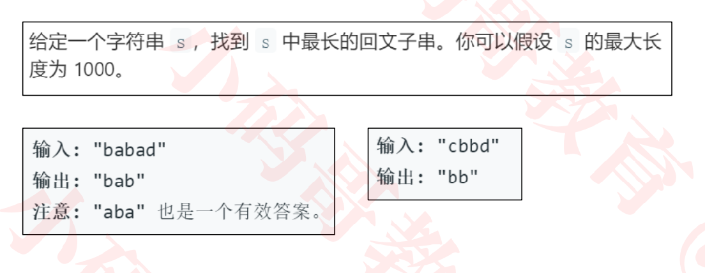

  

+ 暴力法

  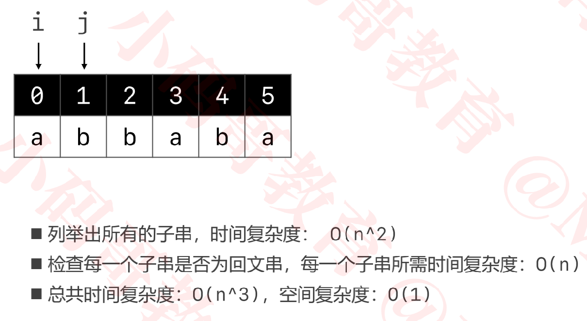

+ 动态规划法

  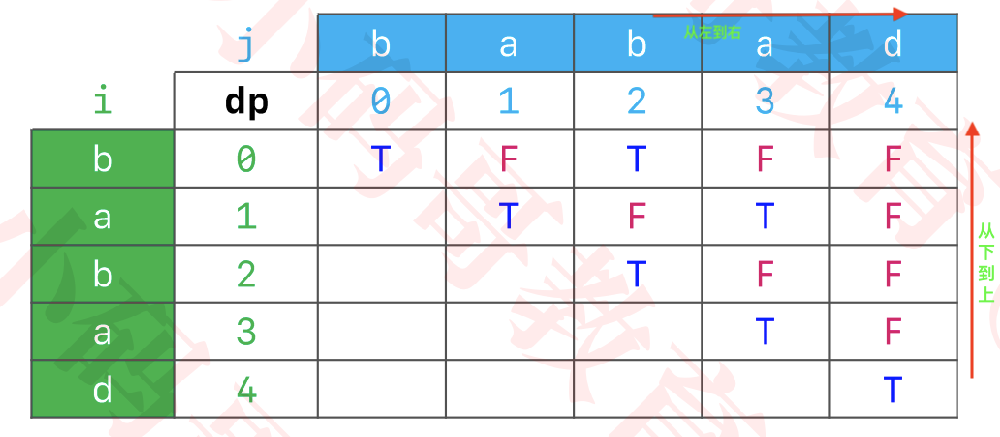

  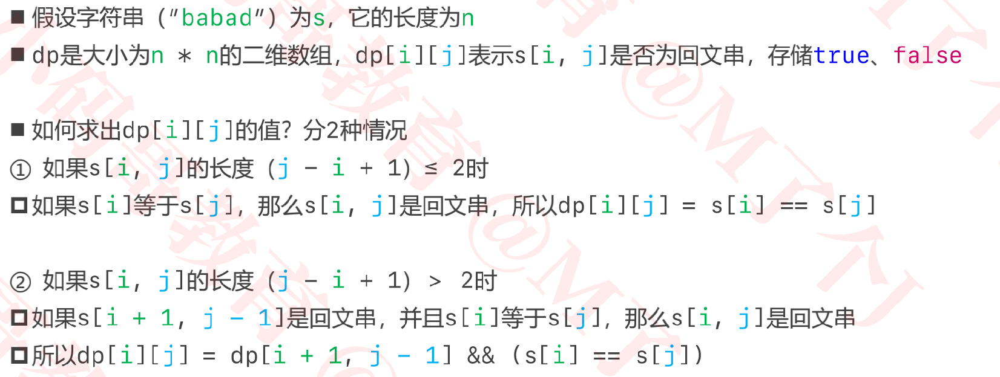

  

+ 代码实现

  ```java
  public String longestPalindrome(String s) {
      	if (s == null) return null;
      	char[] cs = s.toCharArray();
      	if (cs.length == 0) return s;
      	//最长回文字串的长度(至少是1)
      	int maxLen = 1;
      	//最长回文字串的开始索引
      	int begin = 0;
      	boolean[][] dp = new boolean[cs.length][cs.length];
        //从下到上(i由大到小)
      	for (int i = cs.length -1; i >= 0; i--) {
          //从左到右(j由小到大)
      		for (int j = i; j < cs.length; j++) {
            //cs[i,j]的长度
      			int len = j -i + 1;
      			dp[i][j] = (cs[i]== cs[j]) && (len <= 2 || dp[i+1][j-1]);
      			if (dp[i][j] && len > maxLen) {//说明cs[i,j]是回文字串
  					maxLen = len;
  					begin = i;
  				}
  			}
  		}
      	return new String(cs, begin, maxLen);
      }
  ```


+ 扩展中心法

  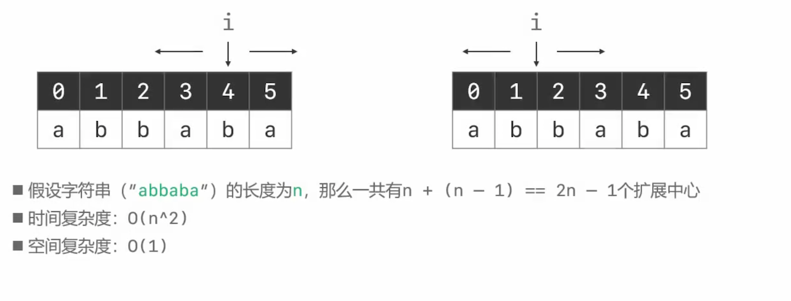

