##排序

### 初识排序

+ 什么叫排序？
  - 排序前：3,1,6,9,2,5,8,4,7
  - 排序后：1,2,3,4,5,6,7,8,9（升序） 或者 9,8,7,6,5,4,3,2,1（降序）
+ 排序的应用无处不在

### 十大排序算法

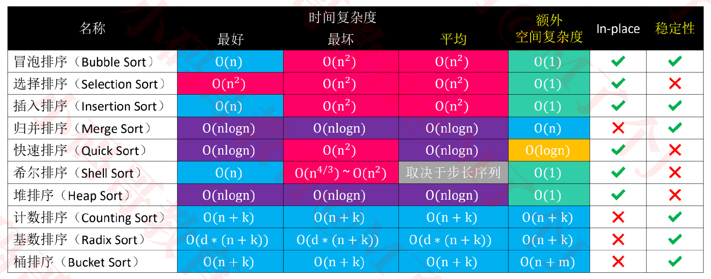

+ 以上表格是**基于数组**进行排序的一般性结论
+ 冒泡、选择、插入、归并、快速、希尔、堆排序，属于**比较排序**（Comparison Sorting）
  - 这七个是要掌握的排序
  - 剩下的3个可作为了解

+ 可用本地化的网站查看排序动画
  - 查看比较排序动画: `visualization/ComparisonSort.html`

### 冒泡排序（Bubble Sort）

+ 冒泡排序也叫做起泡排序

  - 最坏、平均时间复杂度：O(n<sup>2</sup>)
  - 最好时间复杂度：O(n)
  -  空间复杂度：O(1)

+ 执行流程（本课程统一以升序为例子）

  - ① 从头开始比较每一对相邻元素，如果第1个比第2个大，就交换它们的位置(每次交换后，后面的元素即为前面所有元素中最大的元素)
    - 执行完一轮后，最末尾那个元素就是最大的元素
    - 对于n个元素，只需要执行n-1轮排序即可
  - ② 忽略 ① 中曾经找到的最大元素，重复执行步骤 ①，直到全部元素有序

  

+ 代码实现

  ```java
  static void bubbleSort1(Integer[] array) {
      //遍历n-1轮，每次遍历一轮忽略最后一个元素，因此end每次-1
  		for (int end = array.length - 1; end > 0; end--) {
        //忽略已经遍历过的元素，继续进行两两比较
  			for (int begin = 1; begin <= end; begin++) {
  				if (array[begin] < array[begin - 1]) {
  					int tmp = array[begin];
  					array[begin] = array[begin - 1];
  					array[begin - 1] = tmp;
  				}
  			}
  		}
  	}
  ```

  + 此时时间复杂度为O(n<sup>2</sup>)

### 冒泡排序(Bubble Sort) -优化①

+ 如果序列已经完全有序，可以提前终止冒泡排序

  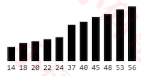

 

+ 代码实现如下

  ```java
  static void bubbleSort2(Integer[] array) {
  		for (int end = array.length - 1; end > 0; end--) {
        //标记这个循环是否有交换，如果没有交换，说明没有逆序对了，即已经升序
  			boolean sorted = true;
  			for (int begin = 1; begin <= end; begin++) {
  				if (array[begin] < array[begin - 1]) {
  					int tmp = array[begin];
  					array[begin] = array[begin - 1];
  					array[begin - 1] = tmp;
  					sorted = false;
  				}
  			}
        //如果提前有序，则退出循环
  			if (sorted) break;
  		}
  }
  ```

  

+ 性能测试-随机序列

  ```java
      //随机生成10000个， [1, 100000]数字
      Integer[] array1 = Integers.random(10000, 1, 100000);
      //copy上面的数组，因为冒泡排序是in-place排序
  		Integer[] array2 = Integers.copy(array1);
  		Times.test("bubbleSort1", ()-> {
  			bubbleSort1(array1);
  		});
  		Times.test("bubbleSort2", ()-> {
  			bubbleSort2(array2);
  		});
  
  【bubbleSort1】
  开始：10:53:53.289
  结束：10:53:53.865
  耗时：0.576秒
  -------------------------------------
  【bubbleSort2】
  开始：10:53:53.868
  结束：10:53:54.569
  耗时：0.701秒
  -------------------------------------
  ```

  + 我们看到优化过竟然时间会变的更长?
    - 因为优化的时机是，在某个循环后提前有序
    - 如果没有达到提前有序，可以看到我们的优化增加了一部分代码，这相当于增加了执行的机器指令，当然会耗时更加多
    - 因此这种优化并不一定是有效的

+ 性能测试-升序序列

  ```java
      //[1,10000]的升序序列
      Integer[] array1 = Integers.ascOrder(1, 10000);
      //copy上面的数组，因为冒泡排序是in-place排序
  		Integer[] array2 = Integers.copy(array1);
  		Times.test("bubbleSort1", ()-> {
  			bubbleSort1(array1);
  		});
  		Times.test("bubbleSort2", ()-> {
  			bubbleSort2(array2);
  		});
  
  【bubbleSort1】
  开始：10:59:22.969
  结束：10:59:23.027
  耗时：0.058秒
  -------------------------------------
  【bubbleSort2】
  开始：10:59:23.030
  结束：10:59:23.031
  耗时：0.001秒
  -------------------------------------
  ```

  + 从上面的结果来看，确实提升了性能

+ 因此，总的来看，这种优化并不一定提升性能


### 冒泡排序(Bubble Sort) -优化②

+ 如果序列尾部已经局部有序，可以记录最后1次交换的位置，减少比较次数

  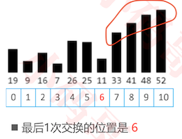

  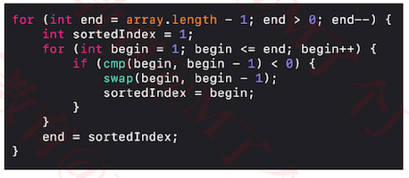

  - 记录了最后一次交换的位置为6，说明6位置以及后面的元素已经有序。
  - 下一次比较的元素就是[0,5]位置
  - 最坏、平均时间复杂度：O(n<sup>2</sup>)
  - 最好时间复杂度：O(n)
    - 完全有序时，只需一次扫描
  -  空间复杂度：O(1)
    - 没有用到额外的空间
    - 也没有递归调用

+ 出现尾部有序的概率，比全部提前有序的概率更大，因此这种优化更有效

  - 而且中间可能出现多次局部有序的情况

+ 代码实现

  ```java
  static void bubbleSort3(Integer[] array) {
  		for (int end = array.length - 1; end > 0; end--) {
  			// sortedIndex的初始值在数组完全有序的时候有用
        // 初始值为1效果是：当数组完全有序的时候，end = 1, 执行完这次循环就退出了
  			int sortedIndex = 1;
        //两个元素比较: begin是后面的元素，begin-1是前面的元素
  			for (int begin = 1; begin <= end; begin++) {
  				if (array[begin] < array[begin - 1]) {
  					int tmp = array[begin];
  					array[begin] = array[begin - 1];
  					array[begin - 1] = tmp;
            //交换位置，则最后的index为begin，此时该位置以及后面的元素都已经有序
  					sortedIndex = begin;
  				}
  			}
        //sortedIndex赋值给end, 外层循环又将end-1
        //所以下次比较获取最大值的是[0, sortedIndex-1]位置的元素
  			end = sortedIndex;
  		}
  	}
  ```

+ 性能测试-尾部有序

  ```java
      //后面2000个是升序的
      Integer[] array1 = Integers.tailAscOrder(1, 10000, 2000);
  		Integer[] array2 = Integers.copy(array1);
  		Integer[] array3 = Integers.copy(array1);
  
  		Times.test("bubbleSort1", ()-> {
  			bubbleSort1(array1);
  		});
  		Times.test("bubbleSort2", ()-> {
  			bubbleSort2(array2);
  		});
  		
  		Times.test("bubbleSort3", ()-> {
  			bubbleSort3(array3);
  		});
  
  【bubbleSort1】
  开始：11:23:39.878
  结束：11:23:40.054
  耗时：0.176秒
  -------------------------------------
  【bubbleSort2】
  开始：11:23:40.057
  结束：11:23:40.128
  耗时：0.071秒
  -------------------------------------
  【bubbleSort3】
  开始：11:23:40.128
  结束：11:23:40.150
  耗时：0.022秒
  -------------------------------------
  ```

  + 因此假如尾部有序，性能是有所提升的

### 排序算法的稳定性（Stability）

+ 如果相等的2个元素，在排序前后的相对位置保持不变，那么这是稳定的排序算法

  - 排序前：5, 1, <font color=red>3𝑎</font>, 4, 7, <font color=red>3𝑏</font>
  - 稳定的排序： 1, <font color=red>3𝑎</font>, <font color=red>3𝑏,</font> 4, 5, 7
  - 不稳定的排序：1, <font color=red>3𝑏</font>, <font color=red>3𝑎</font>, 4, 5, 7

+ 对自定义对象进行排序时，稳定性会影响最终的排序效果

+ 冒泡排序属于稳定的排序算法

  - 因为相等时，并不会交换位置

  - 稍有不慎，稳定的排序算法也能被写成不稳定的排序算法，比如下面的冒泡排序代码是不稳定的

    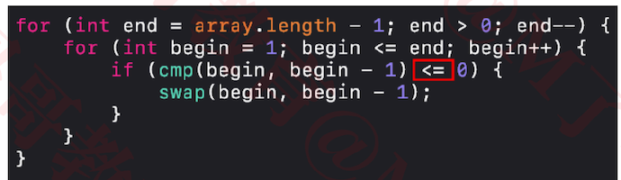

### 原地算法（In-place Algorithm）

+ 何为原地算法？
  - 不依赖额外的资源或者依赖少数的额外资源，仅依靠输出来覆盖输入
    - 例如冒泡排序传进来的数组，我们输出的还是这个数组，但内容被覆盖为有序的了
    - 空间复杂度比较低，没有申请一大堆的空间
  - 空间复杂度为 𝑂(1) 的都可以认为是原地算法
+ 非原地算法，称为 Not-in-place 或者 Out-of-place
+ 冒泡排序属于 In-place

### 选择排序（Selection Sort）

+ 执行流程

  - ① 从序列中找出最大的那个元素索引，然后将这个最大的元素与最末尾的元素交换位置

    - 执行完一轮后，最末尾的那个元素就是最大的元素的索引

  - 忽略 ① 中曾经找到的最大元素，重复执行步骤 ①

    ```java
    for (int end = array.length - 1; end > 0; end--) {
    			int maxIndex = 0;//最大位置的索引
    			for (int begin = 1; begin <= end; begin++) {
    				if (array[maxIndex] <= array[begin]) {
    					 maxIndex = begin; //更新最大位置的索引
    				}
    			}
          //与最后一个元素,交换内容
    			int tmp = array[maxIndex];
    			array[maxIndex] = array[end];
    			array[end] = tmp;
    }
    ```

+ 选择排序的交换次数要远远少于冒泡排序，平均性能优于冒泡排序
+ 最好、最坏、平均时间复杂度：O(n<sup>2</sup>)，空间复杂度：O(1)，属于不稳定排序

+ 思考
  - 选择排序是否还有优化的空间？
    - 使用堆来选择最大值

### 堆排序（Heap Sort）

+ 堆排序可以认为是对选择排序的一种优化

+ 执行流程

  - ① 对序列进行原地建堆（heapify）

  - 重复执行以下操作，直到堆的元素数量为 1

    -  交换堆顶元素与尾元素

      ```
       使用大顶堆，则将最大值交换到最后
      ```

    -  堆的元素数量减1

      ```
      忽略已经排好序的元素
      ```

    -  对 0 位置进行 1 次 siftDown 操作

      ```
      对堆顶执行下滤操作，恢复大顶堆
      ```

+ 执行示例 

  1. 对于如下数组

     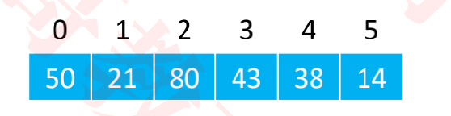

  2. 原地建堆如下

     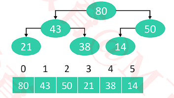

  3. 重复执行步骤2，直到元素数量为1

     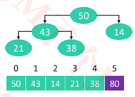

     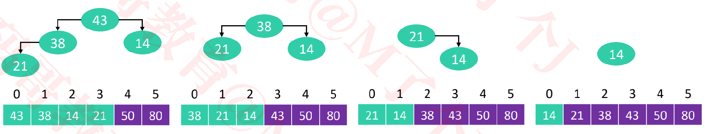

+ 最好、最坏、平均时间复杂度：O(nlogn)，空间复杂度：O(1)，属于不稳定排序

  ```
  不稳定的排序
  假如前两个都是38，那么顶部换到最后之后，两个38的顺序就与原来不一样了
  ```

  

+ 代码实现

  ```java
  public class HeapSort<T extends Comparable<T>> extends Sort<T> {
  	private int heapSize;
  
  	@Override
  	protected void sort() {
  		// 原地建堆
  		heapSize = array.length;
  		for (int i = (heapSize >> 1) - 1; i >= 0; i--) {
  			siftDown(i);
  		}
  		
  		while (heapSize > 1) {
  			// 交换堆顶元素和尾部元素
  			swap(0, --heapSize);
  
  			// 对0位置进行siftDown（恢复堆的性质）
  			siftDown(0);
  		}
  	}
  	
    //下滤的操作
  	private void siftDown(int index) {
  		T element = array[index];
  		
  		int half = heapSize >> 1;
  		while (index < half) { // index必须是非叶子节点
  			// 默认是左边跟父节点比
  			int childIndex = (index << 1) + 1;
  			T child = array[childIndex];
  			
  			int rightIndex = childIndex + 1;
  			// 右子节点比左子节点大
  			if (rightIndex < heapSize && 
  					cmp(array[rightIndex], child) > 0) { 
  				child = array[childIndex = rightIndex];
  			}
  			
  			// 大于等于子节点
  			if (cmp(element, child) >= 0) break;
  			
  			array[index] = child;
  			index = childIndex;
  		}
  		array[index] = element;
  	}
  }
  ```

### 抽象父类sort

```java
public abstract class Sort<T extends Comparable<T>> implements Comparable<Sort<T>> {
	protected T[] array;
	private int cmpCount;
	private int swapCount;
	private long time;
	private DecimalFormat fmt = new DecimalFormat("#.00");
	
	public void sort(T[] array) {
		if (array == null || array.length < 2) return;
		
		this.array = array;
		
		long begin = System.currentTimeMillis();
		sort();
		time = System.currentTimeMillis() - begin;
	}
	
	@Override
	public int compareTo(Sort<T> o) {
		int result = (int)(time - o.time);
		if (result != 0) return result;
		
		result = cmpCount - o.cmpCount;
		if (result != 0) return result;
		
		return swapCount - o.swapCount;
	}
	
	protected abstract void sort();
	
	/*
	 * 返回值等于0，代表 array[i1] == array[i2]
	 * 返回值小于0，代表 array[i1] < array[i2]
	 * 返回值大于0，代表 array[i1] > array[i2]
	 */
	protected int cmp(int i1, int i2) {
		cmpCount++;
		return array[i1].compareTo(array[i2]);
	}
	
	protected int cmp(T v1, T v2) {
		cmpCount++;
		return v1.compareTo(v2);
	}
	
	protected void swap(int i1, int i2) {
		swapCount++;
		T tmp = array[i1];
		array[i1] = array[i2];
		array[i2] = tmp;
	}
	
	@Override
	public String toString() { 
		String timeStr = "耗时：" + (time / 1000.0) + "s(" + time + "ms)";
		String compareCountStr = "比较：" + numberString(cmpCount);
		String swapCountStr = "交换：" + numberString(swapCount);
		String stableStr = "稳定性：" + isStable();
		return "【" + getClass().getSimpleName() + "】\n" 
				+ stableStr + " \t"
				+ timeStr + " \t"
				+ compareCountStr + "\t "
				+ swapCountStr + "\n"
				+ "------------------------------------------------------------------";

	}
	
	private String numberString(int number) {
		if (number < 10000) return "" + number;
		if (number < 100000000) return fmt.format(number / 10000.0) + "万";
		return fmt.format(number / 100000000.0) + "亿";
	}
	
	private boolean isStable() {
    if (this instanceof SelectionSort) return false;
    
    //通过判断其分数是否还保持原来的顺序来判断其是否是稳定的
		Student[] students = new Student[20];
		for (int i = 0; i < students.length; i++) {
			students[i] = new Student(i * 10, 10);
		}
		sort((T[]) students);
    
		for (int i = 1; i < students.length; i++) {
			int score = students[i].score;
			int prevScore = students[i - 1].score;
			if (score != prevScore + 10) return false;
		}
		return true;
	}
}

package com.mj;
public class Student implements Comparable<Student> {
	public int score;
	public int age;
	
	public Student(int score, int age) {
		this.score = score;
		this.age = age;
	}
	
	@Override
	public int compareTo(Student o) {
		return age - o.age;
	}
}

```

+ 要求元素类型具备可比较性

### 重构冒泡排序，选择排序 ，堆排序

+ 冒泡排序

  ```java
  public class BubbleSort1<T extends Comparable<T>> extends Sort<T> {
  
  	@Override
  	protected void sort() {
  		for (int end = array.length - 1; end > 0; end--) {
  			for (int begin = 1; begin <= end; begin++) {
  				// if (array[begin] < array[begin - 1]) {
  				if (cmp(begin, begin - 1) < 0) {
  					swap(begin, begin - 1);
  				}
  			}
  		}
  	}
  
  }
  
  public class BubbleSort2<T extends Comparable<T>> extends Sort<T> {
  
  	@Override
  	protected void sort() {
  		for (int end = array.length - 1; end > 0; end--) {
  			boolean sorted = true;
  			for (int begin = 1; begin <= end; begin++) {
  				// if (array[begin] < array[begin - 1]) {
  				if (cmp(begin, begin - 1) < 0) {
  					swap(begin, begin - 1);
  					sorted = false;
  				}
  			}
  			if (sorted) break;
  		}
  	}
  }
  
  public class BubbleSort3<T extends Comparable<T>> extends Sort<T> {
  	@Override
  	protected void sort() {
  		for (int end = array.length - 1; end > 0; end--) {
  			int sortedIndex = 1;
  			for (int begin = 1; begin <= end; begin++) {
  				// if (array[begin] < array[begin - 1]) {
  				if (cmp(begin, begin - 1) < 0) {
  					swap(begin, begin - 1);
  					sortedIndex = begin;
  				}
  			}
  			end = sortedIndex;
  		}
  	}
  }
  
  ```

+ 选择排序

  ```java
  public class SelectionSort<T extends Comparable<T>> extends Sort<T> {
  
  	@Override
  	protected void sort() {
  		for (int end = array.length - 1; end > 0; end--) {
  			int maxIndex = 0;
  			for (int begin = 0; begin <= end; begin++) {
  				// if (array[maxIndex] <= array[begin]) {
  				if (cmp(maxIndex, begin) <= 0) {
  					maxIndex = begin;
  				}
  			}
  			swap(maxIndex, end);
  		}
  	}
  
  }
  ```

+ 堆排序

  ```java
  public class HeapSort<T extends Comparable<T>> extends Sort<T> {
  	private int heapSize;
  
  	@Override
  	protected void sort() {
  		// 原地建堆
  		heapSize = array.length;
  		for (int i = (heapSize >> 1) - 1; i >= 0; i--) {
  			siftDown(i);
  		}
  		
  		while (heapSize > 1) {
  			// 交换堆顶元素和尾部元素
  			swap(0, --heapSize);
  
  			// 对0位置进行siftDown（恢复堆的性质）
  			siftDown(0);
  		}
  	}
  	
  	private void siftDown(int index) {
  		T element = array[index];
  		
  		int half = heapSize >> 1;
  		while (index < half) { // index必须是非叶子节点
  			// 默认是左边跟父节点比
  			int childIndex = (index << 1) + 1;
  			T child = array[childIndex];
  			int rightIndex = childIndex + 1;
  			// 右子节点比左子节点大
  			if (rightIndex < heapSize && 
  					cmp(array[rightIndex], child) > 0) { 
  				child = array[childIndex = rightIndex];
  			}
  			// 大于等于子节点
  			if (cmp(element, child) >= 0) break;
  			
  			array[index] = child;
  			index = childIndex;
  		}
  		array[index] = element;
  	}
  }
  ```

+ 性能对比测试

  ```java
  public static void main(String[] args) {
   Integer[] array = Integers.random(10000, 1, 20000);	
   testSorts(array, 
  				new SelectionSort(), 
  				new HeapSort(), 
  				new BubbleSort3());
  }			
  
  static void testSorts(Integer[] array, Sort... sorts) {
  		for (Sort sort : sorts) {
  			Integer[] newArray = Integers.copy(array);
  			sort.sort(newArray);
  			Asserts.test(Integers.isAscOrder(newArray));
  		}
  		Arrays.sort(sorts);
  		for (Sort sort : sorts) {
  			System.out.println(sort);
  		}
  	}
  
  【HeapSort】
  稳定性：false 	耗时：0.004s(4ms) 	比较：23.53万	 交换：9999
  ------------------------------------------------------------------
  【SelectionSort】
  稳定性：false 	耗时：0.105s(105ms) 	比较：5000.50万	 交换：9999
  ------------------------------------------------------------------
  【BubbleSort3】
  稳定性：true 	耗时：0.283s(283ms) 	比较：4994.87万	 交换：2514.03万
  ------------------------------------------------------------------
  ```

  + HeapSort的性能更高

### 插入排序 （Insertion Sort）

+ 插入排序非常类似于扑克牌的排序

  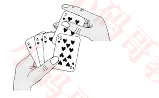

+ 执行流程

  

  - ① 在执行过程中，插入排序会将序列分为2部分

    - 头部是已经排好序的，尾部是待排序的

  - 从头开始扫描每一个元素

    - 每当扫描到一个元素，就将它插入到头部合适的位置，使得头部数据依然保持有序

      ```
      怎样插入合适的位置?
      将待排序的元素和已经排好序的元素，从尾部开始进行比较
      
      当待排序的元素 < 已经排好序的元素
      ```

      

+ 插入排序的实现

  ```
  将待排序的元素和已经排好序的元素，从尾部开始进行比较
  当待排序的元素 < 已经排好序的元素， 则交换位置，继续往前比较
  ```

  ```java
  public class InsertionSort1<T extends Comparable<T>> extends Sort<T> {
  	@Override
  	protected void sort() {
  		for (int begin = 1; begin < array.length; begin++) {
        //begin是待排序的元素， begin前面的是已经排好序的元素
  			int cur = begin;
        //当待排序的元素 < 其前一个元素比较，则交换位置
        //稳定排序
  			while (cur > 0 && cmp(cur, cur - 1) < 0) {
  				swap(cur, cur - 1);
  				cur--;
  			}
  		}
  	}
  }
  ```

+ 性能对比

  ```java
  Integer[] array = Integers.random(10000, 1, 20000);
  testSorts(array, 
  				new InsertionSort1(), 
  				new SelectionSort(), 
  				new HeapSort(), 
  				new BubbleSort3());	
  				
  【HeapSort】
  稳定性：false 	耗时：0.004s(4ms) 	比较：23.54万	 交换：9999
  ------------------------------------------------------------------
  【SelectionSort】
  稳定性：true 	耗时：0.093s(93ms) 	比较：5000.50万	 交换：9999
  ------------------------------------------------------------------
  【InsertionSort1】
  稳定性：true 	耗时：0.138s(138ms) 	比较：2528.50万	 交换：2527.50万
  ------------------------------------------------------------------
  【BubbleSort3】
  稳定性：true 	耗时：0.257s(257ms) 	比较：4992.58万	 交换：2527.50万
  ------------------------------------------------------------------
  ```

  + 插入排序性能比较低，有大量的比较和交换
  + 比较和交换的数量跟逆序对的数量相关

### 插入排序 - 逆序对（Inversion）

+ 什么是逆序对？

  + 数组 <2,3,8,6,1> 的逆序对为：<2,1> <3,1> <8,1> <8,6> <6,1>，共5个逆序对
  + 逆序对越多，比较和交换的次数越多

+ 插入排序的时间复杂度与逆序对的数量成正比关系

  - 逆序对的数量越多，插入排序的时间复杂度越高

+ 时间复杂度

  - 最坏、平均时间复杂度：O(n<sup>2</sup>)

    ```
    最坏:全部逆序
    ```

    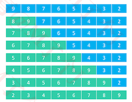

  - 最好时间复杂度：O(n)

    ```
    最好:全部正序，已经排好序了，遍历一遍即可
    ```

+ 空间复杂度：O(1)

+ 属于稳定排序

+ 当逆序对的数量极少时，插入排序的效率特别高
  - 甚至速度比 O (nlogn) 级别的快速排序还要快
+ 数据量不是特别大的时候，插入排序的效率也是非常好的


### 插入排序 - 优化①

+ 思路是将【交换】转为【挪动】

  - 先将待插入的元素备份
  - 头部有序数据中比待插入元素大的，都朝尾部方向挪动1个位置
  - 将待插入元素放到最终的合适位置 

+ 优化的地方在哪?

  ```
  如果使用交换，每次while循环中相当于要执行3行代码，效率比较低
  ```

+ 执行流程

  1. 先将index=5位置的元素备份

     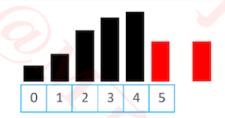

  2. 头部有序数据中比待插入元素大的，都朝尾部方向挪动1个位置

     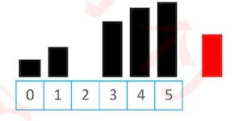

  3. 将元素插入到对应位置,直接赋值即可

     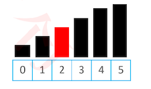

+ 为什么不先找到插入的位置，再进行元素的挪动？

  ```
  这会经历两次循环，效率更低
  ```

+ 代码实现

  ````java
  public class InsertionSort2<T extends Comparable<T>> extends Sort<T> {
  	@Override
  	protected void sort() {
  		for (int begin = 1; begin < array.length; begin++) {
  			int cur = begin;
  			T v = array[cur];
        //进入while循环的次数越多优化越大
  			while (cur > 0 && cmp(v, array[cur - 1]) < 0) {
  				array[cur] = array[cur - 1];
  				cur--;
  			}
        //与优化前的代码相比, while循环外执行赋值操作
  			array[cur] = v;
  		}
  	}
  }
  ````

+ 性能对比

  ```java
  Integer[] array = Integers.random(10000, 1, 20000);	
  testSorts(array, 
  				new InsertionSort1(), 
  				new InsertionSort2(), 
  				new SelectionSort(), 
  				new HeapSort(), 
  				new BubbleSort3());	
  
  【HeapSort】
  稳定性：false 	耗时：0.005s(5ms) 	比较：23.53万	 交换：9999
  ------------------------------------------------------------------
  【SelectionSort】
  稳定性：true 	耗时：0.105s(105ms) 	比较：5000.50万	 交换：9999
  ------------------------------------------------------------------
  【InsertionSort1】
  稳定性：true 	耗时：0.138s(138ms) 	比较：2483.62万	 交换：2482.62万
  ------------------------------------------------------------------
  【InsertionSort2】
  稳定性：true 	耗时：0.16s(160ms) 	比较：2483.62万	 交换：0
  ------------------------------------------------------------------
  【BubbleSort3】
  稳定性：true 	耗时：0.252s(252ms) 	比较：4995.75万	 交换：2482.62万
  ------------------------------------------------------------------
  ```

  + 我们竟然发现InsertionSort2比InsertionSort1的时间大
  + 因为我们的优化是在while循环里，如果进入while循环的次数较少，其在while循环外多了一句赋值操作，反而会使时间变大。因此逆序对的数量越多提升越明显

+ 性能对比-完全逆序

  ```java
  Integer[] array = Integers.descOrder(1, 10000);
  testSorts(array, 
  				new InsertionSort1(), 
  				new InsertionSort2());
          
  【InsertionSort2】
  稳定性：true 	耗时：0.219s(219ms) 	比较：4999.50万	 交换：0
  ------------------------------------------------------------------
  【InsertionSort1】
  稳定性：true 	耗时：0.326s(326ms) 	比较：4999.50万	 交换：4999.50万
  ```

  + 因此逆序对的数量越多提升越明显

### 二分搜索（Binary Search）

+ 如何确定一个元素在数组中的位置？（假设数组里面全都是整数）

  - 如果是无序数组，从第 0 个位置开始遍历搜索，平均时间复杂度：O(n)

    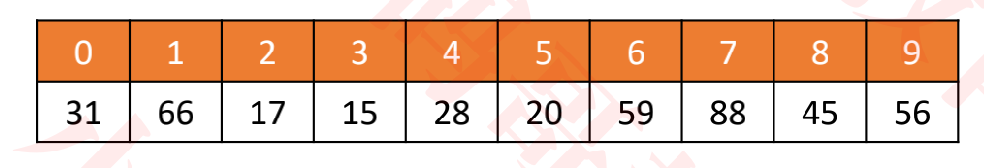

+ 如果是有序数组，可以使用二分搜索，最坏时间复杂度：O(logn)

  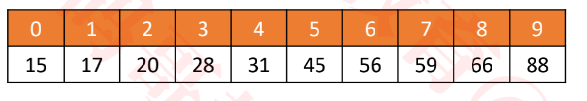

### 二分搜索 – 思路

+ 假设在 [<font color="#FF62D7">begin</font>, <font color="#14a249">end</font>) 范围内搜索某个元素 <font color=red>v</font>，<font color="#7030A0">mid </font>== (<font color="#FF62D7">begin</font> + <font color="#14a249">end</font>) / 2

  ```
  begin是序列的首位置
  end是序列的末位置+1 = begin + 长度
  左开右闭
  ```

+ 如果 <font color=red>v</font> < m，去 [<font color="#FF62D7">begin</font>, <font color="#7030A0">mid</font> )范围内二分搜索

+ 如果 <font color=red>v</font> < m，去 [<font color="#7030A0">mid</font> + 1, <font color="#14a249">end</font>) 范围内二分搜索

+ 如果 <font color=red>v</font> <font color="#7030A0">== </font>m，直接返回 <font color="#7030A0">mid</font>

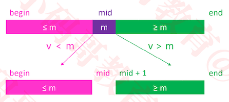

### 二分搜索 – 实例

+ 搜索10

  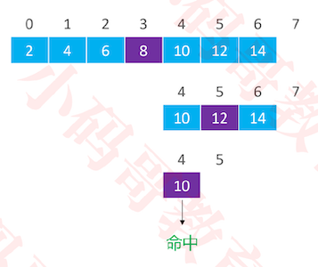

+ 搜索3

  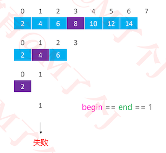

  ```
  最后一次时，begin =0,  end = 1, mid = 0。
  下次begin = mid + 1 = 1 == end ，寻找结束，失败
  ```

+ 具体代码实现

  ```java
  package com.mj;
  public class BinarySearch {
  	/**
  	 * 查找v在有序数组array中的位置
  	 */
  	public static int indexOf(int[] array, int v) {
  		if (array == null || array.length == 0) return -1;
  		int begin = 0;
  		int end = array.length;
  		while (begin < end) {
  			int mid = (begin + end) >> 1;
  			if (v < array[mid]) {
  				end = mid;
  			} else if (v > array[mid]) {
  				begin = mid + 1;
  			} else {
  				return mid;
  			}
  		}
  		return -1;
  	}
  }
  
  ```

+ 思考: 如果存在多个重复的值，返回的是哪一个？

  - 不确定

### 插入排序 – 二分搜索优化②

+ 在元素 v 的插入过程中，可以先二分搜索出合适的插入位置，然后再将元素 v 插入

  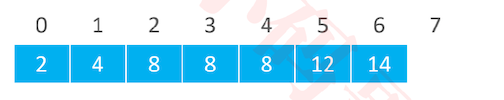

+ 要求二分搜索返回的插入位置：第1个大于 v 的元素位置

  - 如果  <font color=red>v</font> 是 5，返回 2
  - 如果  <font color=red>v</font> 是 1，返回 0
  - 如果  <font color=red>v</font> 是 15，返回 7
  - 如果  <font color=red>v</font> 是 8，返回 5

### 插入排序 – 二分搜索优化 – 思路

+ 假设在 [<font color="#FF62D7">begin</font>, <font color="#14a249">end</font>) 范围内搜索某个元素  <font color=red>v</font>，mid == (<font color="#FF62D7">begin</font> + <font color="#14a249">end</font>) / 2

+ 如果  <font color=red>v</font> <font color="#FF62D7"><</font> m，去 [<font color="#FF62D7">begin</font>, <font color="#7030A0">mid</font>) 范围内二分搜索

+ 如果  <font color=red>v</font> <font color="#14a249">≥</font> m，去 [<font color="#7030A0">mid</font> + 1, <font color="#14a249">end</font>) 范围内二分搜索

  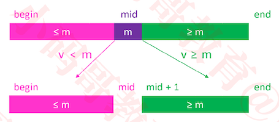

### 插入排序 – 二分搜索优化 – 实例

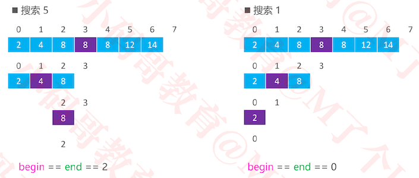


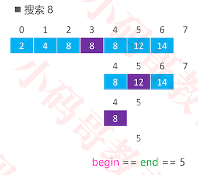

+ 代码实现

```java
public class InsertionSort3<T extends Comparable<T>> extends Sort<T> {
	@Override
	protected void sort() {
		for (int begin = 1; begin < array.length; begin++) {
			insert(begin, search(begin));
		}
	}
	
	/**
	 * 将source位置的元素插入到dest位置
	 * @param source
	 * @param dest
	 */
	private void insert(int source, int dest) {
		T v = array[source];
		for (int i = source; i > dest; i--) {
			array[i] = array[i - 1];
		}
		array[dest] = v;
	}
	
	/**
	 * 利用二分搜索找到 index 位置元素的待插入位置
	 * 已经排好序数组的区间范围是 [0, index)
	 * @param index
	 * @return
	 */
	private int search(int index) {
		int begin = 0;
		int end = index;
    //当begin == end时，即为插入的位置
		while (begin < end) {
			int mid = (begin + end) >> 1;
			if (cmp(array[index], array[mid]) < 0) {
				end = mid;
			} else {
				begin = mid + 1;
			}
		}
		return begin;
	}
}
```


+ 性能对比

  ```java
  Integer[] array = Integers.random(10000, 1, 20000);
  testSorts(array, 
  				new InsertionSort1(),
  				new InsertionSort2(),
  				new InsertionSort3(),
  				new SelectionSort(), 
  				new HeapSort(), 
  				new BubbleSort3()
  				);
  				
  【HeapSort】
  稳定性：false 	耗时：0.004s(4ms) 	比较：23.54万	 交换：9999
  ------------------------------------------------------------------
  【InsertionSort3】
  稳定性：true 	耗时：0.069s(69ms) 	比较：11.90万	 交换：0
  ------------------------------------------------------------------
  【SelectionSort】
  稳定性：true 	耗时：0.121s(121ms) 	比较：4999.50万	 交换：9999
  ------------------------------------------------------------------
  【InsertionSort1】
  稳定性：true 	耗时：0.131s(131ms) 	比较：2507.48万	 交换：2506.48万
  ------------------------------------------------------------------
  【InsertionSort2】
  稳定性：true 	耗时：0.155s(155ms) 	比较：2507.48万	 交换：0
  ------------------------------------------------------------------
  【BubbleSort3】
  稳定性：true 	耗时：0.245s(245ms) 	比较：4992.17万	 交换：2506.48万
  ------------------------------------------------------------------
  ```

  + InsertionSort3有了明显提升

+ 需要注意的是，使用了二分搜索后，只是减少了比较次数，但插入排序的平均时间复杂度依然是 O(n<sup>2</sup>)

### 归并排序（Merge Sort）

+  1945年由约翰·冯·诺伊曼（John von Neumann）首次提出

+  执行流程

  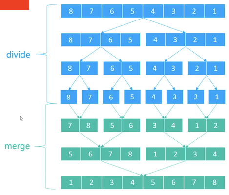

  1.  不断地将当前序列平均分割成2个子序列
     - 直到不能再分割（序列中只剩1个元素）
  2. 不断地将2个子序列合并成一个有序序列
     - 直到最终只剩下1个有序序列

+ 对较大的序列进行归并排序，相当于对它的两个子序列进行归并排序，然后经归并排序好的子序列进行merge

### 归并排序 – divide实现

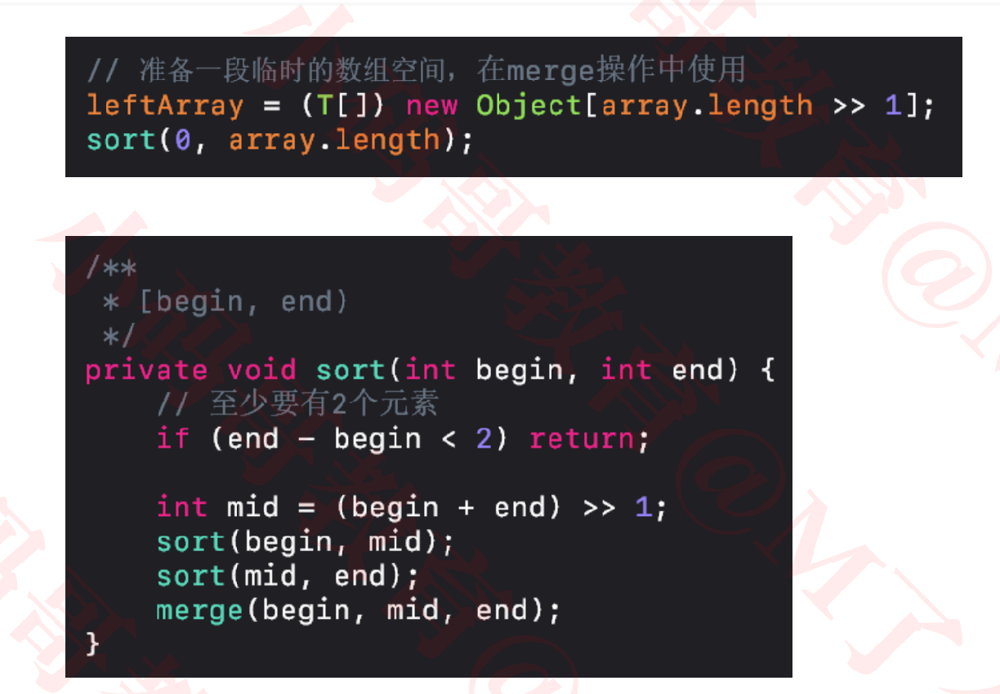

+ 此时代码实现

  ```java
  @SuppressWarnings("unchecked")
  public class MergeSort<T extends Comparable<T>> extends Sort<T> {
  
  	@Override
  	protected void sort() {
  		sort(0, array.length);
  	}
  	/**
  	 * 对 [begin, end) 范围的数据进行归并排序
  	 */
  	private void sort(int begin, int end) {
  		if (end - begin < 2) return;
  		
  		int mid = (begin + end) >> 1;
  		sort(begin, mid);
  		sort(mid, end);
  		merge(begin, mid, end);
  	}
  	
  	/**
  	 * 将 [begin, mid) 和 [mid, end) 范围的序列合并成一个有序序列
  	 */
  	private void merge(int begin, int mid, int end) {
  	}
  }
  
  ```

+ 因此此时的关键点在于，如何将两个子序列进行merge

### 归并排序-merge

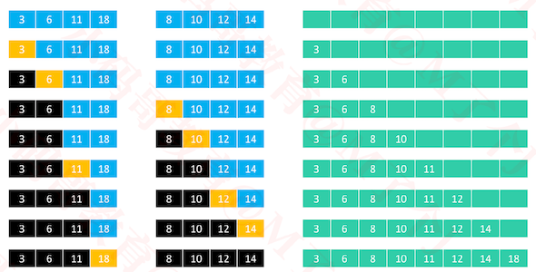

+ 三个序列是独立的内存
+ 分别使用li,ri指向两个子序列要比较的元素,ai指向要存储的位置
+ 将较小的index加1，并将较小的元素存储在大数组中

### 归并排序- merge-细节

+ 需要 merge 的 2 组序列存在于同一个数组中，并且是挨在一起的

  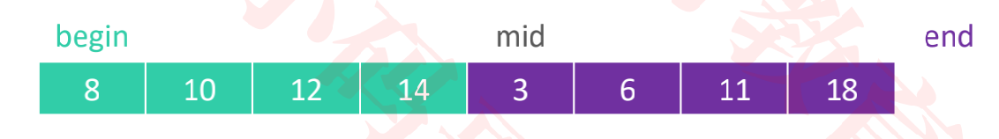

+ 为了更好地完成 merge 操作，最好将其中 1 组序列备份出来，比如 [begin, mid)

  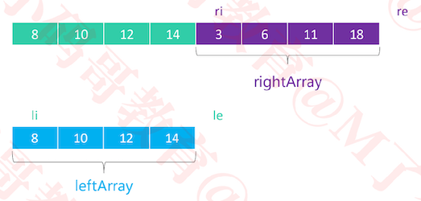

  - li == 0，le == mid – begin

  - ri == mid，re == end

    ```
    1. leftArray的长度最大为最初的数组的一半
    2. 将左边的数组备份出来，因为插入都是往左边插入的
    3. leftArray和rightArray本身就是有序数组
    ```

    

### 归并排序 – merge细节 – 左边先结束

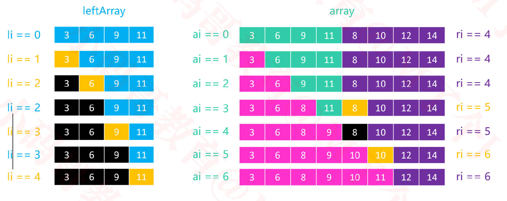

+ 当左边提前结束时，右边不用动

### 归并排序 – merge细节 – 右边先结束

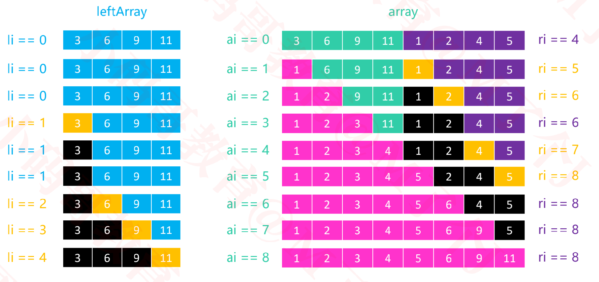

+ 当右边提前结束时，将左边的元素一次放到右边对应位置即可


### 归并排序 - 开辟leftArray

+ 开辟原始数组的一半作为leftArray,这样对于子序列进行merge时，不需要再开辟leftArray，直接复用这个leftArray即可

  ````java
  @SuppressWarnings("unchecked")
  public class MergeSort<T extends Comparable<T>> extends Sort<T> {
  	private T[] leftArray;
  
  	@Override
  	protected void sort() {
      //leftArray的length为原数组的一半
  		leftArray = (T[]) new Comparable[array.length >> 1];
  		sort(0, array.length);
  	}
  }
  ````

### 归并排序 - merge的实现

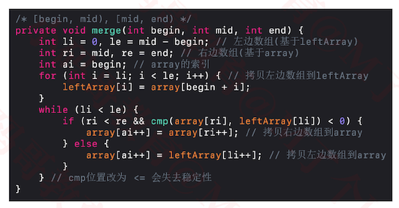

```java
package com.mj.sort.cmp;

import com.mj.sort.Sort;

@SuppressWarnings("unchecked")
public class MergeSort<T extends Comparable<T>> extends Sort<T> {
	private T[] leftArray;

	@Override
	protected void sort() {
		leftArray = (T[]) new Comparable[array.length >> 1];
		sort(0, array.length);
	}
	
	// T(n) = T(n/2) + T(n/2) + O(n)
	/**
	 * 对 [begin, end) 范围的数据进行归并排序
	 */
	private void sort(int begin, int end) {
		if (end - begin < 2) return;
		
		int mid = (begin + end) >> 1;
		sort(begin, mid);
		sort(mid, end);
		merge(begin, mid, end);
	}
	
	/**
	 * 将 [begin, mid) 和 [mid, end) 范围的序列合并成一个有序序列
	 */
	private void merge(int begin, int mid, int end) {
    //li是指向leftArray, le是指当前leftArray的有效元素的长度
		int li = 0, le = mid - begin;
    //ri指向的是大数组中的位置 
		int ri = mid, re = end;
    //ai指向大数组中将要存储的位置
		int ai = begin;
		
		//元素都是位于整个大数组的,
    //从大数组中取出左边的元素进行备份， 左边的元素在大数组中的位置是 [begin mid)
		for (int i = li; i < le; i++) {
			leftArray[i] = array[begin + i];
		}
		// 如果左边还没有结束
    // 如果左边先结束，后面位置不用动了
		while (li < le) { 
			if (ri < re && cmp(array[ri], leftArray[li]) < 0) {
        //右边未结束时，
        //如果array[ri]较小时，将array[ri]的值放到array[ai]位置
				array[ai++] = array[ri++];
        //array[ai] = array[ri];
        //ai++
        //ri++
			} else {
        //情况1. 如果leftArray[li]较小时，将leftArray[li]的值放到array[ai]位置
        //      当leftArray[li] == array[ri], leftArray[li]为较小值，这就保证了稳定性
        //情况2. 右边先结束时，将左边对应赋值到右边即可
				array[ai++] = leftArray[li++];
        //array[ai] = leftArray[li];
        //ai++
        //li++
			}
		}
	}
}
```

### 归并排序 - 性能对比

```java
Integer[] array = Integers.random(10000, 1, 20000);
testSorts(array, 
				new MergeSort(),
				new InsertionSort1(),
				new InsertionSort2(),
				new InsertionSort3(),
				new SelectionSort(), 
				new HeapSort(), 
				new BubbleSort3()
				);

【MergeSort】
稳定性：true 	耗时：0.005s(5ms) 	比较：12.05万	 交换：0
------------------------------------------------------------------
【HeapSort】
稳定性：false 	耗时：0.005s(5ms) 	比较：23.53万	 交换：9999
------------------------------------------------------------------
【InsertionSort3】
稳定性：true 	耗时：0.063s(63ms) 	比较：11.90万	 交换：0
------------------------------------------------------------------
【SelectionSort】
稳定性：true 	耗时：0.094s(94ms) 	比较：4999.50万	 交换：9999
------------------------------------------------------------------
【InsertionSort2】
稳定性：true 	耗时：0.162s(162ms) 	比较：2502.93万	 交换：0
------------------------------------------------------------------
【InsertionSort1】
稳定性：true 	耗时：0.188s(188ms) 	比较：2502.93万	 交换：2501.93万
------------------------------------------------------------------
【BubbleSort3】
稳定性：true 	耗时：0.291s(291ms) 	比较：4997.78万	 交换：2501.93万
------------------------------------------------------------------
```

### 归并排序 – 复杂度分析

+ 归并排序花费的时间
  - T(n) = 2 ∗ T( n/2 )+ O(n)
  - T(1) =  O(1)
  - T(n)/n =  T( n/2 )/(n/2)+ O(1)
+ 令 S(n)= T(n) /n
  - S(1) = O(1)
  - S(n) = S(n/2) +  O(1) = S(n/4) + O(2) = S(n/8) + O(3) = S(n/2<sup>k</sup>) + O(k) = S(1) + O(logn) = O(logn)
  - T(n) = n *  S(n) = O(nlogn)

+ 由于归并排序总是平均分割子序列，所以最好、最坏、平均时间复杂度都是 O(nlogn) ，属于稳定排序

+ 从代码中不难看出：归并排序的空间复杂度是 O(n/2 + logn) = O(n)
  + n/2 用于临时存放左侧数组，logn是因为递归调用了logn次，开辟了logn个函数栈空间

### 常见的递推式与复杂度

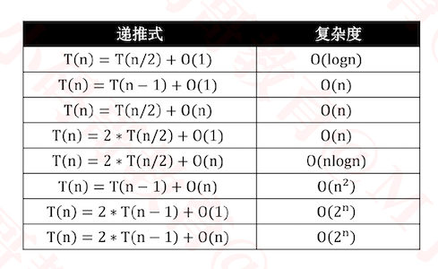

### 归并排序-作业

+ 合并两个有序数组: https://leetcode-cn.com/problems/merge-sorted-array/
+  合并两个有序链表: https://leetcode-cn.com/problems/merge-two-sorted-lists/comments/
+  合并K个有序链表: https://leetcode-cn.com/problems/merge-k-sorted-lists/
+ 解题教程: https://ke.qq.com/course/436549


### 快速排序（Quick Sort）

+ 1960年由**查尔斯·安东尼·理查德·霍尔（Charles Antony Richard Hoare，缩写为C. A. R. Hoare）**提出
  - 昵称为**东尼·霍尔（Tony Hoare）**

### 快速排序 – 执行流程

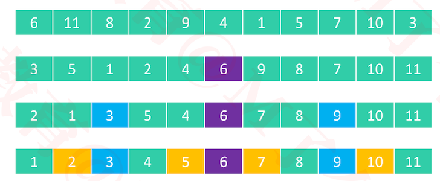

+ 执行流程
  - ① 从序列中选择一个轴点元素（pivot）
    - 假设每次选择 0 位置的元素为轴点元素
  - ② 利用 pivot 将序列分割成 2 个子序列
    - 将小于 pivot 的元素放在pivot前面（左侧）
    - 将大于 pivot 的元素放在pivot后面（右侧）
    - 等于pivot的元素放哪边都可以
  - ③ 对子序列进行 ① ② 操作
    - 直到不能再分割（子序列中只剩下1个元素）

+ 快速排序的本质
  - 逐渐将每一个元素都转换成轴点元素
  - 当都转换成轴点元素之后，就排好序了

### 快速排序 – 轴点构造

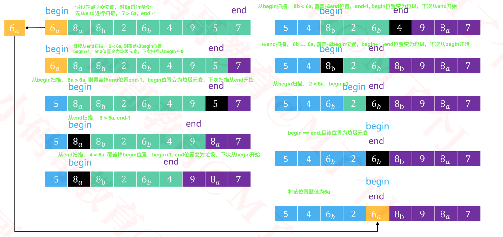

```
从end扫描，如果end元素>轴点元素，则end-1,方向不变
从end扫描，如果end元素<=轴点元素，则将end元素覆盖掉begin元素，begin++，下次从begin扫描

从begin扫描，如果begin元素<轴点元素，则bgin+1,方向不变
从begin扫描，如果begin元素>=轴点元素，则将begin元素覆盖掉end元素，end-1，下次从end扫描
```

+ 代码实现

  ```java
  public class QuickSort<T extends Comparable<T>> extends Sort<T> {
  
  	@Override
  	protected void sort() {
  		sort(0, array.length);
  	}
  
  	/**
  	 * 对 [begin, end) 范围的元素进行快速排序
  	 * @param begin
  	 * @param end
  	 */
  	private void sort(int begin, int end) { 
  		if (end - begin < 2) return;
  		//T(n) = 2T(n/2)+ O(n)= O(nlogn)
  		// 确定轴点位置 
  		int mid = pivotIndex(begin, end);
  		// 对子序列进行快速排序
  		sort(begin, mid); 
  		sort(mid + 1, end); 
  	} 
  	/**
  	 * 构造出 [begin, end) 范围的轴点元素 O(n),把元素扫描一遍即可比较出
  	 * @return 轴点元素的最终位置
  	 */
  	private int pivotIndex(int begin, int end) {
  		// 随机选择一个元素跟begin位置进行交换
  		swap(begin, begin + (int)(Math.random() * (end - begin)));
  		// 备份begin位置的元素
  		T pivot = array[begin];
  		// end指向最后一个元素
  		end--;
  		
  		while (begin < end) {
        //两个while循环解决,扫描方向变化的问题
  			while (begin < end) {
  				if (cmp(pivot, array[end]) < 0) { // 右边元素 > 轴点元素
  					end--;
  				} else { // 右边元素 <= 轴点元素
  					array[begin++] = array[end];
  					break;
  				}
  			}
        
  			while (begin < end) {
  				if (cmp(pivot, array[begin]) > 0) { // 左边元素 < 轴点元素
  					begin++;
  				} else { // 左边元素 >= 轴点元素
  					array[end--] = array[begin];
  					break;
  				}
  			}
  		}
  		// 将轴点元素放入最终的位置
  		array[begin] = pivot;
  		// 返回轴点元素的位置
  		return begin;
  	}
  }
  
  ```

+ 性能对比

  ```java
  Integer[] array = Integers.random(10000, 1, 20000);
  testSorts(array, 
  				new QuickSort(),
  				new MergeSort(),
  				new InsertionSort1(),
  				new InsertionSort2(),
  				new InsertionSort3(),
  				new SelectionSort(), 
  				new HeapSort(), 
  				new BubbleSort3()
  				);
  【HeapSort】
  稳定性：false 	耗时：0.005s(5ms) 	比较：23.55万	 交换：9999
  ------------------------------------------------------------------
  【MergeSort】
  稳定性：true 	耗时：0.006s(6ms) 	比较：12.04万	 交换：0
  ------------------------------------------------------------------
  【QuickSort】 快排的性能还是不错的
  稳定性：false 	耗时：0.007s(7ms) 	比较：16.24万	 交换：6515
  ------------------------------------------------------------------
  【InsertionSort3】
  稳定性：true 	耗时：0.058s(58ms) 	比较：11.90万	 交换：0
  ------------------------------------------------------------------
  【SelectionSort】
  稳定性：true 	耗时：0.094s(94ms) 	比较：4999.50万	 交换：9999
  ------------------------------------------------------------------
  【InsertionSort2】
  稳定性：true 	耗时：0.144s(144ms) 	比较：2512.84万	 交换：0
  ------------------------------------------------------------------
  【InsertionSort1】
  稳定性：true 	耗时：0.209s(209ms) 	比较：2512.84万	 交换：2511.84万
  ------------------------------------------------------------------
  【BubbleSort3】
  稳定性：true 	耗时：0.253s(253ms) 	比较：4996.08万	 交换：2511.84万
  ------------------------------------------------------------------
  ```

  

### 快速排序 – 时间复杂度

+ 在轴点左右元素数量比较均匀的情况下，同时也是最好的情况
  - T(n) = 2 ∗ T (n/2) + O n = O(nlogn)

+ 如果轴点左右元素数量极度不均匀，最坏情况

  - T(n) = T( n - ) + O(n) = O(n<sup>2</sup>)

  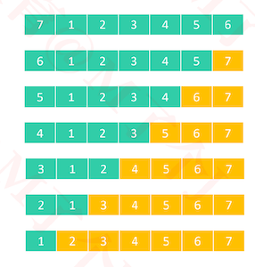

+ 为了降低最坏情况的出现概率，一般采取的做法是
  - 随机选择轴点元素
+ 最好、平均时间复杂度：O(nlogn)
+ 最坏时间复杂度：O(n<sup>2</sup>)
+ 由于递归调用的缘故，空间复杂度：O(logn)
+ 属于不稳定排序

### 快速排序 – 与轴点相等的元素

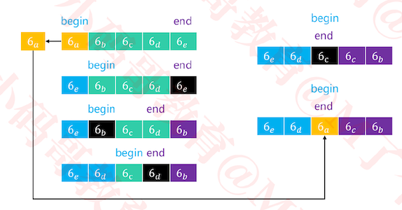

+ 如果序列中的所有元素都与轴点元素相等，利用目前的算法实现，轴点元素可以将序列分割成 2 个均匀的子序列

+ 思考：cmp 位置的判断分别改为 ≤、≥ 会起到什么效果？

  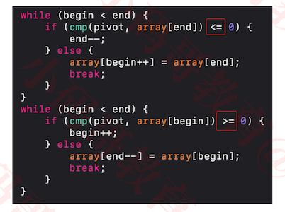

  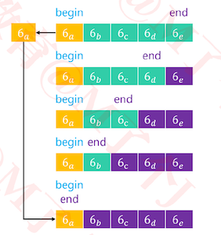

+ 轴点元素分割出来的子序列极度不均匀
  - 导致出现最坏时间复杂度 O(n<sup>2</sup>)


### 希尔排序（Shell Sort）

+ 1959年由唐纳德·希尔（Donald Shell）提出
+ 希尔排序把序列看作是一个**矩阵**，分成 𝑚 列，逐列进行排序
  - 𝑚 从某个整数逐渐减为1
  - 当 𝑚 为1时，整个序列将完全有序
+  因此，希尔排序也被称为**递减增量排序（Diminishing Increment Sort）**
+ 矩阵的列数取决于步长序列（step sequence）
  -  比如，如果步长序列为{1,5,19,41,109,...}，就代表依次分成109列、41列、19列、5列、1列进行排序
  - 不同的步长序列，执行效率也不同

### 希尔排序 – 实例

+ 希尔本人给出的步长序列是 𝑛/2<sup>𝑘</sup>，比如 𝑛 为16时，步长序列是{1, 2, 4, 8}

  

  - 分成8列进行排序

    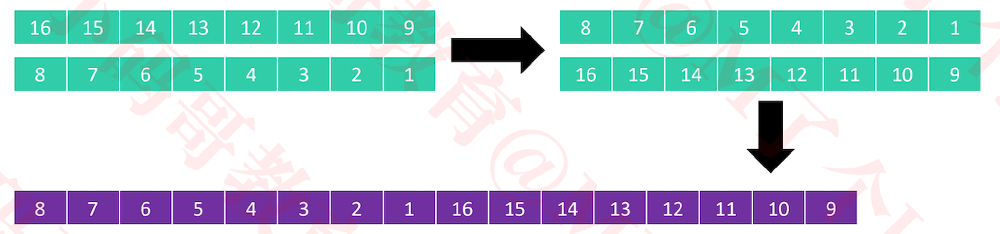

  - 分成4列进行排序

    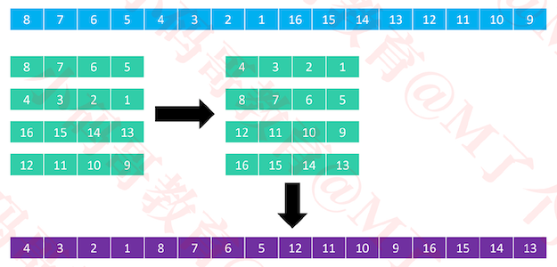

  - 分成2列进行排序

    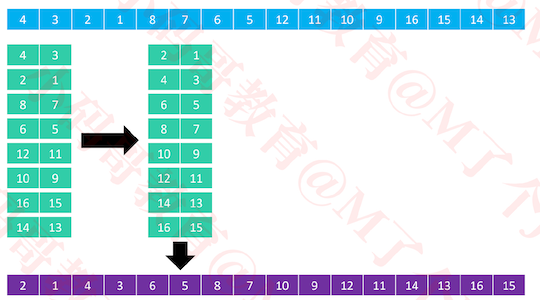

  - 分成1列进行排序

    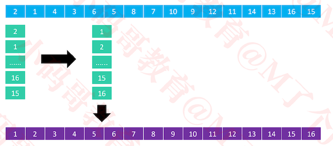

  - 不难看出来，从8列 变为 1列的过程中，逆序对的数量在逐渐减少

    - 因此希尔排序底层一般使用插入排序对每一列进行排序，也很多资料认为希尔排序是插入排序的改进版

+ 假设有11个元素，步长序列是{1, 2, 5}

  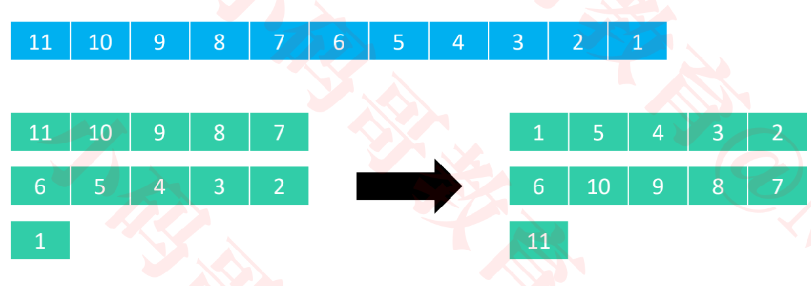

  + 假设元素在第 col 列、第 row 行，步长（总列数）是 step
    - 那么这个元素在数组中的索引是 col + row * step
    - 比如 9 在排序前是第 2 列、第 0 行，那么它排序前的索引是 2 + 0 * 5 = 2
    - 比如 4 在排序前是第 2 列、第 1 行，那么它排序前的索引是 2 + 1 * 5 = 7

###  希尔排序 – 步长序列

+ 希尔本人给出的步长序列，最坏情况时间复杂度是 O(n<font color=red><sup>2</sup></font>)

  ```java
  private List<Integer> shellStepSequence() {
  		List<Integer> stepSequence = new ArrayList<>();
  		int step = array.length;
  		while ((step >>= 1) > 0) {
  			stepSequence.add(step);
  		}
  		return stepSequence;
  	}
  ```

+ 目前已知的最好的步长序列，最坏情况时间复杂度是 O(n<font color=red><sup>4/3</sup></font>) ，1986年由<font color=red>Robert Sedgewick</font>提出

  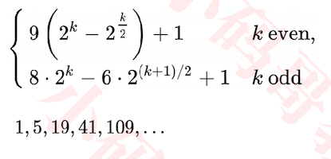

  ```java
  private List<Integer> sedgewickStepSequence() {
  		List<Integer> stepSequence = new LinkedList<>();
  		int k = 0, step = 0;
  		while (true) {
  			if (k % 2 == 0) {
  				int pow = (int) Math.pow(2, k >> 1);
  				step = 1 + 9 * (pow * pow - pow);
  			} else {
  				int pow1 = (int) Math.pow(2, (k - 1) >> 1);
  				int pow2 = (int) Math.pow(2, (k + 1) >> 1);
  				step = 1 + 8 * pow1 * pow2 - 6 * pow2;
  			}
  			if (step >= array.length) break;
  			stepSequence.add(0, step);
  			k++;
  		}
  		return stepSequence;
  	}
  ```

### 希尔排序 – 实现

+ 最好情况是步长序列只有1，且序列几乎有序，时间复杂度为 O(n)

+ 空间复杂度为O(1)，属于不稳定排序

  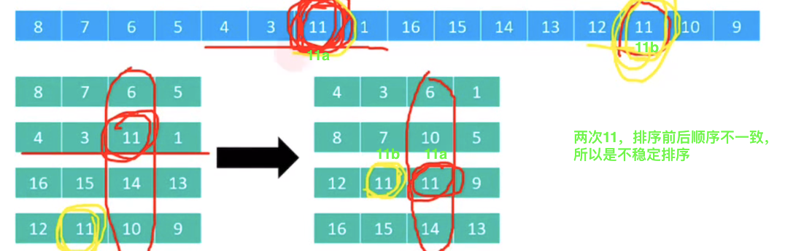

+ 代码实现

  ```java
  public class ShellSort<T extends Comparable<T>> extends Sort<T> {
  
  	@Override
  	protected void sort() {
  		List<Integer> stepSequence = sedgewickStepSequence();
  		for (Integer step : stepSequence) {
  			sort(step);
  		}
  	}
  	
  	/**
  	 * 分成step列进行排序
  	 */
  	private void sort(int step) {
  		// col : 第几列，column的简称
  		for (int col = 0; col < step; col++) { // 对第col列进行排序
  			// col、col+step、col+2*step、col+3*step
  			for (int begin = col + step; begin < array.length; begin += step) {
  				int cur = begin;
          //对列进行插入排序
          //begin是从列的第二个元素开始的
  				while (cur > col && cmp(cur, cur - step) < 0) {
  					swap(cur, cur - step);
  					cur -= step;
  				}
  			}
  		}
  	}
  	
  	private List<Integer> shellStepSequence() {
  		List<Integer> stepSequence = new ArrayList<>();
  		int step = array.length;
  		while ((step >>= 1) > 0) {
  			stepSequence.add(step);
  		}
  		return stepSequence;
  	}
  	
  	private List<Integer> sedgewickStepSequence() {
  		List<Integer> stepSequence = new LinkedList<>();
  		int k = 0, step = 0;
  		while (true) {
  			if (k % 2 == 0) {
  				int pow = (int) Math.pow(2, k >> 1);
  				step = 1 + 9 * (pow * pow - pow);
  			} else {
  				int pow1 = (int) Math.pow(2, (k - 1) >> 1);
  				int pow2 = (int) Math.pow(2, (k + 1) >> 1);
  				step = 1 + 8 * pow1 * pow2 - 6 * pow2;
  			}
  			if (step >= array.length) break;
  			stepSequence.add(0, step);
  			k++;
  		}
  		return stepSequence;
  	}
  }
  
  ```

+ 性能对比

  ```java
  Integer[] array = Integers.random(10000, 1, 20000);
  testSorts(array, 
  				new ShellSort(),
  				new QuickSort(),
  				new MergeSort(),
  				new InsertionSort1(),
  				new InsertionSort2(),
  				new InsertionSort3(),
  				new SelectionSort(), 
  				new HeapSort(), 
  				new BubbleSort3()
  				);
  
  【MergeSort】
  稳定性：true 	耗时：0.004s(4ms) 	比较：12.04万	 交换：0
  ------------------------------------------------------------------
  【HeapSort】
  稳定性：false 	耗时：0.005s(5ms) 	比较：23.55万	 交换：9999
  ------------------------------------------------------------------
  【QuickSort】
  稳定性：false 	耗时：0.006s(6ms) 	比较：15.53万	 交换：6472
  ------------------------------------------------------------------
  【ShellSort】
  稳定性：false 	耗时：0.01s(10ms) 	比较：19.44万	 交换：10.62万
  ------------------------------------------------------------------
  【InsertionSort3】
  稳定性：true 	耗时：0.064s(64ms) 	比较：11.90万	 交换：0
  ------------------------------------------------------------------
  【SelectionSort】
  稳定性：true 	耗时：0.111s(111ms) 	比较：4999.50万	 交换：9999
  ------------------------------------------------------------------
  【InsertionSort1】
  稳定性：true 	耗时：0.164s(164ms) 	比较：2492.08万	 交换：2491.08万
  ------------------------------------------------------------------
  【InsertionSort2】
  稳定性：true 	耗时：0.174s(174ms) 	比较：2492.08万	 交换：0
  ------------------------------------------------------------------
  【BubbleSort3】
  稳定性：true 	耗时：0.264s(264ms) 	比较：4996.81万	 交换：2491.08万
  ------------------------------------------------------------------
  
  ```

### 计数排序（Counting Sort）

+ 之前学习的冒泡、选择、插入、归并、快速、希尔、堆排序，都是基于比较的排序
  - 平均时间复杂度目前最低是 O(nlogn)
+ 计数排序、桶排序、基数排序，都不是基于比较的排序
  - 它们是典型的用空间换时间，在某些时候，平均时间复杂度可以比 O(nlogn)更低
+ 计数排序于1954年由**Harold H. Seward**提出，适合对一定范围内的整数进行排序
+ 计数排序的核心思想
  - 统计每个整数在序列中出现的次数，进而推导出每个整数在有序序列中的索引

 ### 计数排序 – 最简单的实现

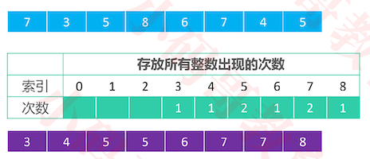

+ 索引为原数组中的元素值，索引对应的值是原数组中的元素出现的次数

+ 代码实现

  ```java
  protected void sort0() {
  		// 找出最大值
  		int max = array[0];
  		for (int i = 1; i < array.length; i++) {
  			if (array[i] > max) {
  				max = array[i];
  			}
  		} // O(n)
  		
  		// 开辟内存空间，存储每个整数出现的次数
  		int[] counts = new int[1 + max];
  		// 统计每个整数出现的次数
  		for (int i = 0; i < array.length; i++) {
  			counts[array[i]]++;
  		} // O(n)
  		
  		// 根据整数的出现次数，对整数进行排序
  		int index = 0;
  		for (int i = 0; i < counts.length; i++) {
  			while (counts[i]-- > 0) {
  				array[index++] = i;
  			}
  		} // O(n)
  	}	
  ```

+ 这个版本的实现存在以下问题

  - 无法对负整数进行排序
  - 极其浪费内存空间
  - 是个不稳定的排序
  - .....


