## 并查集 (Union Find)

### 需求分析

+ 假设有n个村庄，有些村庄之间有连接的路，有些村庄之间并没有连接的路

  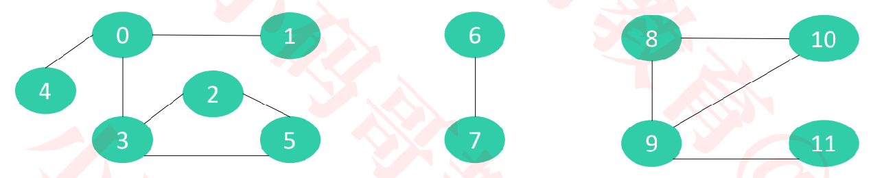

+ 设计一个数据结构，能够快速执行2个操作

  - 查询2个村庄之间是否有连接的路
  - 连接2个村庄

+ 数组、链表、平衡二叉树、集合（Set）？

  - 查询、连接的时间复杂度都是：O(n)

+ 并查集能够办到查询、连接的均摊时间复杂度都是 O(α(n)) ，α(n) < 5

+ 并查集非常适合解决这类“连接”相关的问题

### 基本概念

+ 并查集也叫作不相交集合（**Disjoint Set**）
+ 并查集有2个核心操作
  - 查找（Find）：查找元素所在的集合（这里的集合并不是特指Set这种数据结构，是指广义的数据集合）
  - 合并（Union）：将两个元素所在的集合合并为一个集合
+ 有2种常见的实现思路
  - Quick Find
    - 查找（Find）的时间复杂度：O(1)
    - 合并（Union）的时间复杂度：O(n)
  - <font color=red>Quick Union</font>
    - 查找（Find）的时间复杂度：O(logn)，可以优化至 O(α(𝑛)) ，α(𝑛) < 5
    - 合并（Union）的时间复杂度：O(logn)，可以优化至 O(α(𝑛)) ，α(𝑛) < 5

### 如何存储数据?

+ 假设并查集处理的数据都是整型，那么可以用整型数组来存储数据

  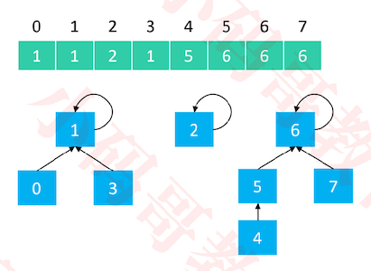

+ 不难看出
  - 0、1、3 属于同一集合
  - 2 单独属于一个集合
  - 4、5、6、7 属于同一集合
  - 其对应位置存储的值，即为它们的父节点
+ 因此，并查集是可以用数组实现的树形结构（二叉堆、优先级队列也是可以用数组实现的树形结构）

### 接口定义

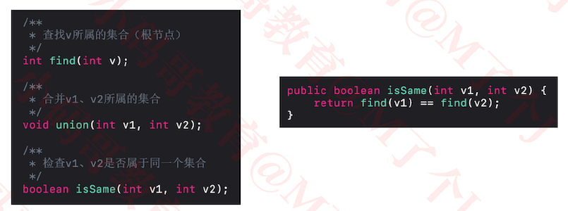

### 初始化

+ 初始化时，每个元素各自属于一个单元素集合

  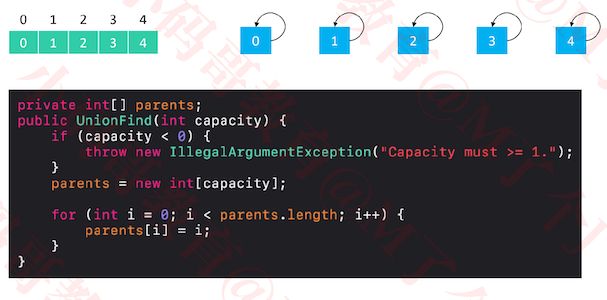

### Quick Find

#### Union操作

+ Quick Find 的 union(v1, v2)：让 v1 所在集合的所有元素都指向 v2 的根节点

  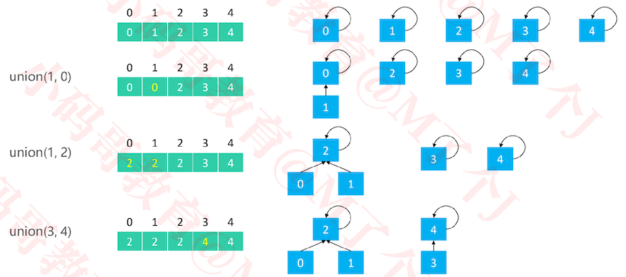

  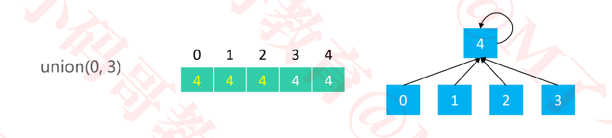

  + union(1,0)，将左边元素1所在的集合的所有元素的父节点，改为右边元素0的父节点，这样两个集合就连起来了。因此1的父节点变为0
  + union(1,2)， 将左边元素1所在的集合的所有元素的父节点，改为右边元素2的父节点.因此0， 1的父节点变为2
  + 最终将所有的元素都连接在一起时，所有的元素拥有一个共同的根节点

#### Find操作

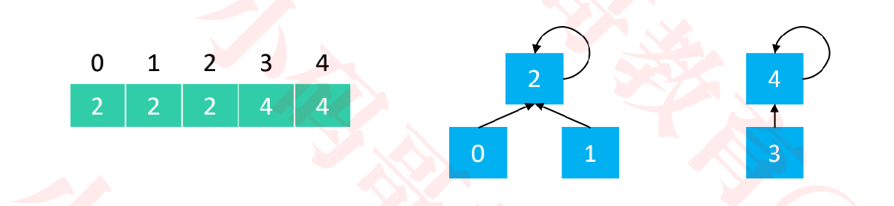

+ 对应存储的元素就是对应的父节点
+ 时间复杂度为O(1)

#### 代码实现

```java
package com.mj.union;

/**
 * Quick Find
 * @author MJ Lee
 *
 */
public class UnionFind_QF extends UnionFind {
	public UnionFind_QF(int capacity) {
		super(capacity);
	}

	/*
	 * 父节点就是根节点
	 */
	public int find(int v) {
		rangeCheck(v);
		return parents[v];
	}

	/**
	 * 将v1所在集合的所有元素，都嫁接到v2的父节点上
	 */
	public void union(int v1, int v2) {
    //p1即为v1的根节点
    //p2即为v2的根节点
		int p1 = find(v1);
		int p2 = find(v2);
		if (p1 == p2) return;
		for (int i = 0; i < parents.length; i++) {
			if (parents[i] == p1) {
				parents[i] = p2;
			}
		}
	}
}
```

### Quick Union 

#### Union操作

+ Quick Union 的 union(v1, v2)：让 v1 的根节点指向 v2 的根节点

  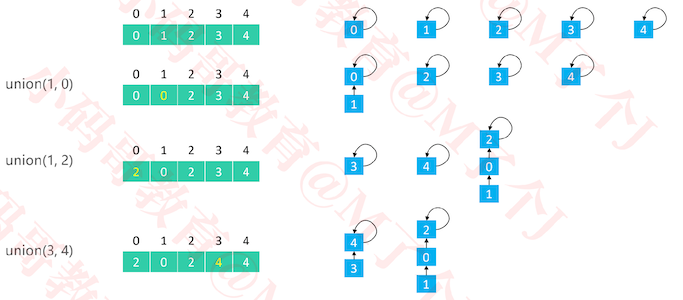

  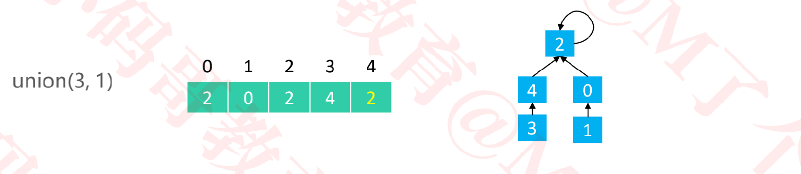

  + union(1,2) ， 让1所在集合的**根节点0**的父节点，变为2所在集合的**根节点2**。因此将0位置对应的元素变为2

#### find操作

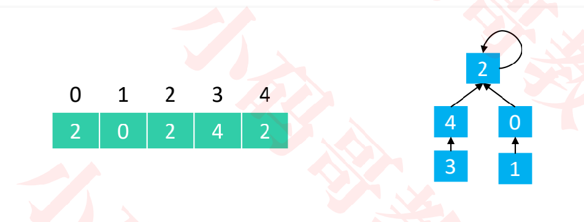

+ find(0) == 2
+ find(1) == 2
+ find(3) == 2
+ find(2) == 2
+ 时间复杂度：O(logn)

#### 代码实现

```java
/**
 * Quick Union
 * @author MJ Lee
 *
 */
public class UnionFind_QU extends UnionFind {

	public UnionFind_QU(int capacity) {
		super(capacity);
	}
	/**
	 * 通过parent链条不断地向上找，直到找到根节点
	 */
	public int find(int v) {
		rangeCheck(v);
		while (v != parents[v]) {
			v = parents[v];
		}
		return v;
	}

	/**
	 * 将v1的根节点嫁接到v2的根节点上
	 */
	public void union(int v1, int v2) {
		int p1 = find(v1);
		int p2 = find(v2);
		if (p1 == p2) return;
		parents[p1] = p2;
	}

}
```


####  优化

+ 在Union的过程中，可能会出现树不平衡的情况，甚至退化成链表

  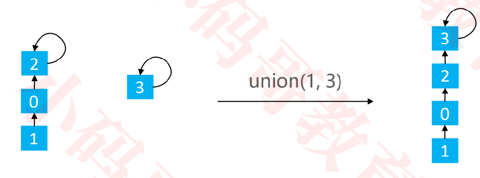

+ 有2种常见的优化方案
  - 基于size的优化：元素少的树 嫁接到 元素多的树
  - <font color=red>基于rank的优化</font>：矮的树 嫁接到 高的树

##### 基于size的优化

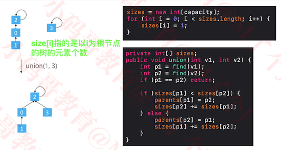

+ 基于size的优化，也可能会存在树不平衡的问题

  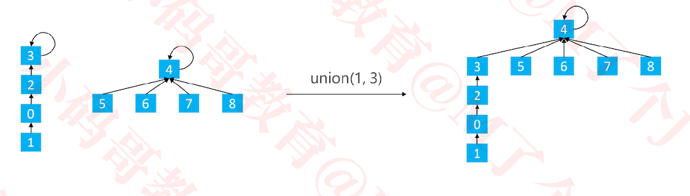

+ 代码实现

  ```java
  /**
   * Quick Union - 基于size的优化
   * @author MJ Lee
   *
   */
  public class UnionFind_QU_S extends UnionFind_QU {
  	private int[] sizes;
  
  	public UnionFind_QU_S(int capacity) {
  		super(capacity);
  		
  		sizes = new int[capacity];
  		for (int i = 0; i < sizes.length; i++) {
  			sizes[i] = 1;
  		}
  	}
  
  	/**
  	 * 将v1的根节点嫁接到v2的根节点上
  	 */
  	public void union(int v1, int v2) {
  		int p1 = find(v1);
  		int p2 = find(v2);
  		if (p1 == p2) return;
  		//将节点数量少的，放到节点数量多的下面
  		if (sizes[p1] < sizes[p2]) {
  			parents[p1] = p2;
  			sizes[p2] += sizes[p1];
  		} else {
  			parents[p2] = p1;
  			sizes[p1] += sizes[p2];
  		}
  	}
  
  }
  ```

##### 基于rank的优化

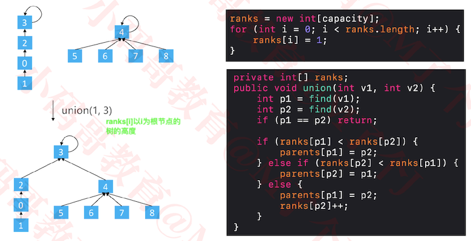

+ 代码实现

  ```java
  package com.mj.union;
  
  /**
   * Quick Union - 基于rank的优化
   * @author MJ Lee
   *
   */
  public class UnionFind_QU_R extends UnionFind_QU {
  	private int[] ranks;
  
  	public UnionFind_QU_R(int capacity) {
  		super(capacity);
  
  		ranks = new int[capacity];
  		for (int i = 0; i < ranks.length; i++) {
  			ranks[i] = 1;
  		}
  	}
  	
  	public void union(int v1, int v2) {
  		int p1 = find(v1);
  		int p2 = find(v2);
  		if (p1 == p2) return;
  		
  		if (ranks[p1] < ranks[p2]) {
  			parents[p1] = p2;
  		} else if (ranks[p1] > ranks[p2]) {
  			parents[p2] = p1;
  		} else {
  			parents[p1] = p2;
  			ranks[p2] += 1;
  		}
  	}
  }
  
  ```

###### 路径压缩 （Path Compression）

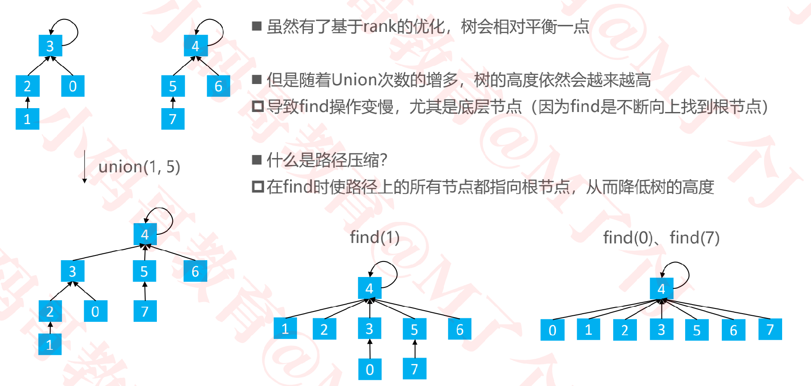

+ 路径压缩使路径上的所有节点都指向根节点，所以实现成本稍高

+ 还有2种更优的做法，不但能降低树高，实现成本也比路径压缩低

  - 路径分裂（Path Spliting）
  - 路径减半（Path Halving）

+ 路径分裂、路径减半的效率差不多，但都比路径压缩要好

+ 代码实现

  ```java
  /**
   * Quick Union - 基于rank的优化 - 路径压缩(Path Compression)
   * @author MJ Lee
   *
   */
  public class UnionFind_QU_R_PC extends UnionFind_QU_R {
  
  	public UnionFind_QU_R_PC(int capacity) {
  		super(capacity);
  	}
  	
  	@Override
  	public int find(int v) { // v == 1, parents[v] == 2
  		rangeCheck(v);
  		if (parents[v] != v) {
  			parents[v] = find(parents[v]);
  		}
  		return parents[v];
  	}
  }
  
  ```

  

###### 路径分裂（Path Spliting）

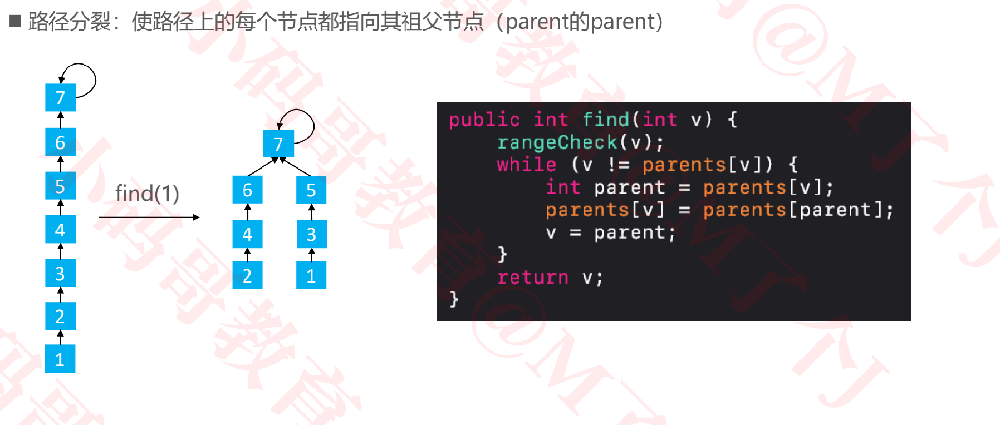

+ 代码实现

  ```java
  
  /**
   * Quick Union - 基于rank的优化 - 路径分裂(Path Spliting)
   * @author MJ Lee
   *
   */
  public class UnionFind_QU_R_PS extends UnionFind_QU_R {
  
  	public UnionFind_QU_R_PS(int capacity) {
  		super(capacity);
  	}
  	
  	@Override
  	public int find(int v) { 
  		rangeCheck(v);
  		while (v != parents[v]) {
  			int p = parents[v];
  			parents[v] = parents[parents[v]];
  			v = p;
  		}
  		return v;
  	}
  }
  ```

  

###### 路径减半（Path Halving）

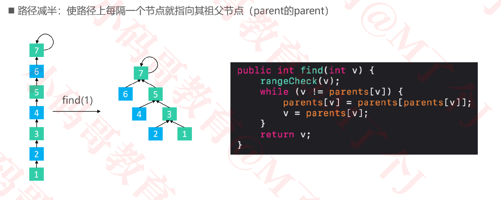

```java
/**
 * Quick Union - 基于rank的优化 - 路径减半(Path Halving)
 * @author MJ Lee
 *
 */
public class UnionFind_QU_R_PH extends UnionFind_QU_R {

	public UnionFind_QU_R_PH(int capacity) {
		super(capacity);
	}
	
	@Override
	public int find(int v) { 
		rangeCheck(v);
		while (v != parents[v]) {
			parents[v] = parents[parents[v]];
			v = parents[v];
		}
		return v;
	}
}
```


### 总结

+ 摘自《维基百科》： https://en.wikipedia.org/wiki/Disjoint-set_data_structure#Time_complexity

  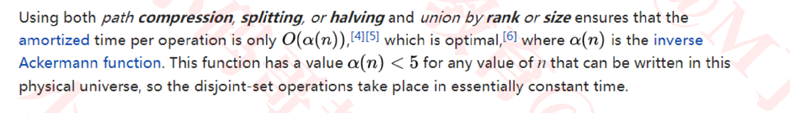

+ 大概意思是
  - 使用路径压缩、分裂或减半 + 基于rank或者size的优化
    - 可以确保每个操作的均摊时间复杂度为 O(α(𝑛)) ，α(𝑛) < 5
+ 个人建议的搭配
  - Quick Union
  - 基于 rank 的优化
  -  Path Halving 或 Path Spliting

### 自定义类型

+ 之前的使用都是基于整型数据，如果其他自定义类型也想使用并查集呢？
  - 方案一：通过一些方法将自定义类型转为整型后使用并查集（比如生成哈希值）
  - 方案二：使用链表+映射（Map）

```java
public class GenericUnionFind<V> {
	private Map<V, Node<V>> nodes = new HashMap<>();

	public void makeSet(V v) {
		if (nodes.containsKey(v)) return;
		nodes.put(v, new Node<>(v));
	}
	
	/**
	 * 找出v的根节点
	 */
	private Node<V> findNode(V v) {
		Node<V> node = nodes.get(v);
		if (node == null) return null;
		while (!Objects.equals(node.value, node.parent.value)) {
			node.parent = node.parent.parent;
			node = node.parent;
		}
		return node;
	}
	
	public V find(V v) {
		Node<V> node = findNode(v);
		return node == null ? null : node.value;
	}
	
	public void union(V v1, V v2) {
		Node<V> p1 = findNode(v1);
		Node<V> p2 = findNode(v2);
		if (p1 == null || p2 == null) return;
		if (Objects.equals(p1.value, p2.value)) return;
		
		if (p1.rank < p2.rank) {
			p1.parent = p2;
		} else if (p1.rank > p2.rank) {
			p2.parent = p1;
		} else {
			p1.parent = p2;
			p2.rank += 1;
		}
	}
	
	public boolean isSame(V v1, V v2) {
		return Objects.equals(find(v1), find(v2));
	}
	
	private static class Node<V> {
		V value;
		Node<V> parent = this;
		int rank = 1;
		Node(V value) {
			this.value = value;
		}
	}
}

```

