## 递归（Recursion）

###  递归（Recursion）

+ 递归：函数（方法）直接或间接调用自身。是一种常用的编程技巧

  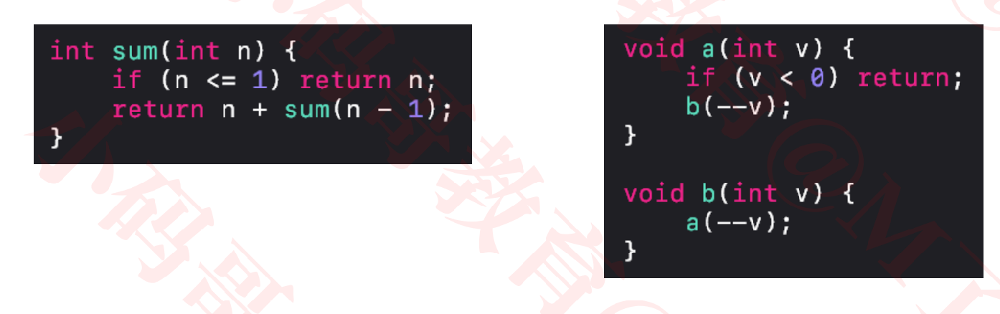

### 递归现象


### 函数的调用过程

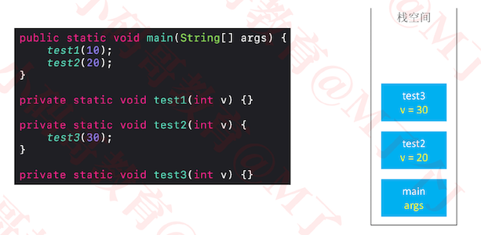

### 函数的递归调用过程

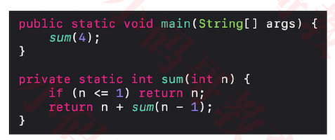

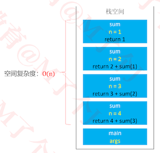

+ 如果递归调用没有终止，将会一直消耗栈空间
  - 最终导致栈内存溢出（Stack Overflow）
+  所以必需要有一个明确的结束递归的条件
  - 也叫作边界条件、递归基

### 函数的递归调用过程

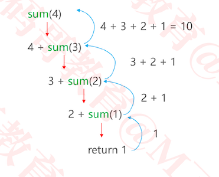

### 实例分析

+ 求 1+2+3+...+(n-1)+n 的和（n>0）

  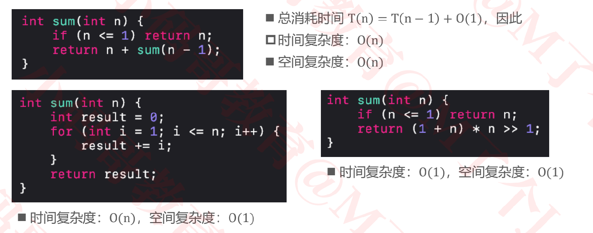

+ 注意：使用递归不是为了求得最优解，是为了简化解决问题的思路，代码会更加简洁

+ 递归求出来的很有可能不是最优解，也有可能是最优解

### 递归的基本思想

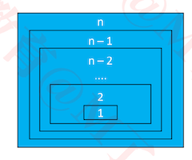

+ 拆解问题

  - 把规模大的问题变成规模较小的同类型问题
  - 规模较小的问题又不断变成规模更小的问题
  - 规模小到一定程度可以直接得出它的解

  

+ 求解
  - 由最小规模问题的解得出较大规模问题的解
  - 由较大规模问题的解不断得出规模更大问题的解
  - 最后得出原来问题的解
+ 凡是可以利用上述思想解决问题的，都可以尝试使用递归
  - 很多链表、二叉树相关的问题都可以使用递归来解决
    -  因为链表、二叉树本身就是递归的结构（链表中包含链表，二叉树中包含二叉树）

### 递归的使用套路

+ ① 明确函数的功能
  - 先不要去思考里面代码怎么写，首先搞清楚这个函数的干嘛用的，能完成什么功能？
+ ② 明确原问题与子问题的关系
  - 寻找 f(n) 与 f(n – 1) 的关系
+ 明确递归基（边界条件）
  - 递归的过程中，子问题的规模在不断减小，当小到一定程度时可以直接得出它的解
  - 寻找递归基，相当于是思考：问题规模小到什么程度可以直接得出解？

### 练习1 – 斐波那契数列

+ 斐波那契数列：1、1、2、3、5、8、13、21、34、……
  - F(1)=1，F(2)=1, F(n)=F(n-1)+F(n-2)（n≥3）
+ 编写一个函数求第 n 项斐波那契数
+ 根据递推式 T n = T(n − 1) + T(n − 2) + O(1)，可得知时间复杂度：O(2<sup>n</sup>)
+ 空间复杂度：O(n)
  - 递归调用的空间复杂度 = 递归深度 * 每次调用所需的辅助空间

#### fib函数的调用过程

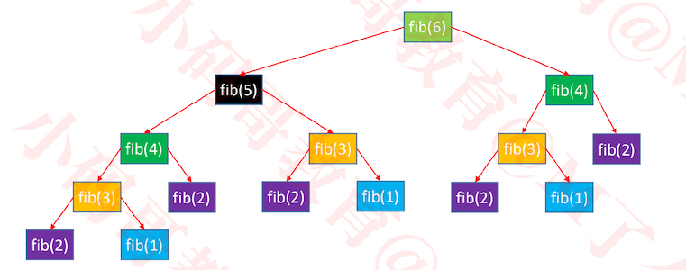

+ 出现了特别多的重复计算

+ fib(6) = fib(5) + fib(4)， fib(5)完全调用结束,才会调用fib(4)

+ 这是一种“自顶向下”的调用过程

+ 空间复杂度跟深度有关

  ```
  从fib(6), fib(5), fib(4), fib(3), fib(2), 函数依次push到栈空间中，占用的空间最高为 (n -1)*单个函数栈的大小。
  
  后面的函数push进栈，pop出栈，其空间复杂度基本维持在n-1之内
  ```

#### 代码实现

```java
int fib0(int n) {
		if (n <= 2) return 1;
		return fib0(n - 1) + fib0(n - 2);
	}
```

#### fib优化1 – 记忆化

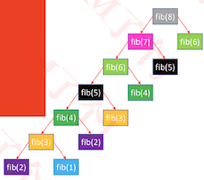

+ 用数组存放计算过的结果，避免重复计算

  ```java
  int fib1(int n) {
  		if (n <= 2) return 1;
  		int[] array = new int[n + 1];
  		array[1] = array[2] = 1;
  		return fib1(n, array);
  	}
  	// array[n]存储的值即为斐波那契数列第n项的值
  	int fib1(int n, int[] array) {
  		if (array[n] == 0) {
  			array[n] = fib1(n - 1, array) + fib1(n - 2, array);
  		}
  		return array[n];
  	}
  ```

+ 时间复杂度：O(n)，空间复杂度：O(n)

#### fib优化2 - 去除递归调用
```java
int fib2(int n) {
		if (n <= 2) return 1;
		int[] array = new int[n + 1];
		array[1] = array[2] = 1;
		for (int i = 3; i <= n; i++) {
			array[i] = array[i - 1] + array[i - 2];
		}
		return array[n];
	}
```

+ 时间复杂度：O(n)，空间复杂度：O(n)
+ 这是一种“自底向上”的计算过程

#### fib优化3 - 滚动数组

+ 由于每次运算只需要用到数组中的 2 个元素，所以可以使用**滚动数组**来优化

  ```java
  int fib3(int n) {
  		if (n <= 2) return 1;
  		int[] array = new int[2];
  		array[0] = array[1] = 1;
  		for (int i = 3; i <= n; i++) {
  			array[i % 2] = array[(i - 1) % 2] + array[(i - 2) % 2];
  		}
  		return array[n % 2];
  	}
  ```

+ 时间复杂度：O(n)，空间复杂度：O(1)

#### fib优化4 – 位运算取代模运算

+ 乘、除、模运算效率较低，建议用其他方式取代

  ```java
  /*
  	 * 4 % 2 = 0  0b100 & 0b001 = 0
  	 * 3 % 2 = 1  0b011 & 0b001 = 1
  	 * 5 % 2 = 1  0b101 & 0b001 = 1
  	 * 6 % 2 = 0  0b110 & 0b001 = 0
  	 */
  	int fib4(int n) {
  		if (n <= 2) return 1;
  		int[] array = new int[2];
  		array[0] = array[1] = 1;
  		for (int i = 3; i <= n; i++) {
  			array[i & 1] = array[(i - 1) & 1] + array[(i - 2) & 1];
  		}
  		return array[n & 1];
  	}
  ```

  

#### fib优化5 - 循环相加

```java
int fib5(int n) {
		if (n <= 2) return 1;
    int first = 1;
    int second = 1;
		array[1] = array[2] = 1;
		for (int i = 3; i <= n; i++) {
			second = first + second;
      first = second - first;
		}
		return second;
}

public static int fib5(int n) {
		if (n <= 1) return n;
		int first = 0;
		int second = 1;
		for (int i = 0; i < n - 1; i++) {
      //second += first;
			//first = second - first;
			int sum = first + second;
			first = second;
			second = sum;
		}
		return second;
}
```

+ 时间复杂度：O(n)，空间复杂度：O(1)


#### fib优化6- 特征方程

+ 斐波那契数列有个线性代数解法：特征方程

  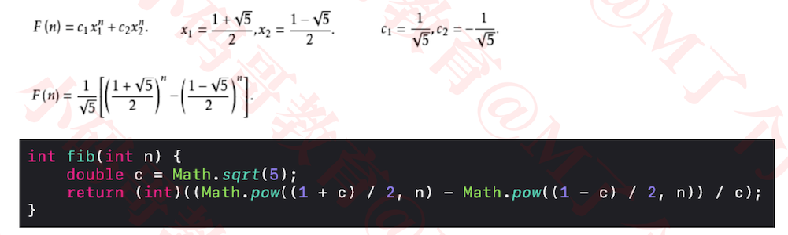

+ 时间复杂度、空间复杂度取决于 pow 函数（至少可以低至O(logn) ）


### 练习2 – 上楼梯（跳台阶）

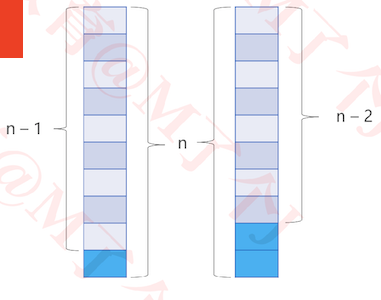

+ 楼梯有 n 阶台阶，上楼可以一步上 1 阶，也可以一步上 2 阶，走完 n 阶台阶共有多少种不同的走法？

  - 假设 n 阶台阶有 f(n) 种走法，第 1 步有 2 种走法
    - 如果上 1 阶，那就还剩 n – 1 阶，共 f(n – 1) 种走法
    - 如果上 2 阶，那就还剩 n – 2 阶，共 f(n – 2) 种走法
  - 所以 f(n) = f(n – 1) + f(n – 2)

  