## 递归（Recursion）

###  递归（Recursion）

+ 递归：函数（方法）直接或间接调用自身。是一种常用的编程技巧

  

### 递归现象


### 函数的调用过程


### 函数的递归调用过程


+ 如果递归调用没有终止，将会一直消耗栈空间
  - 最终导致栈内存溢出（Stack Overflow）
+  所以必需要有一个明确的结束递归的条件
  - 也叫作边界条件、递归基

### 函数的递归调用过程


### 实例分析

+ 求 1+2+3+...+(n-1)+n 的和（n>0）

  

+ 注意：使用递归不是为了求得最优解，是为了简化解决问题的思路，代码会更加简洁

+ 递归求出来的很有可能不是最优解，也有可能是最优解

### 递归的基本思想


+ 拆解问题

  - 把规模大的问题变成规模较小的同类型问题
  - 规模较小的问题又不断变成规模更小的问题
  - 规模小到一定程度可以直接得出它的解

  

+ 求解
  - 由最小规模问题的解得出较大规模问题的解
  - 由较大规模问题的解不断得出规模更大问题的解
  - 最后得出原来问题的解
+ 凡是可以利用上述思想解决问题的，都可以尝试使用递归
  - 很多链表、二叉树相关的问题都可以使用递归来解决
    -  因为链表、二叉树本身就是递归的结构（链表中包含链表，二叉树中包含二叉树）

### 递归的使用套路

+ ① 明确函数的功能
  - 先不要去思考里面代码怎么写，首先搞清楚这个函数的干嘛用的，能完成什么功能？
+ ② 明确原问题与子问题的关系
  - 寻找 f(n) 与 f(n – 1) 的关系
+ 明确递归基（边界条件）
  - 递归的过程中，子问题的规模在不断减小，当小到一定程度时可以直接得出它的解
  - 寻找递归基，相当于是思考：问题规模小到什么程度可以直接得出解？

### 练习1 – 斐波那契数列

+ 斐波那契数列：1、1、2、3、5、8、13、21、34、……
  - F(1)=1，F(2)=1, F(n)=F(n-1)+F(n-2)（n≥3）
+ 编写一个函数求第 n 项斐波那契数
+ 根据递推式 T n = T(n − 1) + T(n − 2) + O(1)，可得知时间复杂度：O(2<sup>n</sup>)
+ 空间复杂度：O(n)
  - 递归调用的空间复杂度 = 递归深度 * 每次调用所需的辅助空间

#### fib函数的调用过程


+ 出现了特别多的重复计算

+ fib(6) = fib(5) + fib(4)， fib(5)完全调用结束,才会调用fib(4)

+ 这是一种“自顶向下”的调用过程

+ 空间复杂度跟深度有关

  ```
  从fib(6), fib(5), fib(4), fib(3), fib(2), 函数依次push到栈空间中，占用的空间最高为 (n -1)*单个函数栈的大小。
  
  后面的函数push进栈，pop出栈，其空间复杂度基本维持在n-1之内
  ```

#### 代码实现

```java
int fib0(int n) {
		if (n <= 2) return 1;
		return fib0(n - 1) + fib0(n - 2);
	}
```

#### fib优化1 – 记忆化


+ 用数组存放计算过的结果，避免重复计算

  ```java
  int fib1(int n) {
  		if (n <= 2) return 1;
  		int[] array = new int[n + 1];
  		array[1] = array[2] = 1;
  		return fib1(n, array);
  	}
  	// array[n]存储的值即为斐波那契数列第n项的值
  	int fib1(int n, int[] array) {
  		if (array[n] == 0) {
  			array[n] = fib1(n - 1, array) + fib1(n - 2, array);
  		}
  		return array[n];
  	}
  ```

+ 时间复杂度：O(n)，空间复杂度：O(n)

#### fib优化2 - 去除递归调用
```java
int fib2(int n) {
		if (n <= 2) return 1;
		int[] array = new int[n + 1];
		array[1] = array[2] = 1;
		for (int i = 3; i <= n; i++) {
			array[i] = array[i - 1] + array[i - 2];
		}
		return array[n];
	}
```

+ 时间复杂度：O(n)，空间复杂度：O(n)
+ 这是一种“自底向上”的计算过程

#### fib优化3 - 滚动数组

+ 由于每次运算只需要用到数组中的 2 个元素，所以可以使用**滚动数组**来优化

  ```java
  int fib3(int n) {
  		if (n <= 2) return 1;
  		int[] array = new int[2];
  		array[0] = array[1] = 1;
  		for (int i = 3; i <= n; i++) {
  			array[i % 2] = array[(i - 1) % 2] + array[(i - 2) % 2];
  		}
  		return array[n % 2];
  	}
  ```

+ 时间复杂度：O(n)，空间复杂度：O(1)

#### fib优化4 – 位运算取代模运算

+ 乘、除、模运算效率较低，建议用其他方式取代

  ```java
  /*
  	 * 4 % 2 = 0  0b100 & 0b001 = 0
  	 * 3 % 2 = 1  0b011 & 0b001 = 1
  	 * 5 % 2 = 1  0b101 & 0b001 = 1
  	 * 6 % 2 = 0  0b110 & 0b001 = 0
  	 */
  	int fib4(int n) {
  		if (n <= 2) return 1;
  		int[] array = new int[2];
  		array[0] = array[1] = 1;
  		for (int i = 3; i <= n; i++) {
  			array[i & 1] = array[(i - 1) & 1] + array[(i - 2) & 1];
  		}
  		return array[n & 1];
  	}
  ```

  

#### fib优化5 - 循环相加

```java
int fib5(int n) {
		if (n <= 2) return 1;
    int first = 1;
    int second = 1;
		array[1] = array[2] = 1;
		for (int i = 3; i <= n; i++) {
			second = first + second;
      first = second - first;
		}
		return second;
}

public static int fib5(int n) {
		if (n <= 1) return n;
		int first = 0;
		int second = 1;
		for (int i = 0; i < n - 1; i++) {
      //second += first;
			//first = second - first;
			int sum = first + second;
			first = second;
			second = sum;
		}
		return second;
}
```

+ 时间复杂度：O(n)，空间复杂度：O(1)


#### fib优化6- 特征方程

+ 斐波那契数列有个线性代数解法：特征方程

  

+ 时间复杂度、空间复杂度取决于 pow 函数（至少可以低至O(logn) ）


### 练习2 – 上楼梯（跳台阶）


+ 楼梯有 n 阶台阶，上楼可以一步上 1 阶，也可以一步上 2 阶，走完 n 阶台阶共有多少种不同的走法？
  - 假设 n 阶台阶有 f(n) 种走法，第 1 步有 2 种走法
    - 如果上 1 阶，那就还剩 n – 1 阶，共 f(n – 1) 种走法
    - 如果上 2 阶，那就还剩 n – 2 阶，共 f(n – 2) 种走法
  - 所以 f(n) = f(n – 1) + f(n – 2)
+ 假设只有1个台阶，只能走1步，  则f(1) = 1。假设只有2个台阶，分别走1步或直接走两步，则f(2) = 2。 

+ 代码实现

  ```java
  public class ClimbStairs {
  	int climbStairs(int n) {
  		if (n <= 2) return n;
  		return climbStairs(n - 1) + climbStairs(n - 2);
  	}
   //climbStairs2
   int climbStairs(int n) {
  	int (n <=2) return n;
  	int first = 1;
  	int second = 2;
  	for (int i = 3; i <=n i++) {
  		second = first + second;
  		first = second - first;
  	}
  	return second;
   }
  }
  ```

### 练习3 – 汉诺塔（Hanoi）

+ 编程实现把 A 的 n 个盘子移动到 C（盘子编号是 [1, n] ）

  - 每次只能移动1个盘子

  - 大盘子只能放在小盘子下面

    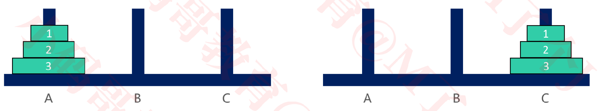

+ 实例

  - 1个盘子

    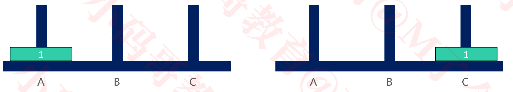

  - 2个盘子

    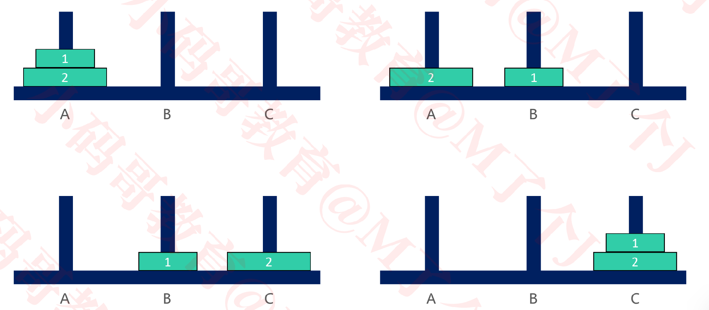

  - 3个盘子

    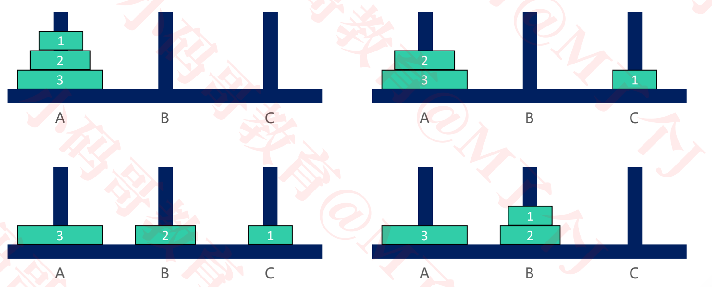

+ 思路

  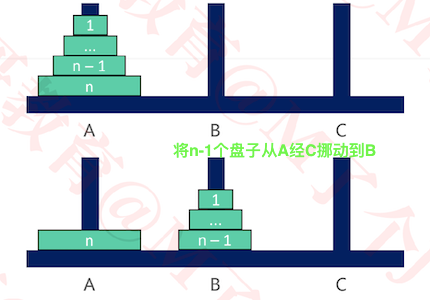

  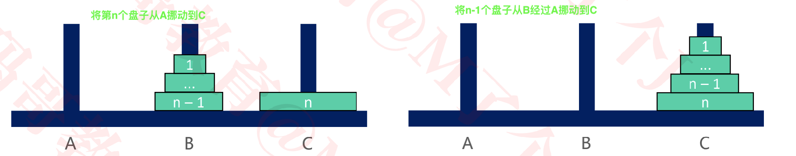

  - 其实分 2 种情况讨论即可
    1. 当 n == 1时，直接将盘子从 A 移动到C
    2. 当 n > 1时，可以拆分成3大步骤
       - ①将 n – 1 个盘子从 A 移动到B
       - ②将编号为 n 的盘子从 A 移动到C
       - ③将 n – 1 个盘子从 B 移动到C
         -  步骤①③ 明显是个递归调用

+ 代码实现

  ```java
  public class Hanoi {
  	/**
  	 * 将 n 个碟子从 p1 挪动到 p3
  	 * @param p2 中间的柱子
  	 */
    //将n个盘子,从p1经过p2,移动到p3. 
    //1. 应该将n-1个盘子经过若干步骤后，从p1移动到p2
    //2. 最底部的盘子应该最后挪动
  	void hanoi(int n, String p1, String p2, String p3) {
  		if (n == 1) {
  			move(n, p1, p3);
  			return;
  		}
      //将n-1个盘子从p1经过p3移动到p2
  		hanoi(n - 1, p1, p3, p2);
      //将第n个盘子从p1直接挪动到p3，此时已经最大的盘子挪动到p3
  		move(n, p1, p3);
      //将剩下的n-1个盘子从p2，经过p1，挪动到p3
  		hanoi(n - 1, p2, p1, p3);
  	} 
  	// T(n) = 2 * [2 * T(n - 2) + O(1)] + O(1)
  	// T(n) = 2^2 * [2 * T(n - 3) + O(1)] + 2 * O(1) + O(1)
  	// T(n) = 2^3 * T(n - 3) + (2^2 + 2^1 + 2^0) * O(1)
  	// T(n) = 2^(n - 1) * O(1) + (2^(n-2) + ... + 2^2 + 2^1 + 2^0) * O(1)
  	// T(n) = [2^(n - 1)+ 2^(n-2) + ... + 2^2 + 2^1 + 2^0] * O(1)
  	// T(n) = (2^n - 1) * O(1)
  
  	/**
  	 * 将 no 号盘子从 from 移动到 to
  	 * @param no
  	 * @param from
  	 * @param to
  	 */
  	void move(int no, String from, String to) {
  		System.out.println("将" + no + "号盘子从" + from + "移动到" + to);
  	}
  }	
  
  ```

+ 测试

  ```java
  public static void main(String[] args) {
  	new Hanoi().hanoi(5, "A", "B", "C");
  }
  
  将1号盘子从A移动到C
  将2号盘子从A移动到B
  将1号盘子从C移动到B
  将3号盘子从A移动到C
  将1号盘子从B移动到A
  将2号盘子从B移动到C
  将1号盘子从A移动到C
  将4号盘子从A移动到B
  将1号盘子从C移动到B
  将2号盘子从C移动到A
  将1号盘子从B移动到A
  将3号盘子从C移动到B
  将1号盘子从A移动到C
  将2号盘子从A移动到B
  将1号盘子从C移动到B
  将5号盘子从A移动到C
  将1号盘子从B移动到A
  将2号盘子从B移动到C
  将1号盘子从A移动到C
  将3号盘子从B移动到A
  将1号盘子从C移动到B
  将2号盘子从C移动到A
  将1号盘子从B移动到A
  将4号盘子从B移动到C
  将1号盘子从A移动到C
  将2号盘子从A移动到B
  将1号盘子从C移动到B
  将3号盘子从A移动到C
  将1号盘子从B移动到A
  将2号盘子从B移动到C
  将1号盘子从A移动到C
  ```

  

+ 复杂度

  + 时间复杂度为O(2<sup>n</sup>),  T(n) = 2 ∗ T(n - 1) + O(1)
  + 空间复杂度为O(n)

### 递归转非递归

+ 递归调用的过程中，会将每一次调用的参数、局部变量都保存在了对应的栈帧（Stack Frame）中

  栈空间

  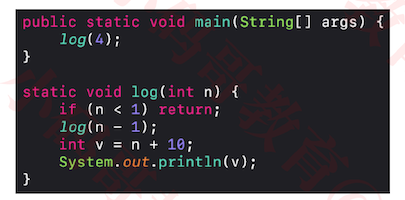

  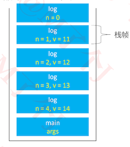

+ 若递归调用深度较大，会占用比较多的栈空间，甚至会导致栈溢出

+ 这时可以考虑将递归转为非递归（递归100%可以转换成非递归）

+ 递归转非递归的万能方法

  - 自己维护一个栈，来保存参数、局部变量

  - 但是空间复杂度依然没有得到优化

    ```java
    static class Frame {
    		int n;
    		int v;
    		Frame(int n, int v) {
    			this.n = n;
    			this.v = v;
    		}
    	}
    	static void log2(int n) {
    		Stack<Frame> frames = new Stack<>();
    		while (n > 0) {
    			frames.push(new Frame(n, n + 10));
    			n--;
    		}
    		while (!frames.isEmpty()) {
    			Frame frame = frames.pop();
    			System.out.println(frame.v);
    		}
    	}
    ```

+ 在某些时候，也可以重复使用一组相同的变量来保存每个栈帧的内容

  ```java
  static void log(int n) {
    for(int i = 1; i <=n; i++) {
      System.out.println(i+10);
    }
  }
  ```

+ 这里重复使用变量i保存原来栈帧中的参数

  - 空间复杂度从O(n)降低到了O(1)

### 尾调用

+ 尾调用：一个函数的最后一个动作是调用函数

  - 如果最后一个动作是调用自身，称为尾递归（Tail Recursion），是尾调用的特殊情况

    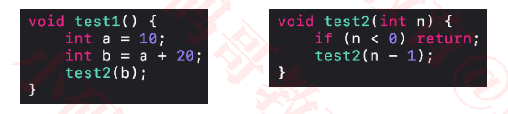

+  一些编译器能对尾调用进行优化，以达到节省栈空间的目的

  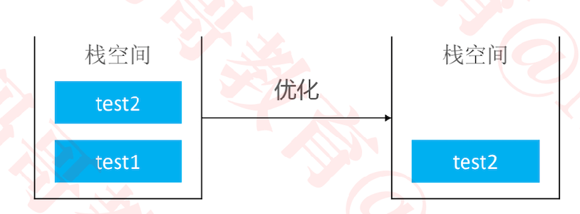

  

### 下面代码不是尾调用

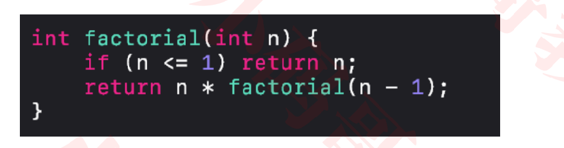

+ 因为它最后1个动作是乘法

### 尾调用优化（Tail Call Optimization）

+ 尾调用优化也叫做尾调用消除（Tail Call Elimination）

  - 如果当前栈帧上的局部变量等内容都不需要用了，当前栈帧经过适当的改变后可以直接当作被尾调用的函数的栈帧使用，然后程序可以 jump 到被尾调用的函数代码
  - 生成栈帧改变代码与 jump 的过程称作尾调用消除或尾调用优化
  - 尾调用优化让位于尾位置的函数调用跟 goto 语句性能一样高

+ 消除尾递归里的尾调用比消除一般的尾调用容易很多

  - 比如Java虚拟机（JVM）会消除尾递归里的尾调用，但不会消除一般的尾调用（因为改变不了栈帧）

    ```
    尾调用时，两个函数的栈帧大小可能不相同。所以不能复用上一个函数的栈帧
    尾递归时，两个函数的栈帧大小一定相同。 所以能复用上一个函数的栈帧
    ```

  - 因此尾递归优化相对比较普遍，平时的递归代码可以考虑尽量使用尾递归的形式

### 尾调用优化前的汇编代码（C++）

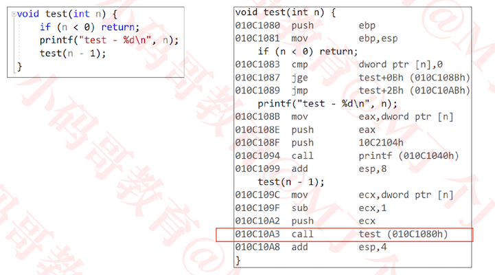

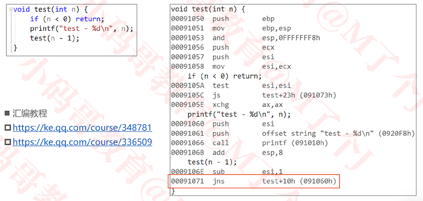


### 尾递归示例1 – 阶乘 

+ 求 n 的阶乘 1*2*3*...*(n-1)*n （n>0）

  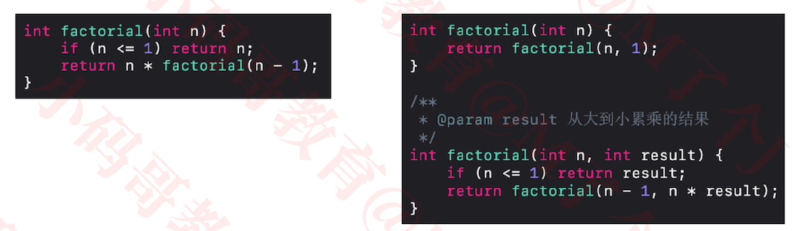

### 尾递归示例2 – 斐波那契数列

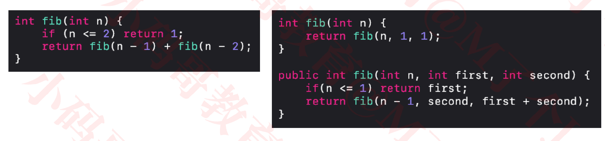