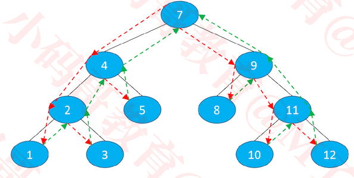
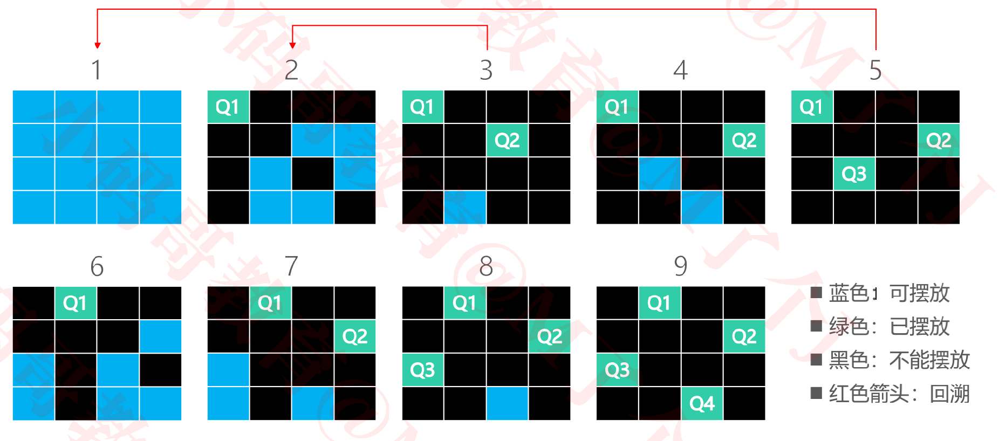
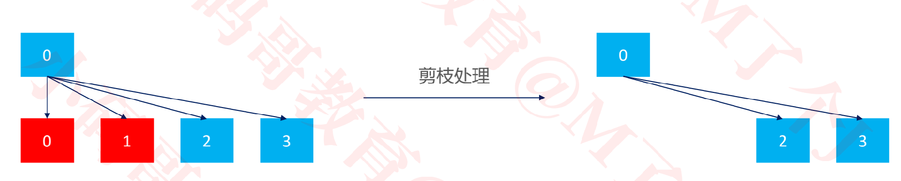
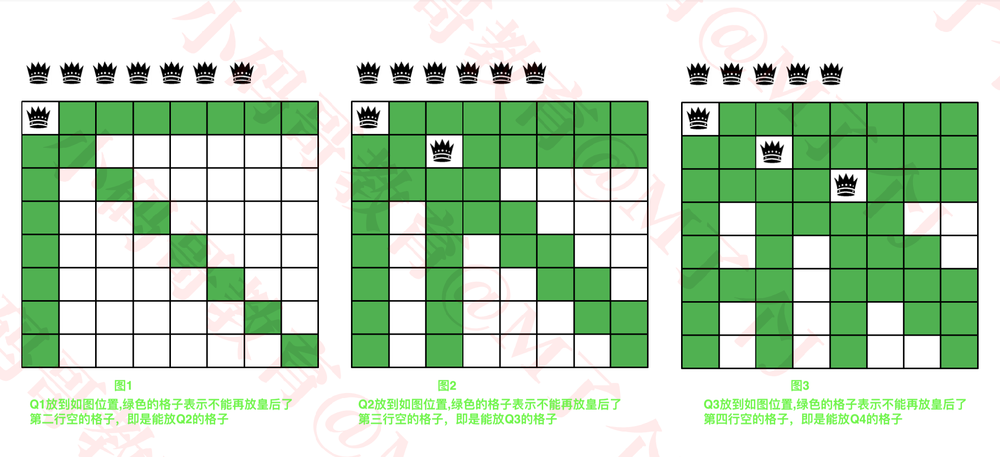
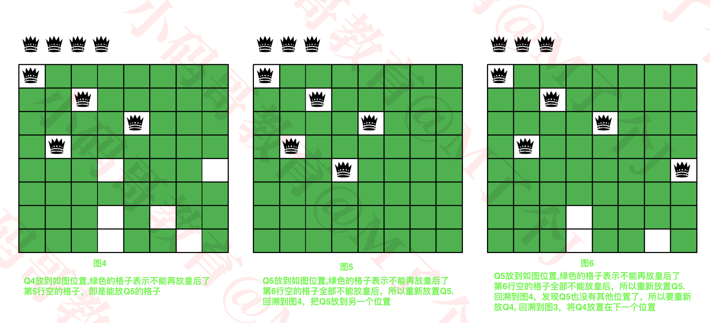
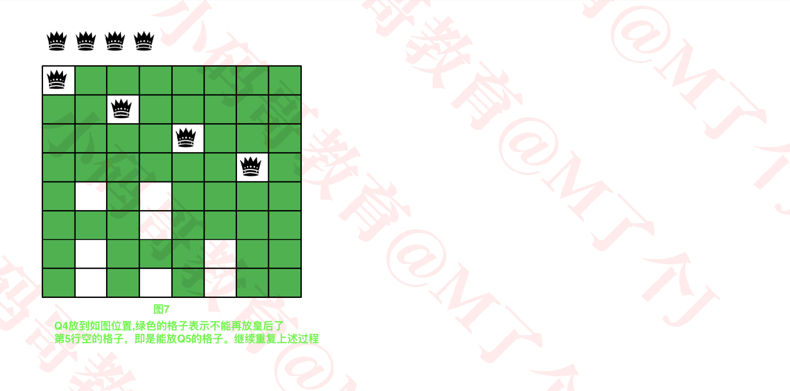

## 回溯（Back Tracking）

+ 回溯可以理解为：通过选择**不同的岔路口**来通往目的地（找到想要的结果）

  - 每一步都选择一条路出发，能进则进，不能进则退回上一步（回溯），换一条路再试

+ 树、图的深度优先搜索（DFS）、八皇后、走迷宫都是典型的回溯应用

  

+ 不难看出,回溯很适合递归


### 练习 – 八皇后问题（Eight Queens）
+ 八皇后问题是一个古老而著名的问题在8x8格的国际象棋上摆放八个皇后，使其不能互相攻击：任意两个皇后都不能处于**同一行、同一列、同一斜线**上

+ 请问有多少种摆法？

  

+  leetcode_51_N皇后：https://leetcode-cn.com/problems/n-queens/

+  leetcode_52_N皇后 II： https://leetcode-cn.com/problems/n-queens-ii/

### 八皇后问题的解决思路

+ 思路一：暴力出奇迹
  + 从 64 个格子中选出任意 8 个格子摆放皇后，检查每一种摆法的可行性
  + 一共 C<sub>64</sub> <sup>8</sup>种摆法（大概是 4.4 ∗ 10<sup>9 </sup>种摆法）

+ 思路二：根据题意减小暴力程度
  - 很显然，每一行只能放一个皇后，所以共有 8<sup>8</sup> 种摆法（16777216 种），检查每一种摆法的可行性
+ 思路三：回溯法
  + 回溯 + 剪枝

### 四皇后 – 回溯法

+ 在解决八皇后问题之前，可以先缩小数据规模，看看如何解决四皇后问题

  

  + Q1放在左上角位置，那么如图2所示，**同一行、同一列、同一斜线**不能再放置其他皇后
  + 在第二行有两个位置可以放Q2，假设放置在图3位置，那么此时下一行没有位置，放Q3。所以要回溯到图2。
  + 将Q2放置在图4位置，在第三行只有1个位置可以放Q3。
  + 当把Q3放置在该位置时，如图5， 那么下一行没有位置放Q4了，所以要回溯到图4,发现Q3没有其他位置了，继续回溯到图2，发现Q2也没有其他位置了，所以回去到图1。
  + Q1放在图6的位置，然后Q2放在图7的位置， 然后Q3放在图8的位置，  然后Q4放在图9的位置。此种情况恰好满足题意。

### 四皇后 – 剪枝（Pruning）



### 八皇后 – 回溯法







### 代码实现

```java
package com.mj;

public class Queens {

	public static void main(String[] args) {
		// TODO Auto-generated method stub
		new Queens().placeQueens(8);
	}
	
	/**
	 * 数组索引是行号，数组元素是列号
	 * 表示二维数组的哪行哪里放了皇后
	 * cols[i] = j 表示第i行，第j列有皇后
	 */
	int[] cols;
	/**
	 * 一共有多少种摆法
	 */
	int ways;
	
	void placeQueens(int n) {
		if (n < 1) return;
		cols = new int[n];
		place(0);
		System.out.println(n + "皇后一共有" + ways + "种摆法");
	}
	
	/**
	 * 从第row行开始摆放皇后
	 * @param row
	 */
	void place(int row) {
    //当row == cols.length,说明所有的皇后已经摆放到合适的位置了
		if (row == cols.length) {
			ways++;
			show();
			return;
		}
		
		for (int col = 0; col < cols.length; col++) {
			if (isValid(row, col)) {
				// 在第row行第col列摆放皇后
				cols[row] = col;
        //第row行摆放完之后，从第row+1行摆放皇后
				place(row + 1);
			}
		}
	}
	
	/**
	 * 判断第row行第col列是否可以摆放皇后
	 * 前row-1行，已经摆放了皇后
	 * 1. 前row-1行，已经摆放了皇后的列不能再摆放皇后
	 * 2. 前row-1行，已经摆放了皇后的位置的对角线不能再摆放皇后
	 */
	boolean isValid(int row, int col) { //体现了剪枝的思想
    //遍历第row行前面的所有行
		for (int i = 0; i < row; i++) {
			// 第col列已经有皇后
			if (cols[i] == col) {
				System.out.println("[" + row + "][" + col + "]=false");
				return false;
			}
			// 第i行的皇后跟第row行第col列格子处在同一斜线上
      // 即为 x0-x1/y0-y1 = 1或-1
			if (row - i == Math.abs(col - cols[i])) {
				System.out.println("[" + row + "][" + col + "]=false");
				return false;
			}
		}
		System.out.println("[" + row + "][" + col + "]=true");
		return true;
	}
	
	void show() {
		for (int row = 0; row < cols.length; row++) {
			for (int col = 0; col < cols.length; col++) {
				if (cols[row] == col) {
					System.out.print("1 ");
				} else {
					System.out.print("0 ");
				}
			}
			System.out.println();
		}
		System.out.println("------------------------------");
	}
}

```

+  代码中是如何体现出回溯和剪枝?

  ```java
  void place(int row) {
      //当row == cols.length,说明所有的皇后已经摆放到合适的位置了
  		if (row == cols.length) {
  			ways++;
  			show();
  			return;
  		}
  		for (int col = 0; col < cols.length; col++) {
  			if (isValid(row, col)) {
  				// 在第row行第col列摆放皇后
  				cols[row] = col;
          //第row行摆放完之后，从第row+1行摆放皇后
  				place(row + 1);
  			}
  		}
  	}
  
  1. place(0) 从第0行开始
  2. for循环遍历每一列col，当(row,col)能够放皇后时，则通过cols[row] = col，记录在第row行皇后在哪一列。
  3. 确定完这一行的皇后时，继续确定下一行的皇后。直到所有的行确定了皇后，则ways+1
  4. 假如下面递归时，无论是否使确定所有的皇后使way++，for循环都会继续选择该行的下一个位置
  ```


### 八皇后的优化

