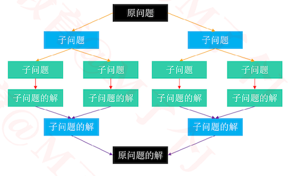
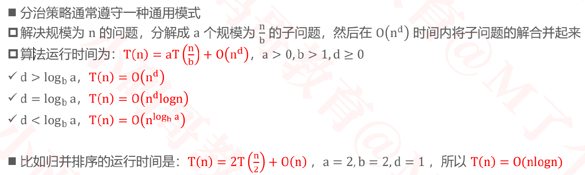
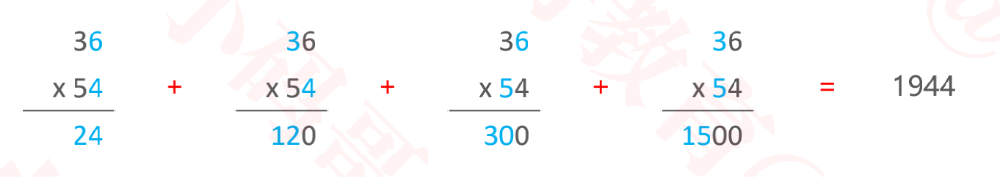
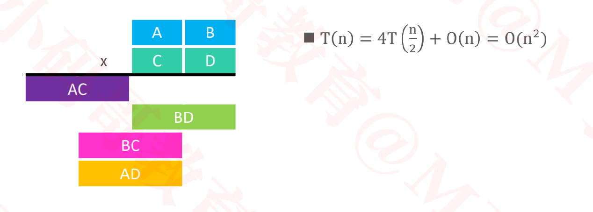
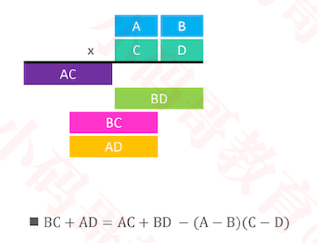
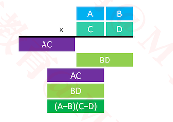

## 分治（Divide And Conquer）
### 分治



+ 分治，也就是分而治之。它的一般步骤是
  - ① 将原问题分解成若干个规模较小的子问题（子问题和原问题的结构一样，只是规模不一样）
  - ② 子问题又不断分解成规模更小的子问题，直到不能再分解（直到可以轻易计算出子问题的解）
  - ③ 利用子问题的解推导出原问题的解
+ 因此，分治策略非常适合用递归
+ 需要注意的是：子问题之间是相互独立的
+ 分治的应用
  - 快速排序
  - 归并排序
  - Karatsuba算法（大数乘法）

### 主定理（Master Theorem）



+ 思考: 为什么有些问题采取分治策略后，性能会有所提升？
  + 假如对n个数据进行排序，时间复杂度为T(n) = O(n<sup>2</sup>)
  + 那么将n均分为2部分，每部分排序为T(n/2) = O((n/2)<sup>2</sup>) = O(n<sup>2</sup>/4), 
  + 此时T(n) = 2T(n/2) + O(merge) = O(n<sup>2</sup>/2) + O(merge) 
  + 只要O(merge)的时间复杂度小于O(n<sup>2</sup>/2),则必然能够提升性能
  + 以归并排序为例, O(merge) = O(n),所以归并排序提升了性能

### 练习1 – 最大连续子序列和

+ leetcode_53_最大子序和：https://leetcode-cn.com/problems/maximum-subarray/
+ 给定一个长度为 n 的整数序列，求它的最大连续子序列和
  - 比如 –2、1、–3、<font color=red>4</font>、<font color=red>–1</font>、<font color=red>2</font>、<font color=red>1</font>、–5、4 的最大连续子序列和是 4 + (–1) + 2 + 1 = 6
+ 这道题也属于最大切片问题（最大区段，Greatest Slice）
+  概念区分
  - 子串、子数组、子区间必须是连续的，子序列是可以不连续的

#### 解法1 – 暴力出奇迹

+ 思路
  - 以第0个元素作为begin, 从第0个元素到第n-1个元素依次作为end。求所有[begin,end]范围的和，计算以0为begin的最大连续子序列和。
  - 以第1个元素作为begin, 从第0个元素到第n-1个元素依次作为end。求所有[begin,end]范围的和，计算以1为begin的最大连续子序列和。
  - 依次计算出每个元素作为begin的所有连续序列的最大值，然后得到最大值

+ 代码实现

  ```java
  public static void main(String[] args) {
  		int[] nums = {-2, 1, -3, 4, -1, 2, 1, -5, 4 };
  		System.out.println(maxSubarray1(nums));
  	}
  
  static int maxSubarray1(int[] nums) {
  		if (nums == null || nums.length == 0) return 0;
  		int max = Integer.MIN_VALUE;
  		for (int begin = 0; begin < nums.length; begin++) {
  			for (int end = begin; end < nums.length; end++) {
  				// sum是[begin, end]的和
  				int sum = 0;
  				for (int i = begin; i <= end; i++) {
  					sum += nums[i];
  				}
          //求得最大序列的和
  				max = Math.max(max, sum);
  			}
  		}
  		return max;
  	}
  //结果为6
  ```

+ 空间复杂度：O(1), 时间复杂度为O(n<sup>3</sup>)

#### 解法1 – 暴力出奇迹-优化

+ 重复利用前面计算过的结果

+ 代码实现

  ```java
  static int maxSubarray2(int[] nums) {
  		if (nums == null || nums.length == 0) return 0;
  		int max = Integer.MIN_VALUE;
  		for (int begin = 0; begin < nums.length; begin++) {
  			int sum = 0;
        //每次end++后的sum = 用之前的sum + 此时end对应的值nums[end]
  			for (int end = begin; end < nums.length; end++) {
  				// sum是[begin, end]的和
  				sum += nums[end];
  				max = Math.max(max, sum);
  			}
  		}
  		return max;
  	}
  ```

#### 解法2 – 分治


```
第三种情况:
对于序列 2 -10 2 3 3 2 -10 2
[begin, mid)是[0, 4), 即2 -10 2 3
[mid, end)是[4, 8), 即3 2 -10 2
[i, j)为[2, 6)， 即2 3 3 2
[i, mid)为[2,4)， 2，3 再往左边，把所有的加上就变小了
[mid, j)为[4,6)， 3，2 再往右边，把所有的加上就变小了

因此对于第三种情况
[i, mid),这一部分的和在[begin, mid)中，再往左边，把所有的加上，和会变小
[mid, j),这一部分的和在[mid, end)中，再往右边，把所有的加上，和会变小

如果是第三种情况，则左边和的最大值一定是[i,mid), 右边和的最大值一定是[mid,j)
结论是: 
最大的和肯定在这三种情况中，求出每一种情况，再求最大值即可。
```

+ 代码实现

  ```java
  public static void main(String[] args) {
  		int[] nums = {-2, 1, -3, 4, -1, 2, 1, -5, 4 };
  		System.out.println(maxSubArray(nums));
  }
    /**
  	 * 求解[begin, end)中最大连续子序列的和
  	 * T(n) = T(n/2) + T(n/2) + O(n)
  	 * T(n) = 2T(n/2) + O(n)
  	 * logba = 1  d = 1
  	 */
  static int maxSubArray(int[] nums, int begin, int end) {
  		if (end - begin < 2) return nums[begin];
  		int mid = (begin + end) >> 1;
      //假设最大和的连续序列一部分在左边，一部分在右边
  		int leftMax = nums[mid - 1];
  		int leftSum = leftMax;
      //左边的最大和:从mid-1往左加
  		for (int i = mid - 2; i >= begin; i--) {
  			leftSum += nums[i];
  			leftMax = Math.max(leftMax, leftSum);
  		}
  		int rightMax = nums[mid];
  		int rightSum = rightMax;
      //右边的最大和:从mid往右加
  		for (int i = mid + 1; i < end; i++) {
  			rightSum += nums[i];
  			rightMax = Math.max(rightMax, rightSum);
  		}
      //leftMax + rightMax是按第三种情况算的值
      //如果不一符合第三种情况，那么最终计算出的最大值是在[begin mid)或[mid end)中
  		return Math.max(leftMax + rightMax, 
  					Math.max(
  					maxSubArray(nums, begin, mid), 
  					maxSubArray(nums, mid, end))
  				);
  	}
  ```

  ```
  情况1
  最大连续子序列在序列左半边时，递归求最大和
  
  情况2
  最大连续子序列在序列右半边时，递归求最大和
  
  情况3
  最大连续子序列有一部分在左边，一部分在右边时，
  左边的最大和:从mid-1往左加
  右边的最大和:从mid往右加
  
  这三种情况的最大值，即为最大连续子序列和
  ```

+ 复杂度

  - 空间复杂度:O(logn)
  - 时间复杂度:O(nlogn)
    - 跟归并排序，快速排序一样
    - T(n) = 2T(n/2) + O(n)

### 练习2 – 大数乘法

+ 按照小学时学习的乘法运算，在进行 n 位数之间的相乘时，需要大约进行 n<sup>2</sup> 次个位数的相乘

+ 比如计算 36 x 54

  

  

  

  ```
  利用分治的思想
  1. 将第一个数拆成AB两部分, 将第二个数拆成CD两部分
  2. 则第一个数和第二个数的乘积为AC, BD, BC, AD的乘积，然后再进行加法运算
  
  假设原来是两个n位数相乘，拆分成4个两个n/2个数相乘,然后再将结果进行大数加法，按"列"相加
  
  根据主定理
  T(n) = 4T(n/2) + O(n) = O(n的2次方)
  ```

+ 当数的位数太多时，只能用字符串进行存储

  ```
  String a = "1231239123123123123123123123"
  String b = "1231239123123123123123123123"
  String c = a * c;
  ```

+ 1960 年 Anatolii Alexeevitch Karatsuba 提出了 Karatsuba 算法，提高了大数乘法的效率

  

  

  +  根据主定理, T(n) = 3T(n/2) + O(n) = O(n<sup>log<sub>2</sub>3</sup>) = O(n<sup>1.585</sup>)

  

