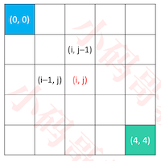
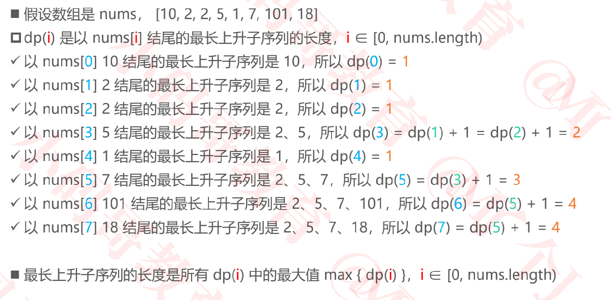
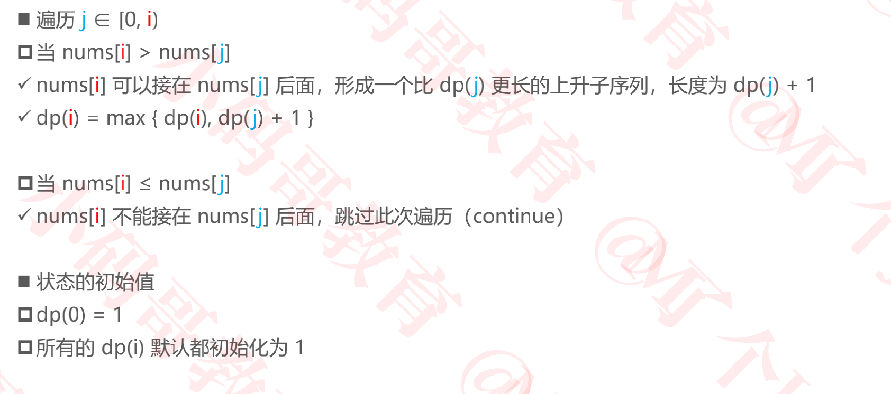

## 动态规划 (Dynamic Programming）

### 动态规划

+ 动态规划，简称DP
  - 是求解最优化问题的一种常用策略
+ 通常的使用套路（一步一步优化）
  - ① 暴力递归（自顶向下，出现了重叠子问题）
  - ② 记忆化搜索（自顶向下）
  - ③ 递推（自底向上）

### 动态规划的常规步骤

+ 动态规划中的“动态”可以理解为是“会变化的状态”

  ① 定义状态（状态是原问题、子问题的解）

  ✓ 比如定义 dp(i) 的含义

  ② 设置初始状态（边界）

  ✓ 比如设置 dp(0) 的值

  ③ 确定状态转移方程

  ✓ 比如确定 dp(i) 和 dp(i – 1) 的关系

### 动态规划的一些相关概念

+ 来自维基百科的解释

  + **Dynamic Programming** is a method for solving a complex problem by breaking it down into a 
    collection of <font color=red>simpler subproblems</font>, solving each of those subproblems <font color=red>just once</font>, and <font color=red>storing</font> their  solutions.

    ① 将复杂的原问题拆解成若干个简单的子问题

    ② 每个子问题仅仅解决1次，并保存它们的解

    ③ 最后推导出原问题的解

+ 可以用动态规划来解决的问题，通常具备2个特点

  - 最优子结构（最优化原理）：通过求解子问题的最优解，可以获得原问题的最优解

  - 无后效性

    ✓ 某阶段的状态一旦确定，则此后过程的演变不再受此前各状态及决策的影响（未来与过去无关）

    ✓ 在推导后面阶段的状态时，只关心前面阶段的具体状态值，不关心这个状态是怎么一步步推导出来的

### 无后效性



+ 从起点（0, 0）走到终点（4, 4）一共有多少种走法？只能向右、向下走
+ 假设 dp(i, j) 是从（0, 0）走到（i, j）的走法
  - dp(i, 0) = dp(0, j) = 1
  - dp(i, j) = dp(i, j – 1) + dp(i – 1, j)
+ 无后效性
  - 推导 dp(i, j) 时只需要用到 dp(i, j – 1)、dp(i – 1, j) 的值
  - 不需要关心 dp(i, j – 1)、dp(i – 1, j) 的值是怎么求出来的

### 有后效性


+ 如果可以向左、向右、向上、向下走，并且同一个格子不能走 2 次

+ 有后效性

  - dp(i, j) 下一步要怎么走，还要关心上一步是怎么来的

    ✓ 也就是还要关心 dp(i, j – 1)、dp(i – 1, j) 是怎么来的？

### 练习1- 找零钱

+ leetcode_322_零钱兑换：https://leetcode-cn.com/problems/coin-change/
+  假设有25分、20分、5分、1分的硬币，现要找给客户41分的零钱，如何办到硬币个数最少？
  - 此前用贪心策略得到的并非是最优解（贪心得到的解是 5 枚硬币）
+ 假设 dp(n) 是凑到 n 分需要的最少硬币个数?
  - 如果第 1 次选择了 25 分的硬币，那么 dp(n) = dp(n – 25) + 1
  - 如果第 1 次选择了 20 分的硬币，那么 dp(n) = dp(n – 20) + 1
  - 如果第 1 次选择了 5 分的硬币，那么 dp(n) = dp(n – 5) + 1
  - 如果第 1 次选择了 1 分的硬币，那么 dp(n) = dp(n – 1) + 1
  - 所以 dp(n) = min { dp(n – 25), dp(n – 20), dp(n – 5), dp(n – 1) } + 1

#### 暴力递归

```java
  /**
	 * 暴力递归（自顶向下的调用，出现了重叠子问题）
	 */
  //conins(6) 需要 conins(1) , conins(5)
  //conins(5) 需要 conins(4)
  //conins(4) 需要 conins(3)
  //conins(3) 需要 conins(2)
  //conins(2) 需要 conins(1)
  //由此可见出现了重复子问题
	static int coins1(int n) {
		if (n < 1) return Integer.MAX_VALUE;
		if (n == 25 || n == 20 || n == 5 || n == 1) return 1;
		int min1 = Math.min(coins1(n - 25), coins1(n - 20));
		int min2 = Math.min(coins1(n - 5), coins1(n - 1));
		return Math.min(min1, min2) + 1;
	}

为什么要n < 1时，返回Integer.MAX_VALUE?
1. 当n < 1时，剩下的零钱已经小于任何一个币值了，所以返回Integer.MAX_VALUE，以便和其他情况放在一起求最小值，将这种情况过滤掉
2. 例如当n = 4时
3. coins1(4-5) = coins1(-1), coins1(4-1) = coins1(3)
4. 通过Min(coins1(-1),coins1(3))一定要把Min(coins1(-1)的情况舍弃掉，
5. 所以n < 1时，要返回Integer.MAX_VALUE
                                      
n == 25,  n == 20, n == 5,  n == 1, 返回1, 这个临界条件如何确定的?
临界条件的确定可以参考n-k这种缩小规模的表达式                                      
```

#### 暴力递归优化-记忆化搜索

```java
/**
	 * 记忆化搜索（自顶向下的调用）
	 */
	static int coins2(int n) {
		if (n < 1) return -1;
    //dp[i]=j,含义为:零钱为i时, 其最少的硬币数位j
		int[] dp = new int[n + 1];
		int[] faces = {1, 5, 20, 25};
		for (int face : faces) {
      //防止n比较小时，造成数组越界
			if (n < face) break;
			dp[face] = 1;
		}
		return coins2(n, dp);
	}
	static int coins2(int n, int[] dp) {
		if (n < 1) return Integer.MAX_VALUE;
		if (dp[n] == 0) {
			int min1 = Math.min(coins2(n - 25, dp), coins2(n - 20, dp));
			int min2 = Math.min(coins2(n - 5, dp), coins2(n - 1, dp));
			dp[n] = Math.min(min1, min2) + 1;
		}
		return dp[n];
	}
```

#### 递推

```java
/**
	 * 递推（自底向上）
	 */
	static int coins3(int n) {
		if (n < 1) return -1;
		int[] dp = new int[n + 1];
		for (int i = 1; i <= n; i++) {
      //int min = Integer.MAX_VALUE;
      //if (i >= 1) min= Math.min(dp[i - 1], min);
			int min = dp[i - 1]; //巧妙利用了dp[0] = 0
			if (i >= 5) min = Math.min(dp[i - 5], min);
			if (i >= 20) min = Math.min(dp[i - 20], min);
			if (i >= 25) min = Math.min(dp[i - 25], min);
			dp[i] = min + 1;
      //dp(n) = min { dp(n – 25), dp(n – 20), dp(n – 5), dp(n – 1) } + 1
		}
		return dp[n];
	}
```

+ 时间复杂度、空间复杂度：O(n)

#### 思考题：请输出找零钱的具体方案（具体是用了哪些面值的硬币）

后续补上

### 练习2 – 最大连续子序列和

+ 给定一个长度为 n 的整数序列，求它的最大连续子序列和

  - 比如 –2、1、–3、4、–1、2、1、–5、4 的最大连续子序列和是 4 + (–1) + 2 + 1 = 6

+  状态定义

  - 假设 dp(i) 是以 nums[i] 结尾的最大连续子序列和（nums是整个序列）

    ✓ 以 nums[0] –2 结尾的最大连续子序列是 –2，所以 dp(0) = –2

    ✓ 以 nums[1] 1 结尾的最大连续子序列是 1，所以 dp(1) = 1

    ✓ 以 nums[2] –3 结尾的最大连续子序列是 1、–3，所以 dp(2) = dp(1) + (–3) = –2

    ✓ 以 nums[3] 4 结尾的最大连续子序列是 4，所以 dp(3) = 4

    ✓ 以 nums[4] –1 结尾的最大连续子序列是 4、–1，所以 dp(4) = dp(3) + (–1) = 3

    ✓ 以 nums[5] 2 结尾的最大连续子序列是 4、–1、2，所以 dp(5) = dp(4) + 2 = 5

    ✓ 以 nums[6] 1 结尾的最大连续子序列是 4、–1、2、1，所以 dp(6) = dp(5) + 1 = 6

    ✓ 以 nums[7] –5 结尾的最大连续子序列是 4、–1、2、1、–5，所以 dp(7) = dp(6) + (–5) = 1

    ✓ 以 nums[8] 4 结尾的最大连续子序列是 4、–1、2、1、–5、4，所以 dp(8) = dp(7) + 4 = 5

+ 状态转移方程
  - 如果 dp(i – 1) ≤ 0，那么 dp(i) = nums[i]
  - 如果 dp(i – 1) > 0，那么 dp(i) = dp(i – 1) + nums[i]
+ 初始状态
  
  - dp(0) 的值是 nums[0]
+ 最终的解
  
- 最大连续子序列和是所有 dp(i) 中的最大值 max { dp(i) }，i ∈ [0, nums.length) 
  
+ 代码实现

  ```java
  static int maxSubArray1(int[] nums) {
  		if (nums == null || nums.length == 0) return 0;
  		int[] dp = new int[nums.length];
  		dp[0] = nums[0];
  		int max = dp[0];
  		for (int i = 1; i < dp.length; i++) {
  			int prev = dp[i - 1];
  			if (prev <= 0) {
  				dp[i] = nums[i];
  			} else {
  				dp[i] = prev + nums[i];
  			}
  			max = Math.max(dp[i], max);
  		}
  		return max;
  	}
  ```

  + 空间复杂度：O(n)，时间复杂度：O(n)

+ 代码优化

  ```java
  static int maxSubArray2(int[] nums) {
  		if (nums == null || nums.length == 0) return 0;
      //dp(i)只关心dp(i-1)的值，所以用一个变量保存dp(i-1)的值
  		int dp = nums[0];
  		int max = dp;
  		for (int i = 1; i < nums.length; i++) {
  			if (dp <= 0) {
  				dp = nums[i];
  			} else {
  				dp = dp + nums[i];
  			}
  			max = Math.max(dp, max);
  		}
  		return max;
  	}
  	
  ```

  + 空间复杂度：O(1)，时间复杂度：O(n)

### 练习3 – 最长上升子序列（LIS）

+ 最长上升子序列（最长递增子序列，Longest Increasing Subsequence，LIS）
+ leetcode_300_最长上升子序列： https://leetcode-cn.com/problems/longest-increasing-subsequence/
+ 给定一个无序的整数序列，求出它最长上升子序列的长度（要求严格上升）
  
- 比如 [10, <font color=red>2</font>, 2,<font color=red> 5 </font>, 1, <font color=red>7</font>, <font color=red>101</font>, 18] 的最长上升子序列是 [2, 5, 7, 101]、[2, 5, 7, 18]，长度是 4
  
+ 状态定义

  

+ 状态转移方程

  

+ 代码实现

  ```java
    /**
  	 * 动态规划
  	 */
  	static int lengthOfLIS1(int[] nums) {
  		if (nums == null || nums.length == 0) return 0;
  		int[] dp = new int[nums.length];
  		int max = dp[0] = 1;
  		for (int i = 1; i < dp.length; i++) {
  			dp[i] = 1;
  			for (int j = 0; j < i; j++) {
  				if (nums[i] <= nums[j]) continue;
          //dp[i]表示以nums[i]为结尾的最长上升序列 
          //0<=j<i,所以dp[j]表示dp[i]前面的上升序列
          //通过遍历dp[i]前面的所有上升序列，假如nums[i]>nums[j]， 则dp[i] = dp[j] + 1，
          //所以dp[i]表示的最长上升序列为 所有的dp[j] + 1中的最大值
          //dp[i] = Math.max(dp[i], dp[j] + 1);
          
          //假如对于所有的nusm[j], nums[i] < nums[j]则说明nums[i]不能与前面的元素构成上升序列
        //所以此时dp[i] = 1。 因此默认dp[i] = 1，自己与自己构成上升序列
          
  				dp[i] = Math.max(dp[i], dp[j] + 1);
  			}
  			max = Math.max(dp[i], max);
  		}
  		return max;
  	}
  ```
  
  