## 链表(Linked List)

### 简介

+ 动态数组有个明显的缺点
  - 可能会造成内存空间的大量浪费

+ 能否用到多少就申请多少内存？

  - 链表可以办到这一点

+ 链表是一种`链式存储`的**线性表**，所有元素的内存地址**不一定是连续的**

  

### 链表的设计


```java
public class LinkedList<E> extends AbstractList<E> {
  private int size;
	private Node<E> first;
	
	private static class Node<E> {
		E element;
		Node<E> next;
		public Node(E element, Node<E> next) {
			this.element = element;
			this.next = next;
		}
	}
}
```

### 接口设计

+ 链表和动态数组的大部分接口是一致的， 所以可以让它们遵循统一的接口

  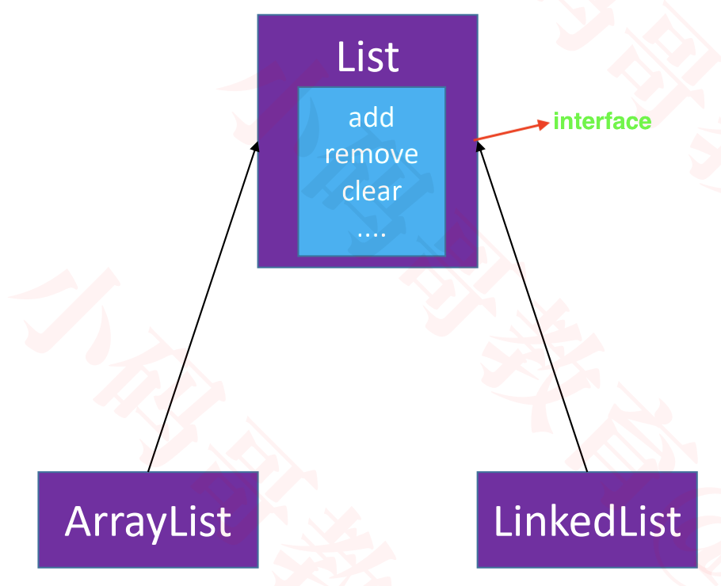

  

+ 链表和动态数组的部分接口实现完全一样，所以可以定义一个抽象类，将实现完全一样的接口，放在抽象类中

  

+ 代码结构设计

  1. 统一的接口`List`的设计

     ```java
     public interface List<E> {
     	static final int ELEMENT_NOT_FOUND = -1;
     	/**
     	 * 清除所有元素
     	 */
     	void clear();
     
     	/**
     	 * 元素的数量
     	 * @return
     	 */
     	int size();
     
     	/**
     	 * 是否为空
     	 * @return
     	 */
     	boolean isEmpty();
     
     	/**
     	 * 是否包含某个元素
     	 * @param element
     	 * @return
     	 */
     	boolean contains(E element);
     
     	/**
     	 * 添加元素到尾部
     	 * @param element
     	 */
     	void add(E element);
     
     	/**
     	 * 获取index位置的元素
     	 * @param index
     	 * @return
     	 */
     	E get(int index);
     
     	/**
     	 * 设置index位置的元素
     	 * @param index
     	 * @param element
     	 * @return 原来的元素ֵ
     	 */
     	E set(int index, E element);
     
     	/**
     	 * 在index位置插入一个元素
     	 * @param index
     	 * @param element
     	 */
     	void add(int index, E element);
     
     	/**
     	 * 删除index位置的元素
     	 * @param index
     	 * @return
     	 */
     	E remove(int index);
     
     	/**
     	 * 查看元素的索引
     	 * @param element
     	 * @return
     	 */
     	int indexOf(E element);
     }
     ```

  2. 抽象类`AbstractList`的设计

     ````java
     public abstract class AbstractList<E> implements List<E>  {
     	/**
     	 * 元素的数量
     	 */
     	protected int size;
     	/**
     	 * 元素的数量
     	 * @return
     	 */
     	public int size() {
     		return size;
     	}
     
     	/**
     	 * 是否为空
     	 * @return
     	 */
     	public boolean isEmpty() {
     		 return size == 0;
     	}
     
     	/**
     	 * 是否包含某个元素
     	 * @param element
     	 * @return
     	 */
     	public boolean contains(E element) {
     		return indexOf(element) != ELEMENT_NOT_FOUND;
     	}
     
     	/**
     	 * 添加元素到尾部
     	 * @param element
     	 */
     	public void add(E element) {
     		add(size, element);
     	}
     	
     	protected void outOfBounds(int index) {
     		throw new IndexOutOfBoundsException("Index:" + index + ", Size:" + size);
     	}
     	
     	protected void rangeCheck(int index) {
     		if (index < 0 || index >= size) {
     			outOfBounds(index);
     		}
     	}
     	
     	protected void rangeCheckForAdd(int index) {
     		if (index < 0 || index > size) {
     			outOfBounds(index);
     		}
     	}
     }
     
     ````

  3. 此时的ArrayList类结构

     ```java
     //ArrayList继承抽象类AbstractList
     public class ArrayList<E> extends AbstractList<E> {
     	/**
     	 * 所有的元素
     	 */
     	private E[] elements;
     	private static final int DEFAULT_CAPACITY = 10;
     	
     	public ArrayList(int capaticy) {
     		capaticy = (capaticy < DEFAULT_CAPACITY) ? DEFAULT_CAPACITY : capaticy;
     		elements = (E[]) new Object[capaticy];
     	}
     	
     	public ArrayList() {
     		this(DEFAULT_CAPACITY);
     	}
     	.....
     }
     
     ```

  4. 此时的LinkedList结构设计

     ```java
     //LinkedList继承抽象类AbstractList
     public class LinkedList<E> extends AbstractList<E> {
     	private Node<E> first;
     	private static class Node<E> {
     		E element;
     		Node<E> next;
     		public Node(E element, Node<E> next) {
     			this.element = element;
     			this.next = next;
     		}
     	}
       
       public void clear() {}
       public E get(int index) {}
       public E set(int index, E element) {}
       public void add(int index, E element) {}
       public E remove(int index) {}
       public int indexOf(E element) {}
       ....
       ....
     }
     ```

### clear


```java
@Override
public void clear() {
		size = 0;
		first = null;
}
```

### 获取index对应的node

```java
	/**
	 * 获取index位置对应的节点对象
	 * @param index
	 * @return
	 */
	private Node<E> node(int index) {
		rangeCheck(index);
		
		Node<E> node = first;
		for (int i = 0; i < index; i++) {
			node = node.next;
		}
		return node;
	}
```


### get

```java
@Override
public E get(int index) {
	return node(index).element;
}
//先获取节点，再获取对应的元素
```

### set

```java
@Override
	public E set(int index, E element) {
    //先获取节点
		Node<E> node = node(index);
		E old = node.element;
    //更新对应的元素
		node.element = element;
		return old;
	}
```

### add

+ 向非0位置插入元素，例如向index=1添加元素

  - 先获取要插入的index的前一个节点，然后再插入元素

  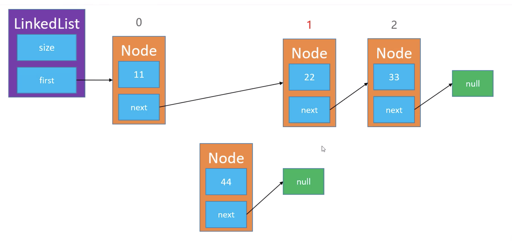

  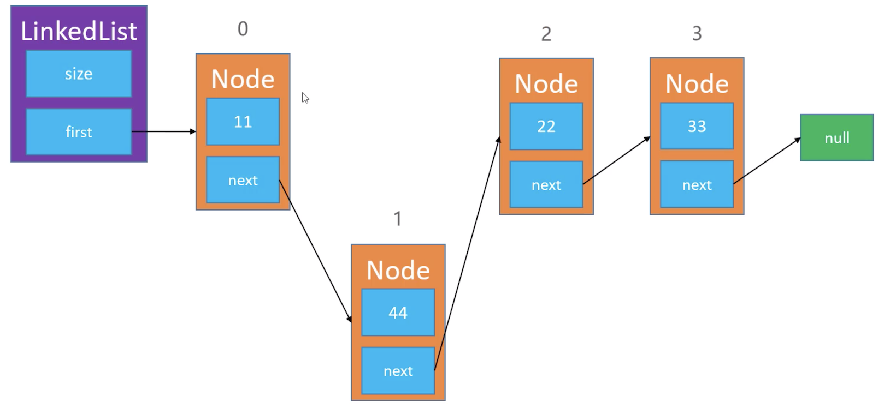 

+ 向index=0位置插入元素

  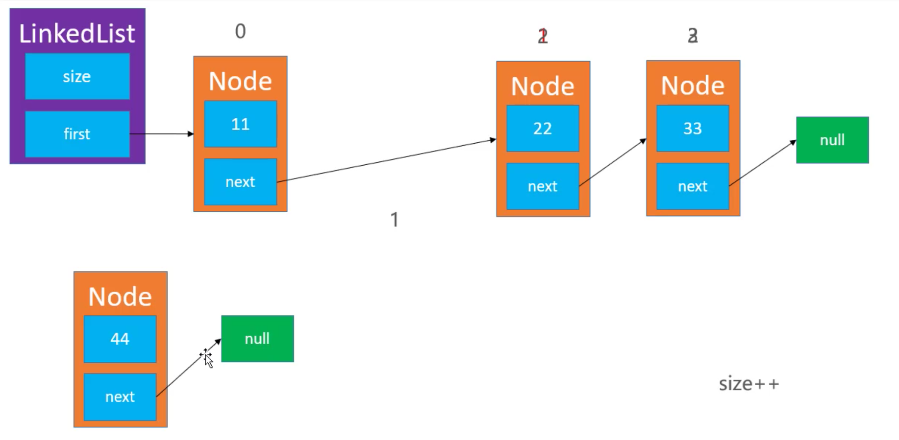

  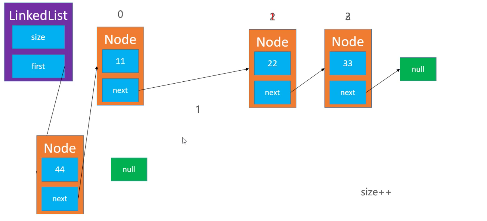

+ 代码如下

  ```java
  @Override
  	public void add(int index, E element) {
  
  		rangeCheckForAdd(index);
      if (index == 0) {
  			first = new Node<>(element, first);
  		} else {
        //找到前一个节点
  			Node<E> prev = node(index - 1);
        //当前节点的next指向前一个节点的next
        //前一个节点的next指向当前节点
  			prev.next = new Node<>(element, prev.next);
  		}
  		size++;
  	}      
  ```

+ 在编写链表的过程中，要注意边界测试，比如index为0， size-1, size时

### remove

+ 非index=0时


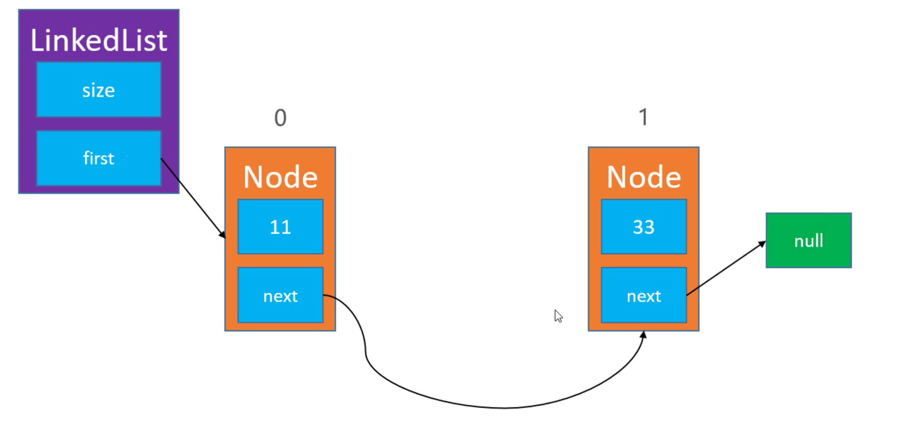

+ 代码如下

  ```java
  public E remove(int index) {
  
  		rangeCheck(index);
    
  		Node<E> node = first;
  		if (index == 0) {
        //index=0时，first指向原来的first的next即可
  			first = first.next;
  		} else {
        //index不为0时
        //1.先找到要删除的index的前一个节点
  			Node<E> prev = node(index - 1);
        //2.得到要删除的节点
  			node = prev.next;
        //3. 将前一个节点的next，指向要被删除的节点的next即可
  			prev.next = node.next;
  		}
  		size--;
  		return node.element;
  	}
  ```

### indexof

```java
//获取某个元素的下标
@Override
public int indexOf(E element) {
		if (element == null) {
			Node<E> node = first;
			for (int i = 0; i < size; i++) {
				if (node.element == null) return i;
				node = node.next;
			}
		} else {
			Node<E> node = first;
			for (int i = 0; i < size; i++) {
        //对象要实现equals方法
				if (element.equals(node.element)) return i;
				node = node.next;
			}
		}
		return ELEMENT_NOT_FOUND;
	}
	
```

+ 通过next指针，遍历查找
+ 注意: 对象要实现equals方法

### toString

+ 对象转成字符串，便于打印

````java
@Override
	public String toString() {
		StringBuilder string = new StringBuilder();
		string.append("size=").append(size).append(", [");
		Node<E> node = first;
		for (int i = 0; i < size; i++) {
			if (i != 0) {
				string.append(", ");
			}
			string.append(node.element);
			node = node.next;
		}
		string.append("]");
		return string.toString();
	}

//假如元素未10,30,40
//打印结果如下
size = 3, [10, 30, 40]
````

### 一个神奇的网站

+ https://visualgo.net/zh

### 练习- 删除链表中的节点

+ https://leetcode-cn.com/problems/delete-node-in-a-linked-list/

+ 请编写一个函数，使其可以删除某个链表中给定的（非末尾）节点，你将只被给定要求被删除的节点。

  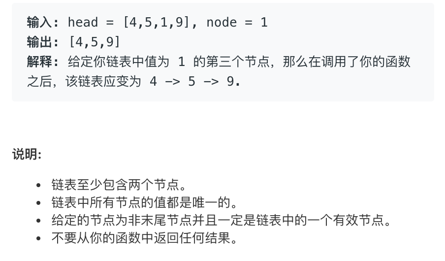

+ 思路

  + 我们只是单纯的想删除该结点，那么可以用下一个结点的element，覆盖当前的element
  + 并且将要删除的节点的next指向下一个结点的next即可

  

  

  

  

+ 代码

  ```java
  
  /**
   * Definition for singly-linked list.
   * public class ListNode {
   *     int val;
   *     ListNode next;
   *     ListNode(int x) { val = x; }
   * }
   */
  class Solution {
      public void deleteNode(ListNode node) {
          node.val = node.next.val;
          node.next = node.next.next;
      }
  }
  ```

  

### 练习- 反转链表

+ https://leetcode-cn.com/problems/reverse-linked-list/

  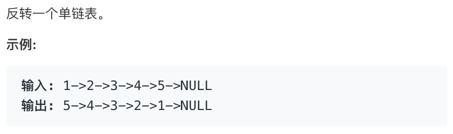

####递归

+ 思路分析

  - 将原来链表的头结点传入reverseList方法，则返回的是对应链表反转之后的链表的头结点

    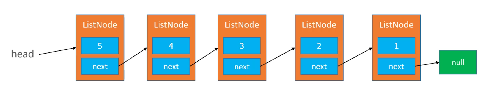

    

  + 将原来链表的头结点的下一个结点传入reverseList方法，则返回的是对应链表反转之后的链表的头结点

    

    + reverseList(Node(5))和reverseList(Node(4))的差异在于
      1. 把Node(4)的next指向Node(5)
      2. 把Node(5)的next指向null

  + 依次类推

    ```java
    reverseList(Node(5)) => 
                         reverseList(Node(4)) + 
                         Node(4).next = node(5)
                         node(5).next = null
                         
    reverseList(Node(4)) => 
                         reverseList(Node(3)) + 
                         Node(3).next = node(4)
                         node(4).next = null
    
    reverseList(Node(3)) => 
                         reverseList(Node(2)) + 
                         Node(2).next = node(3)
                         node(3).next = null
    reverseList(Node(2)) => 
                         reverseList(Node(1)) + 
                         Node(1).next = node(2)
                         node(2).next = null
                         
    reverseList(Node(1)) => Node(1) +
                          Node(1).next = null
                          
    reverseList(Node(5)) => Node(1) +
                          Node(1).next = node(2) 
                          Node(2).next = node(3)
                          Node(3).next = node(4)
                          Node(4).next = node(5)
                          node(5).next = null
                         =>链表反转成功
    ```

+ 代码实现

  ```java
  
  /**
   * Definition for singly-linked list.
   * public class ListNode {
   *     int val;
   *     ListNode next;
   *     ListNode(int x) { val = x; }
   * }
   */
  class Solution {
     public ListNode reverseList(ListNode head) {
  		if (head == null || head.next == null) return head;
  		ListNode newHead = reverseList(head.next);
  		head.next.next = head;
  		head.next = null;
  		return newHead;
     }
  }
  
  ```

####非递归-头插法

+ 思路分析

  - 我们目前只有head节点可供操作，所以需要通过head节点把5节点串起来，然后把4节点串起来，然后一直把整个链表串起来

  - 操作过程如下

    1.  tmp保存head.next
    2. 将head.next指向newHead
    3. 将newHead指向head
    4. 将head指向原来的head.next

    

    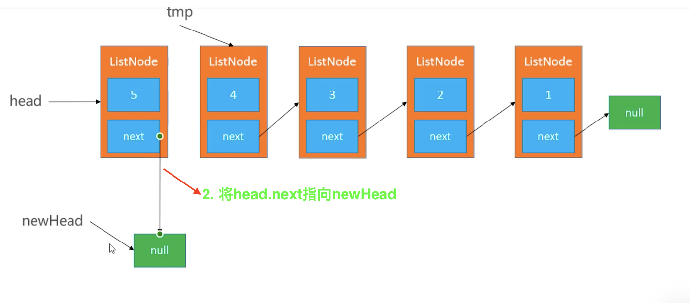

    

    

    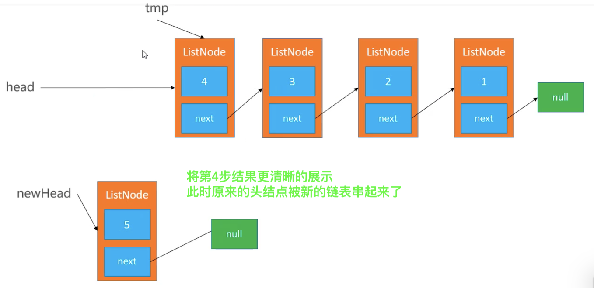

    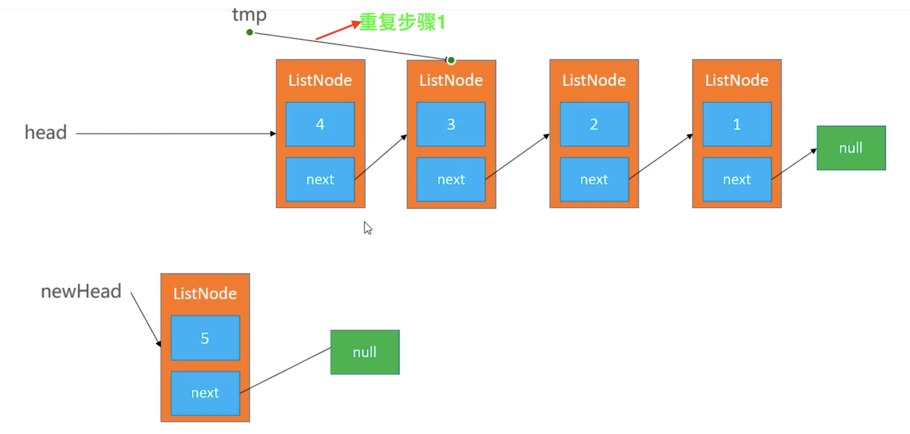

    

    

    

    

    

+ 代码形式如下

  ```java
  /**
   * Definition for singly-linked list.
   * public class ListNode {
   *     int val;
   *     ListNode next;
   *     ListNode(int x) { val = x; }
   * }
   */
  class Solution {
    public ListNode reverseList(ListNode head) {
  		if (head == null || head.next == null) return head;
  	
  		ListNode newHead = null;
  		while (head != null) {
        //1. tmp保存head.next
  			ListNode tmp = head.next;
        //2. 将head.next指向newHead
  			head.next = newHead;
        //3. 将newHead指向head
  			newHead = head;
        //4. 将head指向原来的head.next
  			head = tmp;
  		}
  		return newHead;
    }
  }
  ```

### 练习- 环形链表

+ https://leetcode-cn.com/problems/linked-list-cycle/

+ 题目要求

  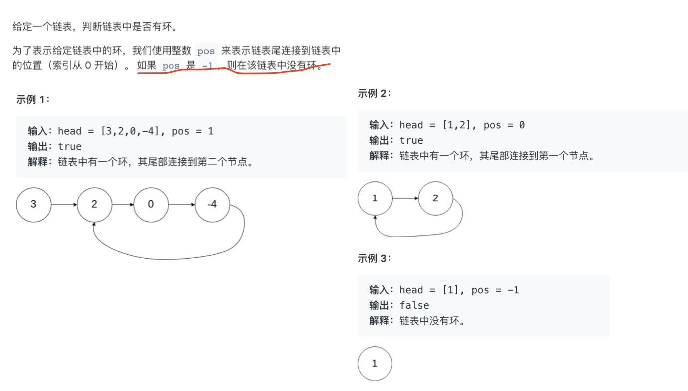

+ 思路分析

  + 通过快慢指针来判断是否有环

  + 慢指针一次走1步，快指针一次走2步。那么每次过后，快慢指针都会逐步的接近，直到相等

  + 最开始时，快指针要在慢指针后面，否则即使无环，他们两个也会可能逐步接近，最终相等

  + 快指针在后面时，只有在有环的情况下，才会追上慢指针。

    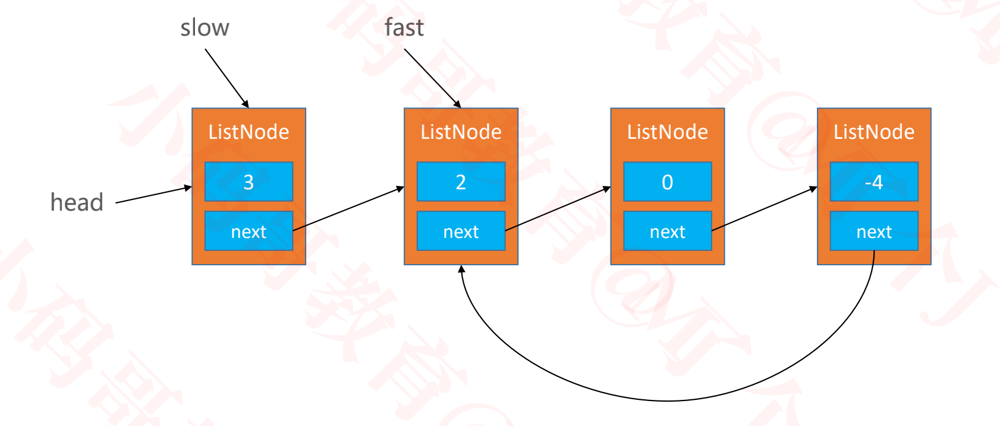

+ 代码实现

  ```java
  /**
   * Definition for singly-linked list.
   * class ListNode {
   *     int val;
   *     ListNode next;
   *     ListNode(int x) {
   *         val = x;
   *         next = null;
   *     }
   * }
   */
  public class Solution {
      public boolean hasCycle(ListNode head) {
  		if (head == null || head.next == null) return false;
      //慢指针
  		ListNode slow = head;
      //快指针
  		ListNode fast = head.next;
      //快慢指针一直向前走
  		while (fast != null && fast.next != null) {
        //慢指针每次走1步
  			slow = slow.next;
        //快指针每次走2步,两者逐步逼近，如果有环，则会相等
  			fast = fast.next.next;
  			if (slow == fast) return true;
  		}
  		 return false;
     }
  }
  ```

### 虚拟头结点

+  有时候为了让代码更加精简，统一所有节点的处理逻辑，可以在最前面增加一个虚拟的头结点（不存储数据）

  

+ LinkedList2的代码调整

  

  + 构造函数的调整

    ```java
    /**
     * 增加一个虚拟头结点
     * @author MJ Lee
     *
     * @param <E>
     */
    public class LinkedList2<E> extends AbstractList<E> {
    	private Node<E> first;
    	
    	public LinkedList2() {
        //first节点的元素为null，index=0是first的next节点
    		first = new Node<>(null, null);
    	}
      ...
    }
    ```

  + node方法的调整

    ```java
    /**
    	 * 获取index位置对应的节点对象
    	 * @param index
    	 * @return
    	 */
    	private Node<E> node(int index) {
    		rangeCheck(index);
    		//从first.next开始遍历
    		Node<E> node = first.next;
    		for (int i = 0; i < index; i++) {
    			node = node.next;
    		}
    		return node;
    	}
    ```

  + add方法

    ```java
    	@Override
    	public void add(int index, E element) {
    		rangeCheckForAdd(index);
    		//当index=0时，prev为first
    		Node<E> prev = index == 0 ? first : node(index - 1);
    		prev.next = new Node<>(element, prev.next);
    		size++;
    	}
    ```

  + remove方法

    ```java
    	@Override
    	public E remove(int index) {
    		rangeCheck(index);
    		//当index=0时，prev为first
    		Node<E> prev = index == 0 ? first : node(index - 1);
    		Node<E> node = prev.next;
    		prev.next = node.next;
    
        size--;
    		return node.element;
    	}
    ```

  + indexOf方法

    ```java
    @Override
    	public int indexOf(E element) {
    		if (element == null) {
          //从index=0处开始遍历
    			Node<E> node = first.next;
    			for (int i = 0; i < size; i++) {
    				if (node.element == null) return i;
    				
    				node = node.next;
    			}
    		} else {
           //从index=0处开始遍历
    			Node<E> node = first.next;
    			for (int i = 0; i < size; i++) {
    				if (element.equals(node.element)) return i;
    				
    				node = node.next;
    			}
    		}
    		return ELEMENT_NOT_FOUND;
    	}
    ```

    

  + toString方法

    ```java
    	@Override
    	public String toString() {
    		StringBuilder string = new StringBuilder();
    		string.append("size=").append(size).append(", [");
    		Node<E> node = first.next;
    		for (int i = 0; i < size; i++) {
    			if (i != 0) {
    				string.append(", ");
    			}
    			string.append(node.element);
    			
    			node = node.next;
    		}
    		string.append("]");
    		return string.toString();
    	}
      
    ```

    

### 数组的随机访问

+ 数组的随机访问速度非常快

+ elements[n]的效率与n是多少无关

  ```
  elements[n]是如何定位地址的?
  数组的首地址+偏移量= 数组的首地址 + index*元素占据的字节
  ```

### 复杂度分析

+ 分为3个情况
  - 最好情况复杂度
  - 最坏情况复杂度
  - 平均情况复杂度

+ ArrayList复杂度分析

  ```java
    // O(1)
  	public E get(int index) { 
  		rangeCheck(index);
  		//通过数组的随机访问，直接取值
  		return elements[index]; 
  	}
    // O(1)
  	public E set(int index, E element) { 
  		rangeCheck(index);
  		
  		E old = elements[index];
      //通过数组的随机访问直接取值，设置
  		elements[index] = element;
  		return old;
  	}
  
  	public void add(int index, E element) { 
  		/*
  		 * 最好：O(1) //index=size时
  		 * 最坏：O(n) //index=0时
  		 * 平均：(O(1) + O(2) + ... +  O(n) ) / n =>  O(n/2) => O(n)
  		 */
  		rangeCheckForAdd(index);
  		//先忽略扩容操作
  		ensureCapacity(size + 1);
  		
  		for (int i = size; i > index; i--) {
  			elements[i] = elements[i - 1];
  		}
  		elements[index] = element;
  		size++;
  	} // size是数据规模
  
  	public E remove(int index) {
  		/*
  		 * 最好：O(1)
  		 * 最坏：O(n)
  		 * 平均：O(n)
  		 */
  		rangeCheck(index);
  		
  		E old = elements[index];
  		for (int i = index + 1; i < size; i++) {
  			elements[i - 1] = elements[i];
  		}
  		elements[--size] = null;
  		return old;
  	}
  
  ```

+ LinkedList复杂度分析

  ```java
  @Override
  	public E get(int index) {
  		/*
  		 * 最好：O(1) //index = 0时
  		 * 最坏：O(n) //index = size-1时
  		 * 平均：O(n)
  		 */
  		return node(index).element;
  	}
  
  	@Override
  	public E set(int index, E element) {
  		/*
  		 * 最好：O(1)  //index = 0时
  		 * 最坏：O(n)  //index = size-1时
  		 * 平均：O(n)
  		 */
  		Node<E> node = node(index);
  		E old = node.element;
  		node.element = element;
  		return old;
  	}
  
  	@Override
  	public void add(int index, E element) {
  		/*
  		 * 最好：O(1)  //index = 0时
  		 * 最坏：O(n)  //index = size时
  		 * 平均：O(n)
  		 */
  		rangeCheckForAdd(index);
  		
  		if (index == 0) {
  			first = new Node<>(element, first);
  		} else {
  			Node<E> prev = node(index - 1);
  			prev.next = new Node<>(element, prev.next);
  		}
  		size++;
  	}
  
  	@Override
  	
  	public E remove(int index) {
  		/*
  		 * 最好：O(1)  //index = 0时
  		 * 最坏：O(n)  //index = size-1时
  		 * 平均：O(n)
  		 */
  		rangeCheck(index);
  		
  		Node<E> node = first;
  		if (index == 0) {
  			first = first.next;
  		} else {
  			Node<E> prev = node(index - 1);
  			node = prev.next;
  			prev.next = node.next;
  		}
  		size--;
  		return node.element;
  	}
  
  ```

  + 网上有些资料说，链表的添加和删除的时间复杂度为O(1)，其实质说的是添加，删除那一刻对next指针的操作的时间复杂度为O(1)，添加和删除操作整体的时间复杂度还是为O(n)。

+ 对比

  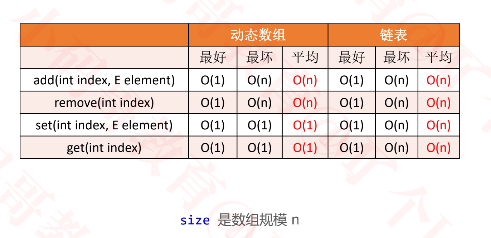

  + 动态数组的优势在于的set，get访问速度快
  + 链表的优势在于节省内存

###  均摊复杂度

+ 什么情况下适合使用均摊复杂度?
  - 经过连续的多次复杂度比较低的情况后，出现个别复杂度比较高的情况

+ 以动态数组add(E element)为例进行分析

  ```java
  /**
  	 * 添加元素到尾部
  	 * @param element
  	 */
  	public void add(E element) {
  		add(size, element);
  	}
  ```

  + 最好时间复杂度: O(1)

    ```
    因为每次都添加到尾部，直接定位到index=size的内存地址，不需要挪动元素
    ```

  + 最坏时间复杂度: O(n)

    ```
    当需要进行扩容时，需要挪动n次
    ```

  + 平均时间复杂度: O(1)

    ```
    绝大多数都是直接添加到index=size处，极个别情况需要扩容，因此平均下来还是0(1)
    
    平均时间复杂度 => O(1) +  O(1) + O(1) +  ... + O(n) /次数 => 0(1)
    ```

  + 均摊时间复杂度: O(1)

    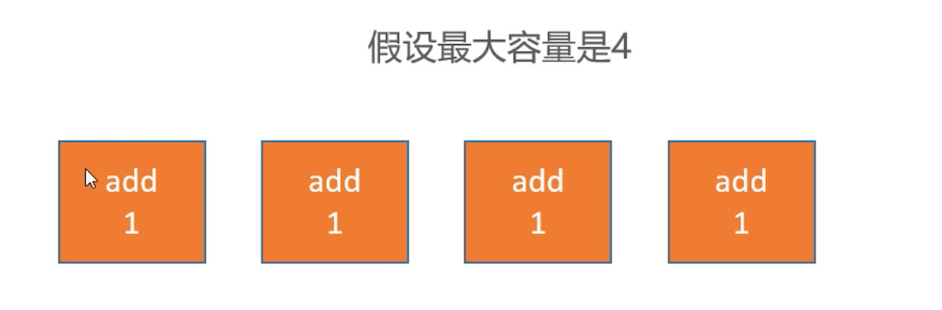

    

    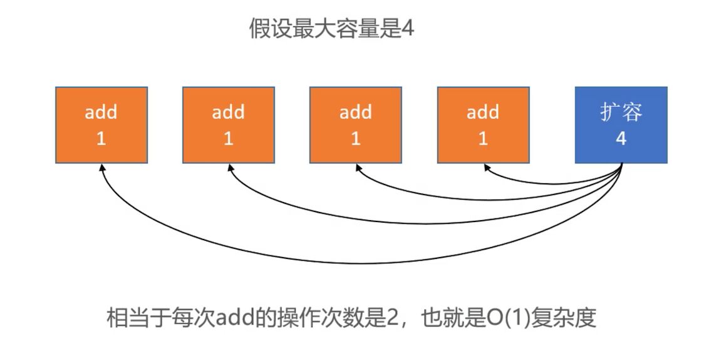

    + 前4次add操作时间复杂度都为1
    + 最后一次add操作时间复杂度都为4
    + 相当于均摊到每次add的操作次数都是2，均摊复杂度为0(1)

### ArrayList的缩容

+ 如果内存使用比较紧张，动态数组有比较多的剩余空间，可以考虑进行缩容操作

    ```
  比如，容量已经扩充到很大时，再进行删除元素，当数组中删除了很多元素时，此时数组中有大量的剩余空间，此时可以考虑进行缩容操作
    ```

  - 比如剩余空间占总容量的一半时，就进行缩容

+ remove的时候进行缩容

  ```java
  public E remove(int index) {	
  		rangeCheck(index);
  		
  		E old = elements[index];
  		for (int i = index + 1; i < size; i++) {
  			elements[i - 1] = elements[i];
  		}
  		elements[--size] = null;
  		//缩容操作
  		trim();
  		
  		return old;
  	}
  
  private void trim() {
    
  		int oldCapacity = elements.length;
      //设计新容量为旧容量的一般
  		int newCapacity = oldCapacity >> 1;
       
      //1. 剩余空间的容量>一半时, 不进行缩容
      //2. 剩余空间的容量<=默认容量时, 不进行缩容
  		if (size > (newCapacity) || oldCapacity <= DEFAULT_CAPACITY) return;
  		
  		// 剩余空间还很多
  		E[] newElements = (E[]) new Object[newCapacity];
  		for (int i = 0; i < size; i++) {
  			newElements[i] = elements[i];
  		}
  		elements = newElements;
  		System.out.println(oldCapacity + "缩容为" + newCapacity);
  	}
  ```

+ 代码测试

  ```java
  public static void main(String[] args) {
     List<Integer> list = new ArrayList<>();
     for(int i = 0; i < 50; i++) {
        list.add(i);
     }
     for(int i = 0; i < 50; i++) {
        list.remove(0);
     }
     System.out.println(list);
  }
  
  //打印结果为
  10扩容为15
  15扩容为22
  22扩容为33
  33扩容为49
  49扩容为73
  73缩容为36
  36缩容为18
  18缩容为9
  size=0, []
  ```

+ clear时也可以进行缩容

  ```java
   /**
  	 * 清除所有元素
  	 */
  	public void clear() {
  		for (int i = 0; i < size; i++) {
  			elements[i] = null;
  		}
  		size = 0;
  		
  		// 仅供参考
  		if (elements != null && elements.length > DEFAULT_CAPACITY) {
  			elements = (E[]) new Object[DEFAULT_CAPACITY];
  		}
  	}
  ```

  


###复杂度震荡

+ 如果扩容倍数，**缩容时机**设计不得当，有可能会导致复杂度震荡

  - 假设扩容倍数为2，缩容时机为容量的一半，且缩容为原来容量的一半

  - 对于一个容量为4的数组

    

    - 添加55，扩容时，时间复杂度为O(n)

      

    - 删除55，缩容时，时间复杂度也为O(n)

      

    - 假如频繁的添加，删除55，那么时间复杂度长期维持在O(n)级别，导致时间复杂度震荡

  

### 双向链表-简介

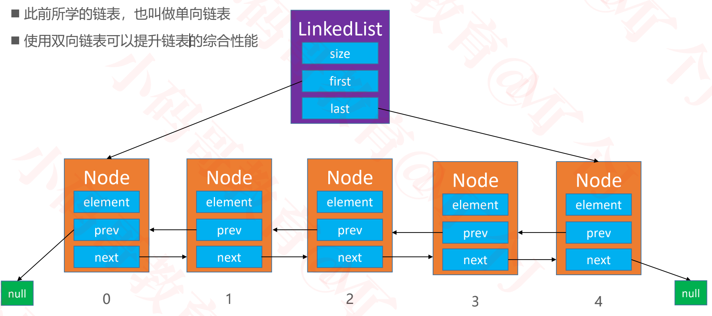

+ 双向链表`first.prev = null, last.next = null`

+ 双向链表在于

  - 单向链表只能从first开始进行查找
  - 双向链表可以从first或last进行查找
  - 如果要找的index小于size的一半，则从first开始查找，否则从last开始查找

+ 双向链表基本结构

  ```java
  public class LinkedList<E> extends AbstractList<E> {
  	private Node<E> first; //first节点
  	private Node<E> last;  //last节点
  	
  	private static class Node<E> {
  		E element;
  		Node<E> prev; //prev节点
  		Node<E> next; //next节点
  		public Node(Node<E> prev, E element, Node<E> next) {
  			this.prev = prev;
  			this.element = element;
  			this.next = next;
  		}
  		....
  		....
  }
  ```

  

### 双向链表-获取node节点

```java
/**
	 * 获取index位置对应的节点对象
	 * @param index
	 * @return 对应的节点对象
	 */
	private Node<E> node(int index) {
		rangeCheck(index);
		
		if (index < (size >> 1)) {
     //如果index < size/2， 则从first开始查找
			Node<E> node = first;
			for (int i = 0; i < index; i++) {
				node = node.next;
			}
			return node;
		} else {
      //如果index >= size/2， 则从last开始查找
			Node<E> node = last;
			for (int i = size - 1; i > index; i--) {
				node = node.prev;
			}
			return node;
		}
	}
```

1. 如果index < size/2， 则从first开始查找
2. 如果index >= size/2， 则从last开始查找

### 双向链表-clear

```java
@Override
	public void clear() {
		size = 0;
		first = null;
		last = null;
}
```


+ 因为java的gc机制中，只要对象没有被gc root对象直接或间接持有，就可以被gc回收掉

### 双向链表-add

+ 双向链表往某个位置插入元素时，不用再去找到前一个节点，因为找到该结点后就可以获取前一个和后一个结点

+ 我们先考虑通用的情况，往2位置插入元素

  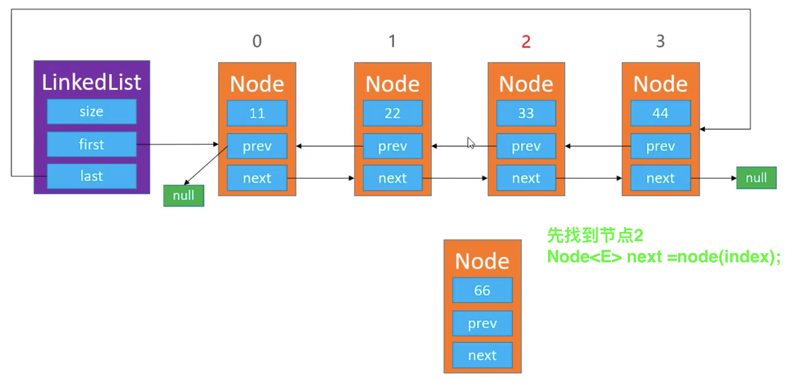

  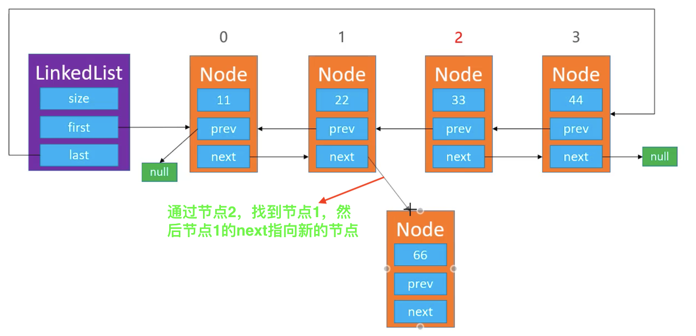

  

  

  

+ 还要注意临界情况：

  1. 当数组为空时添加节点

     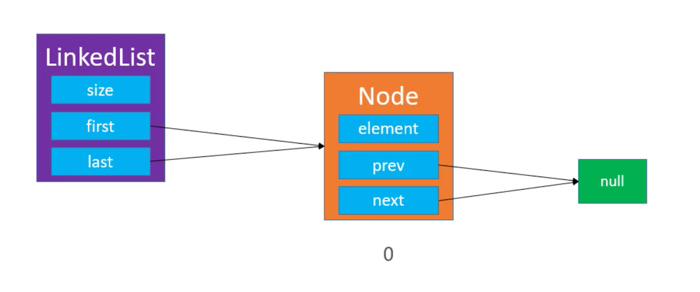

  2. 当数组为非空时，往index=0添加节点

  3. 当数组为非空时，往index=size添加节点

+ 代码如下

  ```java
  @Override
  	public void add(int index, E element) {
  		rangeCheckForAdd(index);
  
  		// size == 0
  		// index == 0
  		if (index == size) { // 往最后面添加元素
        //先拿到oldLast
  			Node<E> oldLast = last;
        //新节点的prev为oldLast,next为null
  			last = new Node<>(oldLast, element, null);
  			if (oldLast == null) { // 这是链表添加的第一个元素
          //情况1 当数组为空时添加节点
          //此时只有一个元素 first和last指向唯一的一个节点
  				first = last;
  			} else {
          //情况2 当数组为非空时，往index=size添加节点
          //更新oldLast.next的指向
  				oldLast.next = last;
  			}
  		} else {
        //获取index位置的节点，该结点将作为新节点的next节点
  			Node<E> next = node(index); 
        //获取上一个节点，该结点将作为新节点的prev节点
  			Node<E> prev = next.prev; 
  			Node<E> node = new Node<>(prev, element, next);
        //更改原index位置的节点的prev指针，使其指向新的节点
  			next.prev = node;
  			if (prev == null) { // index = 0
  			  //情况3 当数组非空时，向index=0 添加节点
          //first指向新的节点
  				first = node;
  			} else {
  			  //情况4 通用情况
          //prev.next指向新的节点
  				prev.next = node;
  			}
  		}
  		
  		size++;
  	}
  ```

### 双向链表-remove

+ 情况如下

  1. 通用情况,删除中间的元素

     ```java
     //1. 先找到要删除的节点node
     Node<E> node = node(index);
     //2. 再找到它的prev, next
     Node<E> prev = node.prev;
     Node<E> next = node.next;
     //3. 将prev的next指向node的next
     prev.next = next;
     //4. 将next的prev指向node的prev
     next.prev = prev;		
     ```

  2. 删除index=0位置的元素

     ```java
     //1. 先找到要删除的节点node
     Node<E> node = node(index);
     //2. 再找到它的prev, next,此时prev为null
     Node<E> prev = node.prev;
     Node<E> next = node.next;
     //3. 将index为0的节点删除后，first指向下一个节点
     first = next;
     //4. 将next的prev指向node的prev，因为prev为null, 所以next.prev = null，即为fist.prev = null
     next.prev = prev;	
     ```

     

  3. 删除index=size-1位置的元素

     ```java
     //1. 先找到要删除的节点node
     Node<E> node = node(index);
     //2. 再找到它的prev, next, ,此时next为null
     Node<E> prev = node.prev;
     Node<E> next = node.next;
     //3. 将原来的index=size-1删除后，其原来的prev即为最后一个元素，所以需将prev.next指向null
     prev.next = next;
     //4. 原来的prev即为最后一个元素，更新last指向
     last = prev;
     ```

     

+ 完整的代码实现

  ```java
  @Override
  	public E remove(int index) {
  		rangeCheck(index);
  
  		Node<E> node = node(index);
  		Node<E> prev = node.prev;
  		Node<E> next = node.next;
  		
  		if (prev == null) { // index == 0
  			first = next;
  		} else {
  			prev.next = next;
  		}
  		if (next == null) { // index == size - 1
  			last = prev;
  		} else {
  			next.prev = prev;
  		}
  		size--;
  		return node.element;
  	}
  ```

  

### 双向链表-接口测试

+ 测试接口是否正确

  ```java
  static void testList(List<Integer> list) {
  		list.add(11);
  		list.add(22);
  		list.add(33);
  		list.add(44);
  
  		list.add(0, 55); // [55, 11, 22, 33, 44]
  		list.add(2, 66); // [55, 11, 66, 22, 33, 44]
  		list.add(list.size(), 77); // [55, 11, 66, 22, 33, 44, 77]
  
  		list.remove(0); // [11, 66, 22, 33, 44, 77]
  		list.remove(2); // [11, 66, 33, 44, 77]
  		list.remove(list.size() - 1); // [11, 66, 33, 44]
  
  		Asserts.test(list.indexOf(44) == 3);
  		Asserts.test(list.indexOf(22) == List.ELEMENT_NOT_FOUND);
  		Asserts.test(list.contains(33));
  		Asserts.test(list.get(0) == 11);
  		Asserts.test(list.get(1) == 66);
  		Asserts.test(list.get(list.size() - 1) == 44);
  		
  		System.out.println(list);
  	}
  	
  	public static void main(String[] args) {
  		testList(new ArrayList<>());
  		testList(new LinkedList<>());
  	}
  //看测试是否通过
  ```

+ 修改LinkedList的toString方法和Node的toString方法，让打印更加清晰

  ```java
  package com.mj;
  
  import com.mj.AbstractList;
  
  public class LinkedList<E> extends AbstractList<E> {
  	...
  	...
  	private static class Node<E> {
  	  ....
  	  ....
  		@Override
  		public String toString() {
  			StringBuilder sb = new StringBuilder();
  			
  			if (prev != null) {
  				sb.append(prev.element);
  			} else {
  				sb.append("null");
  			}
  			
  			sb.append("_").append(element).append("_");
  
  			if (next != null) {
  				sb.append(next.element);
  			} else {
  				sb.append("null");
  			}
  			
  			return sb.toString();
  		}
  	}
  	
  	@Override
  	public String toString() {
  		StringBuilder string = new StringBuilder();
  		string.append("size=").append(size).append(", [");
  		Node<E> node = first;
  		for (int i = 0; i < size; i++) {
  			if (i != 0) {
  				string.append(", ");
  			}
  			string.append(node);//调用node的toString方法
  			node = node.next;
  		}
  		string.append("]");
  		return string.toString();
  	}
  	...
  	...
  }
  
  
  //如果链表中的元素为: 11, 66, 33, 44
  //打印结果为 [null_11_66, 11_66_33, 66_33_44, 33_44_null]
  ```

### 双向链表-总结

+ 粗略对比一下添加，删除的操作数量

  - 单向链表: 1+2+3+..+n = (1+n)*n/ 2 = n/2 + n<sup>2</sup>/2, 除以n，平均一下为1/2 + n/2
  - 双向链表:  (1+2+3+..+n/2）+（1+2+3+... + n/2）= n/2 +  n<sup>2</sup>/4, 除以n，平均一下为1/2 + n/4
  - 操作数量缩减了近一半

+ 双向链表 vs 动态数组

  - 动态数组：开辟、销毁内存空间的次数相对较少，但可能造成内存空间浪费（可以通过缩容解决）

  - 双向链表：开辟、销毁内存空间的次数相对较多，但不会造成内存空间的浪费

  - 如果频繁在尾部进行添加、删除操作，动态数组、双向链表均可选择

    ```
    双向链表在尾部添加，删除操作时间复杂度位O(1)，有尾节点
    动态数组在尾部添加，删除操作时间复杂度位O(1)，因为不需要挪动元素
    ```

  - 如果频繁在头部进行添加、删除操作，建议选择使用双向链表

    ```
    双向链表在头部添加，删除操作时间复杂度位O(1)，有头节点
    动态数组在头部添加，删除操作时间复杂度位O(n)，因为需要挪动元素
    ```

  - 如果有频繁的（在任意位置）添加、删除操作，建议选择使用双向链表

    ```
    从上面添加，删除的操作数量对比中可知
    同等规模的数据，双向链表操作数量减少了近一半
    ```

  - 如果有频繁的查询操作（随机访问操作），建议选择使用动态数组

    ```
    因为动态数组的set, get操作为O(1)
    ```

+ 有了双向链表，单向链表是否就没有任何用处了？

  - 并非如此，在哈希表的设计中就用到了单链表
  - 至于原因，在哈希表章节中会讲到

+ 怎么理解first和last呢？

  - first就是index=0的节点， last就是index=size-1的节点
  - 提供first，last这两个指针只是用来更方便的操作链表
  - index=0, index=size-1位置的节点变动时，要让first，last指向更新后的节点

### 双向链表- 源码分析

+ 官方的LinkedList是双向链表结构，位于java.util.LinkedList

+ 实现基本类似，可以自行参考源码

+ clear的实现有些许差异

  ```java
  public void clear() {
    // Clearing all of the links between nodes is "unnecessary", but:
    // - helps a generational GC if the discarded nodes inhabit
    //   more than one generation
    // - is sure to free memory even if there is a reachable Iterator
    // 即使有gc对象持有迭代器，且迭代器指向对象，也将这些对象释放
    for(Node<E> x= first, x!=null;) {
      Node<E> next = x.next;
      x.next = null;
      x.prev = null;
      x = next;
    }
    first = last = null;
    size = 0;
    modCount++;
  }
  ```

### 单向循环链表-简介

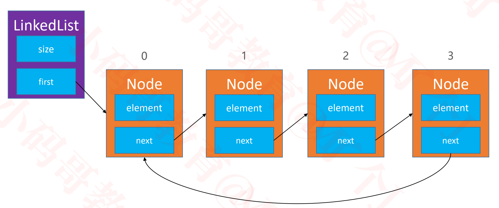

+ 从上图可知，单向循环链表和单向链表结构上的区别在于
  - 单向循环列表的最后一个节点的next指针，指向first
  - 单向循环列表的最后一个节点的next指针，指向null
+ 因此，我们在添加和删除的时候要特别注意维护这个next指针
+ 单向循环链表和单向链表大部分内容都一直，只有少部分差异
+ 要特别注意边界情况
  - index = 0, index = size -1, index = size, size =0, size = 1等

### 单向循环链表-add

+ 与单向链表的add相比，需要在往index=0位置新增节点时，维护多出来的next指针

  1. index=0，size = 0， 新增后，多出来的next指针指向自身，也就是fist的next指向自身

     ```java
     //新节点的next指向原来的fist
     Node<E> newFirst = new Node<>(element, first);
     //拿到最后一个结点, 因为只有1个节点，所以新增的节点也是last节点
     Node<E> last =  newFirst
     //last的next指向新增的节点
     last.next = newFirst
     //新增的节点作为first
     first = newFirst;
     ```

     

  2. index=0,  size不等于0时，新增后，多出来的next指针first

     ```java
     //新节点的next指向原来的fist
     Node<E> newFirst = new Node<>(element, first);
     //拿到最后一个结点， 注意在node(size-1)中用到了原来的first，所以在此之前不能修改first的指向
     Node<E> last =  node(size - 1);
     //last的next指向新增的节点
     last.next = newFirst
     //新增的节点作为first
     first = newFirst;
     ```

  3. 往中间插入的通用情况，与单向链表相同

+ 代码实现

  ```java
  public class SingleCircleLinkedList<E> extends AbstractList<E> {
    ...
    ...
    @Override
  	public void add(int index, E element) {
  		rangeCheckForAdd(index);
  		if (index == 0) {
  			Node<E> newFirst = new Node<>(element, first);
  			// 拿到最后一个节点
  			Node<E> last = (size == 0) ? newFirst : node(size - 1);
  			last.next = newFirst;
  			first = newFirst;
  		} else {
  			Node<E> prev = node(index - 1);
  			prev.next = new Node<>(element, prev.next);
  		}
  		size++;
  	}
    ...
    ...
   }
  ```

### 单向循环链表-remove

+ 与单向链表的remove相比，需要在把index=0位置节点删除时，维护多出来的next指针

  - index=0，size > 1， 删除后，最后节点的next指针指向原来first的next， first指向原来first节点的next

    ```java
    //先找到最后的节点
    Node<E> last = node(size - 1);
    //first指向原来first节点的next
    first = first.next;
    //最后节点的next指针指向原来first的next
    last.next = first;
    ```

    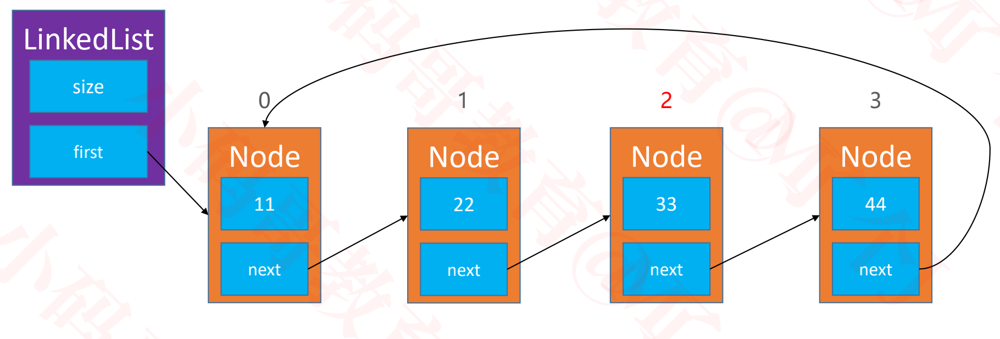

    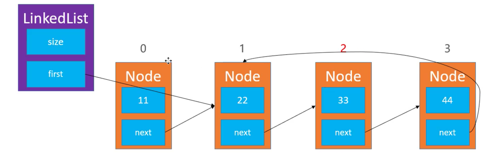

  - index=0，size = 1， 删除后，链表为空

    

    ```java
    first = null;即可
    ```

+ 完整代码

  ```java
  @Override
  	public E remove(int index) {
  		rangeCheck(index);
  		Node<E> node = first;
  		if (index == 0) {
  			if (size == 1) {
  				first = null;
  			} else {
  				Node<E> last = node(size - 1);
  				first = first.next;
  				last.next = first;
  			}
  		} else {
  			Node<E> prev = node(index - 1);
  			node = prev.next;
  			prev.next = node.next;
  		}
  		size--;
  		return node.element;
  	}
  ```

  

### 双向循环链表-简介

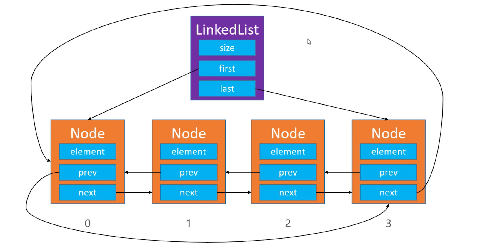

+ 与双向链表的区别在于
  - 双向链表 first.prev = null, last.next = null
  - 双向循环链表 first.prev = last , last.next = first


### 双向循环链表-add

+ 添加的情形

  1. 往最后添加元素，且链表非空时

     ```java
     //获取oldLast
     Node<E> oldLast = last;
     //新的last节点的prev为oldLast， next为first
     last = new Node<>(oldLast, element, first);
     //原来的last节点的next，指向新的last节点
     oldLast.next = last;
     //first.prev指向新的last节点
     first.prev = last;
     ```

  2. 链表为空时，添加元素, first和last指向同一节点。该结点的prev和next都指向自身

     

     ```java
     //last = null， first = null
     Node<E> oldLast = last;
     //新增节点赋值给last， 此时新增节点的prev = null, next = null
     last = new Node<>(oldLast, element, first);
     if (oldLast == null) { // 这是链表添加的第一个元素
         //first, last指向同一个节点
     		first = last;
         //新增节点的prev, next都指向自身
     		first.next = first;
     		first.prev = first;
     }		
     ```

  3. index = 0 , size不等于0时

     ```java
     //找到原来index = 0位置的节点，将会被作为新节点的next
     Node<E> next = node(index); 
     //原来index = 0位置的节点的prev即为last
     Node<E> prev = next.prev; 
     //last作为新节点的prev， 原来的index=0位置的节点作为新节点的next
     Node<E> node = new Node<>(prev, element, next);
     //原来index = 0位置的节点的prev指向新增的node
     next.prev = node;
     //last的next指向新增的node
     prev.next = node;
     if (next == first) { // index == 0
         //first指向node
     		first = node;
     }
     ```

  4. 往中间插入情况，跟普通的双向链表一样

+ 完整的代码如下

  ```java
  public void add(int index, E element) {
  		rangeCheckForAdd(index);
  
  		// size == 0
  		// index == 0
  		if (index == size) { // 往最后面添加元素
  			Node<E> oldLast = last;
  			last = new Node<>(oldLast, element, first);
  			if (oldLast == null) { // 这是链表添加的第一个元素
  				first = last;
  				first.next = first;
  				first.prev = first;
  			} else {
  				oldLast.next = last;
  				first.prev = last;
  			}
  		} else {
  			Node<E> next = node(index); 
  			Node<E> prev = next.prev; 
  			Node<E> node = new Node<>(prev, element, next);
  			next.prev = node;
  			prev.next = node;
  			
  			if (next == first) { // index == 0
  				first = node;
  			}
  		}
  		size++;
  	}
  ```

### 双向循环链表-remove

+ 删除的情形

  - 当只剩一个元素时

    ```java
    first = null;
    last = null;
    ```

  - 删除index=0位置

  - 删除index=size-1位置

  - 删除中间位置

+ 完整的代码

  ```java
  private E remove(Node<E> node) {
  		if (size == 1) {
  			first = null;
  			last = null;
  		} else {
  			Node<E> prev = node.prev;
  			Node<E> next = node.next;
  			prev.next = next;
  			next.prev = prev;
  			
  			if (index == 0) { //node == first
  				first = next;
  			}
  			
  			if (index == size - 1) { // node == last
  				last = prev;
  			}
  		}
  
  		size--;
  		return node.element;
  	}
  ```

### 如何发挥循环链表的最大威力？

+ 可以考虑增设1个成员变量、3个方法

  - `current `：用于指向某个节点
  - `void reset()` ：让 current 指向头结点 first
  - `E next() `：让 current 往后走一步，也就是 current = current.next
  - `E remove()` ：删除 current 指向的节点，删除成功后让 current 指向下一个节点

  

+ 单向循环链表和双向循环链表都要实现这几个接口

+ 以双向循环链表为例

  ```java
  public class CircleLinkedList<E> extends AbstractList<E> {
  	private Node<E> first;
  	private Node<E> last;
    //current指针
  	private Node<E> current; 
  	
  	//reset:让 current 指向头结点 first
  	public void reset() {
  		current = first;
  	}
  	//E next(): 让current 往后走一步，也就是 current = current.next
  	public E next() {
  		if (current == null) return null;
  		
  		current = current.next;
  		return current.element;
  	}
    
  	//E next(): 删除 current 指向的节点，删除成功后让 current 指向下一个节点
  	public E remove() {
  		if (current == null) return null;
  		
  		Node<E> next = current.next;
      //删除当前节点
  		E element = remove(current);
  		if (size == 0) {//当只有1个节点时，删除后current执行null
  			current = null;
  		} else {
  			current = next;
  		}
  		return element;
  	}
  
  	@Override
  	public E remove(int index) {
  		rangeCheck(index);
  		return remove(node(index));
  	}
  	
  	private E remove(Node<E> node) {
  		if (size == 1) {
  			first = null;
  			last = null;
  		} else {
  			Node<E> prev = node.prev;
  			Node<E> next = node.next;
  			prev.next = next;
  			next.prev = prev;
  			if (node == first) { // index == 0
  				first = next;
  			}
  			
  			if (node == last) { // index == size - 1
  				last = prev;
  			}
  		}
  		
  		size--;
  		return node.element;
  	}
    ....
    ....
  }
  
  ```

### 双向循环链表-约瑟夫问题


+ 具体的问题
  - 每次从1数到3，被数到3位置的数据被干掉
  - 第一次3被干掉，第二次6被干掉, 第三次1被干掉， ... ， 最终剩下7
  - 被干掉的顺序为 3, 6, 1, 5, 2, 8, 4,  7
+ 思路
  - 从当前指向的位置，挪动2次
  - 删除此时指向的位置，并指向下一个
  - 循环进行上面两步

+ 代码实现

  ```java
  static void josephus() {
  		CircleLinkedList<Integer> list = new CircleLinkedList<>();
  		for (int i = 1; i <= 8; i++) {
  			list.add(i);
  		}
      //此时链表中的元素为 [1,2,3,4,5,6,7,8]
  		// 指向头结点（指向1）
  		list.reset();
  		
  		while (!list.isEmpty()) {
  			list.next();
  			list.next();
  			System.out.println(list.remove());
  		}
  }
  //第一次循环， 删除3
  list.next ,此时current指向2
  list.next, 此时current指向3
  list.remove(), 删除3，此时current指向4
    
  //第二次循环， 删除6
  list.next ,此时current指向5
  list.next, 此时current指向6
  list.remove(), 删除6，此时current指向7
    
  //第三循环， 删除1
  list.next ,此时current指向7
  list.next, 此时current指向8
  list.remove(), 删除1，此时current指向2
    
  //第四循环， 删除5
  list.next ,此时current指向4
  list.next, 此时current指向5
  list.remove(), 删除5，此时current指向7
    
  //第五循环， 删除2
  list.next ,此时current指向8
  list.next, 此时current指向2
  list.remove(), 删除2，此时current指向4
    
    
  //第六循环， 删除8
  list.next ,此时current指向7
  list.next, 此时current指向8
  list.remove(), 删除8，此时current指向4
    
  //第七循环， 删除4
  list.next ,此时current指向7
  list.next, 此时current指向4
  list.remove(), 删除4，此时current指向7
    
  //第八循环， 删除7
  list.next ,此时current指向7
  list.next, 此时current指向7
  list.remove(), 删除7，此时current指向null
   
  ```

  

### 静态链表

+ 前面所学习的链表，是依赖于指针（引用）实现的

+ 有些编程语言是没有指针的，比如早期的 BASIC、FORTRAN 语言

+ 没有指针的情况下，如何实现链表？

  - 可以通过数组来模拟链表，称为静态链表
  - 数组的每个元素存放 2 个数据：值、下个元素的索引
  - 组 0 位置存放的是头结点信息
  - 当索引值为负时，代表尾节点

  

  


### ArrayList优化思路

+ 保存一个first指针，当first被删除后，指向下一个元素等等，这样就不用挪动元素了
+ 遍历时从first开始遍历
+ 后续会有实现过程

### 作业

+ 移除链表元素
  - https://leetcode-cn.com/problems/remove-linked-list-elements/
+ 删除排序链表中的重复元素
  - https://leetcode-cn.com/problems/remove-duplicates-from-sorted-list/
+ 链表的中间结点
  - https://leetcode-cn.com/problems/middle-of-the-linked-list/solution/

